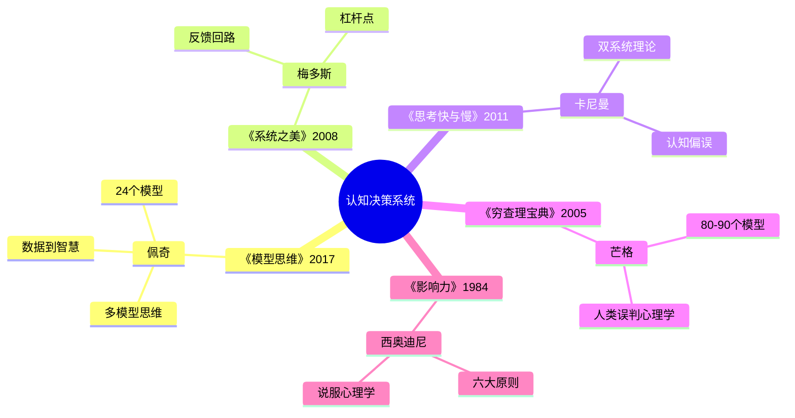
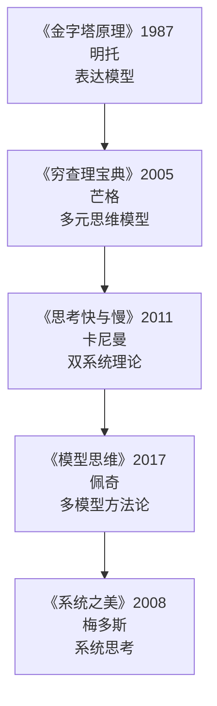
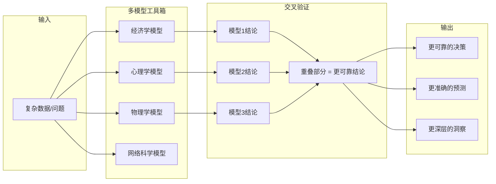
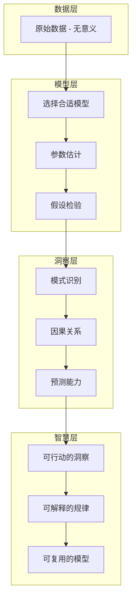
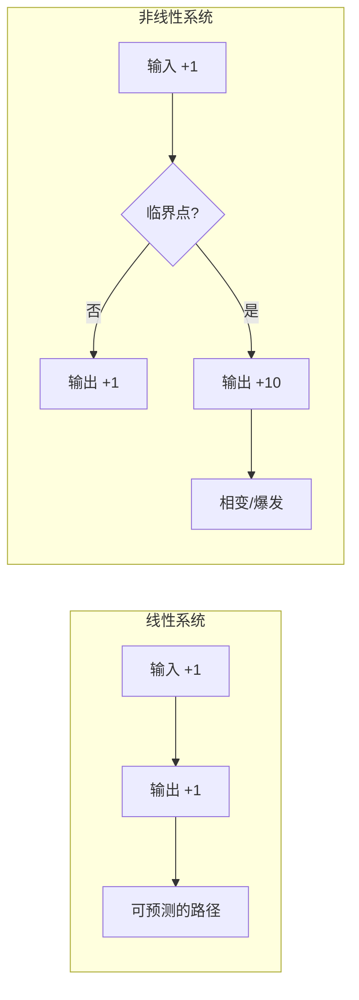
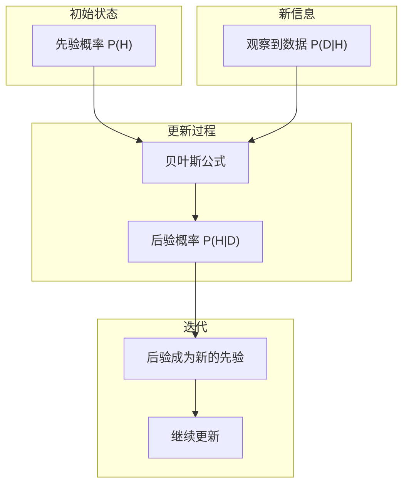
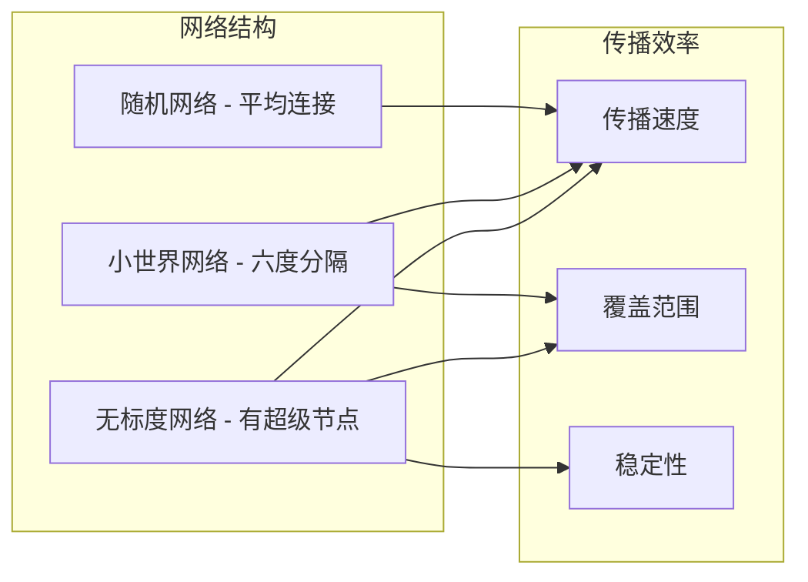

# 《模型思维》读书笔记

> **作者**：斯科特·佩奇（Scott E. Page）
> **原书名**：The Model Thinker: What You Need to Know to Make Data Work for You
> **出版时间**：2019年中文版（原版2017年）

---

## 这本书要解决什么问题？

**核心困境**：我们身处数据爆炸时代，但"拥有数据不等于拥有智慧"。为什么学了那么多知识还是不会用？因为大脑里没有"模型框架"——无法将零散的信息组织成可推导的系统。

**一句话定位**：
> 智慧不是你拥有多少数据，而是你拥有多少个"思维模型"——佩奇用24个模型教你从数据中提炼智慧，成为"多模型思考者"。

### 作者站在什么位置说这些话？

| 维度 | 定位 |
|------|------|
| 主领域 | 复杂性科学、决策科学 |
| 跨界领域 | 认知心理学、系统思维、数据科学、管理学 |
| 作者背景 | 密歇根大学复杂性研究中心"掌门人"、圣塔菲研究所外聘研究员、Coursera"模型思维课"主讲人（超100万用户） |
| 知识定位 | "多元思维模型"的学术版、系统思考的数学化表达；万维钢评价"比芒格的模型高级得多" |

### 和其他书有什么关系？

| 关联书籍 | 关联关系 | 共同底层逻辑 |
|----------|----------|--------------|
| [[系统之美-梅多斯]] | 理论互补 | 系统之美的反馈回路 → 模型思维的多模型叠加 |
| [[思考快与慢]] | 机制基础 | 系统1的漏洞需要多模型修补，系统2需要模型框架 |
| [[穷查理宝典]] | 学术延伸 | 芒格的"工具箱" → 佩奇的"24个正规模型" |
| [[影响力-西奥迪尼]] | 防御应用 | 六大原理利用心理漏洞，模型思维识别这些漏洞 |
| [[金字塔原理-明托]] | 结构化 | 金字塔原理是表达模型，模型思维是思考模型 |

### 知识网络图

---

## 作者的核心论点

### 多模型思维：从数据到智慧的必经之路

经济学家看什么都是激励机制，工程师看什么都是优化问题，心理学家看什么都是童年创伤。这不是因为他们蠢，恰恰是因为他们太擅长自己那个模型了——手里拿着锤子，看什么都像钉子。

佩奇的核心论点直指这个盲区：**多模型思维能够通过一系列不同的逻辑框架生成智慧。** 每个模型都是简化，必然有盲点，但多个模型可以消除单个模型的盲点。重叠的部分就是更可靠的结论，差异的部分揭示了系统的复杂性。

佩奇整理了24个模型，横跨六大类：

| 类别 | 核心模型 | 应用场景 |
|------|----------|----------|
| 线性模型 | 线性回归 | 预测、趋势分析 |
| 非线性模型 | 网络效应、临界点 | 流量增长、系统崩溃 |
| 概率模型 | 贝叶斯更新、随机漫步 | 不确定性决策、投资 |
| 博弈模型 | 纳什均衡、囚徒困境 | 竞争策略、合作 |
| 网络模型 | 小世界网络、无标度网络 | 社交传播、知识管理 |
| 系统模型 | 正反馈、负反馈 | 系统设计、组织管理 |

> **多模型定律**：世界太复杂，任何一个模型都只能看到一部分真相。多模型思维通过让不同逻辑框架"对话"，实现对世界更细致入微的理解。

你不需要成为所有领域的专家，你只需要从每个领域"偷"走最厉害的1-2个模型。24个模型每个花1小时学习，就是24小时的智慧投资，收益是一辈子的思维升级。

这打碎了我对"专业深度"的迷信——以前觉得越专越强，现在意识到，只在一个领域深耕就像只用一个模型看世界，视野必然扭曲。真正的高手不是在一个模型上做到极致，而是能用多个模型交叉验证。

但这还没完，作者进一步指出，模型不只是思考工具，它有七大具体功能，每一个都能直接改变你的工作方式。

---

### 模型的RED CAPE功能：从解释到探索

为什么异地恋的相聚能带来巨大幸福感？用线性模型看，幸福感随着见面次数线性增长；但用阈值模型看，见面次数达到某个临界值后幸福感突然跳升。同一个现象，两个模型给出完全不同的解释。

佩奇把模型的功能归纳为RED CAPE——七个英文单词的首字母：

| 功能 | 说明 | 例子 |
|------|------|------|
| **R**esolve | 解决问题 | 用网络模型理解病毒传播 |
| **E**xplain | 解释现象 | 用博弈论解释价格战 |
| **D**esign | 设计机制 | 用激励机制设计员工绩效 |
| **C**ommunicate | 沟通思想 | 用模型框架向团队解释策略 |
| **A**ct | 指导行动 | 用场景模型做决策 |
| **P**redict | 预测未来 | 用线性回归预测销售 |
| **E**xplore | 探索可能 | 用模型测试新策略 |

模型本质上是一个"翻译器"。数据是原始的、未编码的事件；信息是给数据命名并归类；知识是识别模式和规律；智慧是理解为什么和怎么做。模型连接了这四层——数据经过模型变成信息，信息经过模型变成知识，知识经过模型变成智慧。

> **模型功能定律**：模型是用数学公式和图表展现的形式化结构，它能帮助我们推理、解释、设计、沟通、行动、预测和探索——RED CAPE。

以前我拿到数据就急着下结论，现在学会了先问：我该用哪个模型来解读这些数据？数据像一堆食材，模型是菜谱。没有菜谱，食材只是食材；有了菜谱，食材变成美食。

有了多模型的框架和功能，佩奇接下来展示了几个最有颠覆性的模型。第一个就挑战了我们对"变化"的直觉。

---

### 线性与非线性模型：识别系统的临界点

想象你正在烧水。从1度到99度，水一直是水，看起来什么都没变。但到了100度，水突然变成蒸汽。这就是非线性——不是"越来越热"，而是"突然变了"。

佩奇用这个直觉来解释临界点模型：很多系统不是线性的，存在一个临界点——低于临界点时变化缓慢，达到临界点后突然爆发。

微信就是经典案例。用户从0到100万，那是最难的阶段，增长极其缓慢。但一旦达到网络密度，用户从100万到1亿就像开了闸。每个用户连接N个其他用户，平台价值随用户数平方增长——这就是梅特卡夫定律。

临界点模型的应用远不止商业。病毒传播中，R0小于1则病毒消失，R0大于1则爆发；系统负荷达到80%后会突然崩溃；学习曲线开始慢，突然加速。识别临界点比预测线性路径更重要——99度还是水，100度变成气。

> **非线性定律**：很多系统不是线性的，存在临界点——低于临界点时变化缓慢，达到临界点后突然爆发。识别临界点比预测线性路径更重要。

这个观点打碎了我的一个假设。我一直以为努力和结果是成正比的——多一分努力就多一分回报。非线性模型告诉我，很多时候努力很久没效果不是因为方法错了，而是还没到临界点。下次遇到长期努力没有回报的情况，我不会再急着否定自己，而是先判断：我是在线性系统还是非线性系统中？如果是后者，临界点在哪？

但临界点只是硬币的一面，另一面是：即使你知道了规律，世界依然充满不确定性。佩奇接下来给出了在不确定性中做决策的工具。

---

### 概率与不确定性模型：在未知中决策

塔勒布说黑天鹅不可预测，佩奇不完全同意。他认为你不需要"知道"未来，只需要"估计"概率——新信息来了就更新，总是坚持或调整。这就是在不确定中最聪明的活法。

佩奇最推崇的概率工具是贝叶斯更新。它的核心逻辑很简单：你有一个初始判断（先验概率），新信息来了之后，你根据新信息的可靠程度调整判断（后验概率），然后后验变成新的先验，继续迭代。

在投资中，股价短期像随机漫步，不可预测。但长期有趋势，只是被噪音掩盖。模型帮你分离信号和噪音。在创业中，成功是小概率事件，但你可以用模型提高概率。在日常生活中，决策永远在信息不完备时做出——与其追求确定性，不如追求最优概率。

> **概率思维定律**：世界是不确定的，但我们可以用概率模型量化不确定性。贝叶斯更新让我们在信息不完备时做出最优决策。

以前遇到不确定的情况，我总想等到"想清楚"再做决定。现在我意识到这完全错了——贝叶斯思维告诉我，决策不是一次性的选择，而是持续迭代的过程。先有一个初始判断，然后根据新信息不断修正，比原地不动等到"确定"靠谱得多。

但这还没完。个人的决策模型只是基础，佩奇接下来展示了人与人之间的互动如何产生完全意想不到的结果。

---

### 网络与博弈模型：理解互动关系

为什么同样努力，结果天差地别？不是能力问题，是网络位置不同。处于网络中心的人，信息和资源天然丰富；处于边缘的人，再努力也接触不到关键机会。

佩奇用网络模型揭示了三种基本结构：随机网络（平均连接）、小世界网络（六度分隔）、无标度网络（有超级节点）。结构不同，传播效率、覆盖范围、稳定性天差地别。

而博弈论则揭示了另一层：个体理性不等于集体理性。囚徒困境是经典案例——两个人各自做最优选择，结果两个人都比合作时更差。商业价格战就是囚徒困境的现实版：每家公司降价都是理性选择，但全行业利润被压到零。

> **网络与博弈定律**：很多问题不是个体问题，而是网络问题。理解网络结构和博弈互动，比单点优化更有效。

下次遇到"明明每个人都做对了，结果却一团糟"的局面，我不会再找个人原因，而是去审视：我们处于什么样的网络结构中？博弈规则是什么？改变结构比改变个人更有效。

---

## 这本书的局限

> 佩奇的多模型方法论是从西方学术传统中提炼的，这套方法有它的边界。

| 批评点 | 谁在批评 | 怎么说 | 实际情况 |
|--------|---------|--------|---------|
| 模型数量争议 | 读者 | 芒格说80-90个，佩奇只给24个，到底需要多少？ | 24个是入门精简版，深度应用确实需要更多，但质量比数量重要 |
| 过度模型化 | 经济学家托尼·劳森 | 经济学过度依赖模型，模型不能替代现实判断 | 模型是工具不是真理，佩奇本人也强调模型需要用数据检验 |
| 大模型的幻觉 | AI研究者 | 2025-2026年的讨论中，大模型存在"知识污染"和"逻辑污染" | 模型本身也可能有盲点，多模型交叉验证可以降低但不能消除风险 |
| 时代局限 | 普通读者 | 2017年出版，AI时代有新模型未涵盖 | 核心框架（贝叶斯、博弈、网络）依然适用，但需要自行补充AI相关模型 |
| 个体差异 | 普通读者 | 佩奇是天才学者，普通人能做到吗？ | 理论易懂，应用需要大量练习，但简化版（掌握10个核心模型）完全可行 |
| 文化差异 | 跨文化研究者 | 基于西方学术界，跨文化适用性需验证 | 底层逻辑普适，但具体应用需考虑文化背景 |

**一句话总结局限性**：
> 多模型思维的框架价值极高，但具体模型的选择和应用需要根据个人需求、时代背景和文化环境做调整——框架是通用的，填充是个人的。

---

## 最值得记住的话

**原书说的**：
1. "多模型思维能够通过一系列不同的逻辑框架'生成'智慧。"
2. "有证据表明，具备模型思维的人要比没有这种思维的人更优秀，而且能够运用多种模型思考并解决问题的人要比只运用一种模型思考的人更优秀。"
3. "模型需要用数据检验、改进和精炼。"
4. "智慧包括选择正确的知识或模型。"
5. "无论数据给我们留下的印象如何深刻，它都不是灵丹妙药。"
6. "单个模型本身可能就已经相当强大了，但是一组模型可以实现更多的功能。"
7. "多模型方法能够消除每个单个模型的盲点。"
8. "如果你只有一个模型，你看到的世界就是扭曲的。"

**翻译成人话**：
1. 数据像食材，模型是菜谱——没有菜谱，食材只是食材
2. 你拥有的思维模型越多，你能解决的问题就越多
3. 单一模型是"锤子综合症"，多模型是"瑞士军刀"
4. 临界点前是积累，临界点后是爆发
5. 你的成功不只取决于你，还取决于你的"位置"
6. 贝叶斯思维：新信息来了就更新，而不是固执己见
7. 在不确定中，用概率替代追求确定性
8. 单一模型看世界，就像戴着有色眼镜——多模型才能看到全貌

---

## 讲给没读过的人听

你有没有发现一个奇怪的现象：学了那么多道理，遇到实际问题还是不知道怎么办？

佩奇说，这不是你学得不够多，而是你的工具箱里只有一把锤子。经济学家看什么都是激励问题，工程师看什么都是优化问题，心理学家看什么都是童年创伤。手里拿着锤子，看什么都像钉子。

佩奇是密歇根大学复杂性研究中心的主任，他花了几十年研究一个结论：**用多个模型看问题，比用一个模型更准确。** 他整理了24个模型，来自不同学科，让你像一个瑞士军刀一样应对复杂世界。

模型是什么？简单说，模型就是简化版的现实。地图是模型，菜谱是模型，天气预报也是模型。它们都不完美，但都有用。关键是，你不能只用一张地图——数据像食材，模型是菜谱，没有菜谱，食材只是食材。

最有颠覆性的一个观点是非线性。我们习惯认为多一分努力就多一分回报，但现实往往不是这样。水从1度烧到99度，看起来什么都没变。但到了100度，突然变成蒸汽。很多系统的变化不是"越来越多"，而是"突然爆发"——这就是临界点。努力很久没效果？可能不是方法错了，而是还没到临界点。

另一个改变我的是概率思维。以前遇到不确定的事，总想等到"想清楚"再做。佩奇说这是错的。你不需要知道未来，只需要估计概率，然后根据新信息不断调整。决策不是一次选择，而是一个持续迭代的过程。

---

## 用来检验理解的问题

**基础回忆**：
1. Q: 佩奇的核心论点是什么？
   A: 多模型思维通过让不同逻辑框架"对话"，实现对世界更细致入微的理解。多个模型比单个模型更准确。

2. Q: RED CAPE代表模型的哪七个功能？
   A: Resolve（解决）、Explain（解释）、Design（设计）、Communicate（沟通）、Act（行动）、Predict（预测）、Explore（探索）。

3. Q: 线性系统和非线性系统的关键区别？
   A: 线性系统中输入增加1，输出增加1；非线性系统存在临界点，达到临界点后小幅输入导致大幅输出变化。

**理解验证**：
1. Q: 为什么"多模型比单模型好"？具体好在哪里？
   A: 每个模型都是简化，必然有盲点。多模型可以消除单个模型的盲点——重叠部分是更可靠的结论，差异部分揭示系统复杂性。

2. Q: 贝叶斯更新和"等想清楚再决定"有什么区别？
   A: 贝叶斯是先有初始判断，根据新信息持续迭代；"等想清楚"是追求确定性，实际上永远等不到。决策是迭代过程，不是一次选择。

3. Q: 为什么"同样努力，结果天差地别"？
   A: 网络位置不同。处于网络中心的人信息和资源天然丰富，处于边缘的人再努力也接触不到关键机会。改变网络结构比增加个人努力更有效。

**实际应用**：
1. Q: 选一个你当前面对的问题，尝试用两个不同模型分析。
   A: 关键步骤：先识别问题类型，选择不同学科的模型，看结论是否一致。一致的部分更可靠，不一致的部分需要深挖。

2. Q: 你最近一次"努力很久没效果"的经历是什么？用临界点模型重新解读。
   A: 关键转变：从"方法不对"转变为"可能还在临界点前"。判断系统是线性还是非线性，如果是非线性，临界点在哪里。

**深度分析**：
1. Q: 佩奇和芒格的"多元思维模型"有什么本质区别？
   A: 芒格是实践智慧——攒了80-90个模型，遇到问题就拿武器；佩奇是学术方法——用24个正规模型，证明了"为什么多模型比单模型好"。芒格是"工具箱"，佩奇是"使用说明书"。

2. Q: 为什么模型思维在AI时代更重要？
   A: AI擅长处理数据，但不擅长选择模型和框架。AI提供数据和答案，人类选择模型和提问题。模型是思维的操作系统，AI是运行在上面的应用程序。

---

## 和其他书的对话

梅多斯和佩奇是一对天然的搭档。《系统之美》教你"什么是系统"——反馈回路、杠杆点、系统结构；《模型思维》教你"如何用模型分析系统"——24个正规模型、数据到智慧的路径。梅多斯给你定性直觉，佩奇给你定量工具。读完梅多斯再读佩奇，系统思考就从"感觉"变成了"方法"。

卡尼曼诊断病情，佩奇开药方。《思考，快与慢》揭示了系统1的漏洞——认知偏误、锚定效应、损失厌恶。佩奇说这些漏洞需要多模型来修补：系统1倾向于用单一模型看世界，系统2需要多模型框架来思考。卡尼曼告诉你"为什么会错"，佩奇告诉你"如何对"。

芒格说"收集80-90个模型"，佩奇说"用24个就够"。这不是矛盾——芒格是投资实践者，需要覆盖尽可能多的情况；佩奇是学者，需要证明"多模型为什么更有效"。芒格是武器库，佩奇是训练手册。读了佩奇，你就知道芒格那些模型为什么好用了。

西奥迪尼的《影响力》是"攻击手册"——六大原则利用系统1的漏洞来影响你。佩奇的模型思维是"防御指南"——用多模型识别这些影响。知道攻击模式，才能设计防御系统。

明托的《金字塔原理》是"表达的模型"——结论先行、逻辑展开。佩奇的《模型思维》是"思考的模型"——多模型交叉验证。想清楚（模型思维），才能说清楚（金字塔原理）。模型是思考的骨架，金字塔是表达的结构。

---

*拆解日期：2026-02-14*
*下次回访：1周后回顾「讲给没读过的人听」和「检验问题」*
