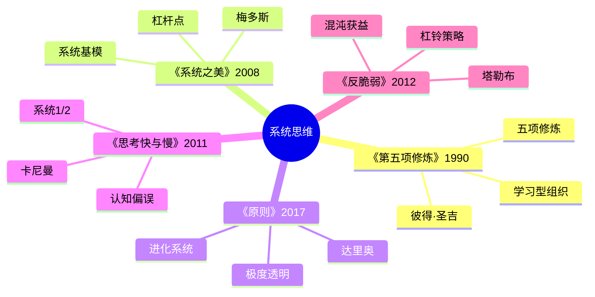
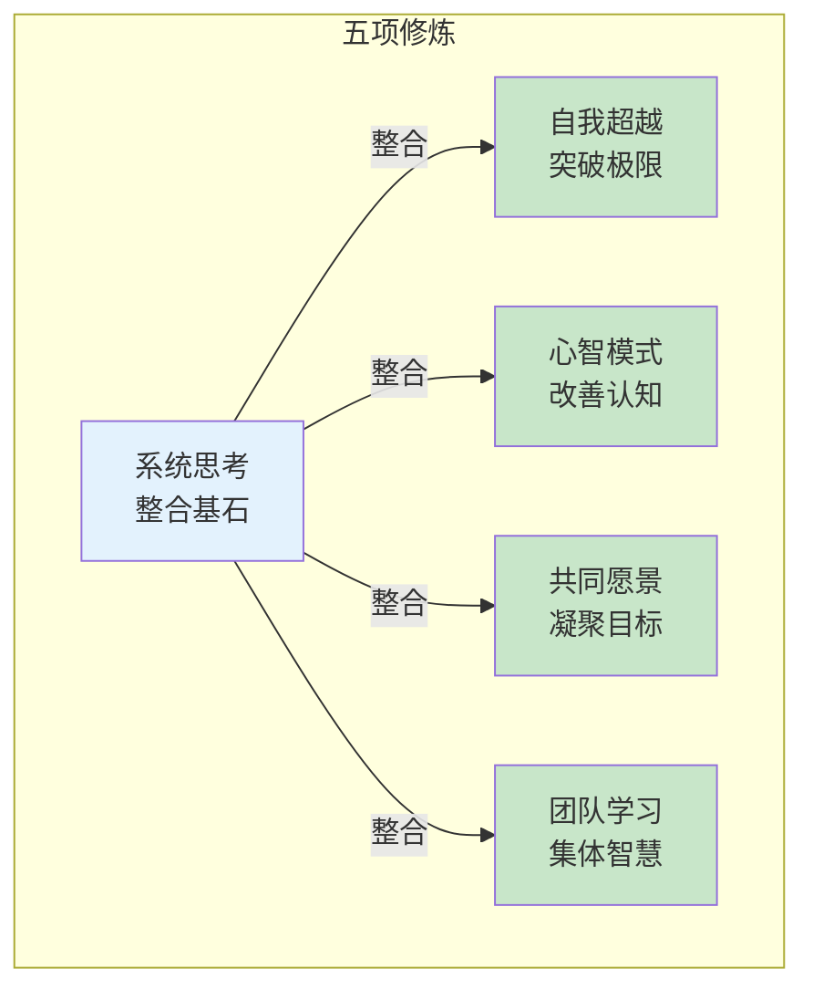
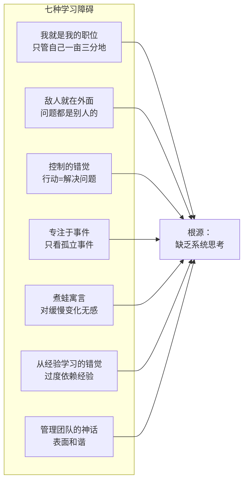
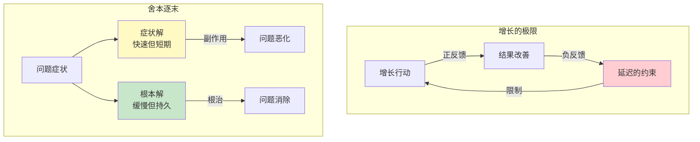
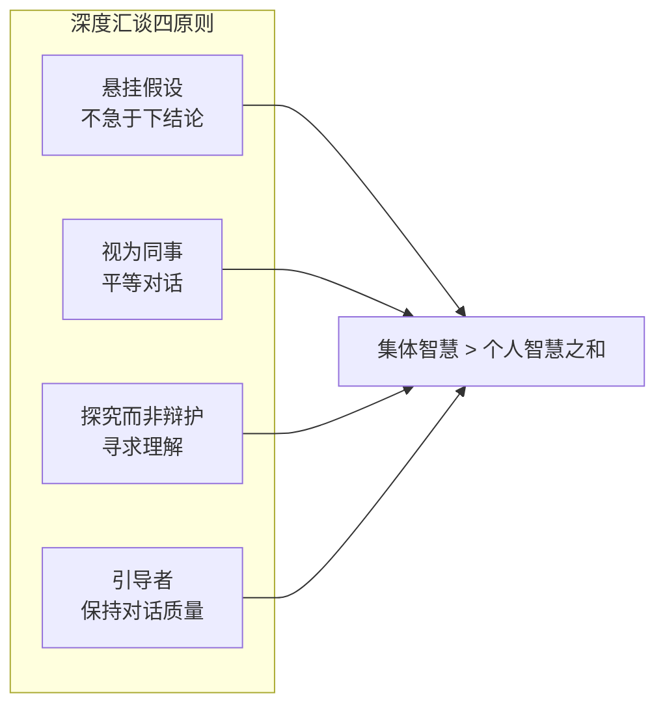
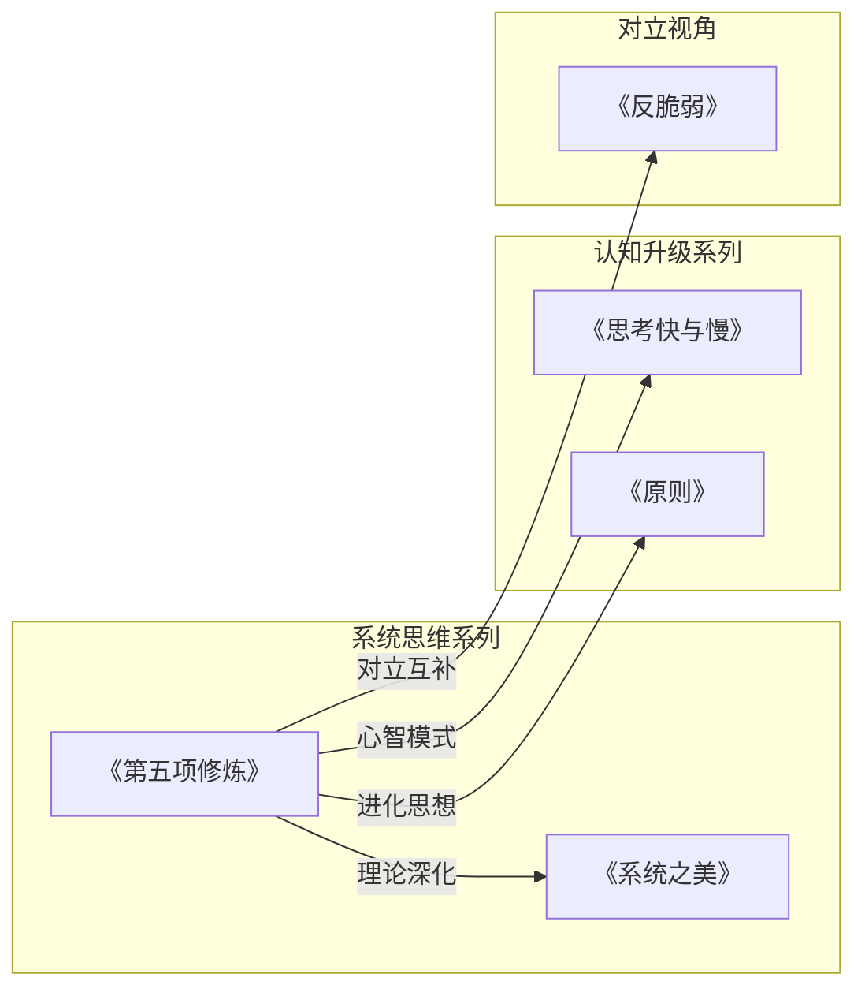

# 《第五项修炼》读书笔记

> **作者**：[美] 彼得·圣吉（Peter Senge）
> **原书名**：The Fifth Discipline: The Art and Practice of the Learning Organization
> **出版时间**：1990年（2009年修订版，2018年中信修订版）
> **豆瓣评分**：8.4（3357人评价）

---

## 这本书要解决什么问题？

想象这样一个场景：一家企业的每个部门都在拼命努力，销售拼命冲业绩，生产拼命赶工期，采购拼命压成本——但整个公司却在走下坡路。这不是某个人的错，而是系统出了问题。

彼得·圣吉在MIT斯隆管理学院研究了多年组织行为后发现：大多数组织都是"学习障碍"患者。员工只关注自己的职位，问题都归咎于外部，只会对症状反应而非根治。结果是组织越来越僵化，越来越无法适应变化。

这本书要解决的核心困境是：为什么组织明明在努力，却越来越难以适应变化？

圣吉给出的答案是：真正的学习型组织，是能够持续扩展其创造未来能力的组织。而系统思考是整合其他四项修炼的基石，是第五项修炼。

### 这书在知识网络中的位置

| 维度 | 定位 |
|------|------|
| 主领域 | 组织管理 / 系统思维 |
| 跨界领域 | 学习理论、认知科学、领导力、东方哲学 |
| 作者背景 | MIT斯隆管理学院教授，"学习型组织之父" |
| 历史地位 | 《哈佛商业评论》评为过去75年最有影响力的管理类图书之一 |

---

## 作者的核心论点

### 论点一：学习型组织的五项修炼

啤酒游戏是MIT经典的供应链模拟实验：零售商、批发商、工厂，每个环节都做出"理性"决策——看到需求增加就多订货，看到库存不足就催货。结果呢？整个系统崩溃了。不是有人做错了什么，而是结构决定了行为。

这就是圣吉想说的：组织的问题，往往不是人的问题，是系统的问题。

五项修炼，就是五条从个人进化到组织进化的路径：

| 修炼 | 含义 | 核心任务 |
|------|------|----------|
| 自我超越 | 突破极限的自我实现 | 建立个人愿景，保持创造力 |
| 心智模式 | 改善看待世界的方式 | 发掘内在假设，及时修正 |
| 共同愿景 | 组织成员共享的目标 | 汇聚个人愿景，激发承诺 |
| 团队学习 | 集体智慧超越个人 | 深度汇谈，悬挂假设 |
| 系统思考 | 整合其他四项的基石 | 看清整体，理解关联 |

> **学习型组织定律**：只有系统思考整合其他四项修炼，才能真正实现组织学习。
> **整合法则**：第五项修炼不是"第五个"，而是"整合者"——没有它，其他四项都是散沙。

---

### 论点二：组织学习的七种障碍

你有没有见过这样的组织：每个人都忙得不可开交，但整体效率却越来越低？每次出问题都开会讨论，但同样的问题下次还会出现？这就是学习障碍的典型表现。

| 障碍 | 表现 | 根源 |
|------|------|------|
| 我就是我的职位 | 只关注自己职责范围 | 缺乏整体观 |
| 敌人就在外面 | 问题都归咎于外部 | 缺乏内省 |
| 控制的错觉 | 积极行动=解决问题 | 对症不对因 |
| 专注于事件 | 只看孤立事件 | 忽视模式和趋势 |
| 煮蛙寓言 | 对缓慢变化无感觉 | 缺乏系统敏感度 |
| 从经验学习的错觉 | 过度依赖经验 | 系统反馈滞后 |
| 管理团队的神话 | 团队表面和谐 | 缺乏真正对话 |

> **学习障碍定律**：组织的失败往往不是因为不够努力，而是因为学习障碍。
> **障碍根源法则**：七种障碍的共同根源是缺乏系统思考——只看局部不看整体。

---

### 论点三：系统思考的法则

"今天的问题来自昨天的解决方案。"这句话听起来像绕口令，却是系统思考的核心洞察。

啤酒游戏揭示了残酷的真相：每个环节都理性决策，结果库存暴增。为什么？因为时滞、反馈回路、补偿性反馈——系统的复杂性超出了我们的直觉。

| 法则 | 含义 | 启示 |
|------|------|------|
| 今日问题来自昨日解 | 解决方案制造新问题 | 考虑长期后果 |
| 越用力推，系统反弹越强 | 补偿性反馈 | 不要过度干预 |
| 情况变好之前先变坏 | 负面延迟 | 坚持长期主义 |
| 显而易见的解往往无效 | 系统杠杆点隐蔽 | 寻找根本原因 |
| 对策可能比问题更糟 | 舍本逐末 | 避免症状解 |
| 欲速则不达 | 系统有时滞 | 尊重系统节奏 |
| 因与果在时空上不相连 | 时滞效应 | 关注时滞 |

> **系统法则**：看问题要看结构，而非事件；看长期，而非短期；看关联，而非孤立。
> **啤酒游戏定律**：局部的理性决策，可能导致系统性的非理性结果——因为结构决定行为。

---

### 论点四：系统基模——理解复杂系统的钥匙

为什么问题总是反复出现？为什么增长总是遇到瓶颈？圣吉研究发现，组织中存在反复出现的系统结构模式——系统基模。识别了基模，就找到了杠杆点。

| 系统基模 | 结构 | 典型表现 | 杠杆点 |
|----------|------|----------|--------|
| 增长的极限 | 正反馈+负反馈 | 初期快速增长，后遇瓶颈 | 消除负反馈源 |
| 舍本逐末 | 症状解+根本解 | 只治标不治本 | 坚持根本解 |
| 转移负担 | 上瘾结构 | 依赖外部解决，能力退化 | 建立内部能力 |
| 目标侵蚀 | 标准下降 | 期望越来越低 | 坚持目标不降 |
| 恶性竞争 | 双方正反馈 | 越竞争越激烈 | 寻找双赢解 |
| 成长与投资不足 | 产能限制 | 发展受阻于投入不足 | 提前投资产能 |
| 公地悲剧 | 共享资源 | 资源被过度使用 | 建立共享规则 |

> **系统基模定律**：识别系统基模，就能预见系统行为，找到杠杆点。
> **杠杆点法则**：小投入，大产出——关键在于找到系统的杠杆点，而不是一味用力。

---

### 论点五：深度汇谈——团队学习的核心技术

为什么三个臭皮匠往往顶不了诸葛亮？因为团队的集体智商往往低于个人智商之和。问题出在对话方式上。

普通讨论是争输赢论对错，深度汇谈是悬挂假设、探究真相。圣吉从量子物理学家戴维·玻姆那里借来了这个概念。

| 深度汇谈 | 普通讨论 |
|----------|----------|
| 悬挂假设，探究真相 | 坚持己见，捍卫立场 |
| 平等对话，不论职级 | 谁职位高谁说了算 |
| 寻求理解，不争对错 | 争输赢，论对错 |
| 发现比个人更深的见解 | 各说各话，没有共识 |

> **深度汇谈定律**：真正的团队学习，是集体智慧超越个人智慧之和。
> **对话法则**：团队学习的基本单位是团体，不是个人——一个人再聪明，也敌不过团队的集体智慧。

---

## 这本书的局限

任何经典都有它的时代烙印。《第五项修炼》也不例外。

首先，这本书的理论框架过于理想化。现实中很少有企业能够完整实施五项修炼。美国企业界曾掀起学习型组织的热潮，但成功案例寥寥。批评者指出，圣吉低估了组织变革的阻力，高估了管理者的学习能力。

其次，西方管理学界认为这本书带有东方神秘主义色彩。圣吉多次引用中国道家思想和禅宗概念，这在强调数据和分析的西方商学院看来显得"不够科学"。虽然系统动力学有数学基础，但五项修炼更多是哲学框架而非可量化的管理工具。

第三，这本书对小型创业公司不太适用。五项修炼更适合有一定规模和资源的大型组织。对于每天都在为生存挣扎的创业公司来说，"深度汇谈"和"系统基模"显得太奢侈。

第四，AI时代的学习型组织需要新的定义。圣吉成书于1990年，当时的学习主要指人的学习。今天，机器学习、人工智能正在改变组织的知识创造方式。人机协作的学习型组织会是什么样子？这本书没有答案。

---

## 最值得记住的话

### 原书金句

1. "真正的学习型组织，是能够持续扩展其创造未来能力的组织。"
2. "系统思考是整合其他四项修炼的基石。"
3. "今日的问题来自昨天的解决方案。"
4. "越用力推，系统反弹越强。"
5. "显而易见的解往往无效。"
6. "啤酒游戏告诉我们：局部的理性，可能导致系统性的非理性。"
7. "深度汇谈是团队学习的核心技术。"
8. "悬挂假设，才能真正探究。"
9. "学习障碍是组织失败的根本原因。"

### 核心洞见

1. "学习型组织不是培训组织，是进化组织。"
2. "组织的失败往往不是因为不够努力，而是因为学习障碍。"
3. "看问题要看结构，而非事件；看长期，而非短期；看关联，而非孤立。"
4. "识别系统基模，就能预见系统行为。"
5. "五项修炼：个人进化到组织进化的完整路径。"
6. "心智模式：你看到的世界，是你心中的世界。"
7. "共同愿景：一个人的梦想是梦想，一群人的梦想是力量。"
8. "第五项修炼不是第五个，是整合者——没有它，其他四项都是散沙。"

---

## 讲给没读过的人听

假如你是一名刚晋升的管理者，团队20人。半年过去了，你发现团队越来越忙，效率却越来越低。每个人都说自己在努力，但项目进度总是拖延，跨部门协作总是吵架。

这时候，你遇到了圣吉的《第五项修炼》。

圣吉会告诉你：你遇到的问题，不是人的问题，是系统的问题。首先检查一下，你的团队有没有这些学习障碍：

- 每个人只管自己的一亩三分地？（我就是我的职位）
- 出了问题都怪其他部门？（敌人就在外面）
- 每天忙得不可开交，却不知道忙出了什么？（控制的错觉）
- 同样的问题反复出现？（专注于事件）

如果有，那你的团队需要学习系统思考。

什么是系统思考？简单说，就是看问题要看结构，而不是看事件；要看长期，而不是看短期；要看关联，而不是看孤立。

举个例子：啤酒游戏。零售商、批发商、工厂，每个环节都做出"理性"决策——看到需求增加就多订货。结果整个系统库存暴增。为什么？因为每个环节都只看自己的库存，看不到整个系统的时滞和反馈回路。

怎么办？圣吉给出五项修炼：

第一，自我超越。先让你自己成为学习型的人，建立个人愿景，保持创造力。

第二，心智模式。检查你看待世界的方式，发掘内在假设，及时修正。

第三，共同愿景。把个人愿景汇聚成组织愿景，激发全员承诺。

第四，团队学习。学会深度汇谈，悬挂假设，探究真相，让集体智慧大于个人智慧之和。

第五，系统思考。这是整合其他四项的基石。看清整体，理解关联，找到杠杆点。

最实用的是什么？系统基模。你的增长遇到瓶颈？可能是"增长的极限"基模。你的问题反复出现？可能是"舍本逐末"基模。你越努力越累？可能是"转移负担"基模。

识别了基模，就找到了杠杆点——小投入，大产出的地方。

---

## 用来检验理解的问题

**问题一**：用一句话概括《第五项修炼》的核心观点。

> 参考答案：真正的学习型组织，是能够持续扩展其创造未来能力的组织；系统思考是整合其他四项修炼的基石。

**问题二**：五项修炼分别是什么？哪一项最重要？

> 参考答案：自我超越、心智模式、共同愿景、团队学习、系统思考。系统思考是第五项修炼，也是整合其他四项的基石。

**问题三**：啤酒游戏揭示了什么道理？

> 参考答案：局部的理性决策，可能导致系统性的非理性结果——因为结构决定行为。

**问题四**：什么是"增长的极限"系统基模？杠杆点在哪里？

> 参考答案：初期快速增长，后遇瓶颈。结构是正反馈遇到负反馈。杠杆点在于消除负反馈源。

**问题五**：深度汇谈和普通讨论的区别是什么？

> 参考答案：深度汇谈悬挂假设、探究真相、平等对话、寻求理解；普通讨论坚持己见、捍卫立场、论输赢对错。

**问题六**：组织学习的七种障碍的共同根源是什么？

> 参考答案：缺乏系统思考——只看局部不看整体。

---

## 和其他书的对话

《第五项修炼》不是孤立存在的，它和很多经典著作有深度对话。

**和《系统之美》的对话**：梅多斯是圣吉的老师，两本书共同构建了系统思考的理论体系。《系统之美》更侧重系统原理，《第五项修炼》更侧重组织应用。读完《第五项修炼》，再读《系统之美》，会对杠杆点、反馈回路等概念有更深的理解。

**和《原则》的对话**：达里奥的《原则》可以说是圣吉思想在企业实践中的落地。达里奥强调极度透明、极度真实，这正是心智模式修炼的高级形态。达里奥的"进化系统"和圣吉的"学习型组织"异曲同工。

**和《思考快与慢》的对话**：卡尼曼的系统1/系统2理论，为心智模式修炼提供了认知科学基础。我们的心智模式往往是系统1的产物——快速、自动、无意识。要改变心智模式，需要启动系统2——缓慢、费力、有意识。

**和《反脆弱》的对话**：塔勒布和圣吉代表了两条不同的路径。圣吉强调有序进化，通过学习型组织适应变化；塔勒布强调从混乱获益，通过反脆弱性在不确定性中成长。两种路径各有价值，取决于组织的环境和目标。

---

## 章节导航

以下是全书各章节的深入拆解：

- [[第1章-学习型组织的疆界]] —— 学习型组织概念与五项修炼框架
- [[第2章-系统思考入门]] —— 系统思考基本原理与啤酒游戏应用
- [[第3章-我就是我的职位]] —— 局限思考障碍及其对系统的影响
- [[第4章-归罪于外]] —— 外部归因障碍与系统责任观
- [[第5章-系统思考的法则]] —— 系统思考深入法则与基模
- [[第6章-自我超越]] —— 个人成长修炼与愿景驱动成长
- [[第7章-心智模式]] —— 认知结构检视与反思改进
- [[第8章-共同愿景]] —— 集体愿景构建与共识形成
- [[第9章-团队学习]] —— 深度汇谈与集体智慧开发
- [[第10章-整合各项修炼]] —— 五项修炼整合协同效应
- [[第11章-实践的艺术与实践]] —— 理论到实践转化路径
- [[第12章-创造共同愿景]] —— 共同愿景构造与参与式发展
- [[第13章-走向学习型组织]] —— 整体组织转型与系统建设
- [[第14章-实践案例与经验]] —— 实践案例验证与经验总结

---

*拆解日期：2026-02-25*
*下次回访：1周后回顾「讲给没读过的人听」和「检验问题」*