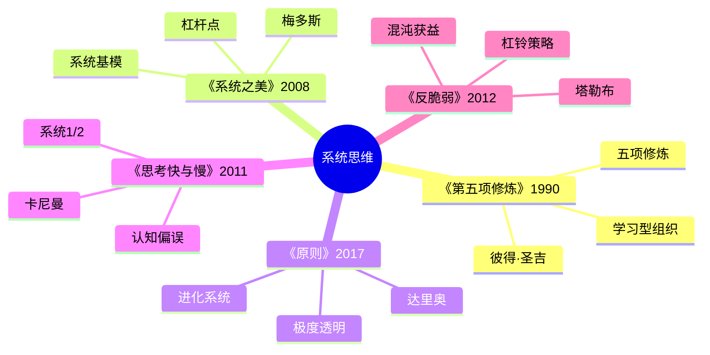
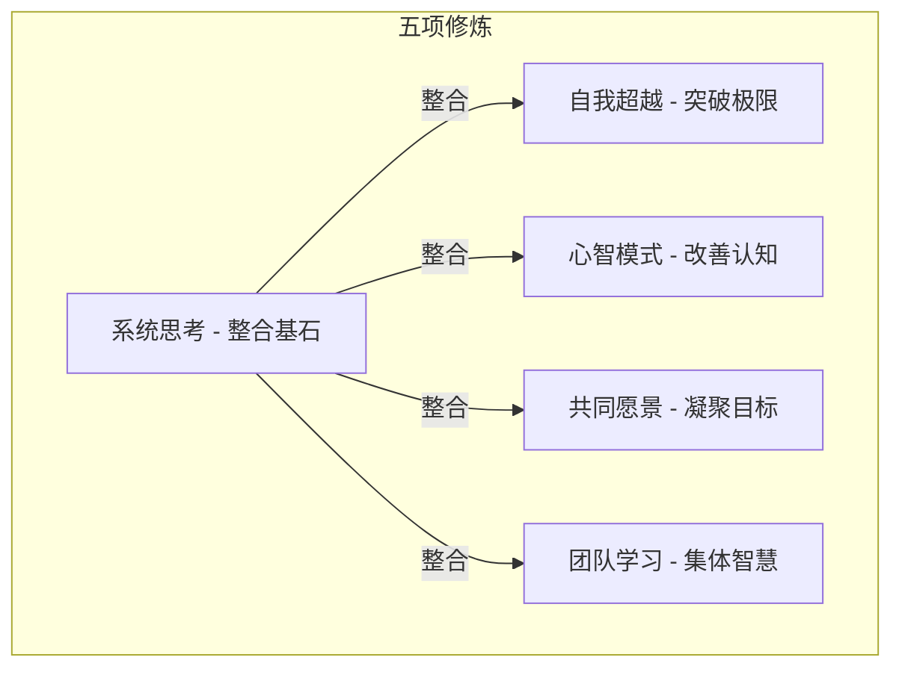
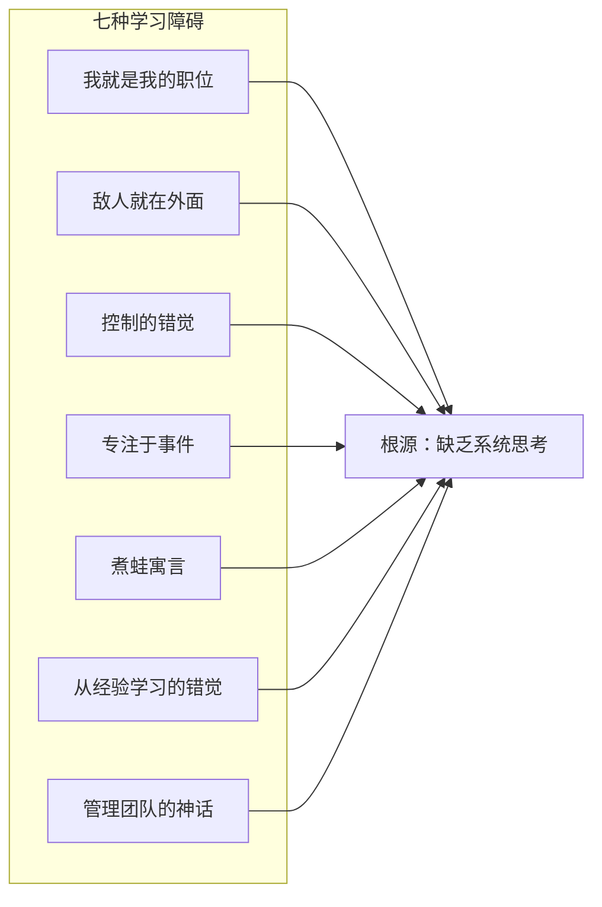
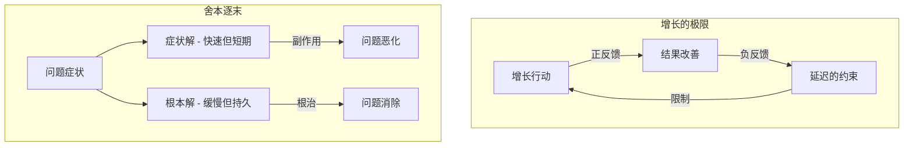
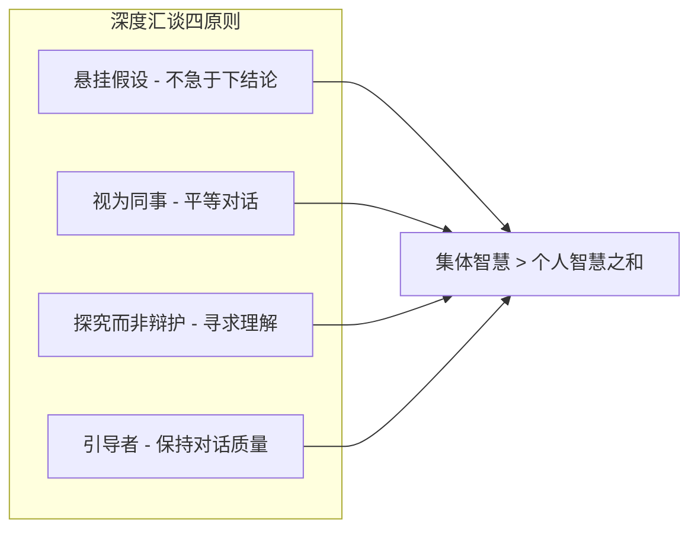

# 《第五项修炼》读书笔记

> **作者**：[美] 彼得·圣吉（Peter Senge）
> **原书名**：The Fifth Discipline: The Art and Practice of the Learning Organization
> **出版时间**：1990年（2009年修订版，2018年中信修订版）

---

## 这本书要解决什么问题？

**核心困境**：大多数组织都是"学习障碍"患者——员工只关注自己的职位，问题都归咎于外部，只会对症状反应而非根治。结果是组织越来越僵化，越来越无法适应变化。

**一句话定位**：
> 真正的学习型组织，是能够持续扩展其创造未来能力的组织。系统思考是整合其他四项修炼的基石，是第五项修炼。

### 作者站在什么位置说这些话？

| 维度 | 定位 |
|------|------|
| 主领域 | 组织管理 / 系统思维 |
| 跨界领域 | 学习理论、认知科学、领导力、东方哲学 |
| 作者背景 | MIT斯隆管理学院教授，"学习型组织之父"，《商业周刊》十大有影响力的管理学人物 |
| 历史地位 | 《哈佛商业评论》评为过去75年最有影响力的管理类图书之一 |

### 和其他书有什么关系？

| 关联书籍 | 关联关系 | 共同底层逻辑 |
|----------|----------|--------------|
| [[系统之美-梅多斯]] | 理论深化 | 系统思考是两者的共同基础，梅多斯更侧重系统原理 |
| [[金字塔原理-明托]] | 实践应用 | 学习型组织需要清晰沟通，心智模式需要结构化表达 |
| [[原则]] | 思想共鸣 | 个人进化与组织进化同构 |
| [[思考快与慢]] | 心智模式 | 心智模式修炼依赖系统2思考，认知偏误是心智模式的陷阱 |
| [[反脆弱-塔勒布]] | 对立互补 | 反脆弱强调从混乱获益，学习型组织强调有序进化——两条路径 |

### 知识网络图

---

## 作者的核心论点

### 学习型组织的五项修炼：不是第五个，是整合者

MIT有一个经典的供应链模拟实验叫"啤酒游戏"。参与者分别扮演零售商、分销商、批发商、工厂，每个环节都理性地做出订货决策——多订一点以防缺货。但结果呢？库存暴增，系统崩盘。每个环节都"做对了"，整个系统却"错了"。

圣吉用这个实验说明一个根本问题：缺乏系统思考的个体，越努力越混乱。

他的解决方案是五项修炼：

| 修炼 | 含义 | 用大白话说 |
|------|------|-----------|
| 自我超越 | 突破极限的自我实现 | 想做到更好，先做到极致 |
| 心智模式 | 改善看待世界的方式 | 你看到的世界，是你心中的世界 |
| 共同愿景 | 组织成员共享的目标 | 一个人的梦想是梦想，一群人的梦想是力量 |
| 团队学习 | 集体智慧超越个人 | 三个臭皮匠，顶个诸葛亮 |
| 系统思考 | 整合其他四项的基石 | 只见树木不见森林，就是不懂系统 |

> **学习型组织定律**：只有系统思考整合其他四项修炼，才能真正实现组织学习。第五项修炼不是"第五个"，而是"整合者"——没有它，其他四项都是散沙。

> **啤酒游戏定律**：局部的理性决策，可能导致系统性的非理性结果——因为结构决定行为。

这打碎了我对"组织管理"的迷信——以前觉得管理就是定制度、抓执行，现在意识到，真正的组织能力来自学习，而不是管控。学习型组织不是培训组织，是进化组织。

这引出了另一个问题：如果组织无法学习，根源在哪？圣吉列出了七种具体的"学习病"。

---

### 组织学习的七种障碍：为什么越努力越糟糕

有一种组织病叫"我就是我的职位"。员工只管自己一亩三分地，跨部门协作形同虚设。还有一种叫"敌人就在外面"，问题永远都是市场不好、客户刁钻、别的部门不配合。更有一种叫"煮蛙寓言"，对缓慢致命的变化完全无感。

圣吉总结了七种学习障碍，每一种都指向同一个根源——缺乏系统思考。

| 障碍 | 表现 | 用大白话说 |
|------|------|-----------|
| 我就是我的职位 | 只关注自己职责范围 | 井底之蛙 |
| 敌人就在外面 | 问题都归咎于外部 | 都是别人的错 |
| 控制的错觉 | 积极行动=解决问题 | 瞎忙不解决问题 |
| 专注于事件 | 只看孤立事件 | 只见树木不见森林 |
| 煮蛙寓言 | 对缓慢变化无感觉 | 温水煮青蛙 |
| 从经验学习的错觉 | 过度依赖经验 | 经验主义害死人 |
| 管理团队的神话 | 团队表面和谐 | 一团和气不解决问题 |

> **学习障碍定律**：组织的失败往往不是因为不够努力，而是因为学习障碍。七种障碍的共同根源是缺乏系统思考——只看局部不看整体。

大厂裁员潮中，"我就是我的职位"的人最先被淘汰——他们的能力只在特定岗位上值钱。创业公司死于"敌人就在外面"——不反思自身问题，永远归咎于环境。AI时代，"从经验学习的错觉"更危险——过去的经验可能完全失效。

以前我以为组织出问题是因为人不努力、制度不完善，现在看，七种障碍就像七种慢性病——组织不会突然死掉，但会慢慢僵化。下次遇到团队效率低下，我不会再急着换人或改制度，而是先对照这七种障碍做个"体检"，找到真正的病因。

有了对障碍的诊断，还需要一套思维方式来替代旧习惯。圣吉接下来给出了系统思考的具体法则。

---

### 系统思考的法则：今天的问题来自昨天的解决方案

你有没有过这样的经历：拼命解决了一个问题，过段时间发现一个更大的问题冒出来了？

这不是运气差。圣吉说这是系统思考的第一法则：**今日问题来自昨日解。** 那个"解决方案"本身就是新问题的种子。

啤酒游戏完美地演示了这一点。前期零售商过度订货（为了防缺货），导致分销商误判需求增加更多订单，工厂加大生产。等真实需求下降时，整个供应链库存已经暴增。每个人都"做对了"，系统却崩了。

| 法则 | 含义 | 啤酒游戏中的表现 |
|------|------|-----------------|
| 今日问题来自昨日解 | 解决方案制造新问题 | 前期过度订货 → 后期库存积压 |
| 越用力推，系统反弹越强 | 补偿性反馈 | 订货越多 → 供应越不稳定 |
| 情况变好之前先变坏 | 负面延迟 | 初期库存下降 → 后期暴涨 |
| 显而易见的解往往无效 | 系统杠杆点隐蔽 | 每个环节增加订货 → 系统崩溃 |
| 对策可能比问题更糟 | 舍本逐末 | 紧急订货 → 打乱生产节奏 |
| 欲速则不达 | 系统有时滞 | 想快速补货 → 信息扭曲 |
| 因与果在时空上不相连 | 时滞效应 | 零售商订货 → 数周后工厂才收到 |

> **系统法则**：看问题要看结构，而非事件；看长期，而非短期；看关联，而非孤立。

降本增效裁员就是"今日问题来自昨日解"——短期省钱了，长期失去人才和知识。盲目拥抱AI就是"对策可能比问题更糟"——工具没用好，反而增加了复杂度。内卷竞争就是"越用力推，系统反弹越强"——过度竞争只会两败俱伤。

下次遇到问题反复出现的局面，我不会再问"这次该怎么解决"，而是问"上次的解决方案是不是这次问题的根源"——这一问，可能改变整个思路。

但法则只是原则，具体怎么用？圣吉给出的工具是"系统基模"——一套识别反复出现的系统结构的模板。

---

### 系统基模：识别反复出现的问题模式

增长遇到瓶颈、问题反复出现、越救火越多、标准越来越低——这些问题看起来各不相同，但底层结构惊人地相似。圣吉把这些反复出现的系统结构归纳为"系统基模"，识别基模就能预见系统行为，找到杠杆点。

| 系统基模 | 典型表现 | 杠杆点 |
|----------|----------|--------|
| 增长的极限 | 初期快速增长，后遇瓶颈 | 消除负反馈源 |
| 舍本逐末 | 只治标不治本 | 坚持根本解 |
| 转移负担 | 依赖外部解决，能力退化 | 建立内部能力 |
| 目标侵蚀 | 期望越来越低 | 坚持目标不降 |
| 恶性竞争 | 越竞争越激烈 | 寻找双赢解 |
| 成长与投资不足 | 发展受阻于投入不足 | 提前投资产能 |
| 公地悲剧 | 资源被过度使用 | 建立共享规则 |

> **系统基模定律**：识别系统基模，就能预见系统行为，找到杠杆点。
> **杠杆点法则**：小投入，大产出——关键在于找到系统的杠杆点，而不是一味用力。

增长遇到瓶颈？可能是"增长的极限"——找到那个延迟出现的负反馈源。问题反复出现？可能是"舍本逐末"——你一直在用症状解，没有碰根本解。越努力越累？可能是"转移负担"——你依赖外部解决方案，内部能力在退化。

这个观点打碎了我的一个假设。我以前总觉得"努力不够"是问题的答案——努力了还没效果，那就更努力。系统基模告诉我，问题可能不在努力的力度，而在努力的方向。在错误的杠杆点上用力，只会让系统反弹更强。下次遇到困境，我不会再一味加力，而是先画出系统结构图，找到真正的杠杆点。

但这些分析工具只是个人的。组织的核心挑战在于：如何让一群人一起做到这些？这引出了圣吉关于团队学习的核心技术。

---

### 深度汇谈：团队学习的核心技术

"三个臭皮匠，顶个诸葛亮"——这句话我们都听过。但现实往往是：三个臭皮匠加起来，还不如一个臭皮匠。为什么？因为大多数团队讨论根本不是"讨论"，而是一场"防御战"——每个人都忙着捍卫自己的立场，没有人真正在听别人说话。

圣吉引入了量子物理学家大卫·玻姆的"深度汇谈"概念，和普通讨论完全不同：

| 深度汇谈 | 普通讨论 |
|----------|----------|
| 悬挂假设，探究真相 | 坚持己见，捍卫立场 |
| 平等对话，不论职级 | 谁职位高谁说了算 |
| 寻求理解，不争对错 | 争输赢，论对错 |
| 发现比个人更深的见解 | 各说各话，没有共识 |

> **深度汇谈定律**：真正的团队学习，是集体智慧超越个人智慧之和。团队学习的基本单位是团体，不是个人——一个人再聪明，也敌不过团队的集体智慧。

远程协作时代，深度汇谈比以往更重要。视频会议天然让人更难"悬挂假设"——你看到的只是头像，感受不到对方的犹豫和思考。跨代沟通中，00后员工更重视平等对话，"谁职位高谁说了算"的模式已经行不通。甚至人机协作也需要"悬挂假设"——面对AI的输出，你是急着辩护"这是错的"还是先探究"它为什么这样回答"？

---

## 这本书的局限

> 圣吉的学习型组织理论是从MIT的管理学研究和企业咨询实践中提炼的，这套方法有它的边界。

| 批评点 | 谁在批评 | 怎么说 | 实际情况 |
|--------|---------|--------|---------|
| 太理想化 | 企业管理者 | 五项修炼需要长期投入，短期看不到回报 | 确实需要耐心，但可以从小处（如悬挂假设）开始实践 |
| 深度汇谈难落地 | 团队领导者 | 企业文化不支持平等对话，职级差异真实存在 | 文化改变需要时间，但引导者机制可以逐步引入 |
| 系统思考门槛高 | 普通读者 | 系统基模和反馈回路需要数学思维 | 概念可以直觉理解，深度应用确实需要练习 |
| 缺乏数字化视角 | 当代读者 | 1990年出版，没有涉及远程协作和数字化组织 | 核心原则不变，但实践方式需要适配数字时代 |
| 过于西方中心 | 跨文化研究者 | 基于美国企业文化，其他文化需要调整 | 圣吉本人对东方哲学有深入研究，但组织实践仍需本地化 |
| 与反脆弱矛盾 | 塔勒布派 | 有序进化可能不如拥抱混乱 | 两条路径不矛盾，适用于不同场景 |

**一句话总结局限性**：
> 五项修炼的框架价值极高，但落地需要根据组织文化、行业特征和数字化程度做适配——原则是通用的，路径是个性化的。

---

## 最值得记住的话

**原书说的**：
1. "真正的学习型组织，是能够持续扩展其创造未来能力的组织。"
2. "系统思考是整合其他四项修炼的基石。"
3. "今日的问题来自昨天的解决方案。"
4. "越用力推，系统反弹越强。"
5. "显而易见的解往往无效。"
6. "啤酒游戏告诉我们：局部的理性，可能导致系统性的非理性。"
7. "深度汇谈是团队学习的核心技术。"
8. "悬挂假设，才能真正探究。"

**翻译成人话**：
1. 学习型组织不是培训组织，是进化组织
2. 第五项修炼不是第五个，是整合者——没有它，其他四项都是散沙
3. 组织的失败往往不是因为不够努力，而是因为学习障碍
4. 看问题要看结构，而非事件；看长期，而非短期；看关联，而非孤立
5. 每个人的理性加起来，不等于系统的理性
6. 杠杆点：小投入，大产出——关键在于位置
7. 心智模式：你看到的世界，是你心中的世界
8. 深度汇谈：不是说服对方，是一起发现真相

---

## 讲给没读过的人听

你有没有发现一个诡异的现象：公司里每个人都在拼命工作，但整个公司的效率越来越低？每个部门都说自己没问题，问题出在别的部门？

MIT做过一个实验叫"啤酒游戏"，完美解释了这个现象。四组人分别扮演零售商、分销商、批发商和工厂。每组都根据自己的信息做出最合理的订货决策。但结果呢？库存暴增，整个供应链崩盘。每个人都"做对了"，系统却"错了"。

圣吉说这就是大多数组织的真实写照。问题不在个人，在系统结构。他提出了"学习型组织"的概念——不是培训组织，是进化组织。核心是五项修炼：自我超越、心智模式、共同愿景、团队学习、系统思考。其中系统思考是"第五项"，也是最重要的一项——它不是第五个修炼，而是整合其他四个的基石。

最有用的一组工具是"系统基模"。增长遇到瓶颈？可能是"增长的极限"——找到那个被你忽略的负反馈。问题反复出现？可能是"舍本逐末"——你一直在用症状解，没碰根本解。越努力越累？可能是"转移负担"——你依赖外部方案，内部能力在退化。

最颠覆我认知的一条法则是"今日问题来自昨日解"。你以为的问题往往是上次解决方案的副产品。所以下次遇到问题反复出现，别问"这次怎么解决"，先问"上次的解决方案是不是这次问题的根源"。

---

## 用来检验理解的问题

**基础回忆**：
1. Q: 五项修炼是哪五项？哪一项最特殊？
   A: 自我超越、心智模式、共同愿景、团队学习、系统思考。系统思考是"第五项"——不是第五个，而是整合其他四项的基石。

2. Q: 啤酒游戏揭示了什么道理？
   A: 局部的理性决策可能导致系统性的非理性结果——因为结构决定行为。

3. Q: 七种学习障碍的共同根源是什么？
   A: 缺乏系统思考——只看局部不看整体。

**理解验证**：
1. Q: 为什么"今日问题来自昨日解"？
   A: 每个解决方案都在改变系统结构，产生新的反馈回路。短期看似解决了问题，长期可能制造更大的问题。需要考虑长期后果。

2. Q: "深度汇谈"和"普通讨论"的本质区别是什么？
   A: 深度汇谈是"悬挂假设、探究真相"，目的是集体发现新见解；普通讨论是"坚持己见、捍卫立场"，目的是赢得辩论。前者集体智慧大于个人之和，后者集体智慧小于个人之和。

3. Q: 为什么系统思考是"第五项"而不是"第一项"？
   A: 因为它是整合者。没有自我超越、心智模式、共同愿景、团队学习这四项作为素材，系统思考就没有可整合的对象。但有了这四项，没有系统思考，它们就是散沙。

**实际应用**：
1. Q: 你的团队正在"救火"吗？用系统基模分析一下。
   A: 关键步骤：识别是"舍本逐末"（只治标不治本）还是"转移负担"（依赖外部解决）→ 找到根本解 → 设计杠杆点。

2. Q: 选一个你最近遇到的问题，用"今日问题来自昨日解"的视角重新审视。
   A: 关键转变：从"这次怎么解决"转变为"上次的解决方案是不是这次问题的根源"。

**深度分析**：
1. Q: 圣吉的"学习型组织"和塔勒布的"反脆弱"有什么本质区别？
   A: 圣吉强调有序进化——通过系统思考、五项修炼让组织持续学习成长；塔勒布强调从混乱中获益——通过杠铃策略让系统在不确定性中变强。一个追求秩序中的进化，一个追求混乱中的获益。两条路径不矛盾，适用于不同场景。

2. Q: 达利欧的"极度透明"和圣吉的"深度汇谈"有什么关联？
   A: 两者都在解决同一个问题——如何让集体智慧超过个人。达利欧用制度（会议录音、棒球卡、可信度加权）来强制透明；圣吉用文化（悬挂假设、平等对话、探究而非辩护）来培育开放。达利欧是硬件方案，圣吉是软件方案。

---

## 和其他书的对话

梅多斯和圣吉在系统思考这条路上是一对师徒。《系统之美》更侧重系统原理本身——反馈回路、杠杆点、系统结构；《第五项修炼》把系统思考嵌入到组织管理的实践中。梅多斯给你理论框架，圣吉给你应用场景。读完圣吉再读梅多斯，你会发现圣吉说的那些"法则"和"基模"，都能在梅多斯那里找到更底层的原理解释。

卡尼曼和圣吉在"心智模式"上有一个隐秘的交汇。卡尼曼揭示了认知偏误——系统1的快思考导致判断失误；圣吉说心智模式是我们看待世界的"有色眼镜"，需要不断检视和修正。卡尼曼告诉你"你的大脑会骗你"，圣吉告诉你"怎么让组织不被大脑骗"。

达利欧和圣吉都在解决"组织如何持续进化"的问题，但方向不同。达利欧是"理性+制度"——用极度透明、可信度加权、五步流程来系统化决策；圣吉是"文化+修炼"——用五项修炼、深度汇谈、系统思考来培育学习能力。达利欧教你不死，圣吉教你成长。

塔勒布和圣吉是两个极端。塔勒布说"混乱是好事"——从反脆弱的角度看，组织应该拥抱不确定性、从冲击中变强；圣吉说"有序是好事"——通过系统思考和学习型组织来主动适应变化。一个偏哲学，一个偏管理。真实情况可能是：既需要圣吉的有序学习，也需要塔勒布的反脆弱韧性。

西奥迪尼的"影响力"和圣吉的"深度汇谈"是两种完全不同的对话模式。西奥迪尼研究的是"如何说服"——利用六大原则影响他人；圣吉追求的是"如何探究"——悬挂假设、平等对话、发现集体智慧。一个是攻击技术，一个是协作艺术。团队需要的是后者，但个人需要先识别前者。

---

*拆解日期：2026-02-25*
*下次回访：1周后回顾「讲给没读过的人听」和「检验问题」*