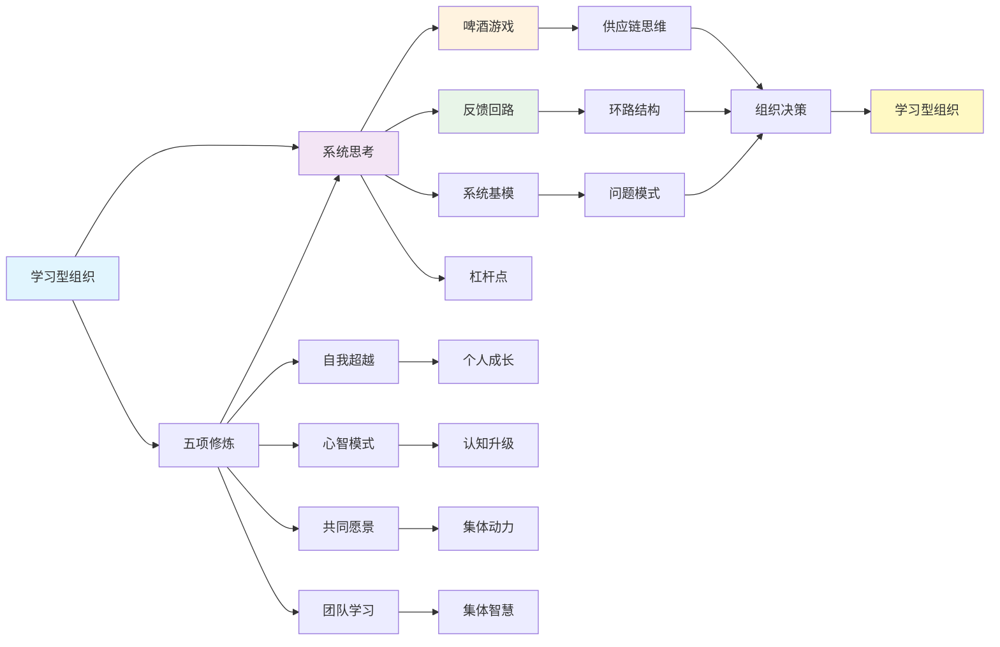

# 《第五项修炼》- 章节导航

> **作者**: [美] 彼得·圣吉（Peter Senge）
> **原书名**: The Fifth Discipline: The Art and Practice of the Learning Organization
> **出版时间**: 1990年（2009年修订版）
> **豆瓣评分**: 8.4（3357人评价）
> **拆解状态**: ✅ 已完成
> **最后更新**: 2026-02-27

---

## 📚 章节结构（Mermaid Mindmap）

```mermaid
mindmap
root((《第五项修炼》))
    第一部分: 概述
      第1章 [[第1章-学习型组织的疆界]]
        核心概念: 系统思考
        核心概念: 学习型组织
      第2章 [[第2章-系统思考入门]]
        核心概念: 系统思考
        核心概念: 啤酒游戏
    第二部分: 学习障碍和助力
      第3章 [[第3章-我就是我的职位]]
        核心概念: 学习障碍
        核心概念: 局部思维
      第4章 [[第4章-归罪于外]]
        核心概念: 学习助力
        核心概念: 系统思考能力
      第5章 [[第5章-系统思考的法则]]
        核心概念: 第五项修炼
        核心概念: 系统基模
    第三部分: 修炼基础
      第6章 [[第6章-自我超越]]
        核心概念: 自我超越
      第7章 [[第7章-心智模式]]
        核心概念: 心智模式
      第8章 [[第8章-共同愿景]]
        核心概念: 共同愿景
      第9章 [[第9章-团队学习]]
        核心概念: 团队学习
      第10章 [[第10章-整合各项修炼]]
        核心概念: 第五项修炼
    第四部分: 实践指导
      第11章 [[第11章-实践的艺术与实践]]
        核心概念: 理论向实践转换
      第12章 [[第12章-创造共同愿景]]
        核心概念: 共同愿景构建
      第13章 [[第13章-走向学习型组织]]
        核心概念: 组织转型
      第14章 [[第14章-实践案例与经验]]
        核心概念: 实践案例
```

---

## 🔗 核心概念关联图



---

## 📊 拆解进度追踪

| 章节 | 标题 | 状态 | 完成日期 | 核心收获 |
|------|------|------|----------|----------|
| 第1章 | [[第1章-学习型组织的疆界]] | ✅ 已完成 | 2026-02-27 | 学习型组织概念与五项修炼框架 |
| 第2章 | [[第2章-系统思考入门]] | ✅ 已完成 | 2026-02-27 | 系统思考基本原理与啤酒游戏应用 |
| 第3章 | [[第3章-我就是我的职位]] | ✅ 已完成 | 2026-02-27 | 局限思考障碍及其对系统的影响 |
| 第4章 | [[第4章-归罪于外]] | ✅ 已完成 | 2026-02-27 | 外部归因障碍与系统责任观 |
| 第5章 | [[第5章-系统思考的法则]] | ✅ 已完成 | 2026-02-27 | 系统思考深入法则与基模 |
| 第6章 | [[第6章-自我超越]] | ✅ 已完成 | 2026-02-27 | 个人成长修炼与愿景驱动成长 |
| 第7章 | [[第7章-心智模式]] | ✅ 已完成 | 2026-02-27 | 认知结构检视与反思改进 |
| 第8章 | [[第8章-共同愿景]] | ✅ 已完成 | 2026-02-27 | 集体愿景构建与共识形成 |
| 第9章 | [[第9章-团队学习]] | ✅ 已完成 | 2026-02-27 | 深度汇谈与集体智慧开发 |
| 第10章 | [[第10章-整合各项修炼]] | ✅ 已完成 | 2026-02-27 | 五项修炼整合协同效应 |
| 第11章 | [[第11章-实践的艺术与实践]] | ✅ 已完成 | 2026-02-27 | 理论到实践转化路径 |
| 第12章 | [[第12章-创造共同愿景]] | ✅ 已完成 | 2026-02-27 | 共同愿景构造与参与式发展 |
| 第13章 | [[第13章-走向学习型组织]] | ✅ 已完成 | 2026-02-27 | 整体组织转型与系统建设 |
| 第14章 | [[第14章-实践案例与经验]] | ✅ 已完成 | 2026-02-27 | 实践案例验证与经验总结 |

**状态说明:**
- ✅ 已完成
- 🔄 进行中
- ⏳ 待开始
- ⏸️ 暂停

---

## 🚀 快速跳转

### 按章节跳转
- [[第1章-学习型组织的疆界]]
- [[第2章-系统思考入门]]
- [[第3章-我就是我的职位]]
- [[第4章-归罪于外]]
- [[第5章-系统思考的法则]]
- [[第6章-自我超越]]
- [[第7章-心智模式]]
- [[第8章-共同愿景]]
- [[第9章-团队学习]]
- [[第10章-整合各项修炼]]
- [[第11章-实践的艺术与实践]]
- [[第12章-创造共同愿景]]
- [[第13章-走向学习型组织]]
- [[第14章-实践案例与经验]]

### 按主题跳转
- [[学习型组织]]
- [[五项修炼]]
- [[系统思考]]
- [[啤酒游戏]]
- [[系统基模]]
- [[心智模式]]
- [[学习障碍]]
- [[团队学习]]
- [[共同愿景]]
- [[自我超越]]

### 相关资源
- [[第五项修炼-拆解记录-v3]]
- [[第五项修炼-圣吉-拆解记录-v3]]
- [[系统之美-梅多斯-拆解记录]]
- [[原则-拆解记录]]
- [[思考快与慢-拆解记录]]
- [[反脆弱-塔勒布-拆解记录]]
