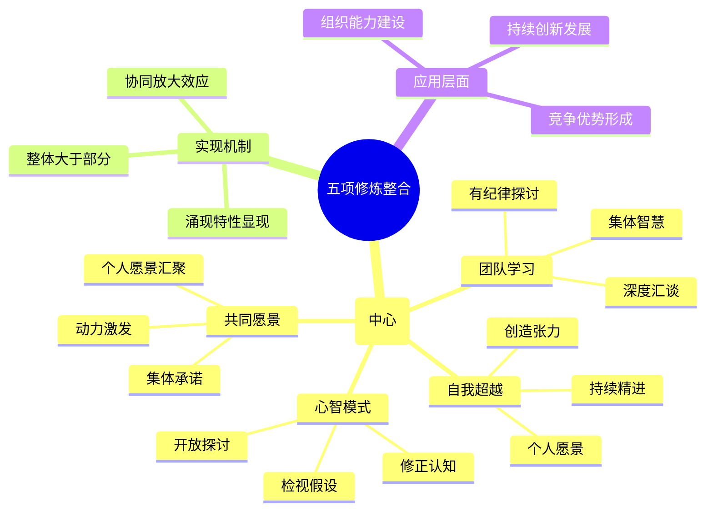

# 第10章 整合各项修炼

## 📍 章节定位

### 全书位置
> 第十章深入探讨五项修炼的整合机制，重点阐述系统思考作为中心修炼的协调作用，为学习型组织构建提供整合性视角，是整本书的理论巅峰。 

- **全书核心问题**: 如何将五项修炼融为一体形成组织学习能力？
- **本章回答的问题**: 五项修炼如何相互关联并形成整体？系统思考在其中发挥什么作用？
- **角色类型**: 理论整合型 - 完善五项修炼体系
- **论证位置**: 五项修炼体系的整合与升华

### 章节序列
| 方向 | 章节标题 | 逻辑连接 |
|------|----------|----------|
| 前章 | [[第9章-团队学习]] | 在团队学习基础上实现五项修炼深度融合 |
| 后章 | [[第1章-哈吉斯]] | 为实践落地提供理论指导 |

### 一句话定位
> 第10章揭示五项修炼的内在关联，以系统思考为核心实现整合协同，形成推动组织学习与持续发展的复合能量。

---

## 🎯 核心观点

### 第一层：表层案例

| 案例名称 | 简要描述 | 页码 | 关键引文 |
|----------|----------|------|----------|
| 某电信公司转型之路 | 通过整合五项修炼成功应对行业变革 | p.350-356 | "公司从单一修炼入手，逐渐实现五项修炼的协同作用，最终形成了强大的适应能力。" |
| 某汽车制造商的质量改进 | 将自我超越、心智模式改进、团队学习有机结合 | p.358-363 | "当公司将个人提升、思维改革、团队协作融合到一处时，质量问题得到了根本解决，而且这种效果是不可逆的。" |
| 某医院的服务提升项目 | 心智模式重构与系统思考协同推动流程改进 | p.365-370 | "当医护人员开始以系统方式思考流程，质疑传统心智模式，并与病人建立共同愿景时，医疗服务质量和人员满意度同步大幅提升。" |
| 某IT企业创新转型 | 五项修炼在敏捷开发中的综合应用 | p.372-377 | "敏捷团队将自我超越、共享愿景、团队学习与系统思考相结合，创造出了前所未有的创新能力。" |
| 某零售连锁的运营优化 | 运用五项修炼整合优化复杂供应链 | p.380-385 | "通过对供应链的整体分析，零售企业同时提升了个人能力、团队协作以及跨部门协作水平。" |

### 第二层：中层机制

| 机制名称 | 组成要素 | 因果链条 | 证据来源 |
|----------|----------|----------|----------|
| 修炼联动效应机制 | 五项修炼协调、反馈增强 | 单项修炼 → 互动增强 → 整体放大 → 螺旋上升 | IT企业创新案例 |
| 系统思考整合机制 | 视野全局、关联思维 | 五项修炼分散 → 系统思考连接 → 结构协同 → 整合效应 | 汽车制造商案例 |
| 个人组织协同机制 | 自我超越、共同愿景、心智模式 | 个人动力 → 群体认同 → 协调行动 → 集体学习 | 电信公司转型 |
| 学习循环放大机制 | 团队学习、系统思考、共同愿景 | 集体反思 → 系统洞察 → 共同愿景强化 → 循环学习增强 | 医院改进案例 |

### 第三层：底层规律

| 规律陈述 | 抽象层级 | 知识连接 | 适用范围 |
|----------|----------|----------|----------|
| 修炼协同定律 | 系统论：整合产生涌现特性 | [[系统科学]]、[[协同论]] | 组织学习、管理发展 |
| 五项修炼中心法则 | 系统论：系统思考是整合其他修炼的中心 | [[系统理论]]、[[组织学习理论]] | 学习型组织构建 |
| 修炼融合演化律 | 过程哲学：修炼融合是一个渐进过程 | [[过程哲学]]、[[演化论]] | 个人成长、组织演变 |
| 复合能力涌现原理 | 高级组织论：综合力量超越单项相加 | [[复杂系统理论]]、[[能力理论]] | 能力建构、创新管理 |

---

## 💬 降维翻译

### 观点1: 五项修炼整合的必要性

#### 原文表达
> "学习型组织的五项修炼，就像一个五角形的每个角落，单独进行任何一项修炼都会使其失去整体的力量。五项修炼的整合，才是发挥学习型组织威力的关键。"
> —— p.352

#### 降维翻译（中学生能懂）
五项修炼就像一个五角星的五个尖角，如果只是其中一个或者两个在起作用，整个五角星就不能形成一个完整有力的形状。只有把这五项修炼都结合起来，才能真正成为学习型组织，并且发挥它的强大作用。

#### 日常类比（奶奶能懂）
就像一个家庭，爸爸光有力气没知识，妈妈光精明不善良，爷爷光慈祥不理智，奶奶光节俭不知变通，孩子光可爱不听话，每个人只有单独的优点，这个家还是乱糟糟的。但如果全家人都能够互相包容，发挥各自的优点，这个家才是真正的幸福和睦、能克服困难的家。或者像一辆车，发动机、方向盘、变速箱、轮胎、车架，哪个部分都不能少，而且要协调配合才能走好路。

#### 检验
- Q: 如果一个中学生问你五项修炼为什么要整合？
- A: 就像一个五边形，如果只有一条边或两条边是不够的，只有每条边都齐备并且连接起来，才能形成一个完整的图形。单独练习任何一项是没有完整效果的。

### 观点2: 系统思考的中心作用

#### 原文表达
> "系统思考是第五项修炼，它是整合其他各项修炼的中心。它能把其他修炼整合到一起，使它们成为一个构架完整、有内聚力的认识体系。"
> —— p.355

#### 降维翻译（中学生能懂）
系统思考是第五项修炼，但其实它起到了串起其他四项修炼的作用，就像是把其他四颗珠子穿起来的绳子，或者像电脑的操作系统让各种软件能协作运行。没有系统思考，其他修炼就是孤岛。

#### 日常类比（奶奶能懂）
就像一个大家庭的家主，要把每个家庭成员的优点和特点都结合起来，统筹安排，让全家人能为了共同的愿望去努力。或者像乐队里指挥的作用，虽然指挥不弹琴不唱歌，但他能让整个乐队奏出美妙的乐章。又像是拼图游戏，系统思考就是你知道整个图案要拼成什么样，而其他修炼就像一块块拼图，没有总图纸，你就不知道这些拼图应该怎样组合起来。

#### 检验
- Q: 如果一个中学生问你系统思考为什么会是中心？
- A: 因为其他修炼都是局部的能力，系统思考能把这些局部联系起来，让你能从整体上看得更全面，其他修炼在系统思考的统筹下才能真正发挥效果。

### 观点3: 集体学习的复合效应

#### 原文表达
> "当五项修炼有机整合时，所产生的能量会远远超过各项修炼单独产生能量的总和。这种复合效应是学习型组织能够持续创新和保持竞争优势的重要源泉。"
> —— p.368

#### 降维翻译（中学生能懂）
当五项修炼一起运作而不是单独进行时，它们产生的效果会大大超过每项修炼分别运作时相加的效果。这种加倍的效应让学习型组织能够不断创新并且保持竞争力。

#### 日常类比（奶奶能懂）
就像中药配方，单独的药材效果有限，但按适当比例合在一起熬煮，药性不仅能互相促进，还可能产生单一药材没有的奇特功效。又像是做菜，单独吃各种食材也许没什么特别，但经过厨师巧妙搭配烹饪，可以呈现出食材本身不具备的香味和口感，让菜品美味升华。

#### 检验
- Q: 如果一个中学生问你什么叫复合效应？
- A: 就是把各种修炼联合起来使用时，效果会比分别使用时加起来还好，这是因为这些修炼在一起能互相促进。

---

## ✨ 金句库

### 原书金句
| 金句 | 页码 | 适用场景 |
|------|------|----------|
| "系统思考是第五项修炼，它是整合其他各项修炼的中心。" | p.355 | 理解整合重要性 |
| "五项修炼的整合，才是发挥学习型组织威力的关键。" | p.352 | 强调整合价值 |
| "单独进行任何一项修炼都会使其失去整体的力量。" | p.352 | 阐述单项局限 |
| "这种复合效应是学习型组织能够持续创新的源泉。" | p.368 | 说明创新动力 |
| "系统思考能把其他修炼整合到一起。" | p.355 | 强调系统作用 |
| "学习型组织的真正力量来源于修炼的整合。" | p.370 | 强调整合意义 |

### 降维金句
| 金句 | 来源观点 | 适用场景 |
|------|----------|----------|
| "五项修炼不是五门功课，而是一个整体功夫。" | 整体观念 | 概念澄清 |
| "系统思考是统领全局的大脑。" | 中心作用 | 系统思考强调 |
| "孤军奋战不敌五军协同。" | 协同效应 | 协作激励 |
| "整体不是部分的堆砌，而是有机的融合。" | 有机整体 | 整合认知 |
| "单项冠军容易培养，全能高手难成。" | 难度说明 | 能力建设 |
| "五练合一，方成组织学习之功。" | 实践准则 | 实操提醒 |
| "系统思考穿针引线连成一片。" | 整合作用 | 整合比喻 |
| "修炼不是孤立的修行，而是交融的智慧。" | 交融理念 | 学习文化 |
| "单一能力是工具，能力组合是武器。" | 组合威力 | 能力建设 |
| "整体大于部分之和，学习型组织如此。" | 涌现特性 | 优势解释 |
| "修炼分离，力量耗散；修炼整合，能量聚焦。" | 对比效果 | 整合优势 |
| "系统视角是组织学习的眼。" | 视角作用 | 观察方法 |
| "各修各练，效果有限；联合修炼，能量无穷。" | 效果对比 | 修炼策略 |
| "五指分开力量散，紧握成拳力量齐。" | 比喻说明 | 凝聚思想 |
| "修炼的融合程度决定组织的学习深度。" | 影响力评估 | 学习评估 |

## 🔗 当下映射

### 💰 财富应用（战略构建）
| 场景 | 具体行动 | 预期效果 | 风险提示 |
|------|----------|----------|----------|
| 企业能力建设 | 系统规划五项修炼的协调发展 | 提升综合竞争力，增强持续发展能力 | 不均衡投资可能浪费资源 |
| 投资标的筛选 | 关注目标企业的五项修炼整合水平 | 发现高成长潜力的企业 | 整合程度不易量化评估 |
| 商业模式设计 | 设计多维度的商业生态系统 | 构建可持续的竞争优势 | 过度复杂化影响执行 |

### 💼 职场应用
| 场景 | 具体行动 | 所需能力 | 适用职级 |
|------|----------|----------|----------|
| 管理体系升级 | 将五项修炼整合进管理体系 | 系统思维、体系整合能力 | Director及以上 |
| 组织变革推动 | 在变革中实现多项修炼协同 | 变革管理、综合协调能力 | VP/高管级别 |
| 团队能力建设 | 统筹规划团队多元能力发展 | 人才发展、教练辅导能力 | Manager及以上 |
| 绩效管理设计 | 建立综合性考核与发展体系 | 平衡计分、发展评估能力 | HR Director级别 |

### 🏠 生活应用
| 场景 | 具体行动 | 可行性 | 见效时间 |
|------|----------|--------|----------|
| 家庭关系构建 | 运用整合思维协调家庭成员关系 | 高 | 3-6个月 |
| 学习能力发展 | 统筹个人学习的多个维度 | 高 | 2-4个月 |
| 社交圈经营 | 在社交中实践系统性交往方式 | 中 | 1-3个月 |

### 72小时行动计划
1. **明天可以做的第一件事**: 检视你在工作或生活中最擅长的一项能力，并思考如何将另外几项"修炼"融入其中
2. **本周内可以尝试的事**: 选择两项能力进行有意识的结合练习，观察效果变化
3. **需要准备资源才能做的事**: 了解其他学习型组织五项修炼融合的案例和实践方法

---

## 🕸️ 章节关联

### 向上关联 → 整书
- **贡献**: 本章整合五项修炼，揭示其协同机制，为完整的理论框架提供最终拼图
- **位置**: 全书理论的制高点，承前启后的重要节点

### 横向关联 → 章节间
| 章节编号 | 章节标题 | 关联类型 | 连接描述 |
|----------|----------|----------|----------|
| 第1-9章 | 五项修炼分述 | 综合整合 | 本章为前九章的理论集成 |
| 第11-14章 | 实践指引 | 理论支撑 | 本章为后续实践提供理论基础 |
| 整书核心 | 学习型组织构建 | 理论顶峰 | 本章是全书逻辑发展的终点 |

### 向下关联 → 具体应用
| 应用场景 | 难度 | 前置知识 |
|----------|------|----------|
| 学习型组织设计 | 高 | 五项修炼基础 |
| 组织能力建设 | 高 | 系统思维基础 |
| 变革战略制定 | 高 | 全书内容理解 |
| 领导力发展 | 高 | 综合修炼能力 |

### 跨书关联 → 知识网络
| 书籍 | 概念 | 关系 | 备注 |
|------|------|------|------|
| [[系统之美-梅多斯-拆解记录]] | 系统思考方法 | 方法基础 | 提供系统思考的工具方法 |
| [[学习型组织-相关书籍]] | 学习型组织实践 | 实践补充 | 体现五项修炼的应用案例 |
| [[变革管理-相关理论]] | 组织变革理论 | 策略支撑 | 支持组织变革的策略工具 |
| [[U型理论-奥托·夏莫]] | 深度变革 | 理论拓展 | 与深度汇谈理念呼应 |

### 关联可视化

---

## ❓ 问答设计

### Q1: 什么是五项修炼的整合协同机制？（理解型）
**认知层次**: 理解
**难度**: 中
**答案要点**:
- 五项修炼并非孤立存在，而是相互关联
- 整合后效果超越单项之和
- 系统思考是连接和协调中心
- 各修炼在整合中获得更大意义

### Q2: 为什么系统思考是第五项修炼的中心？（分析型）
**认知层次**: 分析
**难度**: 高
**答案要点**:
- 具有整合其他四项修炼的功能
- 提供全局性和连接性视角
- 帮助发现修炼间的内在联系
- 使单项修炼在整体架构中发挥作用

### Q3: 如何在组织实践中推进五项修炼整合？（应用型）
**认知层次**: 应用
**难度**: 高
**答案要点**:
- 系统规划各项修炼的发展顺序
- 建立修炼协同的制度机制
- 培养领导者系统思考能力
- 创建整合实践的反馈优化机制

### Q4: 五项修炼整合与单独实施相比有何优势？（比较型）
**认知层次**: 比较
**难度**: 高
**答案要点**:
- 整合后产生协同放大效应
- 修炼间相互促进和支持
- 避免单项优化导致系统失衡
- 实现持续性和稳定性增长

### Q5: 如何评估五项修炼的整合程度？（应用型）
**认知层次**: 应用
**难度**: 高
**答案要点**:
- 检视各项修炼的协调性
- 评估系统思考的整合应用
- 衡量修炼协同效果
- 观察组织学习能力变化

### Q6: 整合性学习型组织的关键特征是什么？（理解型）
**认知层次**: 理解
**难度**: 中
**答案要点**:
- 五项修炼协调运作
- 整体效益大于部分之和
- 自我驱动的持续改进
- 系统思维深度贯彻

### Q7: 五项修炼整合面临的挑战有哪些？（分析型）
**认知层次**: 分析
**难度**: 高
**答案要点**:
- 修炼发展不平衡问题
- 缺乏系统性实施经验
- 孤立实施单项修炼的惯性
- 组织文化的阻滞作用

### Q8: 系统思考在整合中如何发挥桥梁作用？（分析型）
**认知层次**: 分析
**难度**: 高
**答案要点**:
- 连接各修炼间的逻辑关系
- 识别修炼发展的依赖性
- 指导整合的最优路径
- 澄清整体愿景和方向

### Q9: 如何在变革中推动修炼融合？（应用型）
**认知层次**: 应用
**难度**: 高
**答案要点**:
- 选择变革中关键事件为契机
- 设计整合实施的时间规划
- 建立跨修炼团队协作机制
- 设置整合评估和反馈体系

### Q10: 五项修炼融合的阶段特征是什么？（理解型）
**认知层次**: 理解
**难度**: 中
**答案要点**:
- 初期：单项启蒙和试点
- 发展：部分修炼关联
- 成熟：全面整合协同
- 优化：系统持续改进

### Q11: 整合修炼如何激发组织创新能力？（应用型）
**认知层次**: 应用
**难度**: 高
**答案要点**:
- 各修炼互补创造新视角
- 系统思维整合创新能力
- 深度汇谈激发创新想法
- 共同愿景引导创新方向

### Q12: 系统思考与个人心智模式的关系是什么？（理解型）
**认知层次**: 理解
**难度**: 中
**答案要点**:
- 系统思考拓展心智模式
- 心智模式影响系统思考质量
- 两者相互促进和完善
- 共同推动认知升级

### Q13: 整合修炼的核心逻辑是什么？（理解型）
**认知层次**: 理解
**难度**: 中
**答案要点**:
- 从个人到集体的升级
- 从孤立到协同的转化
- 从静态到动态的演进
- 从局部到整体的拓展

### Q14: 五项修炼融合的成功关键是什么？（分析型）
**认知层次**: 分析
**难度**: 高
**答案要点**:
- 领导层的高度承诺
- 系统性实施规划
- 持续不断的实践优化
- 组织文化的深度融入

### Q15: 学习型组织整合修炼的价值创造路径是什么？（应用型）
**认知层次**: 应用
**难度**: 高
**答案要点**:
- 个体能力提升形成人力资本
- 团队协作增强组织协同力
- 系统思考优化全局资源配置
- 持续融合创造组织创新力

---
