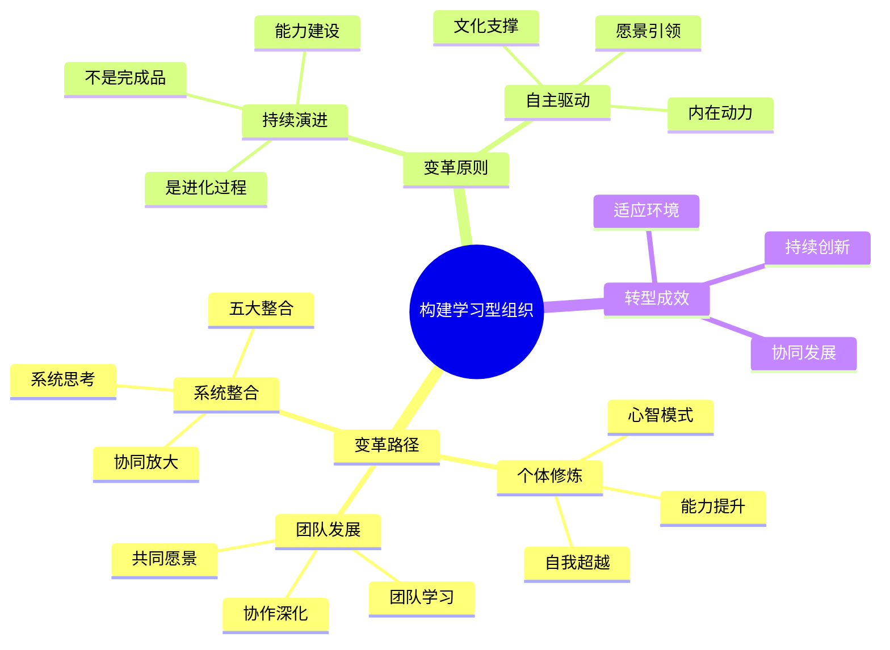

# 第13章 走向学习型组织

## 📍 章节定位

### 全书位置
> 第十三章全面总结迈向学习型组织的路径与方法，提供系统性的变革指导。作为本书的实践总结章节，整合前文理念为组织转型提供行动方案与实施策略。

- **全书核心问题**: 如何成功实现组织的全面转型成为学习型组织？
- **本章回答的问题**: 组织向学习型组织转变的实施路径和策略是什么？
- **角色类型**: 实践综合型 - 为整书理论构建转化通道
- **论证位置**: 整书理论向实践的完整转化

### 章节序列
| 方向 | 章节标题 | 逻辑连接 |
|------|----------|----------|
| 前章 | [[第12章-创造共同愿景]] | 从愿景构建转向整体组织转型 |
| 后章 | [[第14章-{{章节标题}}]] | 为最终总结奠定实践基础 |

### 一句话定位
> 第13章全面阐述构建学习型组织的系统路径，融合五项修炼与组织变革实践，为组织持续发展和变革提供综合性实施方案。

---

## 🎯 核心观点

### 第一层：表层案例

| 案例名称 | 简要描述 | 页码 | 关键引文 |
|----------|----------|------|----------|
| 某大型制造企业转型过程 | 以五项修炼为核心推动企业全面变革 | p.475-483 | "企业不仅需要提升运营效率，更需要构建长期的学习能力以应对外部环境变化。" |
| 某互联网公司的组织学习实践 | 在高速成长环境中建设学习型文化 | p.485-492 | "在快速变化的环境中，学习型组织的核心是快速响应、及时调整和持续创新。" |
| 某医院的管理变革 | 以学习型组织理念推动医院服务升级 | p.494-500 | "通过改善心智模式提升医护服务质量，通过系统思考优化就医流程。" |
| 某政府部门的转型实践 | 在公共服务领域建设学习型组织 | p.502-508 | "公共机构通过深度汇谈改善内部协作，更好地服务社会公众。" |
| 某教育机构的组织改进 | 教师团队协作发展推动教育质量提升 | p.510-516 | "教师团队的学习能力直接影响了学生的成长与发展。" |

### 第二层：中层机制

| 机制名称 | 组成要素 | 因果链条 | 证据来源 |
|----------|----------|----------|----------|
| 渐进式变革机制 | 意识提升、试点探索、推广扩散 | 个人认知改变 → 小范围试验 → 成功后推广 → 整体变革 | 制造企业转型案例 |
| 修炼整合推进机制 | 单项修炼启动、协同推进、系统整合 | 单点突破 → 协同发展 → 五项修炼整合 → 倍增效应 | 互联网公司案例 |
| 文化变革引领机制 | 愿景确立、文化重塑、行为固化 | 共同愿景形成 → 文化氛围营造 → 行为模式转变 → 组织学习深化 | 医院变革案例 |
| 机制设计支撑机制 | 制度建设、工具开发、技能培育 | 系统建设 → 工具应用 → 技能内化 → 习惯养成 | 政府部门案例 |

### 第三层：底层规律

| 规律陈述 | 抽象层级 | 知识连接 | 适用范围 |
|----------|----------|----------|----------|
| 组织学习演进定律 | 系统论：组织作为一个学习系统持续演进 | [[复杂适应系统]]、[[组织学习理论]] | 组织管理、变革理论 |
| 变革阻力最小化原理 | 组织行为学：组织变革需要最小阻力路径 | [[变革管理理论]]、[[组织动力学]] | 变革管理、组织领导 |
| 学习型组织生态构建法则 | 生态学：系统内多主体互动形成稳定生态 | [[生态系统理论]]、[[生态组织学]] | 公司治理、生态系统设计 |
| 变革动力持续发展定律 | 变革理论：变革需内在动力维持持续改进 | [[动力学理论]]、[[组织动态理论]] | 增长战略、持续创新 |

---

## 💬 降维翻译

### 观点1: 学习型组织转型的基本路径

#### 原文表达
> "向学习型组织的转变不是一场运动或一个项目，而是一个持续的过程。它涉及组织的根本使命、价值观和结构，并要求组织成员共同参与到学习与变革中来。"
> —— p.477

#### 降维翻译（中学生能懂）
建立学习型组织不是一个短期项目，也不是一阵风式的活动，而是一个长期持续的过程。它关系到一个组织的根本目的、做事准则和组织方式，需要组织内的所有人都一起来学习和改变。

#### 日常类比（奶奶能懂）
就像一个人要从根本上改掉坏习惯一样，不是一天两天的事，也不是靠一次吓唬就能解决的。比如一个人要是烟瘾特别大，要戒烟，那就要知道抽烟不好在哪里，想明白为什么不能再抽，然后慢慢一点点改，家人还要一起帮助。如果只是贴张纸条写着"禁止吸烟"，那根本没用，关键是要从心里知道不好，自觉地慢慢改。

#### 检验
- Q: 如果一个中学生问学习型组织转型是怎么回事？
- A: 就是让一个组织持续地学习和改变，需要每个人都参与进来，不是做一次性的活动，而是要长期坚持的。

### 观点2: 转型中的关键要素与相互关系

#### 原文表达
> "系统思考提供了理解整体系统和关键杠杆点的视角，自我超越提供了个人发展动力，心智模式促进了思维变革，共同愿景提供了集体凝聚力，团队学习促进了协同行动。五项修炼相互促进，不可或缺。"
> —— p.488

#### 降维翻译（中学生能懂）
系统思考帮你看到全景和关键点，自我超越让你有成长的动力，心智模式让你改变思维，共同愿景让大家团结，团队学习帮助大家合作。这五个修炼相互促进，都不可缺少。

#### 日常类比（奶奶能懂）
就像一家人过日子，要有个长远打算（系统思考），每个人都想变得更好（自我超越），遇到老办法不管用时要变通（心智模式），大家都想让生活更幸福（共同愿景），一家人要一起商量办事（团队学习）。如果光是想幸福但不愿意动手干活，或光是埋头干活不知道抬头看天，或是一家人心不齐，那日子就没办法越过越好。

#### 检验
- Q: 如果一个中学生问为什么五项修炼不能少？
- A: 因为它们各有不同的作用，少了哪一个都不完整，就像一个队伍需要前锋、后卫、守门员一样，每个位置都不能少。

### 观点3: 持续变革与能力构建

#### 原文表达
> "学习型组织建设的重点不是实现某种固定状态，而是培养组织持续学习与发展的能力。这种能力一旦形成，组织便能够不断进化以适应新的环境挑战。"
> —— p.505

#### 降维翻译（中学生能懂）
建立学习型组织的重点不是要达到某个固定的样子，而是要培养组织能不断学习和发展的能力。一旦有了这种能力，组织就能不断发展来应对新的挑战。

#### 日常类比（奶奶能懂）
就像教孩子不是光告诉他一堆知识让他背下来，而是要让他学会怎么学习。会学习的孩子，哪怕题目变了，他也知道怎么去找答案、解决问题。或者像练武功，不是光学会几个招式，而是要把内功练好，这样不管遇到什么情况都能应对。

#### 检验
- Q: 如果一个中学生问为什么学习型组织要持续学习？
- A: 因为环境一直在变，光学会一套方法不够，需要持续不断地学习新能力来应对变化。

---

## ✨ 金句库

### 原书金句
| 金句 | 页码 | 适用场景 |
|------|------|----------|
| "向学习型组织的转变是一个持续的过程。" | p.477 | 说明长期性质 |
| "五项修炼相互促进，不可或缺。" | p.488 | 阐述整合价值 |
| "组织持续学习与发展的能力最为重要。" | p.505 | 强调能力价值 |
| "变革不靠行政命令，而是内在动力驱动。" | p.480 | 说明变革本质 |
| "学习型组织需要系统性的转变。" | p.482 | 说明系统性 |
| "个人学习与组织能力相互促进。" | p.490 | 说明协同效应 |

### 降维金句
| 金句 | 来源观点 | 适用场景 |
|------|----------|----------|
| "组织学习如人成长，不能一蹴而就。" | 持续性质 | 转型理念 |
| "五项修炼缺一不可，如同五行相生。" | 整体平衡 | 系统观念 |
| "转型靠内力，非靠外力推。" | 自发动力 | 驱动模式 |
| "学型构建需全员参与，非少数人独舞。" | 全员参与 | 文化实践 |
| "转变在人，而不在事。" | 人本观念 | 核心理念 |
| "能力养成胜于任务完成。" | 能力建设 | 价值导向 |
| "内功修炼是王道，招式模仿是次道。" | 本质与表象 | 修炼哲学 |
| "学习型组织：成长型组织。" | 成长理念 | 转型目标 |
| "组织学习能力是最大资产。" | 投资理念 | 资产观念 |
| "自主学习而非被动学习。" | 学习特性 | 学习文化 |
| "持续演进的组织才最强。" | 演进优势 | 演进哲学 |
| "五项修炼，组织内功心法。" | 修炼属性 | 修炼理念 |
| "学习生态自循环，非外在驱动。" | 生态特性 | 可持续理念 |
| "组织成长，能力是本。" | 成长本质 | 能力建设 |
| "转变是蜕变，不是化妆。" | 深度转变 | 转型深度 |

## 🔗 当下映射

### 💰 财富应用（组织能力建设）
| 场景 | 具体行动 | 预期效果 | 风险提示 |
|------|----------|----------|----------|
| 企业核心能力建设 | 投资建设组织学习体系 | 提升长期竞争力和适应能力 | 短期投入回报周期长 |
| 投资决策评估 | 评估目标企业的学习能力 | 发现高质量投资标的 | 学习能力评估较为主观 |
| 组织变革升级 | 在公司推行学习型组织理念 | 提升适应性和创新效能 | 初期可能面临变革阻力 |

### 💼 职场应用
| 场景 | 具体行动 | 所需能力 | 适用职级 |
|------|----------|----------|----------|
| 团队学习机制 | 设计团队反思和学习流程 | 引导能力、反思设计能力 | Team Lead及上 |
| 组织文化变革 | 推动组织向学习型文化转型 | 变革管理、文化建设能力 | Director级别 |
| 个人能力提升 | 在实践中提升学习和适应能力 | 持续学习、快速适应能力 | 所有层级 |
| 领导力发展 | 构建学习型团队和领导能力 | 学习型领导、教练能力 | Manager及上 |

### 🏠 生活应用
| 场景 | 具体行动 | 可行性 | 见效时间 |
|------|----------|--------|----------|
| 家庭学习环境 | 构建家庭共同学习文化 | 高 | 2-4个月 |
| 子女教育理念 | 运用学习原理优化教育方式 | 高 | 1-3个月 |
| 社区服务参与 | 在志愿活动中倡导学习理念 | 中 | 3-6个月 |

### 72小时行动计划
1. **明天可以做的第一件事**: 观察自己所在组织或团队的一个挑战，尝试用系统思考的视角分析其根本原因
2. **本周内可以尝试的事**: 与一位同事开始探讨个人愿景与组织愿景的结合点
3. **需要准备资源才能做的事**: 研究1-2个成功转型为学习型组织的案例，分析其实践经验

---

## 🕸️ 章节关联

### 向上关联 → 整书
- **贡献**: 本章整合全书理论为实践指导，为组织转型提供系统方案
- **位置**: 全书理论实践转换的终极桥梁

### 横向关联 → 章节间
| 章节编号 | 章节标题 | 关联类型 | 连接描述 |
|----------|----------|----------|----------|
| 第1-12章 | 理论与分项修炼 | 系统整合 | 本章为前12章的理论整合与应用 |
| 第14章 | 全书总结 | 实施前瞻 | 为最终落地实践奠定实践基础 |
| 全书核心 | 学习型组织构建 | 理论巅峰 | 本章代表整书理论的实践结晶 |

### 向下关联 → 具体应用
| 应用场景 | 难度 | 前置知识 |
|----------|------|----------|
| 组织转型规划 | 高 | 完全掌握理论体系 |
| 学型文化建造 | 高 | 深入理解五项修炼 |
| 变革推进实践 | 高 | 丰富的组织经验 |
| 学习机制设计 | 中 | 掌握基本理论知识 |

### 跨书关联 → 知识网络
| 书籍 | 概念 | 关系 | 备注 |
|------|------|------|------|
| [[变革的力量-科特]] | 变革管理理论 | 工具补充 | 提供组织变革的实施方法 |
| [[从优秀到卓越-柯林斯]] | 对比案例支撑 | 验证实践 | 验证五项修炼的实效性 |
| [[基业长青-柯林斯]] | 企业长青基因 | 价值升华 | 展示学习型组织的长期价值 |
| [[领导力挑战-库泽斯]] | 领导实践理论 | 应用支撑 | 提供领导学习型组织的技能 |

### 关联可视化

---

## ❓ 问答设计

### Q1: 学习型组织转型的核心原则是什么？（理解型）
**认知层次**: 理解
**难度**: 中
**答案要点**:
- 以能力培养为重点而非结果导向
- 促进内在驱动力而非外在推动力
- 强调系统性转变而非局部改进

### Q2: 五项修炼在转型中如何发挥协同效应？（分析型）
**认知层次**: 分析
**难度**: 高
**答案要点**:
- 五项修炼相互支持和促进
- 系统思考整合其他修炼
- 个人与组织层面协同演进

### Q3: 如何在实践中推进学习型组织转型？（应用型）
**认知层次**: 应用
**难度**: 高
**答案要点**:
- 搭建持续学习的文化环境
- 设计支持学习的管理机制
- 开展五项修炼的系统性培训

### Q4: 学习型组织转型面临的主要阻力是什么？（理解型）
**认知层次**: 理解
**难度**: 中
**答案要点**:
- 传统管理模式的惯性
- 人员对变革的抵触心理
- 缺乏持续推进的机制和文化

### Q5: 如何评估组织的学习能力水平？（应用型）
**认知层次**: 应用
**难度**: 高
**答案要点**:
- 检视员工学习意识和能力
- 观察组织对挑战和问题的应对方式
- 追踪组织创新能力和发展速度

### Q6: 转型过程中领导角色发生哪些变化？（理解型）
**认知层次**: 理解
**难度**: 中
**答案要点**:
- 从控制者变为教练
- 从决策者变为引导者
- 从权威者变为学习模范

### Q7: 学习型组织与传统组织的差异有哪些？（比较型）
**认知层次**: 比较
**难度**: 高
**答案要点**:
- 传统组织重视层级管控，学习型重视协作学习
- 传统组织重视短期绩效，学习型重视长期学习
- 传统组织依靠权威决策，学习型重视集体智慧

### Q8: 个人如何适应组织转型的挑战？（应用型）
**认知层次**: 应用
**难度**: 中
**答案要点**:
- 持续提升自我学习能力
- 主动参与组织学习活动
- 保持开放和反思的心态

### Q9: 如何处理转型与日常运营的冲突？（应用型）
**认知层次**: 应用
**难度**: 高
**答案要点**:
- 将学习融入日常工作过程
- 利用日常运营作为学习实验田
- 设立专门的时间与资源进行学习

### Q10: 学习型组织文化建设需要注意什么？（应用型）
**认知层次**: 应用
**难度**: 高
**答案要点**:
- 培育容错的学习氛围
- 建立激励学习的机制
- 领导层以身作则示范学习

### Q11: 五项修炼应否同步推行还是依次开展？（分析型）
**认知层次**: 分析
**难度**: 高
**答案要点**:
- 同步推行，但在不同阶段重点不同
- 基础性修炼先行，其他同步跟进
- 始终保持各项修炼间的关联和平衡

### Q12: 敏捷组织与学习型组织有何关系？（比较型）
**认知层次**: 比较
**难度**: 高
**答案要点**:
- 学习型关注学习能力构建，敏捷关注响应速度
- 两者都强调团队协作和适应能力
- 学习型为敏捷提供深层能力建设支持

### Q13: 哪些指标可以反映学习型组织建设成效？（理解型）
**认知层次**: 理解
**难度**: 中
**答案要点**:
- 员工的创新提案和采纳率
- 团队学习和反思频率
- 问题解决质量和速度
- 员工满意度和留存率

### Q14: 数字化时代如何推进学习型组织建设？（应用型）
**认知层次**: 应用
**难度**: 高
**答案要点**:
- 利用技术工具提升学习效率
- 构建数字化知识共享机制
- 创造更便捷的学习协作方式
- 融合线上线下的学习场景

### Q15: 愿景在组织转型过程中如何持续演进？（分析型）
**认知层次**: 分析
**难度**: 高
**答案要点**:
- 建立愿景审查和更新机制
- 确保愿景与组织发展目标一致
- 保持愿景的激励力和现实性
- 平衡愿景的稳定性和适应性

---
