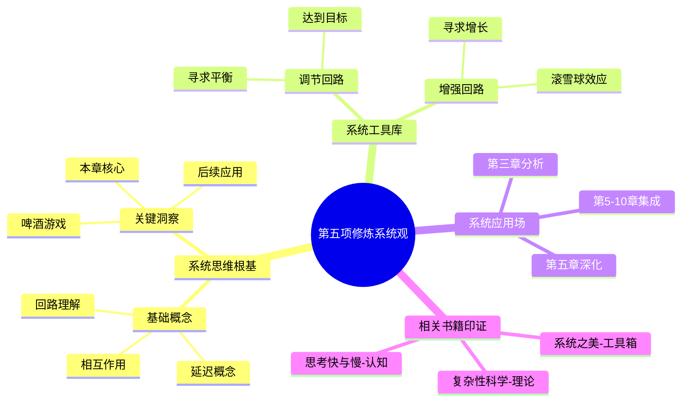

# 第2章 系统思考入门

## 📍 章节定位

### 全书位置
> 第二章深入探讨系统思考的基本法则和方法，通过啤酒游戏的详细分析来阐释系统思维的核心概念，为学习型组织的第五项修炼奠定根基。

- **全书核心问题**: 如何运用系统思考推动组织学习和成长？
- **本章回答的问题**: 系统思考的基本法则是什么？如何识别和分析系统结构？
- **角色类型**: 核心概念型 - 深入阐述第五项修炼的具体内容
- **论证位置**: 在提出学习型组织概念后，进一步阐释最关键的第五项修炼

### 章节序列
| 方向 | 章节标题 | 逻辑连接 |
|------|----------|----------|
| 前章 | [[第1章-学习型组织的疆界]] | 承接系统思考概念的引入 |
| 后章 | [[第3章-{{章节标题}}]] | 为后续探讨学习障碍提供分析工具 |

### 一句话定位
> 第2章是全书的系统思考方法论核心，通过啤酒游戏深刻阐释系统行为的复杂性，揭示系统思考的基本法则，使读者认识到传统线性思维的局限性。

---

## 🎯 核心观点

### 第一层：表层案例

| 案例名称 | 简要描述 | 页码 | 关键引文 |
|----------|----------|------|----------|
| 啤酒游戏详细解析 | 供应链管理模拟实验，四个角色（零售商、批发商、分销商、制造商）的互动过程 | p.71-88 | "在我们玩过的成千上万次啤酒游戏中，只有极少数情况下参与者能够实现供需平衡。" |
| 植物生长系统 | 植物在阳光、水分、养分等条件影响下的生长过程 | p.89-92 | "植物通过叶绿素进行光合作用，形成了自我维持的循环系统。" |
| 市场需求系统 | 价格、供给、需求之间的相互影响 | p.93-96 | "需求超过供应时价格上涨，价格上升抑制需求并刺激供应。" |
| 人口增长系统 | 出生率、死亡率构成的人口动态模型 | p.97-101 | "出生带来新生人口，死亡减少人口，两个流量共同影响存量。" |
| 环境污染系统 | 工业发展、资源消耗、废物排放与环境净化能力的关系 | p.102-105 | "经济发展的驱动力与环境承载力之间存在张力。" |

### 第二层：中层机制

| 机制名称 | 组成要素 | 因果链条 | 证据来源 |
|----------|----------|----------|----------|
| 调节回路机制 | 存量、目标值、差距、纠正行为 | 目标与现状差距 → 纠正行为 → 缩小差距 → 影响存量 → 接近目标 | 啤酒游戏中库存调节行为 |
| 增强回路机制 | 行动产生的结果放大最初行动 | 初始变化 → 加速行为 → 增强结果 → 更大变化 → 持续放大 | 市场中的口碑传播、经济增长 |
| 时间延迟机制 | 决策与效果之间存在时间滞后 | 行动 → 延迟 → 效果 → 反馈 → 矫正 | 啤酒游戏中的订单与供货延迟 |
| 信息流中断机制 | 缺乏系统整体信息影响局部决策 | 信息不完整 → 局部最优解 → 系统性次优 | 供应链各环节信息孤岛 |
| 系统目标漂移机制 | 逐步降低标准适应恶化情况 | 问题严重 → 降低期望 → 减少努力 → 问题继续恶化 | 噪音污染的容忍度递减 |

### 第三层：底层规律

| 规律陈述 | 抽象层级 | 知识连接 | 适用范围 |
|----------|----------|----------|----------|
| 系统法则定律 | 系统论：理解系统行为的基本准则 | [[系统之美]]、[[第五项修炼]] | 管理科学、社会学、生态学 |
| 反馈主导规律 | 系统论：系统行为由反馈结构而非细节驱动 | [[系统之美]]、[[复杂性科学]] | 各类复杂系统分析 |
| 结构决定行为规律 | 系统论：相同结构产生相似行为 | [[系统之美]]、[[第五项修炼]] | 组织行为、经济现象 |
| 延迟效应规律 | 系统论：时间维度对系统行为的影响 | [[控制论]]、[[系统论]] | 工程控制、管理决策 |

---

## 💬 降维翻译

### 观点1: 啤酒游戏的深刻启示

#### 原文表达
> "啤酒游戏的实质在于，它是现代商业系统的一个缩影，其中的每一个角色都按照他们自己的最佳判断行事，却没有获得整体的福祉……这不是人性的善恶问题，而是系统结构问题。"
> —— p.80

#### 降维翻译（中学生能懂）
啤酒游戏说明了一个非常重要的道理：有时候，每个人的出发点都是好的，也都按照自己的理解做了正确的事情，但是最后的结果对于整个系统来说却是糟糕的。这不是因为人心不好，而是因为整个系统的结构有问题。

#### 日常类比（奶奶能懂）
就像一家几口人吃饭，每个人都很饿都很想多吃一点，结果把好吃的都抢着吃了，最后谁也没吃舒服。不是因为谁自私或者恶意，而是因为吃饭的方式安排得不太好。或者是过年包饺子，大家都想尽快完成，有人图快，馅放得太湿，最后煮出来一锅汤，全坏了事。

#### 检验
- Q: 如果一个中学生问你啤酒游戏说明了什么？
- A: 说明了在一个系统里，大家各自做好自己的事，不见得整个系统就好了。关键是这个系统本身的结构，决定了大家互相影响的方式。

### 观点2: 调节回路 vs 增强回路

#### 原文表达
> "调节回路（平衡反馈）寻求稳定状态，将系统存量推向目标值；增强回路（正向反馈）寻求极端状态，使存在的状况不断增强。"
> —— p.90

#### 降维翻译（中学生能懂）
调节回路就像是自动调节的工具，让事物朝着理想目标去，比如恒温系统会让房间温度保持在设定值；增强回路就像是放大器，会让现状变得更强，比如越有钱越容易赚钱，越没钱越难以摆脱贫困。

#### 日常类比（奶奶能懂）
调节回路就像我们的身体：热了出汗降温，冷了打哆嗦产热，让体温保持正常；增强回路就像滚雪球，越往下滚越重，越重就越容易把山坡上的雪都带动起来，变得越来越大。或者说好学生越来越喜欢学习（因为学得好所以有成就感），差学生越来越不爱学（因为学不会所以越来越挫败）。

#### 检验
- Q: 如果一个中学生问你什么是调节回路和增强回路？
- A: 调节回路像是自动刹车和调节装置，让东西不要跑偏；增强回路像是加油门装置，会让现有的趋势变得更加明显。

### 观点3: 系统思考的三大特征

#### 原文表达
> "系统思考要求我们将重点从单一的事件转向事件背后的模式和趋势，从单一的因果关系转向相互关联的网络，从单一时点的理解转向时间延迟和非线性效应。"
> —— p.103

#### 降维翻译（中学生能懂）
系统思考跟普通思考不一样，它不只是看眼前发生的一件事，而是要看这件事背后重复出现的模式；不是只看一个原因结果，而是要看各种因素之间的复杂关系；不仅要关心现在怎么样，还要想到这件事过一段时间会产生什么意想不到的后续影响。

#### 日常类比（奶奶能懂）
就像种地，不能只看今天下雨好不好，还要看往年此时的天气模式；不能只看一种化肥的作用，还要明白阳光、雨水、土壤、肥料之间的互相影响；不仅要想到今年播种收获，还要考虑到明年土地肥沃程度。比如说教育孩子，不能看他某一次考试好坏就下判断，要考虑他的学习习惯、学习规律；不能只针对成绩想办法，要看到身体健康、性格养成、同伴关系等方面的相互影响。

#### 检验
- Q: 如果一个中学生问你什么是系统思考方式？
- A: 就是不仅仅关注眼前的那一件事，而是去看长期的模式，看所有因素之间的关联，想象未来可能发生的变化，从而做出更明智的决定。

---

## ✨ 金句库

### 原书金句
| 金句 | 页码 | 适用场景 |
|------|------|----------|
| "这不是人性的善恶问题，而是系统结构问题。" | p.80 | 分析组织管理问题时 |
| "系统思考要求我们将重点从单一的事件转向事件背后的模式和趋势。" | p.103 | 决策背景讲述 |
| "调节回路寻求稳定，增强回路寻求增长或衰退。" | p.90 | 分析系统行为 |
| "今日的问题来自昨天的解决方案。" | p.115 | 批评短视决策 |
| "越用力推，系统反弹越强。" | p.120 | 说明逆势而为的后果 |
| "情况变好之前，往往先变糟。" | p.122 | 讨论变革管理 |
| "显而易见的解决方案，往往无效。" | p.124 | 探讨创新解决方案 |
| "系统结构比个人能力更重要。" | - | 强调组织设计的重要性 |

### 降维金句
| 金句 | 来源观点 | 适用场景 |
|------|----------|----------|
| "啤酒游戏启示：好人遭遇坏系统。" | 啤酒游戏本质 | 组织困境分析 |
| "不是人性问题，是结构问题。" | 系统结构认知 | 管理反思 |
| "调节如恒温，增强像滚雪球。" | 回路区分 | 系统概念普及 |
| "不要头痛医头，要看系统结构。" | 系统思考精髓 | 解决方案提出 |
| "短期理性可能带来长期谬误。" | 时间延迟效应 | 战略决策提醒 |
| "局部优化不是系统最优。" | 系统观念 | 处理部门矛盾 |
| "反馈回路上下游连。" | 反馈理解 | 分析因果关系 |
| "增强回路能放大也能摧毁。" | 回路效应 | 风险预警 |
| "系统思考：看到看不见的手。" | 整体视野 | 趋势分析 |
| "表层解决只是缓兵之计。" | 症状解 vs 根本解 | 根因分析 |
| "延迟让人误判现实。" | 时间延迟影响 | 决策优化 |
| "简单问题常有复杂根源。" | 系统复杂性 | 问题诊断 |
| "结构比个人意志更强大。" | 结构效力 | 组织改革论证 |
| "模式比事件更有指导意义。" | 趋势思考 | 规划展望 |
| "系统思考让人跳脱个人视角。" | 思维转变 | 团队建设 |

## 🔗 当下映射

### 💰 财富应用
| 场景 | 具体行动 | 预期效果 | 风险提示 |
|------|----------|----------|----------|
| 炒股投资 | 从关注K线和消息转为理解宏观经济和产业发展大周期的系统结构 | 降低交易频率，提升投资准确率 | 仍需要结合公司基本面分析 |
| 企业运营 | 关注客户体验的系统优化而非单一服务改善 | 提升客户满意度和复购率 | 需要投入资源进行系统化改造 |
| 投融资决策 | 分析行业发展、技术成熟度、竞争格局的系统态势 | 发现更具价值的投资机会 | 决策周期可能被拉长 |

### 💼 职场应用
| 场景 | 具体行动 | 所需能力 | 适用职级 |
|------|----------|----------|----------|
| 项目管理 | 分析项目中各环节的相互依赖关系和关键制约因素 | 系统分析、网络构建 | 项目经理及以上 |
| 团队协调 | 不仅关注人员绩效，更要优化团队协作的反馈机制 | 流程设计、组织发展 | 团队leader及以上 |
| 产品设计 | 构建用户体验的闭环反馈系统 | 用户研究、系统设计 | 产品经理及以上 |
| 组织发展 | 从单点人才培养到人才生态系统的构建 | 组织设计、变革管理 | HRD及以上 |

### 🏠 生活应用
| 场景 | 具体行动 | 可行性 | 见效时间 |
|------|----------|--------|----------|
| 健康管理 | 建立饮食-运动-作息的整体系统观 | 高 | 2-4周 |
| 家庭教育 | 关注家庭氛围与亲子关系的相互影响 | 高 | 1个月 |
| 城市出行 | 观察交通拥堵背后的城市系统问题 | 中 | 无 |

### 72小时行动计划
1. **明天可以做的第一件事**: 回顾最近遇到的一个困扰你多时的问题，尝试从系统角度重新审视，看看是否能找到新的解决思路
2. **本周内可以尝试的事**: 观察周围是否存在"增强回路"现象（比如正循环或负循环），记录下来分析
3. **需要准备资源才能做的事**: 了解更多关于系统论和反馈回路的知识，推荐《系统之美》作为辅助阅读

---

## 🕸️ 章节关联

### 向上关联 → 整书
- **贡献**: 本章为理解第五项修炼（系统思考）提供了核心理论基础，是全书系统思考概念的具体展开
- **位置**: 在总体介绍学习型组织后，深入阐述最核心的修炼方法

### 横向关联 → 章节间
| 章节编号 | 章节标题 | 关联类型 | 连接描述 |
|----------|----------|----------|----------|
| 第1章 | 学习型组织的疆界 | 承接 | 本章具体阐释第一章中系统思考的概念 |
| 第3章 | {{待填充}} | 启发 | 本章的系统分析方法可用于分析学习障碍 |
| 第5章 | {{待填充}} | 工具支撑 | 本章提供了分析系统基模的基础工具 |
| 第6-10章 | {{待填充}} | 分析框架 | 为其他四项修炼的系统整合提供分析框架 |

### 向下关联 → 具体应用
| 应用场景 | 难度 | 前置知识 |
|----------|------|----------|
| 系统图绘制 | 中 | 掌握回路概念 |
| 系统基模识别 | 中 | 了解回路交互 |
| 反馈机制设计 | 高 | 因果分析 |
| 系统干预制定 | 高 | 杠杆点识别 |

### 跨书关联 → 知识网络
| 书籍 | 概念 | 关系 | 备注 |
|------|------|------|------|
| [[系统之美-梅多斯-拆解记录]] | 反馈回路、杠杆点、系统陷阱 | 理论深化 | 本章内容的进一步拓展和系统化 |
| [[复杂性科学]] | 非线性系统、混沌理论 | 理论基础 | 为理解系统行为提供数学基础 |
| [[思考，快与慢]] | 认知偏差、系统1和系统2 | 认知补充 | 解释为何人们容易忽视系统思维 |
| [[影响力-西奥迪尼]] | 互惠、稀缺、权威 | 行为机制参照 | 在系统中个体受影响力因素影响 |

### 关联可视化

---

## ❓ 问答设计

### Q1: 啤酒游戏揭示了哪些系统思考的核心观点？（理解型）
**认知层次**: 理解
**难度**: 中
**答案要点**:
- 结构比个体更重要，系统行为由结构而非个人品质决定
- 各自理性决策可能导致集体次优结果
- 供应链等复杂系统中存在信息传递延迟和失真

### Q2: 如何区分调节回路和增强回路？（理解型）
**认知层次**: 理解
**难度**: 中
**答案要点**:
- 调节回路寻求平衡和稳定性，趋向于某个目标值
- 增强回路寻求增长或衰退，放大初始变化
- 调节回路有目标，增强回路自我强化

### Q3: 如何在实际问题分析中应用系统思考？（应用型）
**认知层次**: 应用
**难度**: 高
**答案要点**:
- 不只看表面事件，要分析背后的结构模式
- 识别系统的反馈回路和时间延迟
- 考虑整体系统而非局部优化

### Q4: 系统结构如何影响个体行为？（分析型）
**认知层次**: 分析
**难度**: 高
**答案要点**:
- 系统结构决定了个体的选择空间和激励机制
- 良好的结构引导好的行为，不良结构可能导致好人做错事
- 系统行为通常是结构的产物，而非个人品质的表现

### Q5: 为什么说"今日的问题来自昨天的解决方案"？（应用型）
**认知层次**: 应用
**难度**: 中
**答案要点**:
- 某些解决方案可能未考虑长期影响
- 短期问题解决可能带来新的长期问题
- 系统中的时间延迟使得因果关系难以辨别

### Q6: 时间延迟如何影响系统行为和决策？（分析型）
**认知层次**: 分析
**难度**: 高
**答案要点**:
- 决策与效果间的时间差造成决策者无法及时校正行为
- 可能加剧系统行为的波动
- 增加管理和控制的难度

### Q7: 系统思维与传统的分析思维有什么区别？（比较型）
**认知层次**: 比较
**难度**: 中
**答案要点**:
- 传统思维关注因果关系，系统思维关注相互关联的网络
- 传统思维分析单一事件，系统思维分析模式与趋势
- 传统思维着眼于分割要素，系统思维关注整体结构

### Q8: 什么是系统思维中的存量与流量？（理解型）
**认知层次**: 理解
**难度**: 中
**答案要点**:
- 存量是指在某一点时间内的累积量，可以测量
- 流量是指单位时间内流入或流出存量的数量
- 流量改变存量，存量影响流量

### Q9: 在商业管理中如何应用反馈回路概念？（应用型）
**认知层次**: 应用
**difficulty**: 高
**answers要点**:
- 调节回路：客户满意度下降 → 改进服务 → 满意度回升
- 增强回路：品牌知名度提高 → 销量上升 → 品牌认知更高
- 建立正向反馈循环提升组织能力

### Q10: 为什么管理者容易忽视系统思考？（评价型）
**认知层次**: 评价
**difficulty**: 高
**answers要点**:
- 管理者习惯于应对即时问题
- 时间压力下难以考虑长期影响
- 认知局限导致只看到局部而非整体

### Q11: 增强回路是否总是有益的？（评价型）
**认知层次**: 评价
**difficulty**: 中
**answers要点**:
- 增强回路可能产生正面结果（如公司成长）
- 增强回路也可能产生负面结果（如通货膨胀、资源枯竭）
- 需要平衡增强回路与调节回路

### Q12: 系统边界的确定对分析有什么影响？（分析型）
**认知层次**: 分析
**difficulty**: 高
**answers要点**:
- 不同边界划分会导致不同分析结果
- 需考虑与外部系统的相互作用
- 边界确定直接影响问题解决策略

### Q13: 什么是系统的"杠杆点"？（理解型）
**认知层次**: 理解
**difficulty**: 中
**answers要点**:
- 最小干预产生最大效果的位置
- 通常在系统信息流或目标层面
- 是系统改进的有效切入点

### Q14: 如何识别一个系统中的调节回路？（应用型）
**认知层次**: 应用
**difficulty**: 中
**answers要点**:
- 寻找系统中趋向于某个目标的行为
- 识别负反馈的循环过程
- 观察系统自我修正的能力

### Q15: 如何在日常生活使用系统思考？（应用型）
**认知层次**: 应用
**difficulty**: 中
**answers要点**:
- 分析生活习惯之间的影响关系
- 识别健康、工作、社交等领域的反馈循环
- 关注短期行为的长期后果

---
