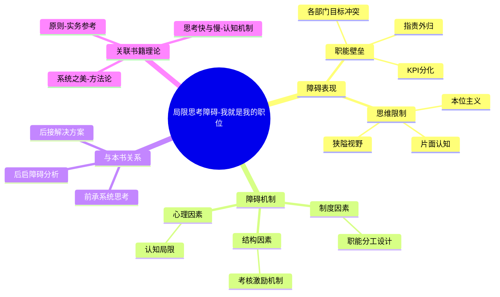

# 第3章 我就是我的职位

## 📍 章节定位

### 全书位置
> 第三章是"学习障碍和助力"部分的开篇章节，深入分析第一个学习障碍：局限思考，揭示组织中个体思维模式如何阻碍系统整体学习，是对前两章概念的实际应用分析。

- **全书核心问题**: 组织中存在哪些阻碍学习的因素？
- **本章回答的问题**: 为什么会产生"局部思维"？它如何影响组织学习？如何克服局限思考？
- **角色类型**: 问题分析型 - 识别和剖析组织学习的第一个主要障碍
- **论证位置**: 为后续章节探索解决方案提供问题基底

### 章节序列
| 方向 | 章节标题 | 逻辑连接 |
|------|----------|----------|
| 前章 | [[第2章-系统思考入门]] | 运用系统思考分析"我就是我的职位"障碍 |
| 后章 | [[第1章-哈吉斯]] | 为分析其他学习障碍奠定基础 |

### 一句话定位
> 第3章深入分析组织中第一个主要学习障碍——局限思考，揭示个体如何被职位所局限，缺乏整体视角，从而阻碍组织作为一个系统的整体学习能力。

---

## 🎯 核心观点

### 第一层：表层案例

| 案例名称 | 简要描述 | 页码 | 关键引文 |
|----------|----------|------|----------|
| 会计与销售的视角差异 | 会计认为"销售业绩不佳是因为价格没有优势"，销售认为"销售业绩不佳是因为产品质量不好，定价过高" | p.126-132 | "销售人员说'如果产品好些，定价低一些，我就能卖掉更多的产品。'会计人员说'我们无法降低价格，因为我们需要维持利润率才能支付成本。'" |
| 汽车制造商各部门目标冲突 | 研发部希望延长开发时间确保质量，生产部希望提高产量降低成本，销售部希望快速响应市场灵活性 | p.133-138 | "每一个职能部门都有自身的衡量标准、优劣势判断、奖励和激励措施，都有自己对形势的界定，都有充分理由把问题归咎于其他部门。" |
| 医院急诊科与普通科室矛盾 | 急诊科批评其他科室不接受危重病人，其他科室认为急诊科轻易将普通病人收入院 | p.139-142 | "急诊科医生抱怨说，'外科病房从不接收我们认为需要住院治疗的病人。'外科病房回应说，'急诊科送来的大多数情况都不是真正需要紧急护理的。'" |
| 跨部门项目中的职责划分 | 软件开发中的UI设计师、后端工程师、项目经理各自认为对方存在问题 | p.143-146 | "每个角色都从自己的职能角度出发定义整个问题，对他人有所指责。" |
| 制造业中的质量与成本冲突 | 生产部门追求低成本、高产量，研发部门追求高质量，采购部门希望便宜材料 | p.147-150 | "各个职能部门往往成为企业中的'诸侯'，每一个人都在维护自身领域，保护自己的管辖界限。" |

### 第二层：中层机制

| 机制名称 | 组成要素 | 因果链条 | 证据来源 |
|----------|----------|----------|----------|
| 职能分工僵化机制 | 组织架构、KPI考核、奖惩制度 | 部门分工 → 考核分割 → 个体利益最大化 → 部门壁垒 → 整体损失 | 会计与销售案例 |
| 片面信息处理机制 | 专业视角、数据限制、认知边界 | 接触局部信息 → 形成片面认知 → 武断归因 → 问题复杂化 | 各部门基于不同信息得出相反结论 |
| 部门竞争机制 | 预算分配、权力争夺、绩效比较 | 目标分化 → 部门竞争 → 指责外归 → 部门对立 → 系统功能受损 | 职能部门诸侯现象 |
| 局限思维固化机制 | 惯性思维、经验局限、成长轨迹 | 长期从事相同职能 → 习惯性思维定势 → 难以跳脱本位 → 阻碍系统思维发展 | 长期在单一职能岗位的员工 |

### 第三层：底层规律

| 规律陈述 | 抽象层级 | 知识连接 | 适用范围 |
|----------|----------|----------|----------|
| 局限视角定律 | 系统论：部分观察整体的天然限制 | [[系统之美-梅多斯-拆解记录]]、[[认知心理学-拆解记录]] | 复杂系统、组织行为学 |
| 功能分化悖论 | 组织学：专业化提升效率但限制整体感知 | [[古典管理学]]、[[学习型组织理论]] | 各类分层组织 |
| 信息茧房效应 | 认知科学：有限信息造就片面认知 | [[信息论]]、[[认知偏误理论]] | 人际交往、学习过程 |
| 部门利益优先律 | 行为经济学：个体目标与集体目标的冲突 | [[博弈论]]、[[组织行为学]] | 群体决策、组织管理 |

---

## 💬 降维翻译

### 观点1: "我就是我的职位"现象的本质

#### 原文表达
> "组织中的每个人都会掉进这种陷阱：我们对其整体产生影响的能力，远低于我们对某个局部的认同感和责任感。这种局限思考的典型表现是，'我就是我的职位'，人们把整个组织看成分散的各个部分。"
> —— p.127

#### 降维翻译（中学生能懂）
这就是说，在一个公司或组织里，人们往往只关注自己那一块工作，感觉自己就像是自己工作的"代表"，忘记了自己其实是整个大系统的一部分。比如一个销售员觉得自己就是"销售"的代表，只关心销售额，不关心公司的整体情况，比如产品质量、研发进度、公司声誉等。

#### 日常类比（奶奶能懂）
这就像是一个家庭，请了一个专门做饭的厨师，但这个厨师只考虑菜做得好不好吃，不关心家里人吃完了会不会生病，是不是浪费粮食，家里还有没有其他开支。或者说踢足球，每个队员只管好自己的位置，前锋只管射门，后卫只管防守，中场只管传球，但没有人站在整个球队的角度去考虑问题，这样当然赢不了比赛。

#### 检验
- Q: 如果一个中学生问你什么是"我就是我的职位"这种障碍？
- A: 就是人们只关注自己的那一小块工作，忘记了自己是整个大组织的一部分，这样会造成整个组织效率低下，因为不同部门之间缺乏协作和理解。

### 观点2: 职能分工的双刃剑效应

#### 原文表达
> "职能分工是现代企业管理的基础，但它创造了新的困难。每个人在职能领域中的专业化程度日益提高，但是看到全局的管理层人数却减少了。"
> —— p.134

#### 降维翻译（中学生能懂）
职能分工就是让不同的人做不同的专业工作，比如有的专门做研发，有的专门做销售，这是现代公司运作的基础方法。这种方法的好处是每个人都能把自己的专业领域做得越来越好；但坏处是，越来越少有人能看清整个公司的样子，知道所有部分是怎么互相影响的。

#### 日常类比（奶奶能懂）
这就像是做一件漂亮衣服，需要裁缝、缝纫工、熨烫工、设计师等等，每个人都把各自的任务做到了最好，但没有一个人能看到这件衣服穿在身上到底好看不好看，合适不合适。或者说做一顿饭，有洗菜的、配菜的、炒菜的、摆盘的，每个人都做得很好，但没人尝最终味道好不好。

#### 检验
- Q: 如果一个中学生问你职能分工为什么会造成问题？
- A: 因为虽然每个人把自己那部分工作做得更精更好了，但整体上来看，越来越少人能了解整个业务是怎么运行的，这就造成了部门间的隔阂和误解。

### 观点3: 系统思维是克服局限性的关键

#### 原文表达
> "学习型组织的重要技能是一项叫做'系统思考'的理论和实务。通过系统思考，组织成员能够认识各种问题相互关联的整体背景，理解为什么局部优化不能带来系统整体优化。"
> —— p.140

#### 降维翻译（中学生能懂）
要解决"每个人都只管自己那一摊子事"这个问题，就需要有一种叫做"系统思考"的方法。通过这种方法，可以让组织里的每个人都能看到自己那部分工作是怎么和其他部分联系在一起的，理解为什么仅仅把自己的部分做得再好，也不能让整个公司变得更好。

#### 日常类比（奶奶能懂）
就是要学会从整个大系统的角度来看问题。就像下棋，不能只看一步，要看到几步之后的变化，而且要用全局的视角，不能只守着自己喜欢的棋子。或者做菜，要考虑到不同食材之间的搭配会对最后的味道有什么影响，考虑营养、口味、色泽等多方面，而不能只追求某一个方面。

#### 检验
- Q: 如果一个中学生问你怎么能让大家不再只考虑自己职位呢？
- A: 要让每个人学会"系统思考"，也就是用整体的、发展的、联系的眼光看问题，让大家看到自己的工作是怎样影响整个组织的。

---

## ✨ 金句库

### 原书金句
| 金句 | 页码 | 适用场景 |
|------|------|----------|
| "我就是我的职位"是组织学习的第一项障碍。 | p.127 | 分析组织问题时 |
| "每个人看到整体的程度，低于他能对其整体产生影响的程度。" | p.128 | 讨论信息透明度 |
| "职能分工创造了新的困难。" | p.134 | 探讨组织结构设计 |
| "专业化日益提高，但看到全局的人数却减少了。" | p.135 | 评价企业现状 |
| "组织中的每个人都会掉进这种陷阱。" | p.127 | 诊断组织文化 |
| "局部的最大化并不等于整体的最优化。" | p.141 | 批评局部思维 |

### 降维金句
| 金句 | 来源观点 | 适用场景 |
|------|----------|----------|
| "专业分工既是效率源泉，又是视野天花板。" | 职能分工双刃剑 | 管理思维启发 |
| "每个人都困在各自的职位泡泡里。" | 局限思考现象 | 组织困境描述 |
| "只见局部工作，不见系统流转。" | 系统思维缺失 | 问题诊断 |
| "我不是我职位的囚徒，我是系统的参与者。" | 系统思维觉醒 | 文化建设 |
| "局部满意不等于整体最优。" | 局部与整体矛盾 | 绩效管理讨论 |
| "专业壁垒高于协作桥梁。" | 部门墙现象 | 跨部门协调 |
| "我为职位而生，也为职位所困。" | 职位认知困境 | 员工发展谈话 |
| "部门思维阻碍组织视野。" | 部门主义影响 | 改革宣传 |
| "分工明确但缺乏整体意识。" | 组织设计问题 | 战略规划 |
| "专技提升，全局视野下降。" | 专业发展的副作用 | 管理警示 |
| "每个部门都为正确的事而争吵。" | 目标分化后果 | 协调难点分析 |
| "局部英雄主义拖累整体作战。" | 部门英雄主义 | 团队协作 |
| "专业分工催生本位主义。" | 制度性问题 | 组织诊断 |
| "各自为政，整体失灵。" | 组织协调失效 | 转型讨论 |
| "我的职位边界 ≠ 我的责任边界。" | 责任边界的重新定义 | 价值观重塑 |

## 🔗 当下映射

### 💰 财富应用（组织决策视角）
| 场景 | 具体行动 | 预期效果 | 风险提示 |
|------|----------|----------|----------|
| 创业团队搭建 | 建立跨职能协作小组，而非按专业分工设置壁垒 | 提高执行效率，减少内耗 | 可能在初期影响专业性 |
| 项目投资 | 评估目标公司跨部门协作能力而非单一能力 | 更准确判断公司成长潜力 | 评估难度较高 |
| 商业模式设计 | 引入系统视角分析各业务单元协同效应 | 构建更稳健的商业模式 | 设计复杂度增加 |

### 💼 职场应用
| 场景 | 具体行动 | 所需能力 | 适用职级 |
|------|----------|----------|----------|
| 跨部门协作 | 主动了解其他部门的KPI和挑战，建立协同视角 | 系统思维、情商 | 基层员工及以上 |
| 项目管理 | 设计项目评价标准时兼顾各部门利益和整体目标 | 资源调配、协调能力 | PM/Team Leader |
| 战略规划 | 运用系统思维连接各个部门的目标和资源配置 | 战略视野、整合能力 | Director及以上 |
| 绩效管理 | 评估时同时考量个人表现和跨部门协作贡献 | 全局观、评价能力 | Manager及以上 |

### 🏠 生活应用
| 场景 | 具体行动 | 可行性 | 见效时间 |
|------|----------|--------|----------|
| 家庭沟通 | 不只从自己的角度考虑问题，理解每个家庭成员的角色和挑战 | 高 | 1-2周 |
| 社区活动 | 将家庭看作社区系统的一部分，积极参与 | 高 | 1-3个月 |
| 团队活动策划 | 策划团建等活动时考量不同性格和需求 | 中 | 1个月 |

### 72小时行动计划
1. **明天可以做的第一件事**: 观察自己日常工作中的"本位主义"倾向，尝试从组织整体角度重新思考最近处理的一个问题
2. **本周内可以尝试的事**: 主动与一位其他部门同事沟通，了解他们的工作目标和挑战，分享你对自己部门工作的理解
3. **需要准备资源才能做的事**: 学习一些简单的系统思考工具，如因果循环图，绘制当前工作系统的主要关联

---

## 🕸️ 章节关联

### 向上关联 → 整书
- **贡献**: 本章识别和深入分析组织学习的首个重大障碍——局限思考，为全书提出的学习型组织解决方案提供针对性的问题基础
- **位置**: 位于理论阐述（前两章）与系统解决方案（后续章节）之间的转换点

### 横向关联 → 章节间
| 章节编号 | 章节标题 | 关联类型 | 连接描述 |
|----------|----------|----------|----------|
| 第1章 | 学习型组织的疆界 | 承接 | 本章分析阻碍学习型组织实现的障碍 |
| 第2章 | 系统思考入门 | 工具应用 | 本章运用系统思考分析"我就是我的职位"问题 |
| 第4章 | {{待填充}} | 同类拓展 | 同属学习障碍系列，与其他四种障碍并列 |
| 第5章 | {{待填充}} | 奠定基础 | 本章问题分析为后续解决方案奠定基础 |
| 第10章 | {{待填充}} | 验证应用 | 五项修炼的整合应用将验证本章问题的解决 |

### 向下关联 → 具体应用
| 应用场景 | 难度 | 前置知识 |
|----------|------|----------|
| 跨部门协作改善 | 中 | 理解本章分析的机制 |
| 组织架构优化 | 高 | 了解各部门关系 |
| 绩效指标重新设计 | 中 | 掌握系统思维 |
| 文化变革推动 | 高 | 基于深层次理解 |

### 跨书关联 → 知识网络
| 书籍 | 概念 | 关系 | 备注 |
|------|------|------|------|
| [[系统之美-梅多斯-拆解记录]] | 反馈回路、系统边界 | 工具支撑 | 为理解局部与系统的联系提供方法 |
| [[思考快与慢-拆解记录]] | 认知偏误、锚定效应 | 解释机制 | 解释为何我们容易产生局限思考 |
| [[原则-拆解记录]] | 原则体系、流程设计 | 解决方案参考 | 在构建跨部门流程方面提供借鉴 |
| [[金字塔原理-明托-拆解记录]] | 结构性思维 | 思维方法补充 | 为表达系统性观点提供工具 |

### 关联可视化

---

## ❓ 问答设计

### Q1: "我就是我的职位"这一学习障碍具体表现为哪些方面？（理解型）
**认知层次**: 理解
**难度**: 中
**答案要点**:
- 狭隘的专业视角，只关注本职工作范围
- 部门间相互指责，将问题归咎于其他部门
- 缺乏整体系统意识，看不到自己工作对全局的影响

### Q2: 职能分工的正负面效应分别体现在什么方面？（分析型）
**认知层次**: 分析
**难度**: 中
**答案要点**:
- 正面：提高专业化程度，提升单部门效率
- 负面：创造部门壁垒，减少全局视野管理人员
- 结果：个人专业化提升但整体视角下降

### Q3: 如何在实践中克服"我就是我的职位"这种局限思维？（应用型）
**认知层次**: 应用
**难度**: 高
**答案要点**:
- 培养系统思维，在做决策时考虑跨部门影响
- 建立跨部门沟通机制，增进对其他部门工作的理解
- 优化绩效考核体系，引入跨部门协作指标

### Q4: 局限思考障碍对组织整体绩效有什么影响？（应用型）
**认知层次**: 应用
**难度**: 中
**答案要点**:
- 制造内部摩擦，消耗协作成本
- 导致局部最优并非整体最优的决策
- 阻碍组织学习和适应能力的提升

### Q5: 怎样识别一个组织是否存在局限思考问题？（应用型）
**认知层次**: 应用
**难度**: 中
**答案要点**:
- 观察跨部门协作是否频繁出现冲突
- 是否经常听到"这不是我的责任"之类的推诿
- 局部指标提升但整体绩效未改善

### Q6: 为什么职能分工会导致员工视野狭窄？（分析型）
**认知层次**: 分析
**难度**: 中
**答案要点**:
- 长期专注于特定领域形成专业惯性思维
- 接触信息局限在本部门范围内
- 考核激励机制强化部门本位意识

### Q7: 系统思维如何帮助克服局限思考？（应用型）
**认知层次**: 应用
**difficulty**: 高
**answers要点**:
- 提供整体性的观察视角
- 明确各组件间关联关系
- 预见局部变动的系统性后果

### Q8: 如何在绩效管理中避免职能本位主义？（应用型）
**认知层次**: 应用
**difficulty**: 高
**answers要点**:
- 设置跨部门协作指标
- 引入系统性绩效评价
- 奖励协同成果而非仅个人贡献

### Q9: 现代企业数字化转型中是否仍然存在局限思维？（评价型）
**认知层次**: 评价
**difficulty**: 高
**answers要点**:
- 数字化工具可能反而加强数据壁垒
- 部门系统割裂可能更加严重
- 需要数字化系统设计之初就考虑整体性

### Q10: 局限思考障碍与其他学习障碍有何联系？（分析型）
**认知层次**: 分析
**difficulty**: 中
**answers要点**:
- 为其他障碍提供土壤（如归罪于外）
- 与其他障碍共同构成复杂的学习困境
- 需要协同解决才能彻底克服

### Q11: 如何在面试中考察候选人是否具备系统思维？（应用型）
**认知层次**: 应用
**difficulty**: 中
**answers要点**:
- 询问过去项目中的跨部门协作经验
- 了解其对上下游工作的认知
- 考察问题分析时是否考虑多方角度

### Q12: 组织中哪些因素会强化"我就是我的职位"的想法？（理解型）
**认知层次**: 理解
**difficulty**: 中
**answers要点**:
- 按部门划分的薪酬晋升体系
- 相对封闭的工作环境
- 专业化培训和考核制度

### Q13: 团队中存在职能壁垒时会出现什么现象？（理解型）
**认知层次**: 理解
**difficulty**: 低
**answers要点**:
- 部门间沟通困难
- 遇事互相推诿
- 效率低下，内耗严重

### Q14: 如何培养团队成员的系统观念？（应用型）
**认知层次**: 应用
**difficulty**: 高
**answers要点**:
- 组织跨部门学习交流
- 实施轮岗制度
- 设计全链路项目锻炼全盘思维

### Q15: "我就是我的职位"与专业化分工之间的平衡应该如何把握？（评价型）
**认知层次**: 评价
**difficulty**: 高
**answers要点**:
- 保持专业深度的同时增加系统广度
- 设立跨职能角色衔接各专业领域
- 建立制度激励整体视角行为

---
