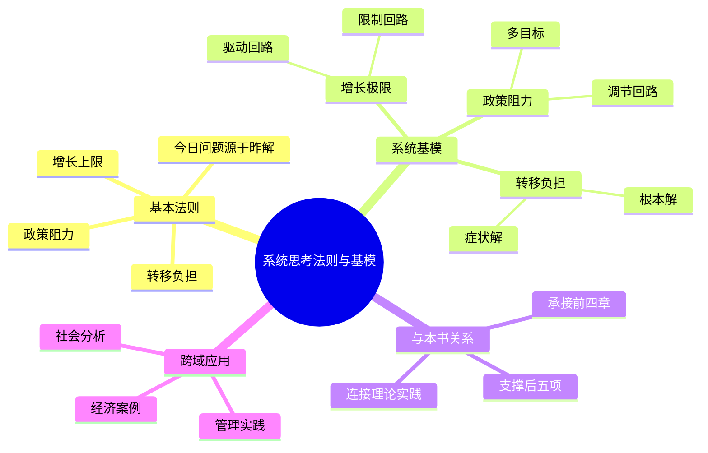

# 第5章 系统思考的法则

## 📍 章节定位

### 全书位置
> 第五章是本书系统思考部分的进阶内容，深入阐述系统思考的深层法则和常见系统模式（基模），是对前面系统思考概念的深化，为第五项修炼提供更为具体的方法论指导。

- **全书核心问题**: 如何运用系统思考解决复杂问题？
- **本章回答的问题**: 系统运行有哪些基本法则？常见的系统结构模式是什么？
- **角色类型**: 方法论深化型 - 提供系统思考的实践法则和模式识别
- **论证位置**: 位于理论阐述（前四章）与具体修炼（后五章）之间的关键节点

### 章节序列
| 方向 | 章节标题 | 逻辑连接 |
|------|----------|----------|
| 前章 | [[第4章-归罪于外]] | 从障碍分析转向解决工具 |
| 后章 | [[第6章-{{章节标题}}]] | 为介绍第一项修炼（自我超越）铺垫 |

### 一句话定位
> 第5章深入探讨系统思考的基本法则和常见基模（系统结构模式），从啤酒游戏扩展到更广泛的系统行为模式，为学习型组织的建造提供系统分析工具。

---

## 🎯 核心观点

### 第一层：表层案例

| 案例名称 | 简要描述 | 页码 | 关键引文 |
|----------|----------|------|----------|
| 感染麻疹的村庄 | 健康干预的意外后果——疫苗接种率下降使疫情更严重 | p.174-178 | "当人们看到麻疹发病率下降时，对疾病的恐惧也随之下降，因此儿童麻疹疫苗的接种率也开始下降。最后，由于缺乏免疫能力的人越来越多，一场严重的流行病再次爆发。" |
| 底特律的衰落 | 城市发展的增长极限模式——基础设施恶化限制人口增长 | p.180-185 | "随着城市人口增加，犯罪开始加剧，基础设施出现恶化，居民对城市的满意度降低了，这使得人们开始移居郊外，反过来又加重了都市的恶化。" |
| 通勤者困境 | 扩宽道路缓解交通的悖论——新建道路吸引更多车流 | p.186-190 | "每当交通拥挤的问题似乎可以通过扩建公路得到解决时，新公路反而吸引了更多的车流量，最终交通又变得拥挤起来。" |
| 增长的极限商业案例 | 成长型企业受限于管理能力、产品质量等制约因素 | p.192-196 | "许多企业在成长过程中，最初的增长促进了组织能力和市场渠道的开发，但这之后，这些企业发现自己受限于管理上的复杂问题或原材料、产品和服务质量等问题。" |
| 避税循环 | 政府税收政策的政策阻力——税率变化引发对策性行为 | p.200-204 | "每当政府试图通过税收来实现某种社会公平目标时，纳税人和企业就会找到减税的对策。随着逃税手段的复杂化和多样，征税效率反而下降了。" |

### 第二层：中层机制

| 机制名称 | 组成要素 | 因果链条 | 证据来源 |
|----------|----------|----------|----------|
| 增长极限机制 | 增长驱动力、限制因素 | 增长 → 限制增强 → 成长减速 → 降低增长期望/标准 | 感染麻疹的村庄案例 |
| 政策阻力机制 | 不同目标、调节系统 | 干预政策 → 多重调节回路 → 系统抗拒措施 → 政策目标失效 | 避税循环案例 |
| 延迟效应机制 | 信息传递滞后、反馈时差 | 行为决策 → 延迟反馈 → 重复决策 → 响应过度/不足 | 麻疹疫苗案例 |
| 本未转移机制 | 症状性解决方案、根本问题 | 表面解决 → 负面副作用 → 原问题加剧 → 依赖症状解 | 通勤者困境案例 |

### 第三层：底层规律

| 规律陈述 | 抽象层级 | 知识连接 | 适用范围 |
|----------|----------|----------|----------|
| 系统行为基本法则 | 系统论：理解复杂系统的基本准则 | [[系统之美]]、[[控制论]] | 管理科学、社会学、生态学 |
| 延迟主导规律 | 系统论：系统响应的时空特征 | [[控制工程]]、[[系统动力学]] | 工程控制、政策制定 |
| 基模普适性原理 | 系统论：相似结构产生相似行为 | [[复杂性科学]]、[[系统论]] | 各类复杂系统 |
| 反馈循环普遍性法则 | 控制论：系统调节的基本机制 | [[维纳控制论]]、[[系统学]] | 生物、技术和社会系统 |

---

## 💬 降维翻译

### 观点1: 今日的问题来自昨天的解决方案

#### 原文表达
> "今天的问题来自昨天的解决方案——我们常常用'症状解'的方法来解决一个问题，结果引发了更大的、新的问题。"
> —— p.174

#### 降维翻译（中学生能懂）
这句话的意思是：我们现在遇到的问题，很多是以前解决问题时留下来的。有时候我们为了对付某个问题，用了表面上看起来很直接的解决办法，但是这个办法却带来了新的更大的麻烦。

#### 日常类比（奶奶能懂）
就像感冒了，为了退烧吃了很多退烧药，结果体温是降下去了，可是药物损害了肝脏。或者为了让孩子好好学习就给他很多零花钱奖励，结果他学会了花钱而不是读书。我们总想立刻解决问题，但没有考虑这样做会带来什么长期的后果。

#### 检验
- Q: 如果一个中学生问你什么叫"今天的问题来自昨天的解决方案"？
- A: 就是你以前为了让事情变好而采取的一些办法，结果却在后来导致了更多的问题，反而让情况变得更糟了。

### 观点2: 麻烦的来源——成长的极限与转移负担

#### 原文表达
> "增长的极限"和"转移负担"是两个常见的系统基模。前者是增长驱动力遇上了制约因素，后者是过于依赖症状性解决方案导致根本能力退化。
> —— p.180

#### 降维翻译（中学生能懂）
这两个系统模式很常见。第一个叫"增长的极限"，就是某样东西越发展，遇到的阻挡它发展的因素就越来越强，到了一定程度就发展不下去了。第二个叫"转移负担"，就是我们依赖一些快速的解决办法，不训练自己从根本上解决问题的能力，结果能力反而退步了。

#### 日常类比（奶奶能懂）
比如说一个生意刚刚开始很兴旺，可是顾客越来越多，服务质量就难保证了，员工也忙不过来了。这叫做"增长的极限"。再比如，一个人头痛就一直吃止痛药，不找出头痛的根本原因（可能是压力大、睡不好什么的），结果身体对药的依赖越来越强，身体的自愈能力反而退化了，这叫做"转移负担"。

#### 检验
- Q: 如果一个中学生问你什么是"转移负担"这类问题模式？
- A: 就是我们习惯了用简单的方法解决复杂的问题，不自己动脑筋解决问题，结果自己的能力反而越来越差，只能更依赖那些简单的方法。

### 观点3: 时间延迟与非线性反应

#### 原文表达
> "由于系统中存在时间延迟，我们的行为与结果之间往往有相当长的时间间隔。这使得我们很难理解两者之间的因果关系，也增加了我们对系统有效干预的难度。"
> —— p.186

#### 降维翻译（中学生能懂）
意思是说，在系统里面，你做了一件事，很可能要过很久之后才会看到后果，甚至可能结果和你想的完全不一样。这就让人很难理解这两者之间的关系，也不好知道自己的做法到底是好是坏。

#### 日常类比（奶奶能懂）
就像小朋友小时候爱吃糖，当时觉得挺甜挺开心的，可是过了几年牙疼起来了；或者是年轻人熬夜玩游戏，当时觉得很爽，可是到了30岁身体就不行了。父母教育孩子也是一样，当时管得严，孩子可能会抱怨，可长大了就知道好处了。很多事不能只看眼前。

#### 检验
- Q: 如果一个中学生问你怎么理解时间延迟的现象？
- A: 就是你做了一件事，过一阵子才能看到效果，而且往往和你想的不太一样。所以我们要做事之前要多想想以后会发生什么。

---

## ✨ 金句库

### 原书金句
| 金句 | 页码 | 适用场景 |
|------|------|----------|
| "今天的问题来自昨天的解决方案。" | p.174 | 分析问题根源时 |
| "复杂的问题往往是系统行为的结果。" | p.178 | 解释复杂问题时 |
| "成长的极限是一种普遍的系统结构模式。" | p.180 | 分析组织瓶颈时 |
| "系统中的时间延迟会使问题更加复杂。" | p.186 | 讨论延迟效应 |
| "转移负担往往导致依赖性的增强。" | p.190 | 分析依赖问题时 |
| "政策阻力存在于各种社会系统中。" | p.200 | 政策分析场景 |

### 降维金句
| 金句 | 来源观点 | 适用场景 |
|------|----------|----------|
| "头痛医头脚痛医脚，最后全身都是毛病。" | 症状解vs根本解 | 批评浅层干预 |
| "表面繁荣掩盖深层制约。" | 增长的极限 | 商业分析 |
| "快速解决带来慢速危机。" | 时间延迟影响 | 战略反思 |
| "治标不治本，反而本末倒置。" | 转移负担 | 问题解决 |
| "今天的解成了明天的毒。" | 时间延迟 | 风险提醒 |
| "政策推一寸，系统抗一尺。" | 政策阻力 | 法规分析 |
| "能力靠练不用废，解决要深不就浅。" | 能力发展观 | 个人成长 |
| "系统反应慢悠悠，人类期待急吼吼。" | 延迟效应 | 心态调整 |
| "局部有效全局祸。" | 系统思维缺失 | 基础建设 |
| "越用力越反弹。" | 调节回路 | 变革管理 |
| "急在治标缓施本。" | 解决方案分层 | 策略建议 |
| "问题解决靠系统，头疼脚痒一起连。" | 系统关联 | 治理思路 |
| "今天行动后果远，决策莫只看当前。" | 时间延迟 | 决策建议 |
| "成长之上有限制，发展不能无顾忌。" | 增长极限 | 可持续发展 |
| "依赖外助非长久，练出内功才无忧。" | 自主能力建设 | 能力建设 |

## 🔗 当下映射

### 💰 财富应用（商业实践）
| 场景 | 具体行动 | 预期效果 | 风险提示 |
|------|----------|----------|----------|
| 商业投资决策 | 评估目标企业是否存在增长极限问题 | 避免投资陷入增长瓶颈的业务 | 系统分析需要较强专业能力 |
| 企业战略规划 | 识别业务增长的制约因素并提前布局 | 为企业持续发展提供策略保障 | 制约因素识别的不确定性 |
| 市场进入策略 | 考虑竞争和基础设施的延迟影响 | 更精准判断市场进入时机 | 市场时机把握难度大 |

### 💼 职场应用
| 场景 | 具体行动 | 所需能力 | 适用职级 |
|------|----------|----------|----------|
| 项目管理 | 预见潜在的制约因素和延迟效应 | 风险识别、前瞻性思维 | PM/Team Leader |
| 组织变革 | 采用系统性变革而非头痛医头的方法 | 变革管理、系统思维 | Director及以上 |
| 绩效改进 | 深入根源而非只关注指标表现 | 根因分析、系统思考能力 | Manager及以上 |
| 问题诊断 | 运用基模识别分析复杂组织问题 | 诊断分析、经验积累 | Senior级别+ |

### 🏠 生活应用
| 场景 | 具体行动 | 可行性 | 见效时间 |
|------|----------|--------|----------|
| 个人健康管理 | 关注长期健康习惯而非短期症状治疗 | 高 | 3-6个月 |
| 家庭财务管理 | 识别影响家庭经济状况的根本因素 | 中 | 1-2年 |
| 教育投资决策 | 综合考虑教育投入的延迟和长远影响 | 中 | 5-10年 |

### 72小时行动计划
1. **明天可以做的第一件事**: 回顾一个你最近正在解决的问题，思考是否只是处理了表面症状而不是根本原因
2. **本周内可以尝试的事**: 在日常决策中，尝试考虑6-12个月后的可能影响，特别是那些可能意想不到的后果
3. **需要准备资源才能做的事**: 学习绘制简单的因果循环图，尝试分析工作中遇到的一个复杂问题

---

## 🕸️ 章节关联

### 向上关联 → 整书
- **贡献**: 本章深化系统思考的方法论基础，为后续介绍五项修炼提供必要的系统分析工具和框架支撑
- **位置**: 承接前四章的学习障碍分析，为第五至十章的修炼方法奠定理论基础

### 横向关联 → 章节间
| 章节编号 | 章节标题 | 关联类型 | 连接描述 |
|----------|----------|----------|----------|
| 第1-2章 | 系统思考入门 | 深化拓展 | 在初步介绍基础上详细介绍具体法则和基模 |
| 第3-4章 | 学习障碍分析 | 方法支撑 | 提供克服障碍所需的系统分析工具 |
| 第6-10章 | 五项修炼 | 工具应用 | 为五项修炼的实施提供系统思考方法基础 |
| 第11-14章 | 实践指引 | 策略基础 | 基模识别为实践应用提供模式参考 |

### 向下关联 → 具体应用
| 应用场景 | 难度 | 前置知识 |
|----------|------|----------|
| 系统基模识别 | 中 | 掌握基本反馈回路概念 |
| 系统问题诊断 | 高 | 完整的系统思考基础 |
| 干预策略设计 | 高 | 丰富的系统实践经验 |
| 杠杆点寻找 | 高 | 深度的结构理解能力 |

### 跨书关联 → 知识网络
| 书籍 | 概念 | 关系 | 备注 |
|------|------|------|------|
| [[系统之美-梅多斯-拆解记录]] | 系统基模、杠杆点、滞后效应 | 深化扩展 | 两书相关内容形成递进关系 |
| [[思考快与慢-拆解记录]] | 直觉偏差、启发法 | 认知补充 | 解释为何我们难以识别系统法则 |
| [[模型思维-佩奇-拆解记录]] | 系统动力学模型、反馈机制 | 方法拓展 | 提供数学方法支持系统思维 |
| [[原则-拆解记录]] | 原则体系、决策框架 | 实践延伸 | 提供基于系统思考的具体原则 |

### 关联可视化

---

## ❓ 问答设计

### Q1: 什么是"系统基模"及其常见类型？（理解型）
**认知层次**: 理解
**难度**: 中
**答案要点**:
- 系统基模是反复出现的系统结构模式，会产生特定的行为特征
- 常见类型包括增长的极限、转移负担、政策阻力等
- 识别基模有助于理解和预测系统行为

### Q2: 为什么说"今天的问题来自昨天的解决方案"？（理解型）
**认知层次**: 理解
**难度**: 中
**答案要点**:
- 过去的解决方案可能只解决了表面症状而忽略了根本原因
- 症状缓解可能掩盖了深层制约因素
- 临时方案可能带来负面副效应

### Q3: 如何运用系统基模识别复杂问题？（应用型）
**认知层次**: 应用
**难度**: 高
**答案要点**:
- 观察行为模式，识别是否有增长放缓、依赖性增加等特点
- 画出系统结构，寻找增强回路和调节回路的结合
- 对比经典基模，确定问题类型

### Q4: "增长的极限"基模有什么典型特征？（理解型）
**认知层次**: 理解
**难度**: 中
**答案要点**:
- 初始阶段快速发展
- 增长速率逐渐降低
- 最终趋于稳定或下降
- 存在制约因素与成长因素的相互作用

### Q5: 如何判断是否遇到了"转移负担"现象？（应用型）
**认知层次**: 应用
**难度**: 中
**答案要点**:
- 观察是否过度依赖短期解决方案
- 检查是否有根本性解决能力的衰落
- 关注长期来看问题是否更严重

### Q6: 时间延迟如何影响系统干预效果？（分析型）
**认知层次**: 分析
**难度**: 高
**答案要点**:
- 决策者无法及时看到行为后果
- 可能基于过时信息进行重复干预
- 增加响应过头或不足的风险

### Q7: "政策阻力"现象产生的主要原因是什么？（分析型）
**认知层次**: 分析
**难度**: 高
**答案要点**:
- 系统内存在多重目标和利益冲突
- 受影响方会自发调节抵消政策影响
- 行为干预未触及系统根本结构

### Q8: 系统思维与传统线性思维的根本区别是什么？（比较型）
**认知层次**: 比较
**难度**: 高
**答案要点**:
- 线性思维关注因果关系，系统思维关注相互联系的网络
- 线性思维注重事件，系统思维关注模式与趋势
- 线性思维追求短期内解决问题，系统思维考虑长远整体

### Q9: 如何在管理实践中运用系统基模？（应用型）
**认知层次**: 应用
**难度**: 高
**答案要点**:
- 定期绘制组织系统图，识别潜在基模
- 针对不同基模采取相应管理对策
- 设计避免基模恶化的行为策略

### Q10: "转移负担"基模如何影响组织学习能力？（应用型）
**认知层次**: 应用
**难度**: 高
**答案要点**:
- 导致组织过度依赖外部解决方案
- 内部能力逐渐退化
- 解决问题的根本能力下降

### Q11: 什么是系统中的"杠杆点"？（理解型）
**认知层次**: 理解
**难度**: 中
**答案要点**:
- 最小干预可能产生最大效果的系统位置
- 通常位于信息流、目标或系统规则层面
- 比表层干预更有效

### Q12: 识别系统基模需要注意哪些因素？（应用型）
**认知层次**: 应用
**难度**: 高
**答案要点**:
- 关注行为的时间序列变化模式
- 寻找系统中的增强和调节反馈回路
- 考虑时间和空间延迟的影响

### Q13: 增长极限基模如何在个人发展中体现？（应用型）
**认知层次**: 应用
**难度**: 中
**答案要点**:
- 学习技能初期效率很高
- 随着时间推移到瓶颈期
- 需要调整学习方式或改变环境

### Q14: 系统法则对决策制定有什么启示？（评价型）
**认知层次**: 评价
**难度**: 高
**答案要点**:
- 需要关注长期延迟后果
- 要寻找根本解决而非症状缓解
- 设计要有系统考量而不是局部优化

### Q15: 如何避免"政策阻力"的负面影响？（应用型）
**认知层次**: 应用
**难度**: 高
**答案要点**:
- 设计政策时充分考虑各方利益
- 避免强制性的单边干预
- 加强政策沟通提高接受度

---
