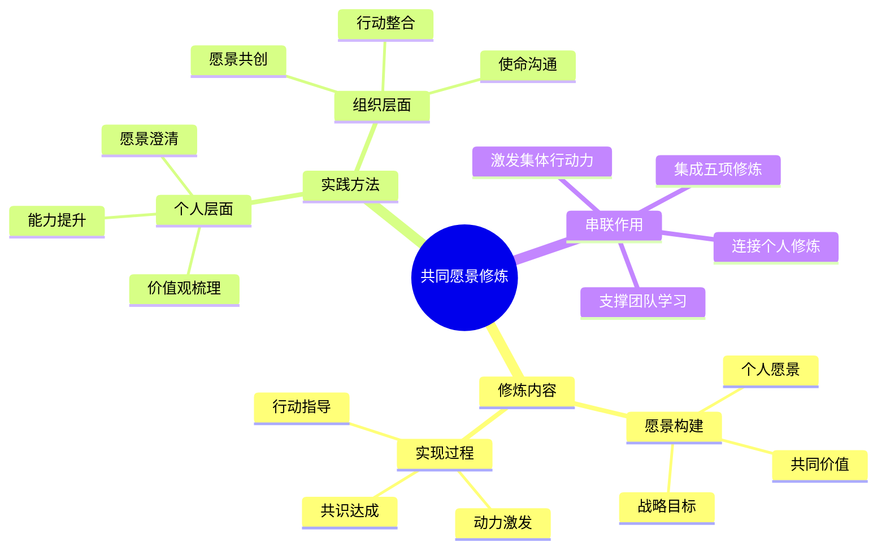

# 第8章 共同愿景

## 📍 章节定位

### 全书位置
> 第八章深入探讨五项修炼的第三项——共同愿景，阐述如何让组织成员拥有共同的宏大愿望，激活内在动力，为学习型组织提供核心驱动力。

- **全书核心问题**: 如何激发集体创造力使组织持续发展？
- **本章回答的问题**: 什么是共同愿景？如何创建和培育共同愿景？
- **角色类型**: 修炼指引型 - 介绍组织层面的修炼
- **论证位置**: 将个人修炼导向组织集合的转折

### 章节序列
| 方向 | 章节标题 | 逻辑连接 |
|------|----------|----------|
| 前章 | [[第7章-心智模式]] | 基于个人认知提升发展集体认知 |
| 后章 | [[第9章-{{章节标题}}]] | 建立共同愿景后深化团队协作 |

### 一句话定位
> 第8章阐述共同愿景修炼的重要内容，揭示如何通过集体愿景的构建与经营，激发组织成员的内在动力和集体创造力。

---

## 🎯 核心观点

### 第一层：表层案例

| 案例名称 | 简要描述 | 页码 | 关键引文 |
|----------|----------|------|----------|
| 明尼苏达大学医学院转型 | 医生们创建"让明尼苏达成为最健康的州"愿景 | p.276-282 | "他们不再把'我们的医院'看作一个建筑物，而是看作一个整体性的健康系统。这个愿景改变了每个人的行为。" |
| 班特兰公司质量管理革新 | 全员共同追求"零缺陷"品质目标 | p.284-290 | "零缺陷不是一个口号，而是每个人都相信能够达到并且愿意为之努力的一个标准。" |
| NASA阿波罗计划 | 全员为实现"让人类踏上月球"愿景而奋斗 | p.292-298 | "每个团队成员不仅知道他们要做这项任务，而且都发自内心地认同这一使命的重要性。" |
| 北欧国家环境保护愿景 | 整个国家为"可持续发展"愿景协作 | p.300-305 | "当一个国家的人民为共同的环保愿景而行动时，其效果远远超过了各个部分单独行动的总和。" |
| Google技术创新使命 | 围绕"整合全球信息"使命激励创新 | p.308-312 | "Google的愿景不是简单的目标，而是激发员工创造和创新的精神动力。" |

### 第二层：中层机制

| 机制名称 | 组成要素 | 因果链条 | 证据来源 |
|----------|----------|----------|----------|
| 愿景共鸣激发机制 | 个人愿景、组织愿景、共同价值观 | 个人诉求 → 愿景认同 → 积极行动 → 组织成就 | 明尼苏达医学院案例 |
| 集体赋能循环机制 | 共同目标、协作网络、成果反馈 | 集体愿景设定 → 协作深化 → 成果共享 → 愿景更新 | NASA阿波罗计划 |
| 持续更新迭代机制 | 现实变化、愿景调整、参与共建 | 环境变迁 → 愿景调整 → 群体更新 → 前后一致 | 环保愿景国家案例 |
| 学习驱动演进机制 | 阶段成果、愿景演化、能力提升 | 目标达成 → 愿景升级 → 能力扩展 → 新期许 | 质量管理革新案例 |

### 第三层：底层规律

| 规律陈述 | 抽象层级 | 知识连接 | 适用范围 |
|----------|----------|----------|----------|
| 愿景驱动组织发展原理 | 系统论：共同目标引导系统演化 | [[组织行为学]]、[[领导力理论]] | 组织管理、战略规划 |
| 价值观整合律 | 心理学：内在一致性促进协同行为 | [[心理学]]、[[伦理学]] | 团队建设、文化交流 |
| 愿景迭代优化法则 | 进化论：愿景需动态适配环境变化 | [[进化心理学]]、[[组织适应性理论]] | 战略调整、组织转型 |
| 激发动机涌现原理 | 能动性学说：共同目标激发集体能动性 | [[动机理论]]、[[群体动力学]] | 领导管理、团队激励 |

---

## 💬 降维翻译

### 观点1: 共同愿景的内涵及其重要性

#### 原文表达
> "共同愿景是一个组织中人们所共同持有的意象或景象。它创造出众人一体的感受，并遍布所有的活动中。共同愿景是学习型组织的精神基础设施。"
> —— p.276

#### 降维翻译（中学生能懂）
共同愿景就是整个组织的员工心里都想要实现的一个宏大目标。这个目标能够让大家觉得我们是一伙的、一条心，把这种精神融入到了所有工作行动当中。它是学习型组织的精神支柱。

#### 日常类比（奶奶能懂）
就像咱们一大家子人，如果都想着要把这个家过得兴旺发达，那么每个人都愿意为此出力，互相帮忙，遇到困难也不怕。有了这个心愿，平时做的事情也都有劲头了。或者像一支球队，如果大家心里都想着赢得总冠军，那么每个人都会很卖力地训练和比赛。

#### 检验
- Q: 如果一个中学生问你什么是共同愿景？
- A: 就是组织里所有人都共同渴望实现的一个目标或梦想，这个目标让大家团结在一起，把力量汇聚起来做大事。

### 观点2: 共同愿景的构建路径

#### 原文表达
> "共同愿景必须以个人愿景为基础。没有个人愿景，就不会有共同愿景的成长土壤。共同愿景也决不能等同于'统一思想'。"
> —— p.280

#### 降维翻译（中学生能懂）
大家共同的愿望必须要建立在每个人自己的愿望基础之上。如果每个人都没有自己想要追求的东西，那就不可能形成大家都认可的整体愿望。共同愿景也不是让大家想法都一模一样的"思想统一"。

#### 日常类比（奶奶能懂）
就像一锅好吃的汤，需要各种不同的料：有人喜欢吃辣的，有人爱吃酸的，各有喜好，但是大家都能接受这锅汤的味道。如果强制把所有人都改成吃同样口味的食物，那就是强迫了。又好比办婚礼，虽然是双方共同的喜事，但每个人都带着自己家庭的文化和期待。

#### 检验
- Q: 如果一个中学生问为什么共同愿景不等于统一思想？
- A: 因为共同愿景是大家把各自的理想目标汇集起来形成的宏大目标，而不是强行让大家的想法都变得一样。

### 观点3: 愿景与现实的结合艺术

#### 原文表达
> "共同愿景的真正力量来自'创造性张力'——愿景与现实之间的差距所产生的能量。这种张力激发人们的创造性，使他们采取有效行动。"
> —— p.288

#### 降维翻译（中学生能懂）
共同愿景真正的力量体现在理想和现实之间的差距上，这个差距会产生推动我们前进的正能量。正是这种差距能激发大家的创造力，促使我们采取实际行动。

#### 日常类比（奶奶能懂）
就像爬山，山顶是我们的目标，现在的位置是现实，这两个之间的距离就是推着我们的力量，让我们不停地往前走。又好比做饭，想做出大厨的味道是理想，但现在只能做家常菜就是现实，正是因为有这样的差别，我们才会有动力不断练习提高厨艺。

#### 检验
- Q: 如果一个中学生问你为什么差距会产生力量？
- A: 因为当我们看到自己的现状和理想之间的距离时，这个距离就会让我们想要行动起来，想办法缩小它，这就是推动我们进步的力量。

---

## ✨ 金句库

### 原书金句
| 金句 | 页码 | 适用场景 |
|------|------|----------|
| "共同愿景是一个组织中人们所共同持有的意象或景象。" | p.276 | 定义概念 |
| "共同愿景是学习型组织的精神基础设施。" | p.276 | 强调重要性 |
| "共同愿景必须以个人愿景为基础。" | p.280 | 建设原则 |
| "真正的共同愿景决不能等同于'统一思想'。" | p.281 | 理论辨析 |
| "共同愿景的真正力量来自创造性张力。" | p.288 | 原理解释 |
| "没有共同愿景，就不会有真正的学习型组织。" | p.290 | 必要性说明 |

### 降维金句
| 金句 | 来源观点 | 适用场景 |
|------|----------|----------|
| "众志成城，其利断金。" | 集体力量 | 团队协作激励 |
| "心往一处想，劲往一处使。" | 目标一致 | 组织凝聚力 |
| "共同的梦，一起实现。" | 愿景共创 | 文化宣传 |
| "大河有水小河满，大河无水小河干。" | 集体个人关系 | 价值观塑造 |
| "个人梦融集体梦，集体梦成就个人梦。" | 双向互动 | 激励话语 |
| "一加一大于二，众人一心铸大业。" | 整体大于部分 | 组织目标 |
| "不是统一思想，而是统一方向。" | 方法原则 | 领导理念 |
| "愿景是集体行动的指南针。" | 导向作用 | 组织战略 |
| "共同的愿景，自发的行动。" | 动力效应 | 管理思维 |
| "梦想汇聚，力量无穷。" | 奋斗目标 | 团队激励 |
| "愿景不等于幻想，而是指引行动的灯塔。" | 实践导向 | 项目宣导 |
| "有愿景有方向，没目标没动力。" | 目标驱动 | 个人激励 |
| "共同愿景不是强加指令，而是心甘情愿。" | 自主动机 | 管理原则 |
| "共同愿景：点燃内心的火，照亮前行的路。" | 激励比喻 | 精神感召 |
| "汇聚众人智慧，成就共同理想。" | 智慧集结 | 价值主张 |

## 🔗 当下映射

### 💰 财富应用（团队价值创造）
| 场景 | 具体行动 | 预期效果 | 风险提示 |
|------|----------|----------|----------|
| 创投基金愿景共识 | 创始团队共同确立"发现并培育改变世界的企业"愿景 | 提升投资眼光，增强团队协作 | 愿景过于宏大会脱离实际 |
| 企业战略规划 | 建立与员工共享的长期目标和价值愿景 | 提高员工忠诚度，降低管理成本 | 沟通成本可能显著增加 |
| 合伙创业愿景构建 | 搭档确立共同的商业理念和发展愿景 | 减少分歧，增强团队凝聚力 | 后期发展理念冲突风险 |

### 💼 职场应用
| 场景 | 具体行动 | 所需能力 | 适用职级 |
|------|----------|----------|----------|
| 部门文化建设 | 与团队成员共同塑造部门发展愿景 | 沟通协调、团队建设能力 | Manager及以上 |
| 项目团队激励 | 为项目组设立清晰的成就目标 | 目标制定、激励能力 | PM/Project Leader |
| 组织变革引领 | 设计并推广组织发展新愿景 | 变革管理、领导力 | Director及以上 |
| 跨部门协作 | 促成跨职能协作的共同愿景 | 影响力、协调能力 | Senior及以上 |

### 🏠 生活应用
| 场景 | 具体行动 | 可行性 | 见效时间 |
|------|----------|--------|----------|
| 家庭目标规划 | 与家人讨论并建立共同的家庭愿景 | 高 | 1-3个月 |
| 社区参与 | 在社区构建共同的发展愿景 | 中 | 3-6个月 |
| 志愿团队组织 | 为志愿者团队设立服务愿景 | 中 | 1-2个月 |

### 72小时行动计划
1. **明天可以做的第一件事**: 询问身边一位同事或朋友他们的个人长期愿景是什么，了解他们的内心动机
2. **本周内可以尝试的事**: 在团队会议上，尝试邀请大家分享个人目标，并寻找潜在的共同点
3. **需要准备资源才能做的事**: 学习一些愿景构建和沟通工具，如愿景画布、未来展望练习等

---

## 🕸️ 章节关联

### 向上关联 → 整书
- **贡献**: 本章深化五项修炼的第三项，连接个人内在动力与集体行动力，为学习型组织提供情感和精神支撑
- **位置**: 个人修炼向组织修炼转变的关键节点

### 横向关联 → 章节间
| 章节编号 | 章节标题 | 关联类型 | 连接描述 |
|----------|----------|----------|----------|
| 第1-7章 | 概述与前三项修炼 | 顺承发展 | 为前几项修炼提供集体动力源头 |
| 第9章 | [[团队学习]] | 逻辑递进 | 共同愿景为团队学习奠定协作基础 |
| 第10章 | [[第五项修炼]] | 整合准备 | 本章是第五项修炼整合的基础 |
| 第13章 | [[走向学习型组织]] | 实践支撑 | 为构建学习型组织提供精神驱动力 |

### 向下关联 → 具体应用
| 应用场景 | 难度 | 前置知识 |
|----------|------|----------|
| 愿景共创工作坊 | 中 | 掌握引导与沟通技巧 |
| 愿景传达与执行 | 中 | 熟悉组织行为基础 |
| 愿景迭代管理 | 高 | 拥有变革管理经验 |
| 文化建设实践 | 高 | 深度理解组织文化 |

### 跨书关联 → 知识网络
| 书籍 | 概念 | 关系 | 备注 |
|------|------|------|------|
| [[原则-拆解记录]] | 价值观驱动决策 | 方法拓展 | 为愿景制定提供原则指导 |
| [[乌合之众-勒庞]] | 群体动员技术 | 负向参考 | 警示愿景操纵的负面影响 |
| [[从优秀到卓越-柯林斯]] | 内驱使命感 | 经验支持 | 提供企业愿景建设实例 |
| [[瞬变-希思]] | 群体行为改变 | 策略工具 | 为愿景传播提供改变策略 |

### 关联可视化

---

## ❓ 问答设计

### Q1: 什么是共同愿景及其核心特征？（理解型）
**认知层次**: 理解
**难度**: 中
**答案要点**:
- 是组织中人们共同持有的理想和前景设想
- 创造众人一体的感受，连接所有活动
- 植根于个人愿景，但超越个人范畴
- 激发集体行动的内在动力

### Q2: 共同愿景与一般组织目标的区别是什么？（比较型）
**认知层次**: 比较
**难度**: 高
**答案要点**:
- 组织目标主要是管理层设定，共同愿景是全员参与构建
- 一般目标关注绩效结果，共同愿景关注意义和价值
- 普通目标驱动外在动机，共同愿景激发内在动力
- 两者可以相互支撑，但愿景有更强的激励作用

### Q3: 如何在组织中构建共同愿景？（应用型）
**认知层次**: 应用
**难度**: 高
**答案要点**:
- 了解员工个人愿景和价值理念
- 寻找个人愿景中的共同元素
- 开展愿景共创工作坊和讨论
- 持续沟通反馈和修正愿景内容

### Q4: 共同愿景修炼的理论基础是什么？（分析型）
**认知层次**: 分析
**难度**: 高
**答案要点**:
- 个人愿景是构建共同愿景的土壤
- 愿景与现实差距产生创造性张力
- 集体承诺提升行动执行力
- 价值观共识增强组织凝聚力

### Q5: 共同愿景如何与个人愿景相结合？（理解型）
**认知层次**: 理解
**难度**: 中
**答案要点**:
- 以个人愿景为基础，挖掘共同点
- 避免压制个人愿景，而是引导其融入整体
- 确保个人在共同愿景下有发展空间
- 通过共同愿景提升个人愿景层次

### Q6: 共同愿景在团队学习中起什么作用？（分析型）
**认知层次**: 分析
**难度**: 高
**答案要点**:
- 为团队学习提供共同目标和方向
- 创造安全的心理空间
- 激发团队成员的参与热情
- 增强学习成果的整合应用

### Q7: 共同愿景构建面临哪些挑战？（分析型）
**认知层次**: 分析
**难度**: 高
**答案要点**:
- 汇聚多元视角，达成一致共识难度大
- 个人利益与集体目标的平衡
- 愿景表述易流于空泛，难以落实
- 维护长期一致性的持久性考验

### Q8: 如何衡量共同愿景建设的成功？（应用型）
**认知层次**: 应用
**难度**: 中
**答案要点**:
- 员工对公司愿景的熟悉程度
- 个人目标与组织愿景的契合度
- 团队协作和主动投入的程度
- 组织行为与愿景的一致性

### Q9: 共同愿景与组织文化有何关系？（理解型）
**认知层次**: 理解
**难度**: 中
**答案要点**:
- 共同愿景是组织文化的核心内容
- 规范和行为准则围绕愿景形成
- 文化传承中强化愿景认同
- 两者相互影响，协同发展

### Q10: 共同愿景在企业转型中如何发挥作用？（应用型）
**认知层次**: 应用
**难度**: 高
**答案要点**:
- 为转型提供方向和动机
- 凝聚转型共识，减少阻力
- 引导资源配置和行动重点
- 塑造适应转型的组织氛围

### Q11: 个人如何参与组织共同愿景的构建？（应用型）
**认知层次**: 应用
**难度**: 中
**答案要点**:
- 主动表达个人愿景和期待
- 寻找与组织愿景的契合点
- 参与愿景讨论和反馈
- 在日常工作中体现愿景精神

### Q12: 如何在多元化组织中构建共同愿景？（应用型）
**认知层次**: 应用
**难度**: 高
**答案要点**:
- 重视多元价值观的包容性
- 寻找深层次的共同关切点
- 建立多方参与的愿景对话
- 确保愿景表述有足够弹性

### Q13: 共同愿景如何保持时代性？（分析型）
**认知层次**: 分析
**难度**: 高
**答案要点**:
- 定期检视愿景与环境的适配性
- 推出愿景迭代更新机制
- 引入新的参与者和观点
- 确保愿景内容与时俱进

### Q14: 共同愿景与激励机制的关系是什么？（比较型）
**认知层次**: 比较
**难度**: 高
**答案要点**:
- 外在激励影响短期行为，愿景激活内在动力
- 绩效导向关注结果，愿景关注价值和意义
- 两者需要协调配合，避免冲突
- 愿景提供更高的行为驱动力

### Q15: 共同愿景的实践有哪些误区？（应用型）
**认知层次**: 应用
**难度**: 高
**答案要点**:
- 认为愿景是高层单方面灌输
- 将共同愿景等同于宣传口号
- 忽视愿景与日常行为的一致性
- 缺乏愿景的后续落地措施

---
