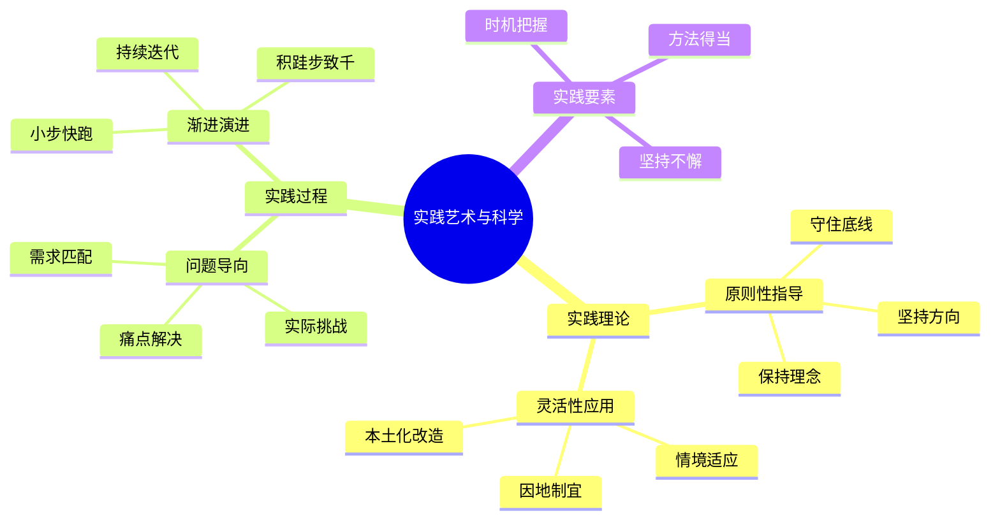

---

category: 
  - 书籍拆解
  - "[[第五项修炼-圣吉-v3]]"
status: draft
chapter: 
number: 11
title: 实践的艺术与实践
links:
  - "[[第五项修炼-圣吉-v3]]"
  - "[[第10章-整合各项修炼]]"
  - "[[第1章-哈吉斯]]"
created: 2026-02-27
tags:
  - 第五项修炼
  - 实践落地
  - 组织学习
  - 变革管理
---

# 第11章 实践的艺术与实践

## 📍 章节定位

### 全书位置
> 第十一章重点探讨如何将前文所述理论与修炼付诸实践，阐述学习型组织建设的实际操作路径和注意事项。作为进入实践部分的第一章，为整个实践部分奠定实施框架。

- **全书核心问题**: 如何将学习型组织理念转化为实际行为？
- **本章回答的问题**: 学习型组织建设的实践路径是什么？有哪些实施原则和注意事项？
- **角色类型**: 实践指导型 - 桥接理论与操作
- **论证位置**: 从前十章理论转向后三章实践

### 章节序列
| 方向 | 章节标题 | 逻辑连接 |
|------|----------|----------|
| 前章 | [[第10章-整合各项修炼]] | 将整合理论转向实践操作 |
| 后章 | [[第1章-哈吉斯]] | 为具体建设实践提供指导基础 |

### 一句话定位
> 第11章提供将五项修炼从理论框架转向组织实践的实施路径和方法论，强调实践中的艺术性与复杂性，为学习型组织建设提供实践基础。

---

## 🎯 核心观点

### 第一层：表层案例

| 案例名称 | 简要描述 | 页码 | 关键引文 |
|----------|----------|------|----------|
| 某制造企业五项修炼导入实践 | 从高层发起到一线执行的系统实践 | p.390-398 | "企业不是简单地选择一个修炼项目，而是寻找能够连接组织实际需求的修炼点。" |
| 某软件公司敏捷团队学习型组织建设 | 在敏捷开发框架中融入学习型组织理念 | p.400-408 | "团队学习成为了敏捷迭代过程中持续改进的驱动力。" |
| 某医院的系统化变革 | 通过五项修炼整合推动医院服务流程改进 | p.410-418 | "心智模式的转变使得医院从治病为中心转为以患者健康为中心。" |
| 某教育机构的转型实践 | 在教育变革中实践学习型组织理念 | p.420-428 | "共同愿景让教师队伍从被动执行转变为教育创新的参与者。" |
| 某非营利组织的能力建设 | 将五项修炼应用于社会服务能力建设 | p.430-438 | "系统思考让组织认识到自身活动与社区发展的关联性。" |

### 第二层：中层机制

| 机制名称 | 组成要素 | 因果链条 | 证据来源 |
|----------|----------|----------|----------|
| 理论向实践转换机制 | 认知转换、组织设计、行为塑造 | 理念输入 → 行为演练 → 组织固化 → 能力升级 | 制造企业导入案例 |
| 实践情境适配机制 | 环境评估、方案定制、动态调整 | 现实约束 → 定制方案 → 实施调整 → 本土优化 | 软件公司案例 |
| 实践阻力克服机制 | 阻力识别、干预设计、持续推动 | 抵触出现 → 深入分析 → 精准干预 → 阻力化解 | 医院变革案例 |
| 学习循环强化机制 | 反馈收集、反思迭代、改进优化 | 行动实施 → 学习反馈 → 方案改进 → 循环强化 | 教育机构案例 |

### 第三层：底层规律

| 规律陈述 | 抽象层级 | 知识连接 | 适用范围 |
|----------|----------|----------|----------|
| 理论-实践融合定律 | 哲学：理论指导实践，实践检验理论 | [[实践哲学]]、[[变革管理理论]] | 管理实践、组织变革 |
| 情境依赖性原则 | 管理学：管理模式需匹配具体情境 | [[权变理论]]、[[情境领导]] | 组织管理、领导科学 |
| 实践转化困难律 | 心理学：认知与行为转换中存在阻碍 | [[行为心理学]]、[[实施科学]] | 组织学习、能力建设 |
| 习得性循环定律 | 学习科学：学习-实践-再学习-再实践的螺旋 | [[学习循环]]、[[反思实践理论]] | 能力建设、组织发展 |

---

## 💬 降维翻译

### 观点1: 实践的复杂性与艺术性

#### 原文表达
> "将学习型组织理念变为实践是一个极其复杂的过程，需要在原则与灵活之间找到平衡。这不像是安装一个机械程序，更像是艺术创作过程。"
> —— p.392

#### 降维翻译（中学生能懂）
把学习型组织的理论变成现实中的做法是非常复杂的，需要在坚持原则的同时又能根据实际情况灵活调整。这不像安装软件那样按照步骤来做就行，更像画画或创作，需要根据实际情况作出判断和创意。

#### 日常类比（奶奶能懂）
就像做菜一样，光知道菜谱不够，还要看具体情况：菜有多新鲜、炉火力道怎么样、家里人的口味偏好。书上写的是一般的做法，做起来还要凭经验灵活调整。或者就像教导孩子，不能只按书上的方法来，每个孩子不一样，要因材施教，这就像是教孩子的一种艺术。

#### 检验
- Q: 如果一个中学生问你为什么实践学习型组织这么复杂？
- A: 因为现实中情况千变万化，不能按固定的模式套用，需要像艺术创作一样灵活应变，既要坚持原则又要适应变化。

### 观点2: 实践中的核心原则

#### 原文表达
> "实践中最重要的是要将五项修炼与组织当前面临的具体挑战联系起来，而不是机械地照搬模式。只有当实践活动与实际问题紧密相关时，学习型组织的建设才能获得生命力。"
> —— p.400

#### 降维翻译（中学生能懂）
实际操作中最重要的，是要把五项修炼跟组织目前遇到的具体困难联系起来，而不是简单地复制别人的模式。只有实践活动跟遇到的问题密切相关，学习型组织建设才会有真正的动力和发展空间。

#### 日常类比（奶奶能懂）
就像治病一样，不能听说有什么好药就吃，要看自己得了什么病才吃什么药。治头痛用治头痛的药，治胃疼用治胃疼的药。搞学习型组织也是一样，公司遇到什么挑战，就在什么地方下功夫，解决实际问题。

#### 检验
- Q: 如果一个中学生问实践时应注意什么？
- A: 要把自己的实际问题和理论相结合，不能生搬硬套，要解决实际的困难，这样才能真正有用。

### 观点3: 循序渐进的重要性

#### 原文表达
> "学习型组织的建设是一个长期过程，需要遵循循序渐进的原则，切忌急于求成。每个修炼的内化都需要时间，整个组织的转变更是如此。"
> —— p.415

#### 降维翻译（中学生能懂）
建立学习型组织是一个长期的工程，需要一步一步来，不能着急。每一种修炼都需要时间去领悟和掌握，整个组织的变化更是这样。

#### 日常类比（奶奶能懂）
就像盖房子一样，必须先打好地基，再一层层往上盖，急不得。或者种果树，要从选种子、育苗、栽培、照料、防虫害，每个阶段都要到位，最后才能开花结果。

#### 检验
- Q: 如果一个中学生问学习型组织建设需要多久？
- A: 这是个很漫长的过程，要一个阶段一个阶段来，不能期望一夜之间就改变，要耐心坚持。

---

## ✨ 金句库

### 原书金句
| 金句 | 页码 | 适用场景 |
|------|------|----------|
| "将理论付诸实践是一门艺术，不是简单的技巧复制。" | p.392 | 说明实践复杂性 |
| "学习型组织建设是一个长期过程。" | p.415 | 强调持之以恒 |
| "与实际问题紧密结合才是生命力所在。" | p.400 | 说明实践导向 |
| "五项修炼的内化需要时间沉淀。" | p.416 | 阐述实施周期 |
| "实践是在原则与灵活之间寻求平衡。" | p.392 | 描述实践特点 |
| "组织的转变是渐进的演化过程。" | p.412 | 解释变革规律 |

### 降维金句
| 金句 | 来源观点 | 适用场景 |
|------|----------|----------|
| "理论虽好，实践才见真章。" | 实践重要性 | 执行导向 |
| "纸上谈兵易，真枪实干难。" | 实践复杂性 | 挑战提醒 |
| "因地制宜，因势利导。" | 情境适配 | 灵活原则 |
| "滴水穿石，贵在坚持。" | 逐步实施 | 长期导向 |
| "知行合一，方出实效。" | 实践结合 | 贯彻理念 |
| "欲速则不达，慢工出细活。" | 循序渐进 | 耐心提醒 |
| "因地制宜不拘泥，因时制宜谋变化。" | 适应原则 | 应对策略 |
| "实践是最好的试金石。" | 实践验证 | 检验标准 |
| "理论是灰色的，实践之树常青。" | 理论实践 | 哲理表达 |
| "千里之行，始于足下。" | 从点滴开始 | 启动激励 |
| "一砖一瓦，筑梦学型。" | 积累建设 | 长期建设 |
| "循序渐进方能行稳致远。" | 循序渐进 | 持久经营 |
| "结合实际，避免教条主义。" | 灵活应用 | 避免误区 |
| "实践出真知，锻炼长才干。" | 实践价值 | 能力建设 |
| "活学活用，不照抄照搬。" | 灵活应用 | 指导原则 |

## 🔗 当下映射

### 💰 财富应用（实践投资）
| 场景 | 具体行动 | 预期效果 | 风险提示 |
|------|----------|----------|----------|
| 企业咨询实践 | 为客户设计定制化的学习型组织建设方案 | 提升顾问价值，增强客户粘性 | 过度定制可能增加复杂度 |
| 投资项目孵化 | 将投资对象的组织学习能力建设纳入孵化内容 | 增强投资标的长期价值 | 需要较长周期才能看到回报 |
| 自身组织升级 | 在公司内部推进学习型组织理念 | 提升组织适应性和创新能力 | 可能面临实施阻力 |

### 💼 职场应用
| 场景 | 具体行动 | 所需能力 | 适用职级 |
|------|----------|----------|----------|
| 项目管理 | 在项目中植入学习机制，不断优化方法 | 项目管理、持续改进能力 | PM/Team Leader |
| 变革推动 | 带领团队实践学习型组织核心理念 | 变革管理、教练指导能力 | Director及以上 |
| 文化转型 | 推动组织文化建设，融入学习理念 | 组织发展、沟通影响能力 | HRD/Change Leader |
| 业务创新 | 将团队学习方法应用于业务改善 | 创新思维、团队协作能力 | Manager及以上 |

### 🏠 生活应用
| 场景 | 具体行动 | 可行性 | 见效时间 |
|------|----------|--------|----------|
| 家庭教育 | 运用五项修炼理念教育子女 | 高 | 1-3个月 |
| 邻里关系 | 以协作学习精神改进邻里相处 | 中 | 2-4个月 |
| 社区服务 | 在志愿活动中实践学习理念 | 高 | 1-2个月 |

### 72小时行动计划
1. **明天可以做的第一件事**: 检视自己目前最困扰的一个工作问题，思考可以运用哪一项修炼的理念尝试解决
2. **本周内可以尝试的事**: 选择一个小的场景（比如一个项目或小组），尝试运用系统思考方法解决一个问题
3. **需要准备资源才能做的事**: 研究1-2个学习型组织建设的成功案例，了解具体实践方法

---

## 🕸️ 章节关联

### 向上关联 → 整书
- **贡献**: 本章连接理论与实践，为前10章的理论框架提供落地执行路径
- **位置**: 全书的逻辑转折点，理论向实践的转化中枢

### 横向关联 → 章节间
| 章节编号 | 章节标题 | 关联类型 | 连接描述 |
|----------|----------|----------|----------|
| 第1-10章 | 五项修炼理论 | 承前应用 | 本章为前十章理论提供实施基础 |
| 第12-14章 | 实践案例与落地 | 启后铺垫 | 本章为后续实践案例提供框架 |
| 整书核心 | 认知-实践双循环 | 实现机制 | 本章开启认知向实践的转化 |

### 向下关联 → 具体应用
| 应用场景 | 难度 | 前置知识 |
|----------|------|----------|
| 实施方案设计 | 中 | 掌握理论基础 |
| 组织变革实践 | 高 | 组织变革经验 |
| 指导他人实践 | 高 | 实践成功经验 |
| 理论实践结合 | 中 | 系统思考能力 |

### 跨书关联 → 知识网络
| 书籍 | 概念 | 关系 | 备注 |
|------|------|------|------|
| [[变革的力量-科特]] | 变革八步法 | 实践方法 | 提供系统变革的操作步骤 |
| [[从优秀到卓越]] | 对比研究经验 | 案例验证 | 验证理论向实践的转化价值 |
| [[基业长青-柯林斯]] | 企业长寿因素 | 验证支撑 | 展示持续学习的长期价值 |
| [[领导力挑战-库泽斯]] | 变革领导力 | 操作指导 | 补充实践领导的技能指导 |

### 关联可视化

---

## ❓ 问答设计

### Q1: 五项修炼在实践中如何避免形式化？（应用型）
**认知层次**: 应用
**难度**: 高
**答案要点**:
- 与组织面临的实际问题紧密结合
- 从解决具体挑战出发，而非为了实践而实践
- 重点放在解决实际问题，而非修炼本身

### Q2: 如何在实施过程中保持理论完整性？（分析型）
**认知层次**: 分析
**难度**: 高
**答案要点**:
- 抓住核心概念和原理不变
- 在具体形式上可以灵活调整
- 定期回顾与理论框架的对应关系

### Q3: 学习型组织实践需要哪些条件支持？（应用型）
**认知层次**: 应用
**难度**: 中
**答案要点**:
- 高层领导支持与参与
- 组织文化和制度配套
- 充分的资源和时间投入
- 系统的变革管理方法

### Q4: 实践中如何处理理论与现实的冲突？（应用型）
**认知层次**: 应用
**难度**: 高
**答案要点**:
- 识别冲突的本质和原因
- 在原则指导下寻求变通方案
- 忠于精髓，灵活于形式

### Q5: 如何评估实践效果？（理解型）
**认知层次**: 理解
**难度**: 中
**答案要点**:
- 关注实践是否解决了实际问题
- 观察组织学习能力是否有提升
- 检视员工行为和思维模式变迁

### Q6: 为什么要循序渐进而不是激进变革？（分析型）
**认知层次**: 分析
**难度**: 高
**答案要点**:
- 深度变革需要时间沉淀内化
- 避免引起过大组织震荡
- 确保每一步变革的扎实稳固

### Q7: 实践中如何平衡理论刚性与灵活性？（应用型）
**认知层次**: 应用
**难度**: 高
**答案要点**:
- 在核心原理上保持刚性
- 在具体形式上保持开放性
- 定期检视频衡调整

### Q8: 学习型组织建设中领导者的角色是什么？（理解型）
**认知层次**: 理解
**难度**: 中
**答案要点**:
- 示范实践的先行者
- 资源和环境的创造者
- 方向和原则的守护者

### Q9: 如何在实践中培养团队的接受度？（应用型）
**认知层次**: 应用
**难度**: 高
**答案要点**:
- 从团队现实痛点出发
- 以成效展示说服他人
- 逐步引导而非强制推行

### Q10: 理论实践转化的关键成功要素是什么？（分析型）
**认知层次**: 分析
**难度**: 高
**答案要点**:
- 持续的领导承诺
- 与实际问题结合度
- 渐进式实施策略
- 系统性的方法论

### Q11: 实践中如何应对不同团队的接受度差异？（应用型）
**认知层次**: 应用
**难度**: 高
**答案要点**:
- 识别各团队关切点和痛点
- 个性化推广方式
- 逐步建立成功试点并扩大

### Q12: 如何在有限资源下推进五项修炼？（应用型）
**认知层次**: 应用
**难度**: 中
**答案要点**:
- 优先从最具潜力的领域切入
- 选取影响深远的项目试点
- 用阶段性成果争取更多支持

### Q13: 检测实践与理论偏离的方法有哪些？（理解型）
**认知层次**: 理解
**难度**: 中
**答案要点**:
- 定期与理论框架对标检视
- 关键概念应用的正确性检查
- 最终效果的评估检验

### Q14: 学习型组织实践的常见陷阱有哪些？（理解型）
**认知层次**: 理解
**难度**: 中
**答案要点**:
- 认为是运动式活动
- 一味模仿先进做法
- 只关注形式忽视本质
- 急于求成缺乏耐心

### Q15: 如何保证实践活动的可持续性？（应用型）
**认知层次**: 应用
**难度**: 高
**答案要点**:
- 内化为组织核心能力而非外在活动
- 与组织价值观和战略目标对齐
- 建立可持续的学习文化
- 设立长期支持机制

---
