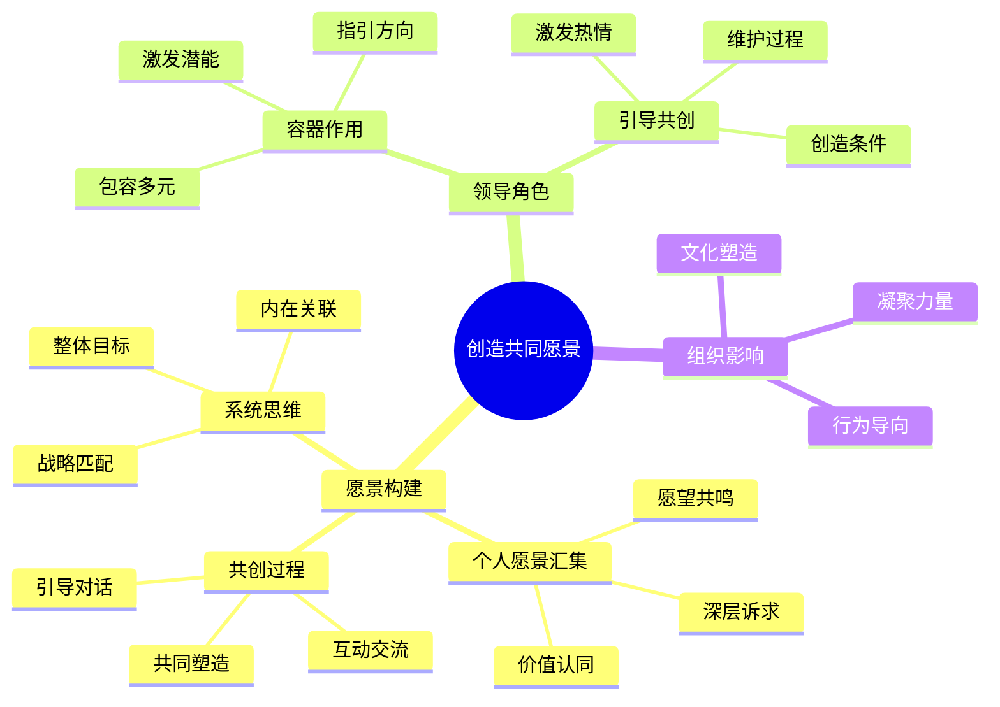

---

category: 
  - 书籍拆解
  - "[[第五项修炼-圣吉-v3]]"
status: draft
chapter: 
number: 12
title: 创造共同愿景
links:
  - "[[第五项修炼-圣吉-v3]]"
  - "[[第11章-实践的艺术与实践]]"
  - "[[第13章-走向学习型组织]]"
created: 2026-02-27
tags:
  - 第五项修炼
  - 共同愿景
  - 学习型组织
  - 团队建设
---

# 第12章 创造共同愿景

## 📍 章节定位

### 全书位置
> 第十二章深入探讨共同愿景的核心原理与具体构建方法，为学习型组织提供凝聚力和行动指引，强调愿景构建的参与性和共创性。连接理论到具体实践操作。

- **全书核心问题**: 如何有效地构建组织层面的共同愿景？
- **本章回答的问题**: 共同愿景的构建机制是什么？如何引导全体员工共创愿景？
- **角色类型**: 实践操作型 - 具体的愿景构建指南
- **论证位置**: 连接愿景理念与组织变革实践

### 章节序列
| 方向 | 章节标题 | 逻辑连接 |
|------|----------|----------|
| 前章 | [[第11章-实践的艺术与实践]] | 在实践原则下开展愿景构建工作 |
| 后章 | [[第13章-走向学习型组织]] | 为实现整体组织转型铺设基础 |

### 一句话定位
> 第12章深入剖析共同愿景构建机制，提供系统方法与实操指南，阐明如何激发组织共同创造力，为学习型组织发展奠定精神基石。

---

## 🎯 核心观点

### 第一层：表层案例

| 案例名称 | 简要描述 | 页码 | 关键引文 |
|----------|----------|------|----------|
| 福特汽车公司的愿景重建 | 亨利·福特二世通过构建"共同愿景"引领企业转型 | p.440-445 | "愿景不仅仅是领导者的想法，而是要与员工共同探讨和发展出来的。" |
| 明尼苏达大学医疗系统 | 通过共创"成为全美最健康的州"愿景实现协作革新 | p.446-452 | "当个人的深层愿望与组织的目标融为一体时，就会产生一种巨大的协同效应。" |
| 某制药公司愿景构建实践 | 在激烈的市场竞争中通过愿景构建凝聚创新力量 | p.453-458 | "愿景不是空洞的口号，而是能够指导日常决策和行为的内在动力。" |
| 某IT服务公司的团队愿景 | 少数民族技术团队通过愿景构建增强团队凝聚力 | p.459-464 | "团队成员需要共同创造愿景，而不仅仅是接受上级制定的目标。" |
| 某非营利社会服务机构愿景共创 | 多元员工团队协作构建为社区服务愿景 | p.465-470 | "愿景必须源于员工内心深处的愿望，并与组织使命相结合。" |

### 第二层：中层机制

| 机制名称 | 组成要素 | 因果链条 | 证据来源 |
|----------|----------|----------|----------|
| 个人愿景汇集机制 | 个体诉求、价值观探寻、期望对齐 | 个人期望表达 → 价值观认同 → 愿景雏形聚集 → 共同愿景形成 | 制药公司愿景案例 |
| 愿景共创推动机制 | 领导引导、员工参与、协作构建 | 引导性对话 → 深度交流 → 集体创造 → 共同认同 | IT服务团队案例 |
| 组织文化支撑机制 | 价值观塑造、制度保障、行为引导 | 文化理念植入 → 制度设计支撑 → 行为导向固化 → 愿景认同强化 | 医疗系统案例 |
| 系统思维应用机制 | 整体观念、因果思考、关联分析 | 系统思考引入 → 因果关系识别 → 整体目标设定 → 共同愿景精炼 | 福特汽车案例 |

### 第三层：底层规律

| 规律陈述 | 抽象层级 | 知识连接 | 适用范围 |
|----------|----------|----------|----------|
| 愿景参与性定律 | 管理学：共创性愿景具有更强认同度 | [[组织行为学]]、[[领导力理论]] | 团队管理、组织发展 |
| 愿景融合效应法则 | 系统论：个别人愿景的融合能产生协同效应 | [[复杂系统理论]]、[[协同理论]] | 组织学习、团队建设 |
| 愿景持久性原理 | 心理学：内生型愿景比外施愿景持续性更强 | [[动机理论]]、[[自我决定理论]] | 员工激励、价值塑造 |
| 愿景引领性公理 | 领导学：愿景是最高层次的领导力表现之一 | [[变革领导理论]]、[[愿景领导理论]] | 战略领导、文化建设 |

---

## 💬 降维翻译

### 观点1: 共同愿景的构建逻辑

#### 原文表达
> "共同愿景必须源自个人愿景，不是个人愿景的削弱或否定。相反，它应该能够激发和支持个人愿景的实现，形成'共同愿景→个人愿景→组织成就'的良性循环。"
> —— p.442

#### 降维翻译（中学生能懂）
共同愿景必须是从每个人自己的愿望发展出来的，而不是要你放弃自己想要的东西。它应该让你更容易实现自己的愿望，然后大家一起努力实现组织的目标。这是一个相互促进的过程：组织的愿景帮助实现个人愿望，个人愿望支持组织实现目标。

#### 日常类比（奶奶能懂）
就像一家人吃饭，如果每个人都有一些想吃的菜，那就可以商量一下，做一些大家都能高兴的菜，这样每个人都满足了自己的小愿望，也达成了家庭团聚吃顿好的这个大家的愿望。又好比一个村子修路，如果大家都有改善交通的心愿，这个共同的愿望就让大家团结起来，路修好了，每个人的生活愿望都能得到更好的实现。

#### 检验
- Q: 如果一个中学生问共同愿景为什么要来自个人愿景？
- A: 因为大家的愿望聚集在一起，才更有力量，而且每个人也能更好地实现自己的小小愿望。

### 观点2: 愿景共创的实施路径

#### 原文表达
> "创造共同愿景不是自上而下的命令或自下而上的提议，而是一个交互的过程，需要在对话和交流中不断澄清、扩展和融合。领导者的作用是'容器'，容纳并激发员工的各种想法。"
> —— p.450

#### 降维翻译（中学生能懂）
创造共同愿景不是领导说了算或者员工投票决定，而是一个大家一起交流、不断明确、扩展和完善的过程。领导的作用像个"容器"，把大家的想法装进去，激发更多想法。

#### 日常类比（奶奶能懂）
就好比一家人一起规划假期去哪里玩，不能爸爸说了算，也不能孩子说了算，应该是大家一起聊，说出各自想去的地方和原因，最后选择让大家最开心的地方。或者像包饺子，每个人包饺子的想法不同，有喜欢韭菜的，有喜欢芹菜的，大家可以商量着来，最后包出大家都满意的饺子。

#### 检验
- Q: 如果一个中学生问创造共同愿景是什么样的过程？
- A: 是大家一起聊，互相启发，最后形成大家都认同的目标，不是一个人说了算。

### 观点3: 愿景构建的内在机制

#### 原文表达
> "共同愿景的真正力量不在于宏伟的字句表述，而在于它能否激发每个人内心深处的共鸣。只有激发了内在驱动力的愿景才具有持续性和真实性。"
> —— p.456

#### 降维翻译（中学生能懂）
共同愿景真正的力量不在于说得多华丽，而在于能不能让每个人心里都觉得"这就是我想实现的"。只有让人心里激动并愿意为之奋斗的愿景，才能长久和真实。

#### 日常类比（奶奶能懂）
就像一个学校的目标不只是写在墙上的一句话，而是要让学生们、老师们心里都觉得"这个目标就是我们想要的"，这样大家才会真心实意地努力。如果是别人强加给你的目标，那你最多就是应付，不会拼命去做。

#### 检验
- Q: 如果一个中学生问什么样的共同愿景才有效？
- A: 是能让每个人心里都认可的愿景，不是写得多么壮观，而是真正让内心觉得有意义的。

---

## ✨ 金句库

### 原书金句
| 金句 | 页码 | 适用场景 |
|------|------|----------|
| "共同愿景必须源自个人愿景。" | p.442 | 强调构建基础 |
| "愿景不是命令，而是共创。" | p.450 | 说明构建原则 |
| "来自内心深处的愿景才真实有力。" | p.456 | 强调本质特性 |
| "真正愿景具有持续性激励力。" | p.457 | 说明影响力 |
| "领导者是容器，不是权威。" | p.451 | 阐释领导者角色 |
| "愿景共鸣产生巨大推动力。" | p.455 | 说明作用机制 |

### 降维金句
| 金句 | 来源观点 | 适用场景 |
|------|----------|----------|
| "共同愿景来自众人心里，不靠上面下达。" | 共创来源 | 组织文化建设 |
| "个人梦想汇成共同愿望。" | 汇集机制 | 团队动力 |
| "真实愿景靠内心驱动，不是靠制度强制。" | 内在驱动 | 激励机制 |
| "愿景不是贴墙上，而是刻心里。" | 感化作用 | 文化渗透 |
| "领导人像个放大器，激荡众人心声。" | 领导角色 | 领导力理念 |
| "众人心愿汇一处，组织前行有动力。" | 协同效应 | 团队凝聚 |
| "愿景源于内心，方能打动他人。" | 内生特质 | 诚意感化 |
| "人人都是愿景的创造者。" | 共创属性 | 参与文化 |
| "不是我要你要，而是我们要要。" | 诉求转移 | 团队意识 |
| "共同愿望，集体实现。" | 目标一致 | 行动协同 |
| "汇聚个人梦想，创造组织愿景。" | 整合效应 | 愿景建设 |
| "共鸣愿景，心行合一。" | 感化力 | 转化机制 |
| "愿景来自共创，不来自强加。" | 来源特性 | 管理理念 |
| "众人合力，愿景成真。" | 协作成果 | 激励口号 |
| "心中共鸣的愿景才最强大。" | 动力本质 | 激发理念 |

## 🔗 当下映射

### 💰 财富应用（愿景驱动发展）
| 场景 | 具体行动 | 预期效果 | 风险提示 |
|------|----------|----------|----------|
| 创业公司愿景构建 | 团队共创使命与发展愿景 | 提升凝聚力，吸引投资 | 过于宏大可能引发质疑 |
| 组织变革推动 | 通过愿景共创意愿变革共识 | 减少阻力，提升转型动力 | 需要大量的时间与资源 |
| 团队文化建设 | 构建团队共同目标愿景 | 提升协作效率，降低沟通成本 | 团队规模大时实施困难 |

### 💼 职场应用
| 场景 | 具体行动 | 所需能力 | 适用职级 |
|------|----------|----------|----------|
| 部门愿景共创 | 策划并主持愿景共创交流会 | 沟通能力、引导技能 | Manager及以上 |
| 团队建设引导 | 引导团队成员探寻个人愿景 | 深度倾听、教练技能 | Team Lead及以上 |
| 战略规划参与 | 在战略中融入共创愿景理念 | 战略思维、参与能力 | Senior及以上 |
| 激励体系设计 | 设计与愿景匹配的激励方案 | 激励设计、目标管理能力 | HRBP级别 |

### 🏠 生活应用
| 场景 | 具体行动 | 可行性 | 见效时间 |
|------|----------|--------|----------|
| 家庭愿景构建 | 与家人沟通并创建家庭愿景 | 高 | 2-4周 |
| 社区发展规划 | 在社区事务中倡导愿景共创理念 | 中 | 2-4个月 |
| 子女教育引导 | 协助孩子建立个人愿景 | 高 | 1-2个月 |

### 72小时行动计划
1. **明天可以做的第一件事**: 思考自己内心真正的个人愿景是什么，写下1-3项自己最为看重的人生价值观
2. **本周内可以尝试的事**: 与一位身边的朋友或同事交流彼此的个人愿景，探讨潜在的共同点
3. **需要准备资源才能做的事**: 学习愿景共创的引导方法，如开放空间技术或未来搜索等工具

---

## 🕸️ 章节关联

### 向上关联 → 整书
- **贡献**: 本章具体阐释共同愿景的构建方法，为学习型组织提供凝聚力源泉
- **位置**: 连接愿景理念与组织变革实践的重要桥梁

### 横向关联 → 章节间
| 章节编号 | 章节标题 | 关联类型 | 连接描述 |
|----------|----------|----------|----------|
| 第8章 | [[第8章-共同愿景]] | 深化扩展 | 在愿景理念基础上细化操作方法 |
| 第11章 | [[第11章-实践的艺术与实践]] | 实操落地 | 为共创过程提供实践指导原则 |
| 第9章 | [[第9章-团队学习]] | 协作支撑 | 愿景共创需要团队学习的对话技能 |
| 第13章 | [[第13章-走向学习型组织]] | 前置基础 | 本章为整体组织转型奠定愿景基础 |

### 向下关联 → 具体应用
| 应用场景 | 难度 | 前置知识 |
|----------|------|----------|
| 愿景共创引导 | 中 | 掌握团队引导技能 |
| 组织文化塑造 | 较高 | 了解组织变革理论 |
| 激励机制设计 | 中 | 拥有激励理论基础 |
| 领导力培养 | 高 | 需要深厚的领导实践 |

### 跨书关联 → 知识网络
| 书籍 | 概念 | 关系 | 备注 |
|------|------|------|------|
| [[领导力挑战-库泽斯]] | 愿景领导 | 实践补充 | 提供愿景表达和传播的实操技巧 |
| [[从优秀到卓越]] | 第5级领导力 | 愿景领导 | 强调愿景构建与领导品格的关系 |
| [[变革的力量-科特]] | 愿景构建 | 方法参考 | 提供构建和传播愿景的八步法 |
| [[U型理论-奥托·夏莫]] | 共同感知 | 共创方法 | 补充实现深度共创的理论支持 |

### 关联可视化

---

## ❓ 问答设计

### Q1: 什么是共同愿景的共创机制及其特点？（理解型）
**认知层次**: 理解
**难度**: 中
**答案要点**:
- 以个人愿景为起点，集合个人心愿到共同愿景中
- 不是命令式，而是对话式、互动式构建
- 在系统性交流中逐步澄清、精炼愿景内容
- 具有双向促进性

### Q2: 个人愿景与共同愿景有什么关系？（分析型）
**认知层次**: 分析
**难度**: 高
**答案要点**:
- 共同愿景应支持和促进个人愿景实现
- 个人愿景是构建共同愿景的基石材料
- 彼此不是替代关系，而是相互增强关系
- 平衡个人与共同目标的张力

### Q3: 如何在实践中引导愿景共创？（应用型）
**认知层次**: 应用
**难度**: 高
**答案要点**:
- 创造安全的对话环境
- 采用引导技术收集多元声音
- 以系统思考整合多重视角
- 将愿景与具体工作连接

### Q4: 为什么共同愿景不是简单的目标？（分析型）
**认知层次**: 分析
**难度**: 高
**答案要点**:
- 共同愿景具有情感吸引力和精神动力
- 需要激发内心的认同和热情
- 具有持续影响力而非短期刺激
- 与个人内在动机深度结合

### Q5: 领导者在愿景共创中的角色是什么？（理解型）
**认知层次**: 理解
**难度**: 中
**答案要点**:
- 充当容器角色，容纳多元想法
- 引导对话而非强加意见
- 创造环境和条件
- 保护共创过程

### Q6: 如何确保共创愿景的真实性？（应用型）
**认知层次**: 应用
**难度**: 高
**答案要点**:
- 确保广泛的全员参与
- 验证愿景与个人内心的连接
- 与日常工作和行为保持一致
- 定期回顾和更新

### Q7: 愿景共创面临哪些挑战？（分析型）
**认知层次**: 分析
**难度**: 高
**答案要点**:
- 个体诉求的多样性与整合难度
- 管控文化下员工参与度不足
- 肤浅讨论难以深入价值层次
- 时间成本与紧迫性的矛盾

### Q8: 愿景与组织战略有什么关系？（理解型）
**认知层次**: 理解
**难度**: 中
**答案要点**:
- 愿景提供战略方向和价值指导
- 策略规划需与愿景保持一致
- 愿景为策略执行提供持久动力
- 两者互相支撑和检验

### Q9: 如何评估共创愿景的有效性？（应用型）
**认知层次**: 应用
**难度**: 中
**答案要点**:
- 检视员工对愿景的内心认同程度
- 观察愿景对员工行为的影响
- 评估愿景对决策的指导作用
- 追踪愿景实现的进展状况

### Q10: 共创愿景与文化塑造有什么关系？（分析型）
**认知层次**: 分析
**难度**: 高
**答案要点**:
- 愿景成为文化建设的引领方向
- 文化实践加深对愿景的理解
- 两者相互促进，共同发展
- 文化是愿景落地的重要载体

### Q11: 共同愿景应包含哪些要素？（理解型）
**认知层次**: 理解
**难度**: 中
**答案要点**:
- 价值观和理念的集中体现
- 未来状态的理想描绘
- 行为和决策的指导原则
- 情感和意义的共同寄托

### Q12: 愿景共创与传统目标制定有何不同？（比较型）
**认知层次**: 比较
**难度**: 高
**答案要点**:
- 共创强调参与，传统强调命令
- 愿景关注意义，目标关注绩效
- 共创寻求认同，制定注重执行
- 愿景激发动力，目标施加压力

### Q13: 愿景构建如何确保全员参与？（应用型）
**认知层次**: 应用
**难度**: 高
**答案要点**:
- 创造多层次的参与机制
- 采用多样的沟通工具
- 提供反馈和调整机会
- 确保包容不同声音

### Q14: 多元文化环境下的愿景构建应注意什么？（应用型）
**认知层次**: 应用
**难度**: 高
**答案要点**:
- 尊重多样性的价值和诉求
- 寻找深层次的共同关注点
- 创造跨文化的对话空间
- 建立包容性的表达机制

### Q15: 如何保持共同愿景的动态调整？（应用型）
**认知层次**: 应用
**难度**: 高
**答案要点**:
- 建立愿景评估和反馈机制
- 保持与环境变化的适应性
- 维护核心价值观稳定性
- 重视成员参与的更新过程

---
