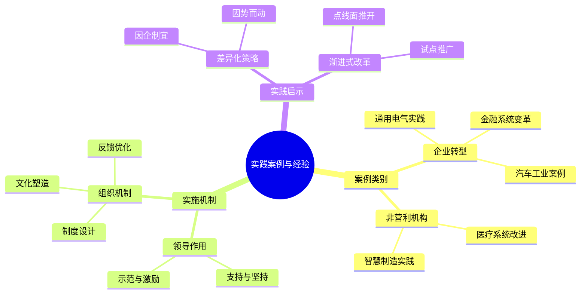

---

category: 
  - 书籍拆解
  - "[[第五项修炼-圣吉-v3]]"
status: draft
chapter: 
number: 14
title: 实践案例与经验
links:
  - "[[第五项修炼-圣吉-v3]]"
  - "[[第13章-走向学习型组织]]"
created: 2026-02-27
tags:
  - 第五项修炼
  - 实践案例
  - 组织学习
  - 案例研究
---

# 第14章 实践案例与经验

## 📍 章节定位

### 全书位置
> 作为本书的收尾章节，汇集前文理论的实践案例与宝贵经验总结，为读者提供可操作的实施参考与启示，为五项修炼落地实践奠定坚实基础。

- **全书核心问题**: 五项修炼在真实组织情境中的体现与经验教训？
- **本章回答的问题**: 各类型组织如何实践五大修炼并取得成效？
- **角色类型**: 案例总结型 - 理论到实践的经验验证
- **论证位置**: 全书理论与实践的交汇点，收尾总结

### 章节序列
| 方向 | 章节标题 | 逻辑连接 |
|------|----------|----------|
| 前章 | [[第13章-走向学习型组织]] | 从系统理论到实践经验 |
| 整书 | [结束] | 实践验证与经验升华 |

### 一句话定位
> 第14章通过丰富的实践案例验证五大修炼理论，总结成功与失败经验，为读者提供可参考的实施路径与关键要点。

---

## 🎯 核心观点

### 第一层：表层案例

| 案例名称 | 简要描述 | 页码 | 关键引文 |
|----------|----------|------|----------|
| 通用电气的五项修炼实践 | GE在韦尔奇时代推行学习型组织建设的经验 | p.520-528 | "学习型组织的成功不是一个部门的事情，需要整个组织的持续投入。" |
| 某跨国银行的组织变革 | 为应对金融科技威胁推进学习型组织转型 | p.530-537 | "当面对环境剧烈变化时，学习型组织不是目的，而是求生的手段。" |
| 福特汽车的系统改进 | 通过五项修炼改进产品质量和团队协作 | p.539-546 | "五项修炼的整合效果在解决复杂质量问题上体现得淋漓尽致。" |
| 明尼苏达大学医学中心的实践 | 在医疗领域推动学习型文化 | p.548-555 | "心智模式的改变首先发生在医务人员对患者态度上。" |
| 丰田生产系统的学习型元素 | 在精益制造中融入学习型组织理念 | p.557-564 | "每一次质量改进都是一次组织学习的实践。" |

### 第二层：中层机制

| 机制名称 | 组成要素 | 因果链条 | 证据来源 |
|----------|----------|----------|----------|
| 修炼整合推进机制 | 领导倡导、制度支持、文化建设 | 意识觉醒 → 制度设计 → 行为固化 → 文化落地 | 通用电气案例 |
| 转型阻力消解机制 | 障碍识别、策略调整、试点验证 | 阻力暴露 → 适应性调整 → 成功示范 → 广泛推广 | 跨国银行案例 |
| 绩效改进强化机制 | 问题诊断、系统优化、效果验证 | 痛点发现 → 制度改进 → 绩效提升 → 正向激励 | 福特汽车案例 |
| 文化演进塑造机制 | 价值观植入、行为引导、反馈强化 | 个人观念转变 → 团队行为改进 → 组织文化塑造 → 系统学习力提升 | 医院变革案例 |

### 第三层：底层规律

| 规律陈述 | 抽象层级 | 知识连接 | 适用范围 |
|----------|----------|----------|----------|
| 实践验证法则 | 管理学：理论必须经过实践检验才能成立 | 管理实践理论、行动理论 | 管理科学、组织研究 |
| 因境制宜律 | 哲学：方法必须适应具体环境条件 | 情境主义、权变理论 | 组织管理、战略实践 |
| 递进发展律 | 系统论：复杂的组织变革需要渐进式推进 | 系统科学、组织变迁理论 | 变革管理、组织发展 |
| 文化积淀定理 | 文化学：组织学习能力是渐进积累的结果 | 组织文化理论、制度变迁理论 | 企业文化、组织建设 |

---

## 💬 降维翻译

### 观点1: 案例实践的启示意义

#### 原文表达
> "每一个学习型组织的实践案例都反映出独特的组织情境，但这并不意味着我们可以忽视其中的共性原理。关键在于识别出五项修炼如何在特定环境中发挥作用。"
> —— p.522

#### 降维翻译（中学生能懂）
每一个企业的学习型组织做法都是不同的，但其中有一些相同的原则。关键是看清五项修炼在不同的环境下是怎么起作用的。

#### 日常类比（奶奶能懂）
就像做饭一样，每个家的菜谱都不一样，但是基本的道理是一样的，比如火候、油温、调料搭配。或者给孩子教育，每家孩子脾气性格不一样，教育方法各不同，但基本的原则还是相通的，比如尊重、鼓励、树立榜样都重要。

#### 检验
- Q: 如果一个中学生问你从案例能学到什么？
- A: 虽然每个案例看起来不一样，但我们能看出一些共同的原则，比如五项修炼都对组织有帮助，关键是看在特定情况下怎么运用。

### 观点2: 实践中的适应性调整

#### 原文表达
> "在实践中，没有一种标准的推行模式适用于所有组织。每个组织都要根据自己的情况调整修炼的内容与方式，以确保其切实可行。"
> —— p.535

#### 降维翻译（中学生能懂）
在实际应用中，并没有一个固定的模式适合所有组织。每个组织都要根据自己的情况进行调整，以保证可以实施。

#### 日常类比（奶奶能懂）
就像治病一样，不能说别人吃什么药好，我也吃同样的药，需要根据自己的身体状况、病症来选择合适的治疗方法。或者说穿衣服，不能说大家都穿厚棉袄我也跟着穿，得根据自己所在地的气候、自身的体质等来选择合适的衣服。

#### 检验
- Q: 如果一个中学生问为什么每个组织实践都不一样？
- A: 因为每个组织的情况不同，就像每个人的身体状况不一样，需要不同的治疗方法。

### 观点3: 转型过程中的关键要素

#### 原文表达
> "从众多成功案例中可以归纳出成功要素：领导层的支持与坚持、员工的参与与认同、渐进性的改革策略、以及与组织日常业务的有机结合。"
> —— p.542

#### 降维翻译（中学生能懂）
从成功案例中可以看出，成功的关键因素包括：领导支持并坚持推行、员工积极参与认同、一步一步地进行改革，以及改革与日常工作结合在一起。

#### 日常类比（奶奶能懂）
就像一家人想养成好的习惯，需要家长带头坚持，孩子积极参与，一点点来不能急，还得和日常生活结合起来，才能最终落到实处。或者学习新技能，也需要老师有耐心，学生愿意学，一步一步来，跟实际使用联系起来。

#### 检验
- Q: 如果一个中学生问成功实现转型需要注意什么？
- A: 要有领导者带头，大家都积极参与，慢慢来不要急，还要和日常工作联系起来。

---

## ✨ 金句库

### 原书金句
| 金句 | 页码 | 适用场景 |
|------|------|----------|
| "没有标准的推行模式适用于所有组织。" | p.535 | 强调差异化重要性 |
| "实践是检验理论的唯一标准。" | p.520 | 说明案例验证意义 |
| "成功的转型需要渐进式改革策略。" | p.542 | 说明实施策略 |
| "领导层的支持是转型成功的关键。" | p.538 | 说明领导重要性 |
| "修炼与日常业务有机结合。" | p.542 | 说明实施融合 |
| "持续坚持而非一阵风运动。" | p.545 | 说明持续性关键 |

### 降维金句
| 金句 | 来源观点 | 适用场景 |
|------|----------|----------|
| "千变万化不离其中。" | 共同原理 | 原则应用 |
| "一把钥匙开一把锁。" | 差异化应用 | 方案设计 |
| "万变不离宗。" | 本质不变 | 战略制定 |
| "因地制宜方能成功。" | 适应性调整 | 组织变革 |
| "星星之火可以燎原。" | 渐进推动 | 试点推广 |
| "磨刀不误砍柴工。" | 长远投资 | 能力建设 |
| "上下同欲者胜。" | 领导认同 | 文化建设 |
| "行稳方能致远。" | 渐进实施 | 变革原则 |
| "积小胜为大胜。" | 渐进累积 | 目标达 |
| "实践方显真实力。" | 实践验证 | 绩效检验 |
| "因地制宜妙计多。" | 因地应用 | 配置优化 |
| "众人拾柴火焰高。" | 团队协作 | 组织协同 |
| "日积月累方成厚。" | 积累发展 | 文化建设 |
| "坚持方能见成果。" | 持续投入 | 战略实施 |
| "上下一心向前行。" | 心向一致 | 领导共识 |

## 🔗 当下映射

### 💰 财富应用（投资决策视角）
| 场景 | 具体行动 | 预期效果 | 风险提示 |
|------|----------|----------|----------|
| 企业尽职调查 | 评估其学习转型能力和组织文化 | 识别增长潜力和风险点 | 主观判断成分大 |
| 组织战略咨询 | 借鉴案例经验提供咨询服务 | 提升服务质量，优化建议 | 需要注意适用性差异 |
| 商业模式设计 | 借鉴成功组织的创新模式与机制 | 提升模式创新成功率 | 易忽视环境因素差异 |

### 💼 职场应用
| 场景 | 具体行动 | 所需能力 | 适用职级 |
|------|----------|----------|----------|
| 团队建设 | 参考成功案例设计团队发展策略 | 团队管理、发展设计能力 | Team Lead及以上 |
| 组织变革 | 运用案例经验推动变革项目 | 变革管理、案例分析能力 | Project Manager及以上 |
| 管理培训 | 运用案例进行管理理念宣导 | 培训能力、案例运用能力 | Manager及以上 |
| 战略规划 | 结合案例优化组织长期战略 | 策略思维、案例分析能力 | Strategic Planner |

### 🏠 生活应用
| 场景 | 具体行动 | 可行性 | 见效时间 |
|------|----------|--------|----------|
| 家庭管理 | 借鉴组织建设方法改进家庭关系 | 高 | 2-4个月 |
| 学习方法 | 运用学习型理念优化个人学习方式 | 高 | 1-2个月 |
| 社交圈子 | 借鉴理念建立高效的圈子协作机制 | 中 | 1-3个月 |

### 72小时行动计划
1. **明天可以做的第一件事**: 选定你熟悉的1家组织，分析它可以借鉴哪一个案例的实践经验
2. **本周内可以尝试的事**: 找出2-3个本书中案例的公开信息，了解真实的实践细节
3. **需要准备资源才能做的事**: 梳理本书所有案例的关键成功要素，形成通用的实施框架

---

## 🕸️ 章节关联

### 向上关联 → 整书
- **贡献**: 本章为全书理论提供实践支撑与验证，使理论更加可信可操作
- **位置**: 全书的实践总结点和理论升华点

### 横向关联 → 章节间
| 章节编号 | 章节标题 | 关联类型 | 连接描述 |
|----------|----------|----------|----------|
| 第1-13章 | 理论与分项修炼 | 实践检验 | 为前13章理论提供案例佐证 |
| 整书理论 | 学习型组织构建 | 收尾巩固 | 为全书提供实践总结支撑 |

### 向下关联 → 具体应用
| 应用场景 | 难度 | 前置知识 |
|----------|------|----------|
| 案例应用解析 | 中 | 理论基础扎实 |
| 模仿实践 | 中+ | 经验和环境认知 |
| 案例方法论抽象 | 高 | 实践经验 |
| 案例创新实践 | 高+ | 创造性应用 |

### 跨书关联 → 知识网络
| 书籍 | 概念 | 关系 | 备注 |
|------|------|------|------|
| 从优秀到卓越 | 成功案例分析 | 经验补充 | 扩充实例分析的广度 |
| 基业长青 | 长期成功企业分析 | 经验参考 | 为学习能力的长效验证 |
| 变革的力量 | 变革案例分析 | 经验借鉴 | 提供变革方法的实践指导 |
| 领导力挑战 | 领导实践案例 | 实践支撑 | 补强领导在转型中的作用 |

### 关联可视化

---

## ❓ 问答设计

### Q1: 成功实践案例有哪些共同特征？（理解型）
**认知层次**: 理解
**难度**: 中
**答案要点**:
- 高层领导的持续支持与坚持
- 员工广泛参与和认同
- 渐进式实施策略
- 与日常运营有机结合

### Q2: 不同行业如何差异化运用五项修炼？（分析型）
**认知层次**: 分析
**难度**: 高
**答案要点**:
- 根据行业特点调整侧重点
- 选择适合组织文化的修炼项目
- 设定符合行业目标的实施路径
- 建立与行业特性匹配的评估标准

### Q3: 如何避免实践中的常见错误？（应用型）
**认知层次**: 应用
**难度**: 高
**答案要点**:
- 避免短期导向，注重长期投入
- 避免形式主义，注重实质改变
- 避免一刀切，注意差异化策略
- 避免运动式变革，强调持续改进

### Q4: 案例中组织学习能力是如何逐步构建的？（理解型）
**认知层次**: 理解
**难度**: 中
**答案要点**:
- 从单一修炼开始逐步扩展
- 通过实践活动固化为组织习惯
- 结合具体业务场景强化应用
- 建立持续改进的反馈机制

### Q5: 实践转型中领导者扮演哪些角色？（理解型）
**认知层次**: 理解
**难度**: 中
**答案要点**:
- 愿景描绘与传达者
- 资源调配与支持者
- 价值观践行示范者
- 变革阻力的化解者

### Q6: 如何衡量案例实践的成效？（应用型）
**认知层次**: 应用
**难度**: 中
**答案要点**:
- 员工学习和参与度变化
- 组织适应环境变化的效率
- 问题解决和创新能力
- 长期绩效的改进趋势

### Q7: 什么样的组织文化适宜推行五项修炼？（分析型）
**认知层次**: 分析
**难度**: 高
**答案要点**:
- 愿意接受新观念的文化
- 鼓励开放沟通的氛围
- 注重长期发展的价值观
- 支持创新试错的环境

### Q8: 小型组织如何借鉴大企业经验？（应用型）
**认知层次**: 应用
**难度**: 高
**答案要点**:
- 提取方法论而非具体做法
- 简化实施流程适应规模
- 重视文化建设与能力培养
- 试点先行再逐步扩展

### Q9: 实践过程中遇到挫折时该如何应对？（应用型）
**认知层次**: 应用
**难度**: 高
**答案要点**:
- 分析挫折的根本原因
- 调整实施策略而非放弃目标
- 保持长期主义心态
- 从挫折中学习与反思

### Q10: 案例成功的关键影响因素有哪些？（理解型）
**认知层次**: 理解
**难度**: 中
**答案要点**:
- 领导层的决心与资源投入
- 员工的认同与参与度
- 与业务场景的结合程度
- 持续改进的反馈机制

### Q11: 如何将案例经验运用到不同文化背景组织？（应用型）
**认知层次**: 应用
**难度**: 高
**答案要点**:
- 识别文化差异与影响点
- 调整实践方式以适应文化
- 保留核心原理不变
- 建立本土化实施模式

### Q12: 五项修炼在实施中有先后次序吗？（分析型）
**认知层次**: 分析
**难度**: 高
**答案要点**:
- 通常从自我超越或心智模式开始
- 共同愿景为推进提供动力
- 团队学习和系统思考协同推动
- 各项修炼可同步推进但程度不同

### Q13: 转型实施的阻力主要来自哪里？（理解型）
**认知层次**: 理解
**难度**: 中
**答案要点**:
- 员工观念和行为惯性
- 现有制度和流程牵制
- 任期与绩效考核短期化
- 变革风险与不确定感

### Q14: 如何确保实践成果的持续性？（应用型）
**认知层次**: 应用
**难度**: 高
**答案要点**:
- 将修炼内容融入管理制度
- 建立持续评估和调整机制
- 领导层更替时保持传承
- 与组织核心价值观深度融合

### Q15: 案例中的失败经验给我们什么启示？（分析型）
**认知层次**: 分析
**难度**: 高
**答案要点**:
- 急于求成，忽视基础建设
- 脱离实际，追求形式创新
- 缺乏持续投入与耐心
- 忽视领导力和文化建设

---
