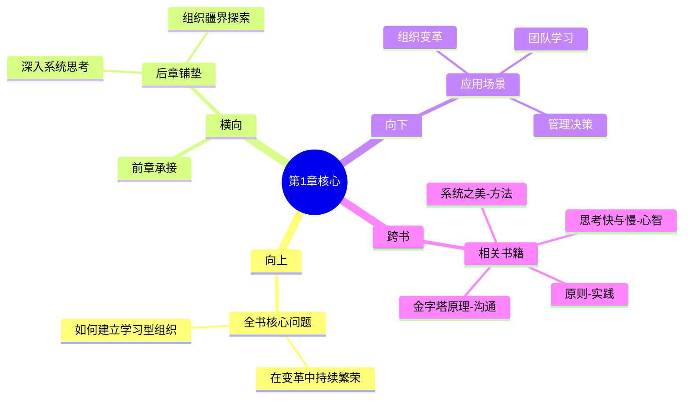

---

category: 
  - 书籍拆解
  - "[[第五项修炼-圣吉-v3]]"
status: draft
chapter: 
number: 1
title: 学习型组织的疆界
links:
  - "[[第五项修炼-圣吉-v3]]"
  - "[[第1章-哈吉斯]]"
created: 2026-02-27
tags:
  - 第五项修炼
  - 学习型组织
  - 系统思考
  - 五项修炼
description: "第一章是全书开篇，介绍学习型组织的基本概念和五项修炼的概要，并通过啤酒游戏展现系统思考的重要性。"
---

# 第1章 学习型组织的疆界

## 📍 章节定位

### 全书位置
> 第一章是全书开篇，介绍学习型组织的基本概念和五项修炼的概要，并通过啤酒游戏展现系统思考的重要性。

- **全书核心问题**: 如何建立学习型组织，在变革的环境中持续繁荣？
- **本章回答的问题**: 什么是学习型组织？为什么要建设学习型组织？五项修炼的基本框架是什么？
- **角色类型**: 开篇定位型 - 定义核心概念，介绍框架体系
- **论证位置**: 全书的理论起点，为后续章节的深入探讨奠定基础

### 章节序列
| 方向 | 章节标题 | 逻辑连接 |
|------|----------|----------|
| 前章 | 整书核心 | 无 |
| 后章 | [[第1章-哈吉斯]] | 深入探讨系统思考的法则 |

### 一句话定位
> 第1章是全书的总纲，定义学习型组织的概念并引入五项修炼的整体框架，通过啤酒游戏展现系统思考的核心价值，为后续章节的深度展开奠定基础。

---

## 🎯 核心观点

### 第一层：表层案例

| 案例名称 | 简要描述 | 页码 | 关键引文 |
|----------|----------|------|----------|
| 啤酒游戏 | MIT供应链管理模拟实验，展示供应链成员的"理性"决策如何导致系统性波动 | p.35-48 | "每个人都做了理性的决定，最终却造成了供应链的严重波动" |
| 储存俱乐部 | 仓储会员店，展示了不同客户群体的组织形态 | p.49-52 | "这种组织形态让我们看到了不同的组织边界" |
| 组织学习实验室 | 组织中进行学习和系统思考的实践场所 | p.53-58 | "在这个实验室里，我们能够安全地探索复杂的组织问题" |
| 学习型组织实例 | 美国钢铁、福特汽车等公司的转型实践 | p.59-64 | "这些公司在实践中摸索出了各自的方法" |

### 第二层：中层机制

| 机制名称 | 组成要素 | 因果链条 | 证据来源 |
|----------|----------|----------|----------|
| 五项修炼协同 | 自我超越、心智模式、共同愿景、团队学习、系统思考 | 五项修炼相互促进 → 学习型组织 | 啤酒游戏显示需要系统思考整合其他修炼 |
| 组织学习循环 | 观察、假设、实践、验证 | 反馈循环使组织不断改进 → 持续学习 | 啤酒游戏展示了错误的假设导致失败 |
| 系统性问题识别 | 问题症状、深层结构、杠杆点 | 识别底层结构 → 找到干预杠杆点 → 有效解决方案 | 啤酒游戏证明了表面解决不了根本问题 |

### 第三层：底层规律

| 规律陈述 | 抽象层级 | 知识连接 | 适用范围 |
|----------|----------|----------|----------|
| 学习型组织定律 | 系统论：个体学习聚合为组织学习 | [[系统之美-梅多斯]]、[[第五项修炼-圣吉]] | 组织管理、团队建设 |
| 跨层次整合规律 | 系统论：系统层面的结果取决于要素、连接和目标 | [[系统之美-梅多斯]]、[[第五项修炼-圣吉]] | 复杂系统设计 |
| 杠杆点效应规律 | 系统论：小的干预可能带来巨大的变革 | [[系统之美-梅多斯]]、[[第五项修炼-圣吉]] | 管理决策、变革实施 |

---

## 💬 降维翻译

### 观点1: 学习型组织的核心理念

#### 原文表达
> "学习型组织是一个能不断拓展其创造未来能力的组织。这种创建能力来源于学习——产生、获取和传递新知识，以及创造性地应用知识的能力。"
> —— p.57

#### 降维翻译（中学生能懂）
学习型组织不是一个普通的公司，而是把自己当作一个生命体，不断学习新的本领，让自己变得更强大。就像人的身体会不断修复细胞一样，这样的组织也会不断改进自己。

#### 日常类比（奶奶能懂）
就像一个人，如果他一直在学习新东西、改正老毛病，那么他就能一直成长和进步。公司也是这样，如果大家都一起学习、一起发现问题、一起解决难题，这个公司就能越来越好，不会因为跟不上时代而被淘汰。

#### 检验
- Q: 如果一个中学生问你学习型组织是什么意思？
- A: 它就像一个会学习的人，组织里的每个人都在成长，整个公司也跟着成长，这样就能面对未来的各种挑战。

### 观点2: 五项修炼的系统关系

#### 原文表达
> "系统思考是第五项修炼，它是整合其他四项修炼的中心。"
> —— p.68

#### 降维翻译（中学生能懂）
如果说学习型组织是一棵大树，那么其他的四项修炼（自我超越、改善心智模式、建立共同愿景、团队学习）就像是树枝，而系统思考是树干，它把这些树枝连接在一起，让整棵树形成一个整体。

#### 日常类比（奶奶能懂）
就像建房子，光有砖头（其他修炼）不够，还需要有钢筋水泥（系统思考）把这些砖头连成一个整体，否则每块砖都是散的，房子也就不结实了。或者就像做菜，调料（其他修炼）很重要，但掌握火候（系统思考）能把所有调料完美结合，做出好味道。

#### 检验
- Q: 如果一个中学生问你为什么系统思考是第五项修炼？
- A: 因为如果不从宏观角度看问题，那别的改变都只是局部的，只有理解了整体情况，各种改进才能协同发挥作用。

### 观点3: 啤酒游戏的启示

#### 原文表达
> "啤酒游戏的实质在于，它是现代商业系统的一个缩影，其中的每一个角色都按照他们自己的最佳判断行事，却没有获得整体的福祉。"
> —— p.45

#### 降维翻译（中学生能懂）
啤酒游戏说明了一个道理：有时候，每个人都按照自己的判断做了最好的选择，但结果对大家都不好。这就是因为大家只看到自己那一部分，没有看到整体。

#### 日常类比（奶奶能懂）
就像一个家庭，每个人都管好自己的事情，比如厨房要买足够的米，冰箱要储存够的菜，但没沟通好，结果买回来一堆米没人吃，菜又不够。或者像交通，每个人开快车想早点到，结果大家都堵在路上，谁都走不快。

#### 检验
- Q: 如果一个中学生问你啤酒游戏说明了什么？
- A: 说明了只管自己那一摊子事是不够的，要看整个系统的情况，才能做出真正好的决定。

---

## ✨ 金句库

### 原书金句
| 金句 | 页码 | 适用场景 |
|------|------|----------|
| "学习型组织是一个能不断拓展其创造未来能力的组织。" | p.57 | 文章开头引用 |
| "系统思考是第五项修炼，它是整合其他四项修炼的中心。" | p.68 | 强调系统思考重要性 |
| "每个人都按照他们的最佳判断行事，却没有获得整体的福祉。" | p.45 | 说明局部最优非全局最优 |
| "今日的问题来自昨天的解决方案。" | - | 说明系统中因果链的重要性 |
| "越用力推，系统反弹越强。" | - | 说明系统反馈的存在 |
| "学习型组织最首要的任务就是建立一个全面的、协调的战略体系。" | p.65 | 强调战略统筹 |

### 降维金句
| 金句 | 来源观点 | 适用场景 |
|------|----------|----------|
| "学习型组织就像会学习的人，能持续成长而不被淘汰。" | 学习型组织内涵 | 大众传播 |
| "五项修炼需要系统思考来整合，不然就是一盘散沙。" | 五项修炼关系 | 管理讨论 |
| "局部最优不等于全局最优，这是啤酒游戏的最大启示。" | 啤酒游戏启示 | 问题分析 |
| "只见树木不见森林，就是没有系统思考能力。" | 系统思考价值 | 批评分析 |
| "真正的学习不是培训多少课程，而是组织的进化能力。" | 学习型组织本质 | 教育观点 |
| "五个修炼齐头并进，才能塑造学习型组织。" | 练习协同效应 | 团建讨论 |
| "学习型组织的边界应该延伸到合作伙伴。" | 组织疆界拓展 | 战略规划 |
| "组织学习不同于个人学习，需要协同机制。" | 学习层级差异 | 团队建设 |
| "结构影响行为，所以光训员工不够，还要改结构。" | 结构-行为关系 | 管理理念 |
| "五项修炼是个人修行通往组织进化的桥梁。" | 修行-组织关系 | 发展理念 |

## 🔗 当下映射

### 💰 财富应用
| 场景 | 具体行动 | 预期效果 | 风险提示 |
|------|----------|----------|----------|
| 创业组织设计 | 在创业初期就构建学习机制，重视系统思考培养 | 提高组织适应性和成长天花板 | 学习文化建设需要时间和成本投入 |
| 投资标的筛选 | 关注公司的学习和发展能力，而不只是现有表现 | 识别高成长潜力的投资目标 | 学习型组织能力难以量化评估 |
| 个人事业规划 | 将所在组织的学习能力纳入职业考虑因素 | 选择能促进个人成长的工作环境 | 可能需要接受较低的初期报酬 |

### 💼 职场应用
| 场景 | 具体行动 | 所需能力 | 适用职级 |
|------|----------|----------|----------|
| 跨部门协作 | 运用系统思维分析问题，关注整体目标而非部门利益 | 系统思考、跨界沟通 | 中层管理及以上 |
| 团队管理 | 建立团队学习机制，改善心智模式和共同愿景 | 领导力、教练能力 | 团队负责人以上 |
| 问题解决 | 不仅关注症状，更要寻找系统性原因 | 根因分析、系统分析 | 所有职位 |
| 职业发展 | 持续提升自我超越和系统思考能力 | 自我管理、学习能力 | 所有职位 |

### 🏠 生活应用
| 场景 | 具体行动 | 可行性 | 见效时间 |
|------|----------|--------|----------|
| 家庭管理 | 将家庭看作一个系统，平衡各方需求 | 高 | 1-3个月 |
| 个人成长 | 建立个人学习系统，定期反思和调整 | 中 | 1-2个月 |
| 社区参与 | 关注社区的结构性问题而非个别现象 | 中 | 3-6个月 |

### 72小时行动计划
1. **明天可以做的第一件事**: 观察一个困扰已久的组织问题，尝试从系统角度分析，而不是只看表面现象
2. **本周内可以尝试的事**: 与同事或朋友分享啤酒游戏的概念，让大家理解局部最优不等于全局最优质的道理
3. **需要准备资源才能做的事**: 阅读系统思考的相关工具书籍，如《系统之美》，提升自己分析结构的能力

---

## 🕸️ 章节关联

### 向上关联 → 整书
- **贡献**: 本章确立学习型组织的概念框架和五项修炼的基本认识，为全书奠定理论基础
- **位置**: 论证的起始点，提出核心概念和分析工具

### 横向关联 → 章节间
| 章节编号 | 章节标题 | 关联类型 | 连接描述 |
|----------|----------|----------|----------|
| 第2章 | {{待填充}} | 铺垫 | 本章介绍系统思考概念，下一章深入探讨其法则 |
| 第5章 | {{待填充}} | 承接 | 本章提出五项修炼整合问题，后续章节逐一阐述 |
| 第6-10章 | {{待填充}} | 远程 | 本章总览五项修炼，各专项修炼在后面详述 |

### 向下关联 → 具体应用
| 应用场景 | 难度 | 前置知识 |
|----------|------|----------|
| 组织学习实验室设计 | 中 | 第1次接触 |
| 跨部门协作系统分析 | 中 | 了解基本概念 |
| 整体性问题解决 | 高 | 系统理论基础 |
| 学习型组织建设 | 高 | 全书理论实践 |

### 跨书关联 → 知识网络
| 书籍 | 概念 | 关系 | 备注 |
|------|------|------|------|
| [[系统之美-梅多斯]] | 系统基模、反馈回路 | 扩展支持 | 本章的系统思考框架的具体方法 |
| [[思考快与慢]] | 心智模式、认知偏误 | 交叉验证 | 心智模式修炼的心理学基础 |
| [[原则]] | 组织制度、原则体系 | 实践对比 | 达里奥对圣吉理论的实践 |
| [[金字塔原理-明托]] | 逻辑表达 | 方法补充 | 学习型组织内部沟通技巧 |

### 关联可视化

---

## ❓ 问答设计

### Q1: 什么是学习型组织及其核心特征？（理解型）
**认知层次**: 理解
**难度**: 中
**答案要点**:
- 核心定义：一个能不断拓展其创造未来能力的组织
- 特征：系统思考、持续学习、整体思维、适应性强
- 与传统组织的区别：从静态管控到动态进化

### Q2: 为什么系统思考被称为"第五项修炼"？（分析型）
**认知层次**: 分析
**难度**: 中
**答案要点**:
- 系统思考整合其他四项修炼
- 其他修炼如果没有系统思考整合，会形成孤岛
- 系统思考提供整体性视角，帮助发现事物之间的联系

### Q3: 啤酒游戏揭示了哪些关键的管理问题？（应用型）
**认知层次**: 应用
**难度**: 中
**答案要点**:
- 局部最优不等于整体最优
- 信息不对称导致决策偏差
- 时间延迟影响系统表现
- 结构比个人意愿更能影响行为

### Q4: 五项修炼之间的关系是怎样的？（分析型）
**认知层次**: 分析
**难度**: 中
**答案要点**:
- 每项修炼都有独特价值
- 系统思考贯穿并整合其他修炼
- 五项修炼相互支撑形成协同效应
- 心智模式影响自我超越的效果

### Q5: 在实际工作中如何应用第一章的理念？（应用型）
**认知层次**: 应用
**难度**: 中
**答案要点**:
- 从整体角度看部门问题
- 重视团队学习与沟通机制
- 建立反馈与改进循环
- 注重长期能力而非短期绩效

### Q6: 学习型组织与传统组织的区别体现在哪些方面？（比较型）
**认知层次**: 分析
**难度**: 中
**答案要点**:
- 目标导向：适应vs控制
- 学习方式：组织学习vs个体培训
- 决策过程：系统思维vs部门分割

### Q7: 什么是组织学习的"疆界"及其意义？（理解型）
**认知层次**: 理解
**难度**: 中
**答案要点**:
- 疆界决定谁被认为是组织的一部分
- 合理延伸边界有助于系统效果
- 传统边界可能限制组织效能

### Q8: 五项修炼中哪一项最为重要？（评价型）
**认知层次**: 评价
**难度**: 高
**答案要点**:
- 系统思考是整合者，至关重要
- 但五项缺一不可，需共同发展
- 应根据组织现状有侧重地推进

### Q9: 如何在小型组织中践行学习型组织理念？（应用型）
**认知层次**: 应用
**难度**: 高
**答案要点**:
- 从个人学习习惯抓起
- 建立坦诚沟通机制
- 关注长期能力培养

### Q10: 组织学习有哪些常见的障碍？（理解型）
**认知层次**: 理解
**难度**: 低
**答案要点**:
- 局部思维
- 推卸责任
- 只关注应急

### Q11: 个人如何参与组织学习？（应用型）
**认知层次**: 应用
**难度**: 中
**答案要点**:
- 自我反思与成长
- 促进开放交流
- 关注整体效果

### Q12: 系统思考需要什么能力？（理解型）
**认知层次**: 理解
**难度**: 中
**答案要点**:
- 结构性思维
- 时间滞后意识
- 因果关系理解

### Q13: 为什么要在组织中推行系统思考？（评价型）
**认知层次**: 评价
**难度**: 中
**答案要点**:
- 避免头痛医头脚痛医脚
- 识别根本性解决方案
- 提升组织整体效能

### Q14: 啤酒游戏的现实意义是什么？（应用型）
**认知层次**: 应用
**难度**: 中
**答案要点**:
- 展示供应链协作挑战
- 说明信息流通的重要性
- 体现系统性解决方案的必要性

### Q15: 如何评估一个组织的学习能力？（分析型）
**认知层次**: 分析
**难度**: 高
**答案要点**:
- 学习机制的存在与运转
- 创新能力的持续发挥
- 应对变化的速度与效果

---
