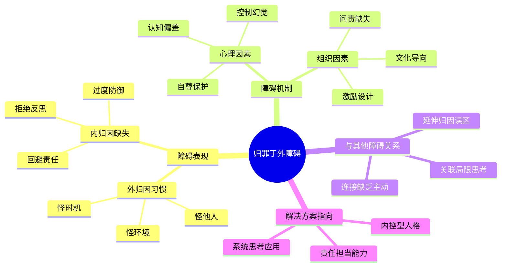

---

category: 
  - 书籍拆解
  - "[[第五项修炼-圣吉-v3]]"
status: draft
chapter: 
number: 4
title: 归罪于外
links:
  - "[[第五项修炼-圣吉-v3]]"
  - "[[第3章-我就是我的职位]]"
  - "[[第1章-哈吉斯]]"
created: 2026-02-27
tags:
  - 第五项修炼
  - 学习障碍
  - 系统思考
  - 组织学习
description: "第四章继续分析组织学习的第二个主要障碍——将问题责任归咎于外部环境，而非审视组织内部因素。本章深化了系统思考的核心观点，强调问题往往源于系统结构而非外在因素。"
---

# 第4章 归罪于外

## 📍 章节定位

### 全书位置
> 第四章继续分析组织学习的第二个主要障碍——将问题责任归咎于外部环境，而非审视组织内部因素。本章深化了系统思考的核心观点，强调问题往往源于系统结构而非外在因素。

- **全书核心问题**: 组织中存在哪些阻碍学习的因素？
- **本章回答的问题**: 为什么组织倾向于将责任和问题归咎于外部环境？这种倾向如何影响组织学习能力？
- **角色类型**: 问题分析型 - 识别和剖析组织学习的第二个主要障碍
- **论证位置**: 延续第三章局限思考主题，深入探讨另一个重要学习障碍

### 章节序列
| 方向 | 章节标题 | 逻辑连接 |
|------|----------|----------|
| 前章 | [[第3章-我就是我的职位]] | 同属学习障碍系列，继续分析内部思维局限 |
| 后章 | [[第1章-哈吉斯]] | 为探讨系统思考的具体应用做铺垫 |

### 一句话定位
> 第4章深入分析"归罪于外"这一学习障碍，揭示组织和个人如何逃避自身责任，将问题归咎于外部环境，从而丧失内在学习和改进的动力。

---

## 🎯 核心观点

### 第一层：表层案例

| 案例名称 | 简要描述 | 页码 | 关键引文 |
|----------|----------|------|----------|
| 丰田与美国汽车公司的对比 | 美国公司抱怨日本倾销，丰田则专注内部改进 | p.152-158 | "在1960和70年代，美国汽车制造商几乎一致把市场份额损失归咎于日本倾销。" |
| 经济危机中的企业反应 | 公司在经济低迷时抱怨市场环境，而不考虑自身问题 | p.159-165 | "许多企业一旦遇到困难，就将其归咎于'经济状况'、'市场疲软'或'竞争加剧'。" |
| 医院医疗事故归因 | 医生护士之间互相指责设备供应商，不反思医疗流程 | p.166-170 | "事故发生之后，通常归因于疏忽的个人或故障的设备，而不是更深入地审视医疗流程。" |
| 教育机构的招生困境 | 学校抱怨生源下降，而不审视教学质量或课程设置 | p.171-174 | "许多教育机构将招生困难归因于社会风气或家庭教育，而不反思自身问题。" |
| 员工绩效问题归因 | 管理者常将员工表现不佳归因于个人态度或能力 | p.175-178 | "管理者倾向于将员工的工作失误归因于态度不好或能力不足，而忽略了工作环境和制度设计。" |

### 第二层：中层机制

| 机制名称 | 组成要素 | 因果链条 | 证据来源 |
|----------|----------|----------|----------|
| 外归因惯性机制 | 认知偏差、自保心理、责任回避 | 问题发生 → 外部归因倾向 → 避免自我反思 → 忽略内部改进 → 问题重复出现 | 丰田vs美国汽车案例 |
| 责任转移机制 | 归罪文化、问责回避、外部指责 | 个人或组织绩效不佳 → 寻找外部责任对象 → 推卸责任 → 内部改进停滞 | 企业经济危机反应 |
| 认知简化机制 | 选择性注意、归因偏差、情绪化判断 | 外部事件冲击强烈 → 注意焦点偏向外因 → 忽略内部因素 → 形成错误归因思维 | 医疗事故归因案例 |
| 控制幻觉机制 | 错误控制感、权责分离、无力感补偿 | 面对外部因素 → 感觉无力掌控 → 强化外控感 → 忽视可控内因 → 改进动力不足 | 招生困境归因案例 |

### 第三层：底层规律

| 规律陈述 | 抽象层级 | 知识连接 | 适用范围 |
|----------|----------|----------|----------|
| 责任归属偏见法则 | 心理学：内外归因偏差 | [[思考快与慢-丹尼尔·卡尼曼]]、归因理论 | 个人与组织决策、责任担当 |
| 外部归因防御机制 | 心理学：自尊保护与印象管理 | 认知心理学、[[社会心理学-阿伦森]] | 人际互动、组织行为 |
| 结构隐藏定律 | 系统论：内部结构对个体不明显 | [[系统之美-梅多斯]]、控制论 | 组织系统、社会系统 |
| 反馈延迟规避定律 | 行为学：即时回应与延迟后果 | 行为分析、组织行为学 | 责任归属、绩效改进 |

---

## 💬 降维翻译

### 观点1: 归罪于外的心理机制

#### 原文表达
> "我们有一种天生的倾向，将失败的责任归属于外在因素——别人、外部条件，甚至是运气，而把功劳归于内部因素。这种双重标准是归罪于外学习障碍的核心。"
> —— p.153

#### 降维翻译（中学生能懂）
当我们做事情失败的时候，往往更容易怪别人、怪环境条件或是说自己运气不好，但如果做成功了，更多时候会说是自己厉害。这是一种很普遍的心理倾向，也是"归罪于外"这种问题的核心机制。

#### 日常类比（奶奶能懂）
就像小孩儿犯错了，会说是因为别的小朋友带坏的；但得了奖状，会说是自己聪明认真。大人也是这样，工作没做好，会说是老板要求太高、同事不配合、市场不好；但做得好了，就觉得自己能力强、运气好。

#### 检验
- Q: 如果一个中学生问你什么叫"归罪于外"？
- A: 就是我们遇到问题或没做好的时候，往往喜欢怪别人或者环境，而不是反思自己哪里可以做得更好。

### 观点2: 归罪于外对系统思考的阻碍

#### 原文表达
> "归罪于外阻碍系统思考，因为它让我们专注于外部事件，而不是深入观察影响事件发生的内部结构和模式。"
> —— p.155

#### 降维翻译（中学生能懂）
当人们倾向于把问题怪到外部因素上时，就不会深入去分析问题背后的真实原因和整体情况。他们会只看到表面的事件，而不去思考隐藏在内部的深层结构，这是系统思考的很大阻碍。

#### 日常类比（奶奶能懂）
就好比家里漏水了，有的人只看到地板湿了的事实，怪天气下雨太大，但不去检查到底是水管破了还是屋檐排水不好。或者孩子生病了，只忙着怪空气不好、食物不干净，而不去检查生活习惯有什么问题。

#### 检验
- Q: 如果一个中学生问你为什么归罪于外会影响学习？
- A: 因为当你总是在怪别人或其他因素时，就不会仔细想想自己和环境之间有哪些深层的联系，哪些地方是可以改进的。

### 观点3: 内向归因促进学习的机制

#### 原文表达
> "如果我们将注意力集中在内部系统因素上，就更有可能学会改进它们。承担责任是学习的先决条件。"
> —— p.168

#### 降维翻译（中学生能懂）
如果我们能够把关注点放到内部因素上，比如我们自己的工作流程、制度设计、思维方式等，那就更可能去改进它们。要承担责任，愿意承认自己在哪些方面可以做得更好，这是学习的前提条件。

#### 日常类比（奶奶能懂）
比如家庭要和睦，不是怪邻居、怪社区、怪社会，而是先从自己做起，从家庭内部找问题，想想家人之间应该怎么沟通、怎么相处。或者说种地丰收，不只是指望天气好、种子好，更要从播种、施肥、管理上找经验和不足。

#### 检验
- Q: 如果一个中学生问你怎样才能不归罪于外呢？
- A: 要学会承担责任，多从自身和自己可以直接影响的地方找原因和改进方法，而不仅仅是抱怨外界。

---

## ✨ 金句库

### 原书金句
| 金句 | 页码 | 适用场景 |
|------|------|----------|
| "归罪于外是组织学习的第二个主要障碍。" | p.151 | 分析组织问题时 |
| "我们有一种天生的倾向，将失败的责任归属于外在因素。" | p.153 | 说明认知偏差 |
| "归罪于外阻碍系统思考。" | p.155 | 讨论系统思维障碍 |
| "承担责任是学习的先决条件。" | p.168 | 强调责任意识 |
| "专注于外部事件而不是系统结构。" | p.156 | 批评治标不治本 |
| "结构比事件更能影响系统行为。" | p.157 | 认知改进建议 |

### 降维金句
| 金句 | 来源观点 | 适用场景 |
|------|----------|----------|
| "内求诸己，外怨诸人：学习能力的分水岭。" | 归因倾向差异 | 学习文化倡导 |
| "外归因是心灵舒适区，内归因是成长触发器。" | 归因心理机制 | 自我反思 |
| "怪环境不如改流程。" | 系统思考应用 | 问题解决导向 |
| "责任不在别人那里，就在自己的控制范围内。" | 责任担当 | 执行力提升 |
| "外向归因锁死成长空间。" | 影响机制 | 学习障碍警示 |
| "成功归于自己，失败归于他人：普遍心理倾向。" | 认知偏差现象 | 自我觉察 |
| "归罪于外是组织免疫力缺失的表现。" | 组织健康观 | 管理诊断 |
| "逃避内部问题，必然遭遇外部冲击。" | 因果循环 | 危机预测 |
| "问责文化是归罪于外的克星。" | 解决策略 | 文化建设 |
| "看得见问题是表象，发现内在结构是本事。" | 层次区分 | 观察能力 |
| "归罪于外者永远是他人的仆人。" | 能动性丧失 | 个人成长激励 |
| "问题面前无外人，都是系统一家人。" | 系统观 | 团队协作 |
| "外部归因是逃避的面具。" | 防御机制 | 觉醒提醒 |
| "责任内归是学习型人格的标志。" | 内控型特征 | 人才识别 |
| "外推责任，内失动力。" | 行为后果 | 组织改进建议 |

## 🔗 当下映射

### 💰 财富应用（组织决策视角）
| 场景 | 具体行动 | 预期效果 | 风险提示 |
|------|----------|----------|----------|
| 证券投资决策 | 评价公司管理层是否勇于承担内部责任而非外部归因 | 更准确识别有长远发展能力的企业 | 判断主观性较强，需结合客观数据 |
| 商业合作 | 优先选择在困难时期能内向归因而非找借口的合作伙伴 | 降低合作风险，建立稳定商业关系 | 识别过程需要足够时间和沟通 |
| 内部决策失误 | 将复盘重点放在内部流程改进而非外部理由 | 促进组织学习，避免重复错误 | 初期可能伤害团队士气，需要恰当引导 |

### 💼 职场应用
| 场景 | 具体行动 | 所需能力 | 适用职级 |
|------|----------|----------|----------|
| 项目总结 | 在项目失败复盘中聚焦流程与团队而非外部因素 | 复盘技能、情绪智商 | Project Manager及以上 |
| 个人发展 | 主动承但责任并从中学习而非归结于他人 | 反思技能、自我驱动 | 所有职级 |
| 团队协作 | 建立共同承担责任的文化氛围 | 领导力、团队建设技能 | Team Leader及以上 |
| 管理决策 | 决策失误后关注系统性改进而非指责个人 | 系统思维、变革管理能力 | Manager及以上 |

### 🏠 生活应用
| 场景 | 具体行动 | 可行性 | 见效时间 |
|------|----------|--------|----------|
| 子女教育 | 遇到问题与孩子共同承担找方法而非归因环境 | 高 | 2-4周 |
| 夫妻冲突 | 沟通时关注如何改进互动模式而非归咎对方 | 高 | 1-2个月 |
| 个人习惯养成 | 失败时不怪环境变化或特殊情况 | 高 | 1-3个月 |

### 72小时行动计划
1. **明天可以做的第一件事**: 回顾近期遇到的一个挫折或失败，列出外部因素的同时，也思考可以改进的内部因素或流程
2. **本周内可以尝试的事**: 在一次团队会议中，当他人开始将问题归结于外部因素时，温和地引导大家关注可以控制的内部因素
3. **需要准备资源才能做的事**: 学习并应用"事后反省"（After Action Review）方法，定期检视决策与结果的因果关系

---

## 🕸️ 章节关联

### 向上关联 → 整书
- **贡献**: 本章继续探讨组织学习的第二大主要障碍，深化了全书关于系统思考的核心观点，为构建学习型组织的必要性提供有力论证
- **位置**: 位于四大障碍中承前启后的关键位置，连接局限思考与缺乏主动积极

### 横向关联 → 章节间
| 章节编号 | 章节标题 | 关联类型 | 连接描述 |
|----------|----------|----------|----------|
| 第1章 | 学习型组织的疆界 | 奠定基础 | 本章问题说明构建学习型组织的必要性 |
| 第2章 | 系统思考入门 | 方法支撑 | 本章说明为何需要运用系统思考分析问题 |
| 第3章 | 我就是我的职位 | 同类延伸 | 同属四大障碍，与局限思考共同构成认知局限 |
| 第5章 | {{待填充}} | 奠定基础 | 本章分析为引入解决方案做铺垫 |
| 第10章 | {{待填充}} | 对应关系 | 五项修炼的整合应用解决本章问题 |

### 向下关联 → 具体应用
| 应用场景 | 难度 | 前置知识 |
|----------|------|----------|
| 建立责任制文化 | 中 | 理解本章分析的归因机制 |
| 实施AAR复盘法 | 中 | 掌握系统思考基础 |
| 设计问责流程 | 高 | 了解内外因素平衡 |
| 推动归因文化转向 | 高 | 基于组织变革基础 |

### 跨书关联 → 知识网络
| 书籍 | 概念 | 关系 | 备注 |
|------|------|------|------|
| [[系统之美-梅多斯]] | 系统边界、杠杆点 | 方法支撑 | 为深入分析系统内部因素提供工具 |
| [[思考快与慢]] | 系统1/2思维、归因偏差 | 心理基础 | 解释归罪于外的内在认知机制 |
| [[原则]] | 拥抱现实、承担责任 | 策略参考 | 提供承担责任的实际操作原则 |
| [精益思想] | 持续改进、问题解决 | 实践应用 | 为内部因素改进提供方法支撑 |

### 关联可视化

---

## ❓ 问答设计

### Q1: 归罪于外这一学习障碍的具体表现有哪些？（理解型）
**认知层次**: 理解
**难度**: 中
**答案要点**:
- 倾向于将失败归咎于外部因素，如他人、环境、时机
- 忽视内部因素和自身可控因素的作用
- 形成固定的认知偏差：好结果归于自己，坏结果怪别人

### Q2: 为什么归罪于外会影响组织学习能力？（分析型）
**认知层次**: 分析
**难度**: 中
**答案要点**:
- 错失改进机会：只关注外部因素，忽略内部流程和结构改进
- 保持错误行为：不反思自身问题，错误重复发生
- 阻碍系统思考：只看到表面事件，不关注深层结构

### Q3: 如何在日常工作中避免归罪于外？（应用型）
**认知层次**: 应用
**难度**: 高
**答案要点**:
- 定期进行内向归因分析，反思自身可改进的点
- 建立问责和复盘机制
- 培养系统思考，分析内外因素的相互影响

### Q4: 归罪于外障碍与其他学习障碍有何联系？（分析型）
**认知层次**: 分析
**难度**: 中
**答案要点**:
- 与局限思考相互强化：局限思维导致无法看到整体，倾向于怪外部
- 深化归因问题：本职思维下更容易将责任推给其他部门或外部因素
- 形成思维循环：外归因导致无法真正学习系统思维

### Q5: 如何判断一个组织是否有归罪于外的倾向？（应用型）
**认知层次**: 应用
**难度**: 中
**答案要点**:
- 观察失败时的责任归属话语
- 注意成功与失败的归因模式差异
- 了解绩效复盘是否会重点关注内部改进

### Q6: 归罪于外的人和承担责任的人有哪些不同？（比较型）
**认知层次**: 比较
**难度**: 中
**答案要点**:
- 归罪于外者：关注外部、感觉被控制、难以成长
- 承担责任者：关注控制、主动改进、持续学习

### Q7: 影响归罪于外倾向的主要心理因素有哪些？（分析型）
**认知层次**: 分析
**难度**: 中
**答案要点**:
- 自我服务偏误：成功归内因，失败归外因
- 认知防御机制：保护自尊，避免面对问题
- 控制感幻觉：高估外部影响，低估内部影响

### Q8: 组织文化如何影响归罪于外倾向？（分析型）
**认知层次**: 分析
**难度**: 高
**答案要点**:
- 惩罚性文化会加剧归罪于外行为
- 权力距离大的组织倾向推卸责任
- 缺乏安全心理的环境不利于内向归因

### Q9: 归罪于外在团队协作中会产生什么具体影响？（应用型）
**认知层次**: 应用
**难度**: 高
**答案要点**:
- 跨部门冲突增加
- 解决问题的效率下降
- 学习与改进的机会错失

### Q10: 哪些具体的工具可以帮助减少归罪于外倾向？（应用型）
**认知层次**: 应用
**难度**: 高
**答案要点**:
- AAR事后复盘法
- 5WHY问题分析法
- 鱼骨图/因果分析图
- 系统思维工具

### Q11: 在数字化转型中归罪于外会如何表现？（应用型）
**认知层次**: 应用
**难度**: 中
**答案要点**:
- 厂商怪技术不成熟
- IT部门怪需求变更太快
- 业务部门怪系统不灵活
- 无法从整体角度审视转型问题

### Q12: 如何判断一个人是否具备内向归因习惯？（理解型）
**认知层次**: 理解
**难度**: 低
**答案要点**:
- 遇到问题时首先考虑自身可改进之处
- 愿意承担失败的责任
- 主动反思并寻求改进

### Q13: 归罪于外会影响什么管理决策？（理解型）
**认知层次**: 理解
**难度**: 中
**答案要点**:
- 组织结构设计
- 人员配置决策
- 流程优化改进
- 制度规则修订

### Q14: 系统思维如何帮助克服归罪于外？（应用型）
**认知层次**: 应用
**难度**: 高
**答案要点**:
- 从整体角度审视问题
- 关注结构与模式而非单一事件
- 理解内外因素的相互影响

### Q15: 如何培养内向归因的习惯？（应用型）
**认知层次**: 应用
**难度**: 高
**答案要点**:
- 定期反思练习
- 设立可控制指标
- 建立成长型思维
- 营造安全的试错环境

---
