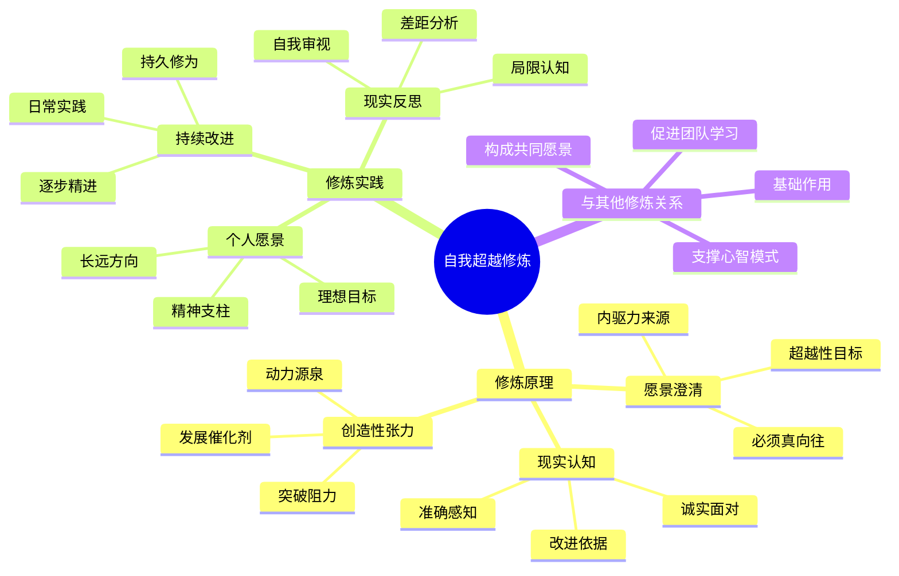

---

category: 
  - 书籍拆解
  - "[[第五项修炼-圣吉-v3]]"
status: draft
chapter: 
number: 6
title: 自我超越
links:
  - "[[第五项修炼-圣吉-v3]]"
  - "[[第5章-系统思考的法则]]"
  - "[[第1章-哈吉斯]]"
created: 2026-02-27
tags:
  - 第五项修炼
  - 自我超越
  - 学习型组织
  - 心智模式
---

# 第6章 自我超越

## 📍 章节定位

### 全书位置
> 第六章是"五项修炼"部分的第一章，深入探讨自我超越这一基础修炼，阐述个人如何通过自我精进推动组织学习。本章连接系统思考理论与个人实践，为五项修炼的展开奠定基础。

- **全书核心问题**: 学习型组织如何通过个人修炼实现整体进化？
- **本章回答的问题**: 什么是自我超越？如何培养自我超越的能力？
- **角色类型**: 修炼指引型 - 介绍五项修炼中的基础修炼
- **论证位置**: 五项修炼的起点，连接个人成长与组织学习

### 章节序列
| 方向 | 章节标题 | 逻辑连接 |
|------|----------|----------|
| 前章 | [[第5章-系统思考的法则]] | 从系统分析转向个人修炼 |
| 后章 | [[第1章-哈吉斯]] | 心智模式与自我超越相辅相成 |

### 一句话定位
> 第6章介绍五项修炼的基石——自我超越，阐述个人如何通过澄清愿景、把握现实、拥抱创造性张力来实现持续成长，从而推动组织学习能力的发展。

---

## 🎯 核心观点

### 第一层：表层案例

| 案例名称 | 简要描述 | 页码 | 关键引文 |
|----------|----------|------|----------|
| 休利特的愿景坚持 | 惠普创始人对"对人尊重"的长期坚持 | p.215-220 | "惠普早期的两个人，休利特和他的伙伴帕卡德，就开始形成一种被他们称为'对人尊重'的愿景，而且始终把它作为公司政策的中心。" |
| 玛丽·弗莱彻的愿景之旅 | 情绪困扰女性对和谐人际关系的追求之路 | p.222-228 | "玛丽·弗莱彻的故事让我们看到，在自我超越中，个人的愿景不仅必须是自己真心渴望的，而且还必须是基于对现实的真实感知。" |
| 小提琴演奏者的追求 | 专业音乐家对技艺完美与内在和谐的双重要求 | p.230-235 | "一个优秀的音乐家既要有严格的技巧训练，又要有内在艺术感受力的培育，两者相结合才是'自我超越'。" |
| 系统变革倡导者的历程 | 致力于组织系统改革的领导者成长过程 | p.236-242 | "系统思考是自我超越修炼者用来认识个人愿景与现实关系的重要工具之一。" |
| 卓越工程师的自我完善 | 持续追求技术和创新能力的工程师生涯 | p.243-248 | "真正的持续自我超越要求个体保持终生的实践毅力。" |

### 第二层：中层机制

| 机制名称 | 组成要素 | 因果链条 | 证据来源 |
|----------|----------|----------|----------|
| 创造性张力生成机制 | 个人愿景、对现实的正确认知 | 愿景与现实差距 → 感受创造性张力 → 驱动变革行动 → 个人成长 | 弗莱彻个人成长案例 |
| 情绪性张力转化机制 | 恐惧、挫折感受 | 情绪性张力 → 妥协/放弃现实 → 强化负面心态 → 回避成长 | 情绪性张力概念分析 |
| 学习精进循环机制 | 技能练习、反馈调整、内省反思 | 实践 → 结果反馈 → 反思总结 → 技能改进 → 新实践 | 小提琴家训练过程 |
| 愿景澄清整合机制 | 外在意愿、内心渴望、现实认知 | 内心澄澈 → 愿景澄清 → 现实认知深化 → 产生创造性张力 → 持续精进 | 成功修炼者特点分析 |

### 第三层：底层规律

| 规律陈述 | 抽象层级 | 知识连接 | 适用范围 |
|----------|----------|----------|----------|
| 个人成长涌现原理 | 系统论：个人系统自我优化的能量涌现 | [[学习科学]]、[[自我决定理论]] | 个人发展、能力成长 |
| 愿景驱动机制 | 心理学：内在动机与目标导向行为 | [[动机心理学]]、[[自我实现理论]] | 目标达成、持续进步 |
| 现实认知深化律 | 认知学：真实感知与认知一致性定律 | [[认知心理学]]、[[建构主义]] | 学习过程、决策优化 |
| 张力平衡发展定律 | 动力学：创造性与恐惧性张力的相对平衡 | [[张力学理论]]、[[动态系统理论]] | 心理健康、行为调节 |

---

## 💬 降维翻译

### 观点1: 自我超越的核心内涵

#### 原文表达
> "自我超越是一个过程，是个人成长的过程，也是学习的过程。自我超越层次高的人，通常展现出对愿景的专注，以及对现实的好奇和诚实。"
> —— p.216

#### 降维翻译（中学生能懂）
自我超越不是一下子就能达到的状态，而是一个不断完善自己、持续学习和成长的过程。那些在这方面做得好的人，通常有两个特点：一是对自己的理想目标非常专注，二是对现实情况充满好奇并且能够坦诚面对。

#### 日常类比（奶奶能懂）
就像种一棵树，不能只想着它长成之后有多好看，还得仔细观察它现在的长势，土壤是干是湿，有没有虫子伤害它，然后才能决定要不要浇水、施肥、捉虫。学习、读书、做人也是这样，得有长远的目标，也要清楚现在的状况，这样才能不断进步。

#### 检验
- Q: 如果一个中学生问你什么叫自我超越？
- A: 就是不断让自己变得更好的过程，有明确的理想目标，同时也能够看到自己现在的实际情况，通过努力一点一点缩小差距。

### 观点2: 创造性张力与情绪性张力的区别

#### 原文表达
> "创造性张力：愿景与现实之间的差距所产生的能量，推动我们朝着愿景努力。情绪性张力：因现实与愿景的差距而产生的负面情绪，往往导致妥协。"
> —— p.220

#### 降维翻译（中学生能懂）
当我们的现状与想达到的目标有差距时，可能会有两种不同的感受：一种是让人有动力去努力奋斗的积极能量，这种力量能推动我们朝目标前进；另一种是让人感到痛苦、焦虑、绝望的情绪，这种情绪可能会让我们降低目标或干脆放弃。

#### 日常类比（奶奶能懂）
就像孩子想考试考满分，但上次只考了80分。有些人觉得"哇，我还能进步得多，要更努力才行"，这就是积极的能量；有些人会觉得"我怎么这么笨，肯定考不了满分的"，就灰心丧气不想学了，这就是负面的情绪。同样是差距造成的，但结果完全不同。

#### 检验
- Q: 如果一个中学生问你什么是创造性张力？
- A: 就是看到理想和现实之间的差距时，不觉得沮丧，而是觉得有动力，让你想方设法去努力缩小这个差距。

### 观点3: 持续自我超越的必要条件

#### 原文表达
> "自我超越修炼要求我们不断地澄清愿景，客观地观察现实，并在此基础上持续地实践与发展。它是真正的终身学习。"
> —— p.240

#### 降维翻译（中学生能懂）
要想不断改善自己，需要三个步骤：第一，弄清楚自己真正想要的是什么；第二，诚实地看待自己的实际情况；第三，在这基础上不断地练习进步。这是一件需要用一辈子去做好的事情。

#### 日常类比（奶奶能懂）
就像学做一道菜，首先要弄明白自己想做出什么样的美味来，然后要看看现在自己掌握的技巧够不够用了，有哪些需要改进的，接下来就要一次次地练习直到成功。而且人的一辈子可能都要学习很多新东西，每个阶段都会有新情况，所以要持续不断学习。

#### 检验
- Q: 如果一个中学生问你怎样才能持续进步？
- A: 要想清楚自己要去哪儿，要看清楚自己在哪儿，然后持续不断地往那个方向努力，这是一个终生的过程，不能停止。

---

## ✨ 金句库

### 原书金句
| 金句 | 页码 | 适用场景 |
|------|------|----------|
| "自我超越是一个过程，是个人成长的过程，也是学习的过程。" | p.216 | 定义概念时使用 |
| "创造性张力是自我超越的核心原理。" | p.219 | 原理阐述时 |
| "愿景必须是自己真心渴望的，而不是外在强加的标准。" | p.225 | 愿景澄清时 |
| "对现实的准确感知是自我超越的重要组成部分。" | p.227 | 现实认知时 |
| "真正的持续自我超越要求个体保持终生的实践毅力。" | p.245 | 强调持续性时 |
| "自我超越层次高的人，通常展现出对愿景的专注。" | p.216 | 描述特质时 |

### 降维金句
| 金句 | 来源观点 | 适用场景 |
|------|----------|----------|
| "愿景是灯塔，现实是舵柄。" | 愿景与现实的关系 | 个人成长激励 |
| "差距是动力，不满是能源。" | 创造性张力 | 努力激励 |
| "不是因为看到希望才坚持，是因为坚持才看到希望。" | 精进哲学 | 坚持鼓励 |
| "真实的自己遇见理想的自己。" | 自我审视 | 自省启发 |
| "目标要远，脚步要近。" | 目标策略 | 远景规划 |
| "自我超越靠自觉不靠压力。" | 内在驱动 | 激励方式 |
| "现实是最好的老师，愿景是最强的引擎。" | 相互作用观 | 学习心态 |
| "真正的强者敢于直面现实。" | 现实认知 | 勇气激发 |
| "成长始于看清现实和愿景的差距。" | 张力原理 | 认知提升 |
| "不要逃避痛苦，要从痛苦中学习。" | 痛苦转化 | 逆境应对 |
| "梦想是方向，但踏实是方法。" | 梦想现实观 | 实践指导 |
| "心怀理想，脚踏实地。" | 理想实践观 | 价值观 | 
| "知行合一，方得始终。" | 学行关系 | 修炼准则 |
| "内观心源，外拓境界。" | 修炼路径 | 境界提升 |
| "每日一省，每月一悟。" | 持续修炼 | 日常践行 |

## 🔗 当下映射

### 💰 财应用（个人发展投资）
| 场景 | 具体行动 | 预期效果 | 风险提示 |
|------|----------|----------|----------|
| 技能投资策略 | 基于愿景和现实差距确定技能发展方向 | 提升核心竞争力，加速个人成长 | 可能偏离市场需求变化 |
| 人脉资源优化 | 围绕愿景建立和维护高价值连接 | 获取资源支持，扩大发展机会 | 需花费大量时间精力 |
| 知识结构升级 | 超前布局未来需要的跨领域知识 | 构建领先优势，提升适应能力 | 短期内可能影响直接收益 |

### 💼 职场应用
| 场景 | 具体行动 | 所需能力 | 适用职级 |
|------|----------|----------|----------|
| 目标管理系统 | 设定个人愿景并与日常工作结合 | 目标分解、自我管理能力 | 所有职级 |
| 职业发展规划 | 明确长期职业愿景并制定现实路线图 | 规划能力、自我洞察力 | 专员及以上 |
| 团队激励引领 | 引导团队成员探寻个人愿景和现实差距 | 沟通激励、教练技能 | Leader及以上 |
| 能力持续提升 | 运用创造性张力驱动技能持续精进 | 学习能力、自省能力 | 所有员工 |

### 🏠 生活应用
| 场景 | 具体行动 | 可行性 | 见效时间 |
|------|----------|--------|----------|
| 健康生活方式 | 设定并追求身心健康目标，正视现实 | 高 | 1-3个月 |
| 家庭和谐营造 | 构建美好家庭愿景，并改善现状 | 高 | 3-6个月|
| 亲子教育实践 | 明确教育愿景，客观看待孩子现状 | 中 | 6-12个月 |

### 72小时行动计划
1. **明天可以做的第一件事**: 花10分钟写下自己的长期愿景（个人想成为什么样的人，或想拥有什么样的生活）
2. **本周内可以尝试的事**: 每天花几分钟时间客观地审视自己的现状，记录与愿景之间的差异
3. **需要准备资源才能做的事**: 制定一份为期一年的自我超越计划，包含愿景实现的阶段性目标

---

## 🕸️ 章节关联

### 向上关联 → 整书
- **贡献**: 本章启动五项修炼，将系统思考理论与个人实践相结合，是个人发展与组织学习的连接纽带
- **位置**: 从理论分析转向实践修炼，为后续四项修炼奠定基础

### 横向关联 → 章节间
| 章节编号 | 章节标题 | 关联类型 | 连接描述 |
|----------|----------|----------|----------|
| 第1-5章 | 概述与系统思考 | 承上启下 | 本章将系统思考应用到个人成长 |
| 第7章 | 心智模式 | 相互依存 | 心智模式支撑个人愿景澄清 |
| 第8章 | [[第8章-共同愿景]] | 扩展延伸 | 从个人愿景扩展到组织共同愿景 |
| 第9章 | [[第9章-团队学习]] | 实践支撑 | 个人自我超越支撑团队学习 |
| 第10章 | [[第五项修炼-圣吉]] | 整合呼应 | 本章是五项修炼的基础 |

### 向下关联 → 具体应用
| 应用场景 | 难度 | 前置知识 |
|----------|------|----------|
| 愿景澄清练习 | 中 | 掌握自我省察能力 |
| 创造性张力应用 | 中 | 理解张力机制 |
| 自我修炼计划 | 高 | 持续践行意愿 |
| 导师指导计划 | 高 | 寻找匹配资源 |

### 跨书关联 → 知识网络
| 书籍 | 概念 | 关系 | 备注 |
|------|------|------|------|
| [[思考快与慢]] | 专注与认知反思 | 延伸应用 | 为自我观察提供认知工具 |
| [[心流-契克森米哈赖]] | 持续精进体验 | 体验深化 | 探索最佳实践心流状态 |
| [[终身成长-德韦克]] | 成长思维 | 概念支撑 | 培育超越型成长心态 |
| [[原则]] | 个人原则构建 | 实践拓展 | 制定自我超越原则体系 |

### 关联可视化

---

## ❓ 问答设计

### Q1: 什么是自我超越及其核心特征？（理解型）
**认知层次**: 理解
**难度**: 中
**答案要点**:
- 自我超越是一个持续成长的过程而非结果状态
- 对个人愿景的高度专注
- 对现实的客观认知和诚实面对

### Q2: 愿景与现实的认知对自我超越有何重要意义？（分析型）
**认知层次**: 分析
**难度**: 高
**答案要点**:
- 愿景提供驱动力和方向
- 现实认知提供改进依据
- 两者结合产生创造性张力推动自我精进

### Q3: 如何在日常生活中培养自我超越能力？（应用型）
**认知层次**: 应用
**难度**: 高
**答案要点**:
- 定期澄清个人愿景
- 诚实地面对现实状况
- 将愿景与现实差距转化为改进动力
- 进行持续的实践反思

### Q4: 创造性张力与情绪性张力有何区别？（理解型）
**认知层次**: 理解
**难度**: 中
**答案要点**:
- 创造性张力驱动积极改变和成长
- 情绪性张力产生负面情绪，常导致妥协
- 前者关注可能性，后者关注局限性

### Q5: 持续自我超越需要什么条件？（理解型）
**认知层次**: 理解
**难度**: 中
**答案要点**:
- 不断澄清理想目标
- 客观观察实际情况
- 保持终生的实践毅力

### Q6: 自我超越如何推动组织学习？（分析型）
**认知层次**: 分析
**难度**: 高
**答案要点**:
- 个人修炼构成组织学习的基础单元
- 个人愿景与组织目标结合形成共同动力
- 各项个人能力提升转化为组织能力

### Q7: 自我超越修炼中最常见的挑战是什么？（分析型）
**认知层次**: 分析
**难度**: 高
**答案要点**:
- 避免对现实的否认和粉饰
- 抵制短期诱惑与妥协冲动
- 克服情绪性张力的干扰

### Q8: 愿景澄清有哪些关键要求？（应用型）
**认知层次**: 应用
**难度**: 中
**答案要点**:
- 必须是自我真心渴望的
- 不能是外在强加的标准
- 需与个人价值观保持一致

### Q9: 如何区分真正的愿景和外在目标？（理解型）
**认知层次**: 理解
**难度**: 中
**答案要点**:
- 真正愿景源自内心热情
- 外在目标多为他人期待
- 愿景具有持久的内驱力

### Q10: 自我超越修炼的核心原则是什么？（应用型）
**认知层次**: 应用
**难度**: 高
**答案要点**:
- 诚实面对现实状况
- 坚持清晰愿景追求
- 转换张力为积极能量
- 保持终身学习心态

### Q11: 情绪性张力如何阻碍个人成长？（分析型）
**认知层次**: 分析
**难度**: 高
**答案要点**:
- 引发恐惧和焦虑情绪
- 导致妥协和目标降低
- 阻碍积极行动的发生

### Q12: 创造性张力是如何产生的？（理解型）
**认知层次**: 理解
**难度**: 中
**答案要点**:
- 源于愿景与现实的差距
- 需要对现实的准确感知
- 需要对愿景的真诚投入

### Q13: 如何在工作中应用自我超越原则？（应用型）
**认知层次**: 应用
**难度**: 高
**答案要点**:
- 设定职业发展目标
- 客观评估能力现状
- 将差距转化为提升动力

### Q14: 个人愿景与组织愿景如何协调？（综合型）
**认知层次**: 综合
**难度**: 高
**答案要点**:
- 寻找个人愿景与组织目标的结合点
- 在共同目标中寻找个人意义
- 避免两者之间的严重冲突

### Q15: 自我超越有哪些具体的实践方法？（应用型）
**认知层次**: 应用
**难度**: 中
**答案要点**:
- 定期反思和愿景澄清
- 现实情况的客观评估
- 建立持续学习机制
- 寻求导师或榜样指引

---
