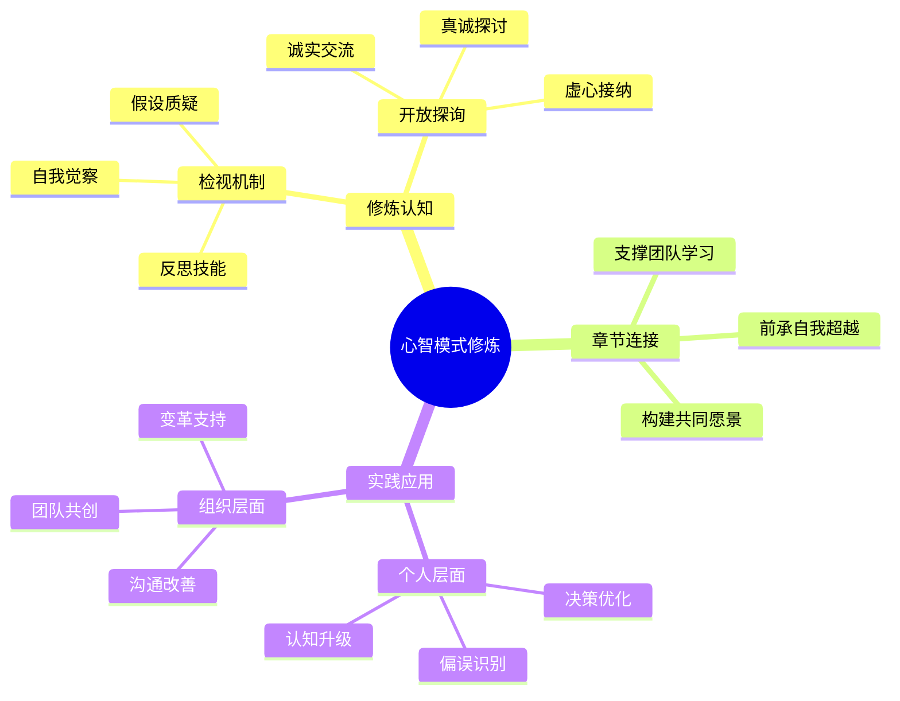

---

category: 
  - 书籍拆解
  - "[[第五项修炼-圣吉-v3]]"
status: draft
chapter: 
number: 7
title: 心智模式
links:
  - "[[第五项修炼-圣吉-v3]]"
  - "[[第6章-自我超越]]"
  - "[[第1章-哈吉斯]]"
created: 2026-02-27
tags:
  - 第五项修炼
  - 心智模式
  - 学习型组织
  - 系统思考
---

# 第7章 心智模式

## 📍 章节定位

### 全书位置
> 第七章深入探讨五项修炼的第二项——心智模式，阐释如何审视和改善我们理解世界的方式。本章连接个人内心世界与外部行为，是深化自我超越的重要支撑。

- **全书核心问题**: 心智模式如何影响我们的认知与行为？
- **本章回答的问题**: 什么是心智模式？如何检视和改善我们的心智模式？
- **角色类型**: 修炼指引型 - 介绍反思性修炼
- **论证位置**: 在自我超越基础上深化内部修炼机制

### 章节序列
| 方向 | 章节标题 | 逻辑连接 |
|------|----------|----------|
| 前章 | [[第6章-自我超越]] | 探索内在世界的重要维度 |
| 后章 | [[第1章-哈吉斯]] | 为构建共同愿景奠定认知基础 |

### 一句话定位
> 第7章阐述心智模式修炼的重要内容，揭示我们如何通过审视和改善内心认知结构来提高对现实的准确感知，从而更好地实现个人成长和组织发展。

---

## 🎯 核心观点

### 第一层：表层案例

| 案例名称 | 简要描述 | 页码 | 关键引文 |
|----------|----------|------|----------|
| 艾利克斯的销售策略转变 | 某销售经理从"硬卖"到"深度倾听"理念的转变过程 | p.238-245 | "艾利克斯开始意识到，销售工作最重要的不是说服客户购买，而是帮助客户澄清他们的真正需求。" |
| 丰田生产方式的思维革新 | 从"机器连续运转"到"无缺陷生产"的根本思维模式转变 | p.240-250 | "日本管理者开始质疑西方管理中'最大化的设备利用率'这一基本假设。" |
| 阿波罗13号工程师团队 | 面对危机时如何重构问题认知从而找到解决方案 | p.252-258 | "工程师们必须抛弃原有的解决问题的假设，从全新的视角看待现有资源的使用方式。" |
| 乔治·夏尔的绘画认知转变 | 画家学习绘画时的"看见方式"转变 | p.260-265 | "初学者必须改变'看到'的方式才能真正'看见'要画的东西。" |
| IBM企业文化重塑 | 传统硬件厂商面对互联网冲击时的认知模式调整 | p.268-275 | "IBM高层必须挑战'计算机是高端设备'这一根深蒂固的心智模式。" |

### 第二层：中层机制

| 机制名称 | 组成要素 | 因果链条 | 证据来源 |
|----------|----------|----------|----------|
| 束缚型心智模式机制 | 内隐假设、认知僵化、现实扭曲 | 固化假设 → 认知滤镜 → 选择性注意 → 错误决策 | 丰田生产方式案例 |
| 学习型心智模式机制 | 开放心态、反思意识、认知开放 | 开放认知 → 多维度观察 → 新型假设 → 有效调整 | 艾利克斯销售转变案例 |
| 检视重构循环机制 | 自我观察、假设质疑、行为检验 | 现象观察 → 模式识别 → 检视假设 → 调整验证 | 阿波罗13号团队案例 |
| 跳板型认知转化机制 | 认知差距、反思契机、新模式建立 | 认知冲突 → 突破机会 → 新思维框架 → 适应行为 | 乔治·夏尔案例 |

### 第三层：底层规律

| 规律陈述 | 抽象层级 | 知识连接 | 适用范围 |
|----------|----------|----------|----------|
| 认知塑造现实原理 | 认知心理学：个体通过已有的认知结构理解世界 | [[认知心理学]]、[[建构主义理论]] | 个人成长、组织变革 |
| 心智相对性定律 | 哲学：不存在绝对客观现实，个体认知影响感知 | [[现象学]]、[[实用主义哲学]] | 跨文化交流、理解分歧 |
| 反思加速学习定律 | 学习科学：元认知能力提升学习效率 | [[元认知理论]]、[[反思型学习理论]] | 教育培训、个人成长 |
| 认知惯性阻碍创新法则 | 组织行为学：既有的思维模式制约创新思维 | [[双环学习理论]]、[[组织心理学]] | 创新管理、变革领导力 |

---

## 💬 降维翻译

### 观点1: 心智模式的本质与作用

#### 原文表达
> "心智模式是深植于我们心灵之中，关于我们自己、别人、组织，以及世界每个层面的形象、假设和故事。它影响我们如何理解世界，影响我们的行为选择。"
> —— p.235

#### 降维翻译（中学生能懂）
心智模式就像是在我们脑子里的一套"内在地图"，它告诉我们这个世界是怎样的、别人是怎么想的、组织是怎么运作的。这张内置地图影响着我们怎么看问题，也决定了我们会做什么选择。

#### 日常类比（奶奶能懂）
就像每个人心里都有一本关于世界的小册子，里面写着各种事情"通常是这样的"。比如说"做生意就得靠关系"或者"学生就应该听老师的话"。这个册子里的东西会影响我们怎么处理事情，遇到问题时会按照册子里的经验来。

#### 检验
- Q: 如果一个中学生问你什么是心智模式？
- A: 就是在你心里那套关于世界怎么运作的看法或者想法，它决定了你怎么理解和处理遇到的事情。

### 观点2: 检视心智模式的重要性

#### 原文表达
> "我们的心智模式往往在不知不觉中起作用。只有学会检视我们的心智模式，我们才能对自己的思维过程保持觉察，从而做出更有意识、更有效的选择。"
> —— p.239

#### 降维翻译（中学生能懂）
我们常常意识不到自己的思维模式在影响判断，就像是戴着有色眼镜看世界但自己却不知道。只有学会反过来看看自己这套思维模式，我们才能更清醒地看到自己是怎么思考的，从而做出更好的决定。

#### 日常类比（奶奶能懂）
就像戴了老花镜没意识到一样，我们会看歪东西而不自知。或者像是习惯了一间房子里家具的摆放，即使有人挪动了，我们也需要一会儿才能反应过来。只有时常提醒自己检查，才能发现问题。

#### 检验
- Q: 如果一个中学生问你为什么要检视我们的心智模式？
- A: 因为我们往往不知道自己的想法影响了判断，经常像戴着有色眼镜看东西一样，所以要时不时停下来看看自己脑子里面的地图是否还管用。

### 观点3: 心智模式修炼的实践方法

#### 原文表达
> "心智模式修炼包括开发反思自己思考方式的能力，以及与别人开诚布公探讨交流的能力。这样我们既能深入了解自己的内心世界，也能有效地影响外在世界。"
> —— p.262

#### 降维翻译（中学生能懂）
改进认知方式的练习包括两部分：一是学会观察和反思自己是怎么思考问题的，二是学会和别人真诚地交流看法，听取不同意见。这样不仅能更了解自己心里的想法，也能更好地影响外面的世界。

#### 日常类比（奶奶能懂）
就像是要改善做饭的本事，一方面自己要多琢磨每次做菜的想法和做法是不是好的，另一方面要多听听吃过的人的意见，这样才能知道自己做法中有哪些问题、怎么改进。

#### 检验
- Q: 如果一个中学生问你如何修炼心智模式？
- A: 一个是常常反思自己的思考过程，看看有没有问题；另一个是多和别人交流，听听不同的建议和想法。

---

## ✨ 金句库

### 原书金句
| 金句 | 页码 | 适用场景 |
|------|------|----------|
| "心智模式是我们脑子里的理解世界的方式。" | p.234 | 解释核心概念 |
| "我们的心智模式往往在不知不觉中起作用。" | p.236 | 强调隐性影响 |
| "只有学会检视我们的心智模式，我们才能更加自觉。" | p.239 | 强调修炼必要性 |
| "心智模式影响我们如何理解世界，影响我们的行为选择。" | p.240 | 阐述影响力 |
| "反思自己的思考方式是一项重要的修炼。" | p.255 | 推崇反思文化 |
| "开诚布公地探讨交流是心智模式修炼的核心。" | p.262 | 强调交流重要性 |

### 降维金句
| 金句 | 来源观点 | 适用场景 |
|------|----------|----------|
| "脑袋里的地图决定脚下走的路。" | 心智模式影响行为 | 个人决策启发 |
| "戴着有色眼镜看世界，还说世界不对。" | 认知偏差提醒 | 反思意识唤醒 |
| "思维模式不换，行为老样子。" | 心智模式重要性 | 变革动力激发 |
| "反思是智慧的开始。" | 反思价值 | 学习型组织文化 |
| "思维要开放，行动要坚定。" | 开放 vs 坚持 | 个人修养表达 |
| "看不见的框子才是最难破的。" | 认知盲区比喻 | 限制性信念识别 |
| "思维是现实的过滤网。" | 思维与现实关系 | 认知科学探讨 |
| "认知即命运。" | 认知决定论 | 哲理表达 |
| "审视思维模式胜过拼命努力。" | 有效性对比 | 工作方法指导 |
| "认知升级带动全方位提升。" | 全面性说明 | 改进目标设定 |
| "思维转变带来根本改变。" | 变革本质 | 个人成长激励 |
| "模式决定结果。" | 模式重要性概括 | 决策原则 |
| "心智模式不改，原地打转。" | 转变必要性 | 改变现状警示 |
| "跳出思维牢笼，天地更广阔的。" | 框架突破 | 开放心态鼓励 |
| "内在地图影响外在现实。" | 心物关系 | 哲学思辨 |

## 🔗 当下映射

### 💰 财富应用（认知视角）
| 场景 | 具体行动 | 预期效果 | 风险提示 |
|------|----------|----------|----------|
| 商业决策优化 | 定期检查决策假设和思维模式 | 减少认知偏误，提高决策质量 | 可能延误决策时机 |
| 投资理念升级 | 从线性思维转向系统思维 | 发现长期价值，规避泡沫风险 | 需要突破原有投资框架 |
| 竞争策略调整 | 拓展对商业模式的认知框架 | 获得差异化机会，减少竞争烈度 | 需要投入资源学习新领域 |

### 💼 职场应用
| 场景 | 具体行动 | 所需能力 | 适用职级 |
|------|----------|----------|----------|
| 沟通方式改善 | 运用开放探询技巧与同事交流 | 自我觉察、情绪管控 | 所有职级 |
| 问题解决优化 | 增加多角度看问题的反思时间 | 系统性思维、分析能力 | 专员及以上 |
| 团队建设创新 | 邀请成员分享不同观点和思路 | 包容性领导、引导技能 | Leader及以上 |
| 战略规划制定 | 邀请团队挑战核心假设 | 反思性领导、变革管理 | Director及以上 |

### 🏠 生活应用
| 场景 | 具体行动 | 可行性 | 见效时间 |
|------|----------|--------|----------|
| 亲子沟通 | 以开放心态倾听孩子想法 | 高 | 1-2个月 |
| 健康养生 | 从对抗疾病思维转向支持健康 | 中 | 3-6个月 |
| 家庭决策 | 以多元化视角讨论重要事项 | 高 | 1-2个月 |

### 72小时行动计划
1. **明天可以做的第一件事**: 回顾最近一次与人意见不合的经历，思考当时自己的假设是什么
2. **本周内可以尝试的事**: 在一次重要对话中，主动运用开放探询的方式了解他人的观点
3. **需要准备资源才能做的事**: 开始记录并分析自己在特定情况下的思维模式和假设

---

## 🕸️ 章节关联

### 向上关联 → 整书
- **贡献**: 本章深化五项修炼的第二项，连接个体内在世界与外在行为，为学习型组织的认知基础提供支撑
- **位置**: 承接自我超越修炼，为进一步团队学习奠定认知基础

### 横向关联 → 章节间
| 章节编号 | 章节标题 | 关联类型 | 连接描述 |
|----------|----------|----------|----------|
| 第1-5章 | 概述与系统思考 | 支撑应用 | 将系统思考应用到心智模式检视 |
| 第6章 | 自我超越 | 补充完善 | 为深入自我认知提供工具 |
| 第8章 | [[第8章-共同愿景]] | 基础准备 | 个人认知提升促进行组织共识 |
| 第9章 | [[第9章-团队学习]] | 工具支撑 | 开放探询技能是团队学习基础 |
| 第10章 | [[第五项修炼-圣吉]] | 整合准备 | 与其他修炼形成有机整体 |

### 向下关联 → 具体应用
| 应用场景 | 难度 | 前置知识 |
|----------|------|----------|
| 心智模式检视练习 | 中 | 自我觉察能力 |
| 开放探询技巧实践 | 中 | 沟通基础能力 |
| 认知偏误识别 | 高 | 心理学基础 |
| 团队讨论引导 | 高 | 引导实践技能 |

### 跨书关联 → 知识网络
| 书籍 | 概念 | 关系 | 备注 |
|------|------|------|------|
| [[思考快与慢]] | 认知偏误、系统1/系统2思维 | 本质连接 | 为理解认知运行机制提供基础 |
| [[心流-契克森米哈赖]] | 注意力管理、深度觉察 | 方法补充 | 提供意识觉察能力提升参考 |
| [[终身成长-德韦克]] | 成长型思维 | 思维扩展 | 支持开放心态构建 |
| [[乌合之众-勒庞]] | 群体认知偏误 | 对比视角 | 提示个人认知与集体认知的关系 |

### 关联可视化

---

## ❓ 问答设计

### Q1: 什么是心智模式及其主要特征？（理解型）
**认知层次**: 理解
**难度**: 中
**答案要点**:
- 心智模式是深藏在我们内心对世界和自我的假设和认知
- 影响我们理解世界和行为选择
- 通常是潜意识的，需要主动反思才能觉察

### Q2: 为什么我们需要检视自己的心智模式？（分析型）
**认知层次**: 分析
**难度**: 高
**答案要点**:
- 潜意识的心智模式会影响判断却不被觉察
- 老旧的假设可能不再适用于新环境
- 检视能提升对思维过程的觉察

### Q3: 如何在实际中检视和改进心智模式？（应用型）
**认知层次**: 应用
**难度**: 高
**答案要点**:
- 发展反思自己思考方式的能力
- 与他人开诚布公地探讨交流
- 学会开放探询和相互商谈技巧

### Q4: 心智模式与认知偏误有何关系？（理解型）
**认知层次**: 理解
**难度**: 中
**答案要点**:
- 心智模式可能导致认知偏误
- 认知偏误是心智模式的表现形式
- 通过改善心智模式可减少偏误

### Q5: 开放探询和相互商谈的区别是什么？（理解型）
**认知层次**: 理解
**难度**: 中
**答案要点**:
- 开放探讨是提出问题了解他人想法
- 相互商谈是分享观点探讨共同想法
- 两者都是有效的交流方式

### Q6: 心智模式修炼如何影响组织学习？（应用型）
**认知层次**: 应用
**难度**: 高
**答案要点**:
- 提高团队成员的反思能力
- 促进真诚开放的沟通
- 增强组织适应环境变化能力

### Q7: 什么是单环学习和双环学习？（理解型）
**认知层次**: 理解
**难度**: 中
**答案要点**:
- 单环学习是修正错误，维持既有策略
- 双环学习是质疑基本假设和策略
- 心智模式修炼属于双环学习

### Q8: 如何在工作中运用心智模式修炼？（应用型）
**认知层次**: 应用
**难度**: 中
**答案要点**:
- 定期反思工作假设
- 与同事坦诚探讨分歧
- 主动挑战既有做事方式

### Q9: 心智模式修炼面临哪些挑战？（分析型）
**认知层次**: 分析
**难度**: 高
**答案要点**:
- 既有的思维惯性根深蒂固
- 反思需要高度的自我觉察能力
- 开放交流需要心理安全环境

### Q10: 开放心态在心智模式修炼中的作用是什么？（分析型）
**认知层次**: 分析
**难度**: 高
**答案要点**:
- 提高对未知想法的接纳
- 减轻反思过程中的心理防御
- 促进有效沟通与学习

### Q11: 个人心智模式如何影响团队协作？（应用型）
**认知层次**: 应用
**难度**: 高
**答案要点**:
- 个人假设决定协作方式
- 不同心智模式导致沟通误解
- 共享心智模式有助于合作质量

### Q12: 心智模式是如何形成的？（理解型）
**认知层次**: 理解
**难度**: 中
**答案要点**:
- 早期经验的累积
- 教育和社会环境影响
- 专业知识的塑造

### Q13: 检视心智模式的常见障碍有哪些？（分析型）
**认知层次**: 分析
**难度**: 高
**答案要点**:
- 自我防御机制
- 认知惰性
- 维护自我形象的需要
- 群体认同压力

### Q14: 如何设计组织级的心智模式修炼？（应用型）
**认知层次**: 应用
**难度**: 高
**答案要点**:
- 创建安全的讨论环境
- 引入系统工具和方法
- 设立跨职能交流机制
- 领导层示范反思行为

### Q15: 心智模式修炼需要哪些基础条件？（分析型）
**认知层次**: 分析
**难度**: 高
**答案要点**:
- 充足的心理安全感
- 个人的自知能力
- 持续反思的意愿
- 开放包容的文化环境

---
