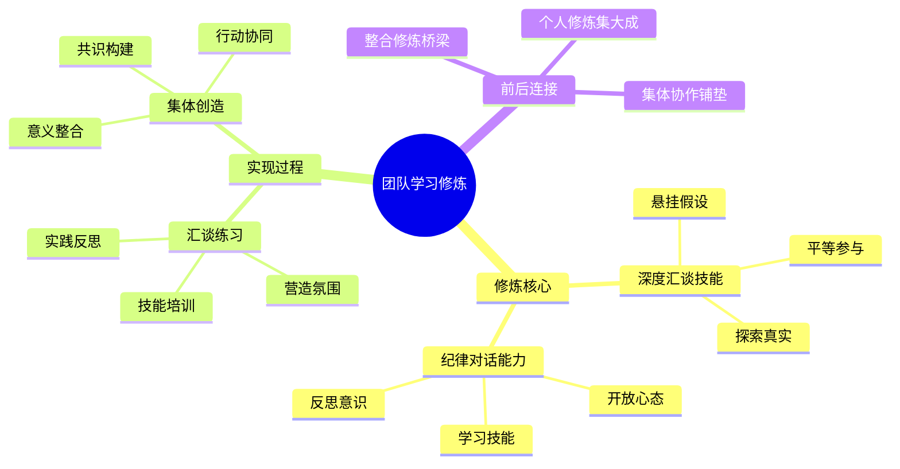

---

category: 
  - 书籍拆解
  - "[[第五项修炼-圣吉-v3]]"
status: draft
chapter: 
number: 9
title: 团队学习
links:
  - "[[第五项修炼-圣吉-v3]]"
  - "[[第8章-共同愿景]]"
  - "[[第1章-哈吉斯]]"
created: 2026-02-27
tags:
  - 第五项修炼
  - 团队学习
  - 学习型组织
  - 深度汇谈
---

# 第9章 团队学习

## 📍 章节定位

### 全书位置
> 第九章深入探讨五项修炼的第四项——团队学习，阐述如何通过集体智识的开发实现协同效应，是组织学习能力的核心体现，为第五项修炼的整合提供实践途径。

- **全书核心问题**: 如何实现团队协作中的整体学习效果大于个体之和？
- **本章回答的问题**: 什么是团队学习？如何实现高质量的集体对话与协作？
- **角色类型**: 修炼指引型 - 介绍协作层面的修炼
- **论证位置**: 个人修炼向集体修炼的集大成，为第五项修炼铺垫

### 章节序列
| 方向 | 章节标题 | 逻辑连接 |
|------|----------|----------|
| 前章 | [[第8章-共同愿景]] | 在共同愿景下开展深度团队协作 |
| 后章 | [[第1章-哈吉斯]] | 为第五项修炼整合奠定实践基础 |

### 一句话定位
> 第9章阐述团队学习修炼的核心要素，揭示如何通过深度汇谈和商讨技巧，激发集体智慧，实现1+1>2的团队学习效应。

---

## 🎯 核心观点

### 第一层：表层案例

| 案例名称 | 简要描述 | 页码 | 关键引文 |
|----------|----------|------|----------|
| 某制造企业工程团队的项目复盘 | 通过深度汇谈发现质量问题的根本原因而非个人责任 | p.310-315 | "团队通过暂停指责，开始探讨问题背后的真实原因，发现了工艺流程中的根本缺陷。" |
| 洛克菲勒大学的研究生研究小组 | 通过深度汇谈激发了重大生物学发现 | p.316-322 | "研究人员通过悬挂假设，让每个人的想法得到充分交流，从而发现了细胞膜运输的重大突破。" |
| 福特汽车的开发团队 | 通过团队学习机制实现了成本与品质的双重提升 | p.324-330 | "团队开始进行有纪律的对话练习，学习如何在分歧中寻找共同点，并将争论转化为创造性的探索。" |
| 某软件公司的敏捷开发团队 | 运用团队学习原则改进开发流程 | p.332-338 | "团队采用了回顾反思机制，将每次迭代看作学习机会，不断优化协作方式。" |
| NASA航天项目团队的协作实践 | 为复杂项目建立了高水准的团队学习文化 | p.340-346 | "项目团队建立了一套机制，确保错误和失败被当作学习机会，而非惩罚的依据。" |

### 第二层：中层机制

| 机制名称 | 组成要素 | 因果链条 | 证据来源 |
|----------|----------|----------|----------|
| 深度汇谈机制 | 悬挂假设、平等对话、共同探寻 | 个体观点差异 → 深度交流 → 共同理解 → 创造性解决方案 | 研究小组案例 |
| 团队反思循环机制 | 集体反思、反馈改进、实践更新 | 团队行动 → 集体反思 → 模式识别 → 行动改进 | 软件公司案例 |
| 纪律对话维护机制 | 开放态度、技能训练、文化培育 | 缺乏对话技能 → 训练应用 → 建立规范 → 形成文化 | 福特汽车案例 |
| 学习型团队演化机制 | 个体学习、集体互动、知识创造 | 个人理解 → 集体讨论 → 融合重构 → 共有知识 | 制造企业复兴案例 |

### 第三层：底层规律

| 规律陈述 | 抽象层级 | 知识连接 | 适用范围 |
|----------|----------|----------|----------|
| 集体智识涌现定理 | 系统论：整体大于部分之和 | 复杂系统理论、集体智慧理论 | 团队建设、组织管理 |
| 对话质量决定论 | 组织学习理论：对话是知识转换的载体 | 组织对话理论、知识管理理论 | 组织沟通、领导力 |
| 信任促进学习原理 | 学习科学：安全感促学习开放性 | 学习理论、社交心理学 | 教育培训、心理咨询 |
| 假设悬挂效益法则 | 认知科学：悬置预判提高接纳度 | 认知科学研究、[[哲学]] | 决策分析、团队协商 |

---

## 💬 降维翻译

### 观点1: 团队学习的核心理念

#### 原文表达
> "团队学习是发展团队成员整体搭配与实现共同目标能力的过程。当一个组织能够进行良好的团队学习时，组织中的每个人都可以学习得更快，因为人们可以从彼此身上学到很多东西。"
> —— p.310

#### 降维翻译（中学生能懂）
团队学习就是让团队里的每个人都学会更好地配合，一起达成目标的过程。当一个团队学习搞得很好的时候，每个人学得都比自己单干更快，因为大家可以互相学习、互相帮助。

#### 日常类比（奶奶能懂）
就像一家人一起干活，大家一起琢磨问题，有人有想法大家一起讨论，互相启发，这样的话每个人都能学到好多别的方法和经验，比自己一个人琢磨事要快得多、好得多。

#### 检验
- Q: 如果一个中学生问你什么是团队学习？
- A: 就是大家在一起互相学习、互相帮助的过程，让每个人都学会更好的配合，一起把事情做得更好。

### 观点2: 深度汇谈与一般讨论的区别

#### 原文表达
> "深度汇谈的目的在于揭示我们思维的不一致性，使每个人自由地探究较复杂的话题。相比之下，一般讨论的目的是为了赢得辩论或者快速达成解决方案。"
> —— p.315

#### 降维翻译（中学生能懂）
深度汇谈是想让我们了解到每个人的思考可能不太一样，并让大家可以自由地探讨比较复杂的问题。而一般的讨论常常是为了争出谁对谁错，或者只想快点得到解决办法。

#### 日常类比（奶奶能懂）
就像一家人聊天，有些人是聚在一起商量事儿，每个人都可以讲出心里的想法，就算暂时没结论也不要紧；有些是争论谁对谁错，最后往往是嗓门大的赢，但问题其实没解决。

#### 检验
- Q: 如果一个中学生问你深度汇谈和普通讨论有什么不同？
- A: 深度汇谈是为了更好地理解彼此的想法，大家一起找到解决方法；普通讨论是为了争赢或者赶紧有个结果。

### 观点3: 学习型团队的特点和要求

#### 原文表达
> "学习型团队要求成员具备反思型对话的技能，能够以开放的心态面对自己的假设，愿意承认自己可能犯错，并且有能力与他人进行有纪律的探讨。"
> —— p.320

#### 降维翻译（中学生能懂）
一个能学习型的团队，需要大家一起练习反思性的对话技能，要能敞开胸怀看待自己的想法，承认自己也可能搞错，还要能跟别人有纪律地讨论，不争吵。

#### 日常类比（奶奶能懂）
就像一个好学生小组，每个人都要愿意说出自己的疑惑和想法，承认自己也有不懂的地方，大家讨论问题时要有礼貌，不能吵吵闹闹，要互相尊重，一起想办法。

#### 检验
- Q: 如果一个中学生问团队学习需要具备什么能力？
- A: 需要大家一起反思问题的习惯，要能看开自己也可能有错，要懂得尊重别人，不为争论而争论。

---

## ✨ 金句库

### 原书金句
| 金句 | 页码 | 适用场景 |
|------|------|----------|
| "团队学习是发展团队成员整体搭配与实现共同目标能力的过程。" | p.310 | 定义团队学习 |
| "深度汇谈的目的在于揭示我们思维的不一致性。" | p.315 | 诠释深度汇谈 |
| "团队学习可以使组织中每个人学得更快。" | p.310 | 说明价值意义 |
| "深度汇谈创造了一个独特的意义池。" | p.318 | 强调创造价值 |
| "高质量讨论是团队学习的重要技能。" | p.322 | 技能重要性 |
| "真正的团队学习需要纪律性对话。" | p.325 | 强调实践要求 |

### 降维金句
| 金句 | 来源观点 | 适用场景 |
|------|----------|----------|
| "集体智慧胜于个人独断。" | 智慧价值 | 团队协作 |
| "团队学习，众人拾柴火焰高。" | 协作增值 | 团建文化 |
| "深度汇谈比雄辩更有价值。" | 对话原则 | 沟通技巧 |
| "思维碰撞催生创意火花。" | 创意生成 | 创新实践 |
| "开放心态开启学习通道。" | 开放态度 | 心理准备 |
| "质疑假设，而非攻击人身。" | 讨论纪律 | 交流准则 |
| "平等对话才有真知灼见。" | 平权沟通 | 权力结构 |
| "坦承错误是成长的捷径。" | 反思精神 | 个人成长 |
| "团队智慧需要对话技巧支撑。" | 技能要求 | 技能建设 |
| "汇谈质量决定团队高度。" | 质量导向 | 绩效提升 |
| "放下成见，收获新见。" | 心理突破 | 态度转变 |
| "深度探讨出真知。" | 探讨价值 | 学习文化 |
| "反思是团队精进的秘密武器。" | 反思作用 | 团队发展 |
| "悬挂假设，拥抱可能。" | 假设观念 | 认知革新 |
| "对话有纪律，创意无边界。" | 纪律创意 | 管理风格 |

## 🔗 当下映射

### 💰 财富应用（组织能力）
| 场景 | 具体行动 | 预期效果 | 风险提示 |
|------|----------|----------|----------|
| 项目团队学习 | 建立定期复盘机制，实践深度汇谈 | 提升团队绩效和创新能力 | 初期可能降低决策速度 |
| 管理团队协作 | 运用团队学习技能提升决策质量 | 降低沟通成本，提升凝聚力 | 对团队成员素质要求较高 |
| 产品迭代规划 | 团队集体讨论产品需求优先级 | 避免个人判断局限，提升产品适配度 | 需要良好的团队文化基础 |

### 💼 职场应用
| 场景 | 具体行动 | 所需能力 | 适用职级 |
|------|----------|----------|----------|
| 跨部门问题解决 | 组织多角色参与的深度讨论 | 沟通引导、对话技能 | Group Lead及以上 |
| 团队能力提升 | 开展反思型对话培训 | 学习能力、辅导技能 | Team Leader及以上 |
| 决策制定优化 | 引入多样观点和团队协商 | 判断力、包容性 | Manager级以上 |
| 项目复盘改进 | 运用系统方法进行集体反思 | 总结能力、系统思维 | Project Manager |

### 🏠 生活应用
| 场景 | 具体行动 | 可行性 | 见效时间 |
|------|----------|--------|----------|
| 家庭问题协商 | 改变简单讨论为深度交流 | 高 | 1-2个月 |
| 社区议事参与 | 在社区事务中实践对话技能 | 中 | 2-4个月 |
| 深度友谊建构 | 与好友开展更深入的主题讨论 | 中 | 3-6个月 |

### 72小时行动计划
1. **明天可以做的第一件事**: 在团队讨论中，尝试先了解他人的观点，而非急于提出自己的解决方案
2. **本周内可以尝试的事**: 在下次团队会议结束时，组织一个简短的反思环节，回顾此次沟通的质量
3. **需要准备资源才能做的事**: 学习团队学习的技能工具，如行动学习法或深度汇谈技术

---

## 🕸️ 章节关联

### 向上关联 → 整书
- **贡献**: 本章完善五项修炼的前三项，将个人修炼整合为团队实践，为第五项修炼的整合奠定协作基础
- **位置**: 个体向群体过渡的关键节点，个人发展与组织成长的桥梁

### 横向关联 → 章节间
| 章节编号 | 章节标题 | 关联类型 | 连接描述 |
|----------|----------|----------|----------|
| 第1-8章 | 个人修炼与愿景构建 | 顺承发展 | 为团队协作提供有准备的个体 |
| 第10章 | [[第五项修炼-圣吉]] | 综合铺垫 | 团队学习是第五项修炼实现的实践途径 |
| 第11-14章 | [[第13章-走向学习型组织]] | 实践支撑 | 本章是建成学习型组织的关键手段 |

### 向下关联 → 具体应用
| 应用场景 | 难度 | 前置知识 |
|----------|------|----------|
| 深度汇谈实践 | 中 | 掌握有效沟通基础 |
| 团队学习设计 | 中 | 拥有团队建设经验 |
| 对话技能培训 | 高 | 了解学习原理机制 |
| 组织学习文化 | 高 | 具备文化变革能力 |

### 跨书关联 → 知识网络
| 书籍 | 概念 | 关系 | 备注 |
|------|------|------|------|
| [[第五项修炼-圣吉]] | 深度汇谈技术 | 核心内容 | 两书在此部分内容相互印证 |
| 团队协作的五大障碍 | 团队信任 | 延伸实践 | 弥补信任建设的具体方法 |
| U型理论 | 集体感知 | 方法补充 | 为深入团队汇谈提供方法论 |
| 关键对话 | 高质量对话 | 技能支撑 | 提供团队沟通工具集 |

### 关联可视化

---

## ❓ 问答设计

### Q1: 团队学习的核心理念是什么？（理解型）
**认知层次**: 理解
**难度**: 中
**答案要点**:
- 发展整体配合能力和共同目标实现能力
- 提升成员间学习效率
- 实现个体智慧向集体智慧的转化

### Q2: 深度汇谈与日常讨论的根本区别是什么？（比较型）
**认知层次**: 比较
**难度**: 高
**答案要点**:
- 目的不同：汇谈为理解，讨论为解决
- 态度不同：汇谈开放探究，讨论倾向防卫
- 结果导向：汇谈产生创造性洞察，讨论争取胜利

### Q3: 如何在实践中开展团队学习？（应用型）
**认知层次**: 应用
**难度**: 高
**答案要点**:
- 建立心理安全的对话环境
- 学习汇谈和探讨的基本技巧
- 设立定期反思机制
- 重视集体知识创造过程

### Q4: 团队学习的价值体现在哪里？（分析型）
**认知层次**: 分析
**难度**: 高
**答案要点**:
- 充分整合个体知识和经验
- 在分歧中生成创新方案
- 培养协作能力和团队精神
- 实现学习效益的最大化

### Q5: 团队学习有哪些常见阻碍？（理解型）
**认知层次**: 理解
**难度**: 中
**答案要点**:
- 个体防卫心理和隐藏假设
- 团队成员权力结构不平衡
- 缺乏有效的对话技能
- 急于得出结论的倾向

### Q6: 深度汇谈对个体有什么要求？（理解型）
**认知层次**: 理解
**难度**: 中
**答案要点**:
- 愿意敞开心扉分享真实想法
- 能够暂停判断，悬挂个人假设
- 具备倾听和反思的意愿
- 有心理安全感支撑

### Q7: 如何克服团队学习中的文化障碍？（应用型）
**认知层次**: 应用
**难度**: 高
**答案要点**:
- 领导者示范开放行为
- 建立试错和学习的安全机制
- 提供对话技能培训
- 设立团队学习激励体系

### Q8: 哪些因素会影响团队学习效果？（分析型）
**认知层次**: 分析
**难度**: 高
**答案要点**:
- 团队构成及其技能分布
- 信任和开放的文化程度
- 团队学习的制度支持
- 对话质量与引导技能

### Q9: 学习型团队与普通团队的核心差异在于？（比较型）
**认知层次**: 比较
**难度**: 高
**答案要点**:
- 普通团队重任务完成，学习团队重能力发展
- 普通团队回避冲突，学习团队开放分歧
- 成员成长导向不同

### Q10: 团队学习如何应用于复杂问题解决？（应用型）
**认知层次**: 应用
**难度**: 高
**答案要点**:
- 整合多方专业视角
- 激发创新思维碰撞
- 辨识问题深层次原因
- 形成集体行动共识

### Q11: 团队学习与个体学习的关系是什么？（理解型）
**认知层次**: 理解
**难度**: 中
**答案要点**:
- 个体学习是团队学习的基础
- 团队学习促进个体学习深化
- 两者相互支撑和促进
- 团队学习能产生个体无法实现的效果

### Q12: 建设学习型团队的首要条件是什么？（理解型）
**认知层次**: 理解
**难度**: 中
**答案要点**:
- 团队成员具备开放心态
- 建立心理安全的学习环境
- 掌握基本的团队学习技能
- 共同的价值观和目标

### Q13: 团队学习技能主要包括哪些？（理解型）
**认知层次**: 理解
**难度**: 中
**答案要点**:
- 深度汇谈的基本技能
- 有纪律的探讨方式
- 个人反思的能力
- 共享心智模式的构建

### Q14: 如何评价团队学习的质量？（应用型）
**认知层次**: 应用
**难度**: 高
**答案要点**:
- 观察团队对复杂问题的处理方式
- 衡量团队决策质量的提升
- 检视团队成员的参与度和信任水平
- 追踪团队集体能力的成长

### Q15: 虚拟团队如何实现有效团队学习？（应用型）
**认知层次**: 应用
**难度**: 高
**答案要点**:
- 设计适合在线环境的互动机制
- 加强虚拟沟通技能的培训
- 建立清晰的规则和流程
- 利用技术工具支持知识共享

---
