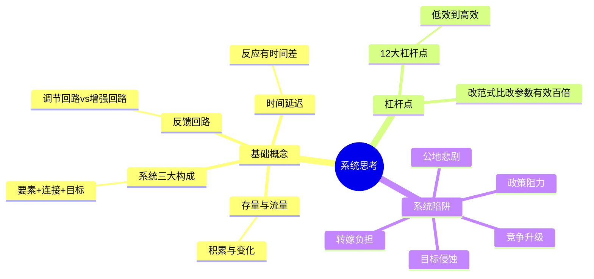

# 《系统之美》拆解记录

## 这本书要解决什么问题？

**核心困境**：世界是由系统构成的，但大多数人看不到系统。遇到问题就"头痛医头，脚痛医脚"，按下葫芦浮起瓢。你越努力越迷茫，因为你改的是参数，不是结构。

**一句话定位**：
> 不是问"如何解决复杂问题？"，而是问"如何看清复杂系统的运作规律？"——看清系统，才能和系统共舞。

### 作者站在什么位置说这些话？

| 维度 | 定位 |
|------|------|
| 主领域 | 系统思考、系统动力学 |
| 跨界领域 | 复杂性科学、可持续发展 |
| 作者背景 | 麻省理工系统学博士，师从系统动力学创始人杰伊·福瑞斯特，《增长的极限》主创者，彼得·圣吉的老师 |
| 历史语境 | 2008年出版（遗作，生前为手稿流传），系统思考入门经典 |

### 和其他书有什么关系？

| 关联书籍 | 关联关系 | 共同底层逻辑 |
|----------|----------|--------------|
| [[第五项修炼-圣吉-拆解记录]] | 师承关系 | 圣吉提出系统思考的重要性，梅多斯提供完整方法论 |
| [[思考快与慢-拆解记录]] | 理论基础 | 系统1看不到反馈回路，系统思考需要系统2上线 |
| [[原则-拆解记录]] | 实践延伸 | 系统思考是建立原则系统的基础能力 |
| [[影响力-西奥迪尼-拆解记录]] | 反向防御 | 理解系统机制，才能识别和抵御影响力技巧 |
| [[模型思维-佩奇-拆解记录]] | 工具互补 | 模型是工具，系统思考是使用工具的方法 |

### 知识网络图

---

## 作者的核心论点

### 系统三大构成——不是一堆东西凑在一起就是系统

一支足球队，11个球员各踢各的，那叫一群人。加上传球配合、战术纪律，为了赢球这个目标连接在一起，才叫系统。

梅多斯说，任何系统都有三个构成要素：**要素**（组成部分）、**连接**（要素之间的关系）、**功能或目标**（系统存在的目的）。

| 系统 | 要素 | 连接 | 目标 |
|------|------|------|------|
| 足球队 | 球员、教练、球场 | 传球、配合、战术 | 赢球 |
| 人体 | 器官、细胞、神经 | 血液、神经信号 | 生存、繁衍 |
| 公司 | 员工、部门、资源 | 信息流、物流、决策流 | 利润、使命 |

这里有一个反直觉的发现：改变要素对系统的影响最小。换掉足球队的全部球员，只要战术和目标不变，球队的风格依然如故。但改变连接或目标，系统会发生根本变化。而**最重要的是改变目标**——同样的球员，不同的目标（赢球 vs 娱乐），行为完全不同。

> **系统构成定律**：系统的行为由其目标决定，而不是由其要素决定。改变目标比改变要素有效百倍。

这打碎了我对"换人就能解决问题"的迷信。公司业绩不好就换CEO，团队效率低就换人，其实换人只是改要素。如果不改连接方式和组织目标，换谁来了都一样。

理解了系统由什么构成，下一步要看系统怎么运转。这涉及两个基本概念：存量和流量。

### 存量与流量——浴缸里的系统哲学

浴缸里的水就是理解系统最好的模型。缸里的水位是**存量**——任何时刻可以测量的积累量。水龙头进水是**流入**，排水口出水是**流出**。存量可以缓冲和延迟变化，流量可以突然改变。

| 系统 | 存量 | 流入 | 流出 |
|------|------|------|------|
| 银行账户 | 余额 | 存入 | 取出、消费 |
| 知识 | 知识储备 | 学习 | 忘却、过时 |
| 自信 | 自信水平 | 成功经历 | 失败、批评 |
| 仓库库存 | 库存量 | 进库 | 出库 |

大多数人只关注存量（账户余额），忽视流量（存入/取出比例）。但改变存量有两条路：增加流入，或减少流出。想存钱，要么多赚，要么少花——两条路同样有效。

以前我只想着增加流入（多赚钱、多学习），现在意识到减少流出（少浪费、少忘却）同样重要，有时候甚至更有效。

> **存量流量定律**：想改变存量？别只想着增加流入，减少流出同样有效。

存量流量描述的是系统的静态面。但系统之所以复杂，是因为要素之间会互相影响——这就是反馈回路。

### 反馈回路——系统的心跳

你有没有过这样的体验？越努力成绩越好，越自信就越想努力——这是正向循环。或者业绩差→压力大→表现更差→压力更大——这是恶性循环。两种循环都是反馈回路在起作用。

梅多斯把反馈回路分成两类。**调节回路**像恒温器，目标是保持稳定。空调温度高了就制冷，饿了就吃，饱了就停——这些都是调节回路在维持平衡。**增强回路**像复利，目标是增长或崩溃。钱越多利息越多钱越多，好评越多买的人越多好评越多——自我强化，越滚越大。增强回路不区分方向：正向的让你飞起来，负向的让你螺旋坠落。

大多数人只看到线性因果（A导致B），看不到反馈回路（A导致B，B又反过来影响A）。这就是为什么你越努力越迷茫——你可能踩进了一条负向增强回路，努力的方向在强化问题本身。

> **反馈回路定律**：看清反馈回路，才能跳出恶性循环，设计良性循环。

有了反馈回路的概念，还需要理解一个让系统变得格外棘手的现象——时间延迟。这正是下一个关键发现。

### 时间延迟——今天做的决定，可能明年才看到结果

健身一周没效果就放弃。环保政策执行了看不到改善就怀疑没用。今天开始学英语，一个月后还是张不开嘴。不是方法不对，是你忽视了系统的时间延迟。

| 系统 | 延迟 | 后果 |
|------|------|------|
| 健身 | 今天练，几个月后身体才变 | 一周没效果就放弃 |
| 投资 | 今天买，长期才知道涨跌 | 急功近利 |
| 环保 | 今天排放，几十年后才见后果 | 等看到后果已来不及 |
| 管理 | 今天裁员，几个月后效率才降 | 短期数据好看，长期更差 |

延迟是系统复杂性的关键来源。忽视延迟会导致两种错误：要么过早放弃（健身一周没效果就放弃），要么过度反应（股市跌了就恐慌抛售）。正确的做法是理解系统有时间常数——身体的变化以月计，环境的变化以十年计，投资的变化以年计。

下次遇到"努力了没效果"的情况，我不会再轻易放弃，而是问自己：这个系统的延迟周期是多少？也许不是方法不对，只是时间还没到。

> **延迟定律**：系统的延迟常被忽视，但这恰恰是"拔苗助长"的根源。

理解了系统的基本构件——构成、存量流量、反馈回路、时间延迟——接下来是这本书最有价值的部分：在哪里干预系统最有效。

### 12大杠杆点——同样的努力，用对地方放大10倍效果

梅多斯总结了一个震撼的发现：系统有12个干预点，从低效到高效排列。大部分人只关注最低的12级（调参数——改税率、改补贴、改KPI数值），但最有效的是最高的1级（超越范式——跳出系统重新思考）。

| 级别 | 杠杆点 | 例子 |
|------|--------|------|
| 12 | 数字和参数 | 税收标准、补贴税率 |
| 11 | 缓冲器 | 仓库库存、现金储备 |
| 10 | 存量-流量结构 | 物流网络、供应链结构 |
| 9 | 时间延迟 | 信息传递速度、反应时间 |
| 8 | 调节回路 | 质量控制、错误修正机制 |
| 7 | 增强回路 | 增长率、口碑传播 |
| 6 | 信息流 | 谁能看到什么数据 |
| 5 | 规则 | 激励机制、惩罚机制、约束 |
| 4 | 自组织 | 创新、进化、适应性 |
| 3 | 目标 | 系统的根本目的 |
| 2 | 范式 | 系统背后的根本信念 |
| 1 | 超越范式 | 跳出系统，重新思考 |

环保问题上，调税率（12级）不如改变发展范式（1级）。公司改革上，改KPI数值（12级）不如改公司使命（3级）。同样的努力，打在不同的杠杆点上，效果天差地别。

> **杠杆点定律**：杠杆点越高越难改变，但威力越大——改范式比改参数有效百倍。

这个观点打碎了我的一个假设。我以前觉得改变世界要从具体行动开始——调参数、改规则。但梅多斯告诉我，最有效的干预往往是最抽象的：改变系统背后的信念和目标。

---

## 这本书的局限

| 批评点 | 谁在批评 | 怎么说 | 实际情况 |
|--------|---------|--------|---------|
| 理论偏强 | 普通读者 | 大量抽象概念，缺少可操作步骤 | 概念可以落地，但需要读者自己找到应用场景 |
| 杠杆点难以实践 | 管理者 | 高级杠杆点（改范式）说起来容易做起来难 | 梅多斯也承认这一点，但意识到杠杆点的存在本身就是进步 |
| 西方中心视角 | 跨文化研究者 | 案例多来自西方工业化社会 | 系统规律普适，但具体案例需要本土化 |
| 遗作未完成 | 学术界 | 梅多斯去世后由他人整理出版，部分章节不够完整 | 核心思想完整，但细节可能有未经作者最终确认的地方 |

**一句话总结局限性**：
> 系统思考是一个强大的认知框架，但"看清系统"和"改变系统"之间还有巨大的鸿沟。这本书帮你睁开眼睛，但走路还得靠自己。

---

## 最值得记住的话

**原书说的**：
1. "系统总体大于部分之和。"
2. "系统中最不明显的部分（功能或目标），常常是系统行为最关键的决定因素。"
3. "调节回路寻求稳定，增强回路追求增长。"
4. "杠杆点越高越难，但威力越大。"
5. "不要推系统，要和系统共舞。"

**翻译成人话**：
1. 一堆东西凑在一起不是系统，要看它们怎么连、为了什么连
2. 改变系统，改目标比改要素有效百倍
3. 调节回路像恒温器，增强回路像复利
4. 你今天的努力，可能明年才看到结果——系统的延迟常被忽视
5. 杠杆点越高越难，但效果越好——改范式比改参数有效百倍
6. 别怪个人做坏事，是系统结构在产生坏行为
7. 竞争升级是自杀——要么单方面停火，要么改目标为共赢
8. 救急不救穷——帮系统恢复能力，别替它解决问题
9. 政策推不动，说明你推的方向错了——找目标，别推行为
10. 没边界的增长就是自杀——可持续的系统知道何时停止

---

## 讲给没读过的人听

你有没有过这种经历？拼了命解决一个问题，结果旧问题没好，新问题又冒出来了。按下葫芦浮起瓢。

梅多斯说，这是因为你没看到系统。世界是由系统构成的，系统有三个东西：要素（组成部分）、连接（它们怎么联系）、目标（它们为了什么）。大部分人只盯着要素，但真正决定系统行为的是连接和目标。

系统里还有几个隐藏机制。反馈回路：越努力成绩越好→越自信→越努力，这是正向循环；业绩差→压力大→表现更差→压力更大，这是恶性循环。时间延迟：今天健身，几个月后身体才变，一周没效果就放弃是因为你忽视了延迟。杠杆点：同样的努力，打在不同的地方效果天差地别。大部分人只会在最低层调参数（改KPI、改税率），但最有效的是改目标甚至改范式。

记住一句话就够了：别怪个人做坏事，是系统结构在产生坏行为。改变结构，行为自然改变。

---

## 用来检验理解的问题

**基础回忆**：
1. Q: 系统的三大构成是什么？
   A: 要素（组成部分）、连接（要素之间的关系）、功能或目标（系统存在的目的）。

2. Q: 调节回路和增强回路的区别？
   A: 调节回路像恒温器，目标是保持稳定；增强回路像复利，目标是增长或崩溃（自我强化）。

3. Q: 12大杠杆点中，最低效和最高效的分别是什么？
   A: 最低效是第12级（数字和参数，如税率），最高效是第1级（超越范式，跳出系统重新思考）。

**理解验证**：
1. Q: 为什么"改变要素"对系统影响最小？
   A: 因为系统的行为由连接和目标决定。同样的要素、不同的连接方式和目标，系统行为完全不同。

2. Q: 为什么时间延迟会导致"拔苗助长"？
   A: 因为系统反应有时间差。你做了改变，没看到效果就过度加码，反而破坏了系统的自然节奏。

**实际应用**：
1. Q: 你在工作中遇到过哪些"政策阻力"？用系统思维怎么解决？
   A: 政策推不动，说明你在推行为而不是改目标。不要推系统，要找到系统的目标，让它自己想达到目标。

2. Q: 用杠杆点框架分析"如何改善团队协作"。
   A: 不要只调参数（改KPI数值），尝试改规则（激励机制）、改信息流（透明度）、甚至改目标（团队使命）。

**深度分析**：
1. Q: "系统结构决定系统行为"这个规律，对管理者意味着什么？
   A: 别怪个人做坏事，是系统在产生坏行为。与其惩罚个人，不如改变系统结构——激励机制、信息流、组织目标。

2. Q: 梅多斯和圣吉的师承关系，如何体现在两人的著作中？
   A: 圣吉的《第五项修炼》提出"系统思考很重要"，梅多斯的《系统之美》告诉你"怎么系统思考"。一个喊口号，一个给工具。

---

## 和其他书的对话

圣吉和梅多斯是师生关系。《第五项修炼》告诉你"要系统思考"——这是学习型组织的第五项修炼；《系统之美》告诉你"如何系统思考"——这是完整的系统思考方法论。圣吉喊口号，梅多斯给工具。读完圣吉知道为什么重要，读完梅多斯知道怎么做。

卡尼曼和梅多斯在对抗同一个敌人——人类认知的天然缺陷。卡尼曼说系统1（快思考）容易"只见树木不见森林"，看不到反馈回路；系统思考需要系统2（慢思考）上线，才能识别反馈回路、理解延迟、找到杠杆点。卡尼曼诊断了人类认知的毛病，梅多斯提供了一种系统级的疗法。

达利欧和梅多斯的关系也很有意思。《原则》教你建立自己的决策系统，《系统之美》教你理解任何系统（包括你的决策系统）如何运作。没有系统思考的基础，原则只是散乱的条条。理解了系统，才能建立真正有效的原则体系。

西奥迪尼的《影响力》揭示了人类行为被操控的6大心理机制。这些机制之所以有效，正是因为它们利用了系统1的自动反应——人类大脑里的"调节回路"被外部触发了。系统思考帮你识别这些机制，启动系统2来防御。影响力技巧利用系统1的缺陷，系统思考帮你启动系统2防御。

---

## 五个系统陷阱

理解了系统的基本构件，梅多斯还指出了系统中最常见的陷阱。这些陷阱解释了为什么"好心办坏事"如此普遍。

### 政策阻力——你越推，系统越抵抗

政府限房价，开发商捂盘惜售，供应更少，房价反而涨了。公司禁止加班，员工在家加班，反而更累。工厂宁愿交罚款继续排污，也不升级设备。为什么政策推出后效果不如预期？因为系统有自我调节机制，外来干预会被系统吸收、抵消。

> **政策阻力定律**：推不动，说明你推的方向错了——找系统的目标，而不是推它的行为。

### 公地悲剧——个体理性，集体疯癫

每个牧民多放一只羊，自己的收益增加了。但所有牧民都这样做，草场退化，所有人受害。公海捕捞、环境污染、办公室空调温度——都是同一个结构：个体利益与集体利益的冲突。

> **公地悲剧定律**：个体理性导致集体非理性——改变连接，而不是指责个体。

### 目标侵蚀——温水煮青蛙

业绩不好→下调目标→更少努力→业绩更差。分数下降→降低标准→更少学习→分数更差。偶尔偷懒→接受平庸→越来越懒。系统绩效缓慢下降，但目标也在跟着降，最终系统崩溃。温水煮青蛙，温度降得慢，目标也降得慢。

> **目标侵蚀定律**：保持标准，不要接受平庸——对比历史最佳和外部标杆，不让目标随绩效下滑。

### 竞争升级——双输的军备竞赛

对手降价→我降价→对手再降→利润都没了。对手增兵→我增兵→都破产。邻家孩子补课→我家补更多→都崩溃。典型的增强回路：对方强化→我强化→对方更强化→全输。

> **竞争升级定律**：竞争升级是自杀——要么单方面停火，要么改目标为共赢。

### 转嫁负担——帮了倒忙

止痛药止痛，但身体失去自身止痛能力。政府救助坏企业，好企业反而得不到资源。家长替孩子解决所有问题，孩子失去解决问题能力。用AI解决所有问题，人失去思考能力。外部干预让系统内部的调节机制退化——短期解决问题，长期制造更大的问题。

> **转嫁负担定律**：救急不救穷——帮系统恢复能力，而不是替它解决问题。

---

*拆解日期：2026-02-14*
*下次回访：1周后回顾「讲给没读过的人听」和「检验问题」*
