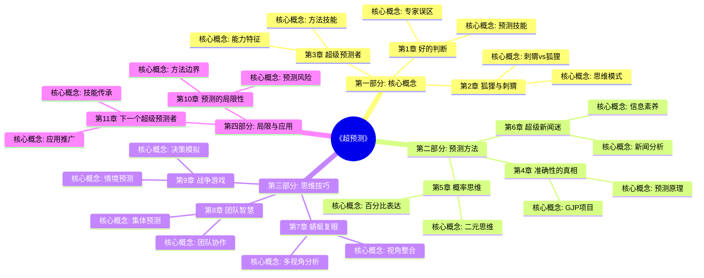
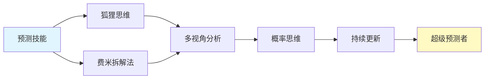

# 《超预测》- 章节导航

> 作者: 菲利普·泰洛克（Philip E. Tetlock）、丹·加德纳（Dan Gardner）
> 总章节: 11章
> 拆解状态: ✅ 已完成
> 最后更新: 2026-02-27

---

## 📚 章节结构（Mermaid Mindmap）

---

## 🔗 核心概念关联图

---

## 📊 拆解进度追踪

| 章节 | 标题 | 状态 | 完成日期 | 核心收获 |
|------|------|------|----------|----------|
| 第1章 | [[第1章-好的判断]] | ✅ | 2026-02-27 | 推翻预测天赋论，建立准确性可习得的认知 |
| 第2章 | [[第2章-狐狸与刺猬]] | ✅ | 2026-02-27 | 狐狸型思维的多元视角胜过刺猬型的固化坚持 |
| 第3章 | [[第3章-超级预测者]] | ✅ | 2026-02-27 | 超级预测者的具体特征和能力构成分析 |
| 第4章 | [[第4章-准确性的真相]] | ✅ | 2026-02-27 | Brier评分等量化方法揭秘预测准确性标准 |
| 第5章 | [[第5章-概率思维]] | ✅ | 2026-02-27 | 从二元思维到概率思维的认知升级 |
| 第6章 | [[第6章-超级新闻迷]] | ✅ | 2026-02-27 | 主动信息搜集+交叉验证的素养培养 |
| 第7章 | [[第7章-蜻蜓复眼]] | ✅ | 2026-02-27 | 内外视角切换和多框架分析技巧 |
| 第8章 | [[第8章-团队智慧]] | ✅ | 2026-02-27 | 4-5人精英团队的协作预测增值 |
| 第9章 | [[第9章-战争游戏]] | ✅ | 2026-02-27 | 情境模拟和路径推演的实战演练 |
| 第10章 | [[第10章-预测的局限性]] | ✅ | 2026-02-27 | 技能边界认知与确定性幻觉防范 |
| 第11章 | [[第11章-下一个超级预测者]] | ✅ | 2026-02-27 | 预测技能的推广传承与普及意义 |

**状态说明:**
- ✅ 已完成
- 🔄 进行中
- ⏳ 待开始
- ⏸️ 暂停

---

## 🚀 快速跳转

### 按章节跳转
- [[第1章-好的判断]]
- [[第2章-狐狸与刺猬]]
- [[第3章-超级预测者]]
- [[第4章-准确性的真相]]
- [[第5章-概率思维]]
- [[第6章-超级新闻迷]]
- [[第7章-蜻蜓复眼]]
- [[第8章-团队智慧]]
- [[第9章-战争游戏]]
- [[第10章-预测的局限性]]
- [[第11章-下一个超级预测者]]

### 按主题跳转
- [[预测技能]]
- [[狐狸思维]]
- [[费米拆解法]]
- [[概率思维]]
- [[多视角分析]]

### 相关资源
- [[超预测-泰洛克-拆解记录]] - 主拆解笔记
- [[黑天鹅-塔勒布-拆解记录]] - 互补视角
- [[思考快与慢-拆解记录]] - 理论基础
