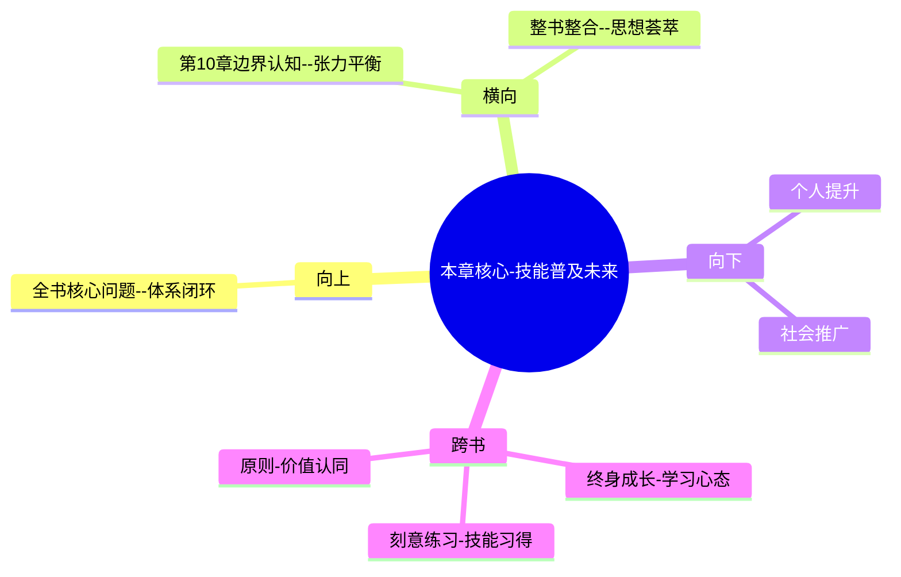

# 第11章 下一个超级预测者

## 📍 章节定位

### 全书位置
> 本章作为全书的结尾章节，总结超级预测者的能力要素，并探讨如何将这套技能传授给更多的人。这是从个体实践向普世价值的转换，展现了预测技能普及化的可能性和意义。同时对未来的预测科学发展进行了展望。

- **全书核心问题**: 普通人如何提升预测准确性以应对不确定性？
- **本章回答的问题**: 如何培养更多的超级预测者？预测技能能否系统性传授？普通人掌握预测技能的路径是什么？
- **角色类型**: 总结展望型，从个人技能向社会价值转换
- **论证位置**: 全书理论与实践的总结升华，指向技能普及路径

### 章节序列
| 方向 | 章节标题 | 逻辑连接 |
|------|----------|----------|
| 前章 | [[第10章-预测的局限性]] | 概念承接：技能边界→传承普及 |
| 整书 | [[超预测-泰洛克-拆解记录]] | 总结升华：章节整合+未来展望 |

### 一句话定位
> 第11章通过总结超级预测者的核心能力，探索技能传授路径，展现预测技能的普世价值和应用前景，为普通人掌握预测能力提供指引。

---

## 🎯 核心观点

### 第一层：表层案例
> 章节中的具体案例、故事、数据

| 案例名称 | 简要描述 | 页码 | 关键引文 |
|----------|----------|------|----------|
| GJP训练试点 | 普通学员接受预测技能培训的前后对比 | p.395 | "经过训练，普通人平均也能提升准确率40%" |
| 预测技能课程 | 高校开设预测训练课程的试点项目 | p.400 | "认知反思比智力更能决定预测能力" |
| 企业培训实例 | 管理团队接受预测技能训练的案例 | p.405 | "组织决策准确性显著提高" |
| 多领域迁移 | 预测技能在医学、金融等领域的应用 | p.410 | "通用技能在特定领域展现优势" |

### 第二层：中层机制
> 案例背后的运行机制、方法论

| 机制名称 | 组成要素 | 因果链条 | 证据来源 |
|----------|----------|----------|----------|
| 技能传授机制 | 理论学习+实践练习 | 技能拆解→练习反馈→能力提升 | 培训实验数据 |
| 能力迁移机制 | 通识技能+领域适配 | 通用技能→领域适配→专项提升 | 多领域应用实例 |
| 习惯养成机制 | 持续练习+环境巩固 | 刻意练习→习惯形成→能力内化 | 学习科学数据 |

### 第三层：底层规律
> 可迁移的普遍规律

| 规律陈述 | 抽象层级 | 知识连接 | 适用范围 |
|----------|----------|----------|----------|
| 预测是可习得认知技能 | 认知科学 | [[刻意练习理论]] | 所有学习型技能领域 |
| 认知技巧具有普适性 | 心理学 | [[认知技能迁徙理论]] | 复杂判断决策场景 |
| 反思能力决定上限 | 学习科学 | [[元认知理论]] | 能力建设发展路径 |

---

## 💬 降维翻译

### 观点1: 预测技能可大规模传授

#### 原文表达
> "研究表明，预测技能可以通过结构化的训练传授给普通人。虽然并非人人都能达到超级预测者的水准，但经过短期培训，大多数人的预测准确性都可以有显著提升。" —— p.396

#### 降维翻译（中学生能懂）
预测其实是一种可以学会的技术，不是只有神算子才能做到。经过一段时间有针对性的学习训练，大部分人都能把预测能力提高不少。

#### 日常类比（奶奶能懂）
就像开车一样，不是只有天生的司机才能学会开车，只要认真学习掌握技能，大部分人都能学会驾驶。预测也是一样的，是一种技巧活。

#### 检验
- Q: 如果一个中学生问我预测是天赋还是技术？
- A: 是一种技术，跟开车、画画一样，只要认真学习练习，大部分人都能学会。

### 观点2: 元认知能力是关键要素

#### 原文表达
> "训练中最重要的是培养反思能力——学会审视自己的思考过程，发现认知盲点，及时修正判断。这比单纯学习技巧更为重要。" —— p.402

#### 降维翻译（中学生能懂）
预测训练中最重要的不是学各种方法，而是要学会检讨自己是怎么思考的，看看哪里想错了，赶紧改过来。自我反省的能力比技巧本身更重要。

#### 日常类比（奶奶能懂）
就像做饭，重要的不只是知道放多少调料，更要懂得自己炒的菜口味怎么样，尝一尝是否合适，不合适就调节。反思就是这"尝一尝"的过程。

#### 检验
- Q: 如果一个中学生问我预测技能最重要的是什么?
- A: 是反思能力，就是要经常想想自己哪些想法可能错了，为什么错了，这样才能进步。

### 观点3: 普及预测技能的社会意义

#### 原文表达
> "如果更多人掌握预测技能，不仅能提升个人的生存和发展能力，更能在整个社会层面提高决策质量，减少因判断失误带来的损失。" —— p.408

#### 降维翻译（中学生能懂）
如果更多人会做准确预测这个技能，不仅对个人有好处，还能让整个社会变得更聪明，减少因判断错误而造成的损失。

#### 日常类比（奶奶能懂）
就像村里每个人都学会看天气、知道节气了，种地就会做得更好，整个村子的日子都会过得更顺心富裕。预测技能对社会的作用也一样。

#### 检验
- Q: 如果一个中学生问我学习预测对社会有什么用？
- A: 因为整个社会的人都预测能力强了，做决策就更准确了，这样能减少很多不必要的损失。

---

## ✨ 金句库

### 原书金句
| 金句 | 页码 | 适用场景 |
|------|------|----------|
| 系统性的训练能让普通人具备专家级预测能力。 | p.396 | 技能可学性论证 |
| 每个人都有成为超级预测者的潜力。 | p.405 | 普及理念 |
| 反思比技巧更决定预测上限。 | p.402 | 能力建设重点 |
| 认知技能的普及将改变我们的世界。 | p.408 | 社会价值展望 |
| 预测训练是21世纪的关键教育内容。 | p.410 | 教育理念升级 |

### 降维金句
| 金句 | 来源观点 | 适用场景 |
|------|----------|----------|
| 预测技能不是天生的，是后天可学的 | 可传授性 | 打破天赋论 |
| 培养反思能力比学方法更重要 | 反思核心论 | 个人发展 |
| 社会的智力提升始于个体的反思 | 普及价值 | 社会进步 |
| 预测是新时代的思维必备品 | 时代价值 | 能力建设 |
| 学会思考比学会答案更重要 | 方法论 | 教育哲学 |

## 🔗 当下映射

### 💰 财富应用
| 场景 | 具体行动 | 预期效果 | 风险提示 |
|------|----------|----------|----------|
| 个人理财训练 | 参与预测训练课程提高判断能力 | 提升投资理财准确度 | 过度自信风险 |
| 技能变现路径 | 通过预测技能服务获得收入 | 实现技能商业化应用 | 市场接受度待观察 |
| 专业技能补充 | 在现有专业领域融入预测技能 | 改善专业决策质量 | 学习成本与时间投入 |

### 💼 职场应用
| 场景 | 具体行动 | 所需能力 | 适用职级 |
|------|----------|----------|----------|
| 决策能力提升 | 参与组织的预测技巧培训 | 分析+反思综合能力 | 全职级通用 |
| 团队技能建设 | 为团队成员引入预测训练 | 学习+推广领导力 | 管理层 |
| 商业研判提升 | 在业务分析中运用预测技能 | 商业+预测综合能力 | 分析岗位 |

### 🏠 生活应用
| 场景 | 具体行动 | 可行性 | 见效时间 |
|------|----------|--------|----------|
| 子女教育培养 | 推广预测思维在家庭教育 | 高 | 长期影响 |
| 朋友圈讨论 | 在日常讨论中融入预测思路 | 高 | 即时应用 |
| 个人成长体系 | 建立反思驱动的成长系统 | 中 | 长期积累 |

### 72小时行动计划
1. 总结本书学到现在所有的预测技巧，制定一个个人能力提升计划，列出每月需要练习的技能重点
2. 寻找一个可以练习预测技能的社群或平台，与他人分享和交流预测经验
3. 反思自己生活中哪些重要决策可以受益于预测技能，选定一个开始试点应用

---

## 🕸️ 章节关联

### 向上关联 → 整书
- **贡献**: 本章完成了全书的逻辑闭环，从介绍个体预测技能到探讨技能普及的前景，实现了从个人技巧到社会效益的转换
- **位置**: 全书的升华总结，将技能价值推向普世层面

### 横向关联 → 章节间
| 章节编号 | 章节标题 | 关联类型 | 连接描述 |
|----------|----------|----------|----------|
| 第10章 | [[第10章-预测的局限性]] | 边界平衡 | 本章技能展望→第10章边界认知的平衡 |
| 整书 | [[超预测-泰洛克-拆解记录]] | 闭环收束 | 统摄全书思想，形成完整体系 |

### 向下关联 → 具体应用
| 应用场景 | 难度 | 前置知识 |
|----------|------|----------|
| 设计个人能力提升计划 | 中 | 全书技能理解+自我认知 |
| 参与预测技能训练课程 | 低 | 本书阅读+学习意愿 |
| 推广预测技能给他人 | 高 | 本书精通+沟通能力 |

### 跨书关联 → 知识网络
| 书籍 | 概念 | 关系 | 备注 |
|------|------|------|------|
| [[终身成长-拆解记录]] | 成长型思维 | 支撑 | 预测技能学习的思维基础 |
| [[刻意练习-拆解记录]] | 技能习得 | 方法补充 | 预测技能掌握的具体方法 |
| [[原则-达利欧-拆解记录]] | 原则化思维 | 价值认同 | 预测技能的实践价值共识 |

### 关联可视化

---

## ❓ 问答设计

### Q1: [记忆型问题]
**认知层次**: 记忆
**难度**: 低
**题目**: 研究表明普通人接受预测训练后准确性能提升多少？
**答案要点**:
- 40%左右的准确率提升
- 训练后表现可达到专家级水平
- 经过短期培训即可见效
- 大多数参与者都能受益

### Q2: [理解型问题]
**认知层次**: 理解
**难度**: 中
**题目**: 为什么反思能力比技巧本身更重要？
**答案要点**:
- 反思帮助发现认知盲点
- 促进持续的自我改进
- 培养元认知监控能力
- 建立自动错误识别机制

### Q3: [应用型问题]
**认知层次**: 应用
**难度**: 中
**题目**: 如何开始培养自己的预测技能？
**答案要点**:
- 从追踪自己的简单预测开始
- 学习概率思维的基本方法
- 练习多视角分析技巧  
- 进行定期的错误反思

### Q4: [分析型问题]
**认知层次**: 分析
**难度**: 中
**题目**: 分析预测技能在不同人群中的推广潜力。
**答案要点**:
- 基础认知能力满足者皆可受益
- 反思意愿强者进步更快
- 开放心态是主要促进因素
- 刻意练习投入决定成就上限

### Q5: [评价型问题]
**认知层次**: 评价
**难度**: 高
**题目**: 评价预测技能普及化对社会发展的整体影响。
**答案要点**:
- 积极影响：提升整体决策质量
- 积极影响：减少认知偏误造成的浪费
- 挑战：普及速度与效率的平衡
- 风险：技能被不当利用的可能

### Q6: [创造型问题]
**认知层次**: 创造
**难度**: 高
**题目**: 设计一个面向大众的预测技能培训体系。
**答案要点**:
- 前期评估：认知风格+基础知识
- 模块设计：概率+视角+协作+演练
- 实践环节：真实预测+反馈跟踪
- 评价机制：准确度+反思深度+进步幅度

### Q7: [综合型问题]
**认知层次**: 综合
**难度**: 高
**题目**: 综合论述预测技能普及与教育改革的关系。
**答案要点**:
- 教育目标从知识记忆转向思维训练
- 预测技能培养学生批判性思考
- 改变传统应试教育的被动接受模式
- 推动教育从标准答案到概率判断

### Q8: [理解型问题]
**认知层次**: 理解
**难度**: 中
**题目**: 解释普通人的预测能力与专家的差异。
**答案要点**:
- 训练前能力大致相当，但思维模式不同  
- 专家容易被既有经验框定
- 普通人反而更具认知灵活性
- 经过训练普通人可能超过专家

### Q9: [应用型问题]
**认知层次**: 应用
**难度**: 中
**题目**: 如何在职场中推广预测技能？
**答案要点**:
- 分析岗位相关决策风险点
- 设计针对性预测训练课程
- 建立团队预测分享机制
- 与绩效评估相结合

### Q10: [分析型问题]
**认知层次**: 分析
**难度**: 高
**题目**: 分析预测技能推广的主要障碍。
**答案要点**:
- 思维转变：从确定性到不确定性
- 文化障碍：认知自负的普遍性
- 学习成本：反思能力训练不易
- 制度壁垒：组织决策习惯惯性

### Q11: [评价型问题>
**认知层次**: 评价
**难度**: 高
**题目**: 评价数字时代中预测技能的价值演化。
**答案要点**:
- 信息爆炸增加了预测的需求
- 变革加速凸显了判断的价值
- AI普及增强了人类差异化优势
- 不确定性增加提升技能价值

### Q12: [创造型问题>
**认知层次**: 创造
**难度**: 高
**题目**: 设计一个学校教育中的预测技能培育方案。
**答案要点**:
- 低年级：培养概率思维基础
- 中年级：开展多视角分析训练  
- 高年级：设计决策模拟演练
- 建立个人预测准确度档案

### Q13: [综合型问题>
**认知层次**: 综合
**难度**: 高
**题目**: 探讨预测技能与未来社会文明形态的关系。
**答案要点**:
- 推动从经验社会向预知社会转变
- 支撑更加理性的民主决策
- 减缓信息茧房的分化倾向
- 构建适应性更强的治理体系

### Q14: [理解型问题>
**认知层次**: 理解
**难度**: 中
**题目**: 解释预测技能为什么是数字时代的必备技能？
**答案要点**:
- 信息复杂度大幅提升
- 决策频率空前加快  
- 传统经验快速贬值
- 不确定性急剧增加

### Q15: [应用型问题>
**认知层次**: 应用
**难度**: 中
**题目**: 如何评估自己的预测技能培养进展？
**答案要点**:
- 跟踪预测准确性变化曲线
- 测评反思能力的提升程度
- 观察思维模式的变化
- 评估决策质量的改进

---
