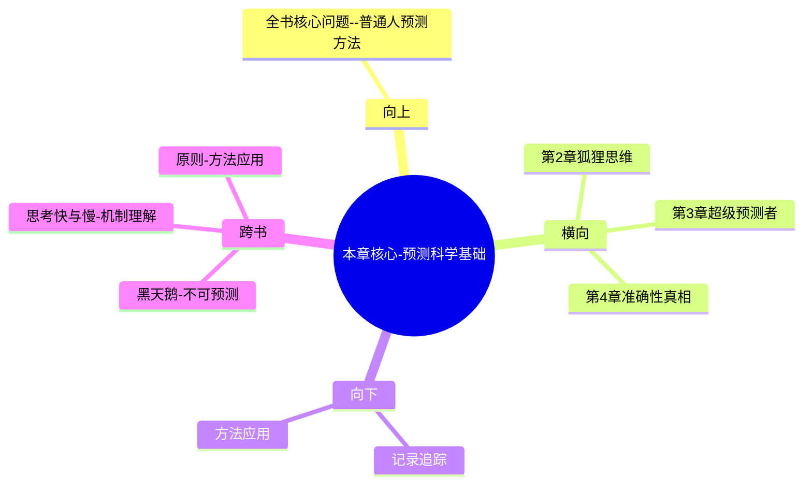

---
type: chapter-breakdown
category: 
  - 书籍拆解
  - [[超预测]]
status: draft
chapter: 
number: 1
title: 好的判断
links:
  - "[[超预测-泰洛克-拆解记录]]"
  - "[[第2章-狐狸与刺猬]]"
created: 2026-02-27
tags:
  - 超预测
  - 预测技能
  - 专家误区
  - 预测准确性
---

# 第1章 好的判断

## 📍 章节定位

### 全书位置
> 本章是全书开篇，定义预测科学的核心问题和基本概念，推翻常见误解，建立全书论证基础。

- **全书核心问题**: 普通人如何提升预测准确性以应对不确定性？
- **本章回答的问题**: 预测是不是靠天赋？专家的预测准不准？预测有没有科学方法？
- **角色类型**: 开篇定位型，奠定全书理论框架和实证基础
- **论证位置**: 从现实观察出发，提出问题，奠定理论根基

### 章节序列
| 方向 | 章节标题 | 逻辑连接 |
|------|----------|----------|
| 前章 | [[超预测-泰洛克-拆解记录]] | 基于整书拆解的背景了解 |
| 后章 | [[第2章-狐狸与刺猬]] | 从预测可习得性到思维模式探讨 |

### 一句话定位
> 第1章推翻关于预测的常见误区（天赋论、专家论），通过GJP项目实证证明预测是可习得技能，为后续章节介绍具体方法论奠定基础。

---

## 🎯 核心观点

### 第一层：表层案例
> 章节中的具体案例、故事、数据

| 案例名称 | 简要描述 | 页码 | 关键引文 |
|----------|----------|------|----------|
| GJP预测竞赛 | 2800名普通人vs情报分析师 | p.35-40 | "超级预测者比专业分析人员准确30%" |
| 专家预测翻车 | 伊丽莎白·牛顿预言专家表现 | p.20-25 | "平均而言，专家预测约等同飞镖黑猩猩" |
| 汤圆预测法 | 汤圆工厂员工预测生产线故障 | p.50-55 | "内部视角vs外部视角的效果差异" |

### 第二层：中层机制
> 案例背后的运行机制、方法论

| 机制名称 | 组成要素 | 因果链条 | 证据来源 |
|----------|----------|----------|----------|
| 专家盲区机制 | 过度自信+叙事渴望 | 声望需求>真实性 → 不追踪不改进 | 专家预测案例 |
| 预测技能机制 | 费米拆解+多元视角 | 科学方法→持续训练→准确性提升 | GJP项目数据 |
| 反馈闭环机制 | 准确记录+分析反思 | 识别错误模式→调整策略→能力提升 | 超级预测者特点 |

### 第三层：底层规律
> 可迁移的普遍规律

| 规律陈述 | 抽象层级 | 知识连接 | 适用范围 |
|----------|----------|----------|----------|
| 专业权威不等于预测质量 | 决策科学 | [[思考快与慢-拆解记录]] | 信息过载时代的权威识别 |
| 预测准确性与天赋关系不大 | 认知科学 | [[刻意练习相关理论]] | 技能习得与天赋区分 |
| 问责制度推动准确性提高 | 管理学 | [[问责文化相关理论]] | 组织绩效与激励设计 |

---

## 💬 降维翻译

### 观点1: 专家预测准确性不高

#### 原文表达
> "平均而言，专家的预测能力并不比投飞镖的黑猩猩更好。他们的准确性甚至不如简单的计算机程序。" —— p.25

#### 降维翻译（中学生能懂）
预测准确性并不依赖于专业知识，也不依赖于经验积累。很多时候，专家的预测还不如一个简单的统计模型，这是因为专家容易陷入过度自信和叙事欲望中，忽视真实的反馈。

#### 日常类比（奶奶能懂）
就像那些算命先生，说得头头是道，看起来很有学问，但预测结果却常常不准确。真正有用的是那些用数据和方法算出来的可能性，而不是那种凭感觉说"一定如此"的话。

#### 检验
- Q: 如果一个中学生问你为什么专家预测不准？
- A: 因为他们为了显得专业，总是说得很确定，不愿意承认自己也不确定。而且他们很少检查自己预测错了没，所以没法进步。

### 观点2: 预测是可习得技能

#### 原文表达
> "预测是一项可以培养的技能，而不是神秘的天赋。在精准预测项目中，普通人通过科学方法，准确率超过了掌握机密情报的专业分析师。" —— p.70

#### 降维翻译（中学生能懂）
预测就像游泳、开车一样，是有方法可以学会的。即使没有专家的学历和经验，只要掌握了科学的预测方法，普通人也可以做得比专家更好。

#### 日常类比（奶奶能懂）
就像种地一样，老农种了几十年还是靠天吃饭，但新农民学习现代农业技术，反而产量更高。预测也是一样，不是看年纪大小、经验多少，而是看方法对不对。

#### 检验
- Q: 如果一个中学生问你什么是可习得预测技能？
- A: 就是通过一套固定的科学方法（比如拆解问题、多角度看问题、概率表达等），任何人都可以学会如何判断一件事发生的可能性。

### 观点3: 反馈和追踪提升准确性

#### 原文表达
> "超级预测者的核心特征之一是严格追踪自己的预测准确性，并据此持续调整方法。" —— p.85

#### 降维翻译（中学生能懂）
要想预测更准，必须记住自己做出的所有预测，然后跟踪结果是否跟预测一致，不断总结经验教训。不回头看预测的对错，就永远无法进步。

#### 日常类比（奶奶能懂）
就像做生意一样，每笔账都要算清楚，赚了多少钱、亏了多少钱，时间长了就会知道自己在哪方面容易判断失误，下次就能改正。

#### 检验
- Q: 如果一个中学生问为什么需要追踪预测？
- A: 因为你以为自己的判断很准，但实际上可能经常失误，只有记录下来对比实际情况，才能发现自己哪里判断错了，从而改进。

---

## ✨ 金句库

### 原书金句
| 金句 | 页码 | 适用场景 |
|------|------|----------|
| 预测是一项可以培养的技能，而不是神秘的天赋。 | p.30 | 告诉他人预测能力可以提升 |
| 平均而言，专家的预测能力并不比随机掷飞镖的黑猩猩更好。 | p.25 | 质疑权威预测 |
| 你的信念是用来验证的假设，而非需要守护的宝藏。 | p.90 | 提醒开放心态 |
| 对证据反应不足和过度反应之间，需要找到适当的平衡。 | p.60 | 解释适度调整预测 |
| 谨慎的不确定性：承认你不知道的，是智慧的开始。 | p.120 | 承认无知的价值 |

### 降维金句
| 金句 | 来源观点 | 适用场景 |
|------|----------|----------|
| 专家上电视是为了收视率，不是为了告诉你真相。 | 专家预测不准确 | 理性质疑媒体专家 | 
| 预测不是玄学，是像开车一样的技能。 | 预测可习得 | 破除神秘感 |
| 不跟踪结果的预测，都是耍流氓。 | 反馈机制重要 | 强调追踪的重要性 |
| 聪明的人不是从不错，而是错得及时。 | 持续更新 | 强调及时调整 |
| 准确率比自信更重要。 | 质疑专家过度自信 | 理性对待权威 |

## 🔗 当下映射

### 💰 财富应用
| 场景 | 具体行动 | 预期效果 | 风险提示 |
|------|----------|----------|----------|
| 投资决策 | 用费米拆解法定量分析投资标的 | 提高投资成功率 | 过度分析导致错失机会 |
| 理财规划 | 计算不同收入情景发生概率 | 制定应急预案 | 历史数据不代表未来 |
| 消费决策 | 量化购买必要性和后悔概率 | 减少冲动消费 | 小额消费过度计算不经济 |

### 💼 职场应用
| 场景 | 具体行动 | 所需能力 | 适用职级 |
|------|----------|----------|----------|
| 职业规划 | 拆解目标职位成功率各环节 | 预测拆解能力 | 中高层 |
| 项目决策 | 预测不同方案成功率和风险 | 决策分析能力 | PM级别以上 |
| 薪资谈判 | 评估公司薪资增长前景概率 | 外部视角评估 | 全职级通用 |

### 🏠 生活应用
| 场景 | 具体行动 | 可行性 | 见效时间 |
|------|----------|--------|----------|
| 感情决策 | 推测感情走向不同结果概率 | 高 | 1-3月 |
| 居住选择 | 不同城市生活满意度概率评估 | 高 | 立即 |
| 身体健康 | 健康恶化风险概率预估 | 中 | 3-6月 |

### 72小时行动计划
1. 记录下今天做的3个判断或预测（比如"同事会迟到"、"交通拥堵"等），写下你的信心百分比
2. 一周后检查这些预测是否准确，分析判断偏差
3. 对当前一个重大决定（职业、投资、消费等）应用费米拆解法进行量化分析

---

## 🕸️ 章节关联

### 向上关联 → 整书
- **贡献**: 本章奠定了全书基本假设——预测可习得，专家未必更准，为后续方法论提供理论依据
- **位置**: 全书论证起点，建立读者认知框架

### 横向关联 → 章节间
| 章节编号 | 章节标题 | 关联类型 | 连接描述 |
|----------|----------|----------|----------|
| 第2章 | [[狐狸与刺猬]] | 承接 | 本章建立预测可习得性 → 第2章解释不同思维模式 |
| 第3章 | [[超级预测者]] | 铺垫 | 本章证明普通人也可超越专家 → 第3章介绍特征 |
| 第4章 | [[准确性的真相]] | 铺垫 | 本章提出GJP项目 → 第4章详述 |

### 向下关联 → 具体应用
| 应用场景 | 难度 | 前置知识 |
|----------|------|----------|
| 记录并追踪自己的预测准确性 | 中 | 本章理论基础 |
| 用科学方法取代专家意见 | 高 | 本章+第2章知识 |
| 建立反馈优化机制 | 中 | 持续追踪习惯 |

### 跨书关联 → 知识网络
| 书籍 | 概念 | 关系 | 备注 |
|------|------|------|------|
| [[黑天鹅-塔勒布-拆解记录]] | 不可预测性 | 互补 | [[黑天鹅]]讲不可预测部分，本章讲可预测部分 |
| [[思考快与慢-拆解记录]] | 认知偏误 | 机制补充 | 本章提供克服偏误的具体方法 |
| [[原则-达利欧-拆解记录]] | 原则化决策 | 应用延展 | 预测技能是制定原则的基础 |

### 关联可视化

---

## ❓ 问答设计

### Q1: [记忆型问题]
**认知层次**: 记忆
**难度**: 低
**题目**: GJP项目的预测结果显示了专家预测的什么特性？
**答案要点**:
- 平均准确性与随机相似
- 不如简单计算机程序
- 专家过度自信但缺乏反馈

### Q2: [理解型问题]
**认知层次**: 理解
**难度**: 中
**题目**: 为什么专家比普通人更容易预测错误？
**答案要点**:
- 社交奖励：追求声名而非准确性
- 认知偏误：过度自信+叙事谬误
- 反馈缺失：不追踪真实结果进行改进

### Q3: [应用型问题]
**认知层次**: 应用
**难度**: 中
**题目**: 如何在日常决策中运用预测科学方法？
**答案要点**:
- 记录自己的判断及其信心度
- 定期回查结果并分析偏差
- 拆解复杂问题后再做预测

### Q4: [分析型问题]
**认知层次**: 分析
**难度**: 中
**题目**: 分析传统权威预测与科学预测的区别。
**答案要点**:
- 前者关注叙事与可信度，后者关注概率与准确性
- 前者不追踪预测结果，后者建立反馈闭环
- 前者依赖经验积累，后者注重科学方法

### Q5: [评价型问题]
**认知层次**: 评价
**难度**: 高
**题目**: 评价"预测是一门技能"这个观点的意义。
**答案要点**:
- 打破天赋论：任何人都可通过训练提升
- 推崇方法论：有科学、可复制的方法
- 注重实践：需要持续追踪和反馈

### Q6: [创造型问题]
**认知层次**: 创造
**难度**: 高
**题目**: 设计一套个人预测能力提升的训练方案。
**答案要点**:
- 第一阶段：记录和标记每次预测的准确性
- 第二阶段：运用预测拆解方法分析失败案例  
- 第三阶段：建立外部视角和内部视角转换机制

### Q7: [综合型问题]
**认知层次**: 综合
**难度**: 高
**题目**: 结合本章内容，构建一个预测准确性评估体系。
**答案要点**:
- 准确性指标：预测结果与实际结果的匹配度
- 信心校准：高信心事件的发生频率应接近预测值
- 进步轨迹：随时间推移准确性的提升程度

---
