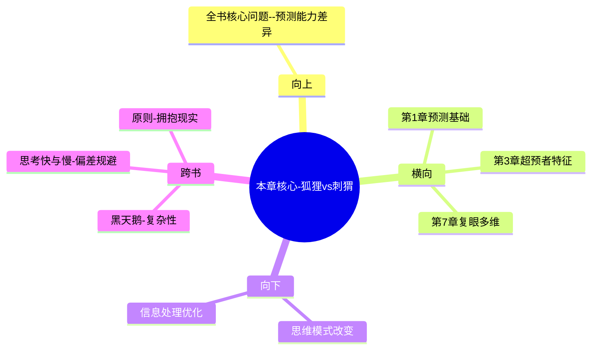

---
type: chapter-breakdown
category: 
  - 书籍拆解
  - [[超预测-泰洛克-拆解记录]]
status: draft
chapter: 
number: 2
title: 狐狸与刺猬
links:
  - "[[超预测-泰洛克-拆解记录]]"
  - "[[第1章-好的判断]]"
  - "[[第3章-超级预测者]]"
created: 2026-02-27
tags:
  - 超预测
  - 狐狸思维
  - 刺猬思维
  - 思维模式
  - 认知风格
---

# 第2章 狐狸与刺猬

## 📍 章节定位

### 全书位置
> 本章是全书理论核心，阐述预测者的两种根本思维模式（刺猬vs狐狸），为理解超级预测者的特征奠定基础，直接承接第一章提出的"预测是可习得技能"的观点。

- **全书核心问题**: 普通人如何提升预测准确性以应对不确定性？
- **本章回答的问题**: 什么样的思维模式有利于准确预测？刺猬型思维与狐狸型思维的核心区别？
- **角色类型**: 核心概念型，在整书理论体系中占据中心地位
- **论证位置**: 从实证数据上升到理论框架，解释为什么会存在预测能力的差异

### 章节序列
| 方向 | 章节标题 | 逻辑连接 |
|------|----------|----------|
| 前章 | [[第1章-好的判断]] | 概念承接：从预测可习得性到预测者类别差异 |
| 后章 | [[第3章-超级预测者]] | 概念延续：狐狸型思维的进一步深化和具体特征 |

### 一句话定位
> 第2章通过"狐狸vs刺猬"的经典区分，揭示了导致预测能力差异的根本性思维方式区别：多元视角与灵活调整对比单一视角与固执坚持。

---

## 🎯 核心观点

### 第一层：表层案例
> 章节中的具体案例、故事、数据

| 案例名称 | 简要描述 | 页码 | 关键引文 |
|----------|----------|------|----------|
| 古希腊诗意象 | 狐狸知多事，刺猬知一事 | p.125 | "狐狸知道很多事情，但刺猬只知道一件大事" |
| 赫胥黎vs奥威尔类型 | 知识分子的两种思维方式 | p.130 | "赫胥黎vs奥威尔代表的两种认知倾向" |
| 复杂性偏好测试 | 狐狸型喜欢复杂，刺猬型喜欢简约 | p.135 | "狐狸更愿意停留在不确定性的泥沼中" |
| 专家类型调查 | 媒体专家多为刺猬型 | p.140 | "刺猬型更适合做电视评论员" |

### 第二层：中层机制
> 案例背后的运行机制、方法论

| 机制名称 | 组成要素 | 因果链条 | 证据来源 |
|----------|----------|----------|----------|
| 思维固化机制 | 单一理论+确认偏误 | 理论筛选→选择性注意→固执坚持 | 媒体专家案例 |
| 多元整合机制 | 多视角+概率修正 | 多元信息→权重调整→动态更新 | 超级预测者数据 |
| 认知闭合机制 | 定义需求+简化偏好 | 不确定厌恶→快速定论→抗拒更改 | 心理学实验数据 |

### 第三层：底层规律
> 可迁移的普遍规律

| 规律陈述 | 抽象层级 | 知识连接 | 适用范围 |
|----------|----------|----------|----------|
| 认知多样性优于单一同质性 | 认知科学 | [[思考快与慢-拆解记录]]的多样化思维 | 复杂系统预测场景 |
| 思维灵活性胜过固化坚持 | 心理学 | [[非对称风险-塔勒布-拆解记录]]的反脆弱 | 面临变化的决策环境 |
| 开放性vs封闭性的准确率差异 | 预测科学 | [[原则-拆解记录]]的进化原则 | 变化莫测的商业情境 |

---

## 💬 降维翻译

### 观点1: 刺猬型思维特征

#### 原文表达
> "刺猬型思考者倾向于用一个大观念、一个统筹全局的理念来看待这个世界的一切，他们的思想被某种观点或者意识形态统一起来，他们将每一个问题放在单一的焦点之下进行观察。" —— p.132

#### 降维翻译（中学生能懂）
刺猬型思维就是喜欢用一种固定的想法去理解所有的事情，无论遇到什么问题都会套用同一个理论，觉得这个世界上只有他自己认可的那种道理是正确的。

#### 日常类比（奶奶能懂）
就像那些老是说"都是年轻人太懒了"的长辈一样，不管什么问题——高房价、就业难、生育率下降，都归咎于年轻人懒惰。他们只有一个解决方案，就是年轻人要勤奋。 

#### 检验
- Q: 如果一个中学生问你什么是刺猬型思维？
- A: 就是总觉得自己手里有个万能钥匙，什么锁都能开。遇到啥问题，都用同样的方法去解决，不愿意考虑别的可能性。

### 观点2: 狐狸型思维特征

#### 原文表达
> "狐狸型思考者追求更多信息，甚至是相互冲突的信息，他们对复杂性很着迷，不耐烦于大战略设计和社会哲学建构，他们更像是百科全书，而非大一统的律令。" —— p.133

#### 降维翻译（中学生能懂）
狐狸型思维就是愿意接受不同的看法，不着急给事情下结论，会仔细研究各种复杂的信息，包括相反的观点，能够灵活变通适应新的情况。

#### 日常类比（奶奶能懂）
就像一个精明的生意人都要听不同的信息，去不同的市场打听价格，既听买方的意见也听卖方的说法，最后综合各种信息做出判断，而不是认死理。

#### 检验
- Q: 如果一个中学生问你什么是狐狸型思维？
- A: 就像一个好的侦探一样，要听每个人的说法，包括可能互相矛盾的内容，然后整合所有的线索来找到真相，而不是先入为主认定一个人是罪犯。

### 观点3: 狐狸型预测更准确

#### 原文表达
> "狐狸的表现明显要好于刺猬。狐狸并不像刺猬那样坚定地相信某个宏大的理论，他们也不太可能基于某种世界观做出极端性的判断，因此，当现实发生变化时，他们修改预测的速度也要快得多。" —— p.140

#### 降维翻译（中学生能懂）
在预测准确性上，狐狸型思维的人通常比刺猬型思维的预测得更准，关键是他们不太固执，一旦发现情况有变，就会很快调整自己的看法。

#### 日常类比（奶奶能懂）
就像炒股，有些老人认为只有黄金靠谱，只投资黄金，这就是刺猬思维。而聪明的投资者会看房地产、股票、债券等多种投资渠道，根据形势随时调整，这就更像狐狸。

#### 检验
- Q: 如果一个中学生问为什么狐狸型预测更准？
- A: 因为刺猬不愿意承认自己错了，狐狸能接受新信息立刻改变认知，所以在变化的世界里预测会更准确。

---

## ✨ 金句库

### 原书金句
| 金句 | 页码 | 适用场景 |
|------|------|----------|
| 狐狸知道很多事情，但刺猬只知道一件大事。 | p.125 | 区分两类思维方式 |
| 刺猬型思维者更喜欢上电视，因为他们的观点简明扼要。 | p.145 | 解释媒体偏向 |
| 狐狸更愿意停留在不确定性的泥沼中。 | p.136 | 强调开放思维 |
| 对于狐狸来说，世界是一幅由许多相互冲突的片段拼接而成的画。 | p.134 | 描述狐狸思维特性 |
| 刺猬型思考者更容易预测失败，因为他们不容易改变主意。 | p.140 | 预测准确性分析 |

### 降维金句
| 金句 | 来源观点 | 适用场景 |
|------|----------|----------|
| 刺猬只会一招，狐狸百变不离其宗 | 刺猬vs狐狸本质 | 形象对比 |
| 手握锤子，看啥都是钉子是陷阱 | 刺猬型思维弊端 | 预警思维狭隘 |
| 多听不同声音，再做判断 | 狐狸型思维优点 | 建议行动 |
| 灵活应变胜过固执偏见 | 狐狸型优势 | 价值观引导 |
| 单一视角看不清全貌，多元角度更准确 | 狐狸型有效性 | 方法论证 |

## 🔗 当下映射

### 💰 财富应用
| 场景 | 具体行动 | 预期效果 | 风险提示 |
|------|----------|----------|----------|
| 投资决策 | 采用多元化分析框架（技术+基本面+情绪指标） | 避免单一判断错误 | 思维过载导致错失机会 |
| 理财规划 | 考虑通胀、政策、市场等多重因素影响 | 更贴近真实风险 | 过度分散损失收益 |
| 消费决策 | 比较性价比、功能、品牌等多维度信息 | 避免冲动购买 | 选择过多延长决策周期 |

### 💼 职场应用
| 场景 | 具体行动 | 所需能力 | 适用职级 |
|------|----------|----------|----------|
| 项目分析 | 从技术、成本、时间、风险等多个维度评估 | 综合分析能力 | PM/高级工程师以上 |
| 团队管理 | 考虑成员性格、技能、动机、环境等多种因素 | 人性化管理能力 | 直线经理 |
| 战略规划 | 融合内外部环境、竞争对手、客户诉求等信息 | 战略思维能力 | 中高层管理人员 |

### 🏠 生活应用
| 场景 | 具体行动 | 可行性 | 见效时间 |
|------|----------|--------|----------|
| 感情决策 | 考虑对方性格、价值观、生活习惯、未来规划等 | 高 | 长期 |
| 居住选择 | 比较地理位置、交通便利、周边配套、未来发展 | 中 | 1-2年 |
| 身体健康 | 考虑饮食、运动、作息、心理等多种因素 | 高 | 持续 |

### 72小时行动计划
1. 分析最近一次重要的判断或决定：我是不是只考虑了一个角度？试着找出至少3个其他相关因素
2. 主动寻找一个与自己观点相悖的文章或观点，并试着理解对方的逻辑
3. 选择一个重要的决策议题，按狐狸式思维方式进行多维度分析（至少列出5个不同视角）

---

## 🕸️ 章节关联

### 向上关联 → 整书
- **贡献**: 本章提供了预测者能力差异的理论解释，回答了为什么同样方法训练，有些人预测更准
- **位置**: 全书理论基础，解释预测准确性的根本原因

### 横向关联 → 章节间
| 章节编号 | 章节标题 | 关联类型 | 连接描述 |
|----------|----------|----------|----------|
| 第1章 | [[第1章-好的判断]] | 延伸 | 本章解释第一章提到的预测能力差异内在原因 |
| 第3章 | [[第3章-超级预测者]] | 承接 | 本章奠定狐狸型思维基础 → 第3章介绍具体特征 |
| 第7章 | [[第7章-蜻蜓复眼]] | 验证 | 本章理论支持 → 第7章具体方法 |

### 向下关联 → 具体应用
| 应用场景 | 难度 | 前置知识 |
|----------|------|----------|
| 改变固有思维模式 | 高 | 认知反思能力 |
| 采纳多元信息源 | 中 | 信息处理能力 |
| 建立灵活决策框架 | 高 | 概括抽象能力 |

### 跨书关联 → 知识网络
| 书籍 | 概念 | 关系 | 备注 |
|------|------|------|------|
| [[黑天鹅-塔勒布-拆解记录]] | 不可预测性 | 支持 | 塔勒布也强调避免单一模型依赖 |
| [[思考快与慢-拆解记录]] | 系统化的思维偏差 | 扩展 | 狐狸思维有助于克服系统性的偏误 |
| [[原则-拆解记录]] | 拥抱现实，应对现实 | 对比 | 达利欧强调拥抱现实，狐狸思维体现这一原则 |

### 关联可视化

---

## ❓ 问答设计

### Q1: [记忆型问题]
**认知层次**: 记忆
**难度**: 低
**题目**: "狐狸知道很多事情，但刺猬只知道一件大事"是谁的观点？
**答案要点**:
- 俄国文学评论家以赛亚·柏林提出
- 用来形容两种不同的世界观和思维模式
- 刺猬用单一理念统一万物，狐狸接受多元化观点

### Q2: [理解型问题]
**认知层次**: 理解
**难度**: 中
**题目**: 为什么刺猬型思维在预测上通常表现较差？
**答案要点**:
- 过度依赖单一理论框架
- 认知僵化，不愿接受相反证据
- 无法快速调整既有观念
- 容易被确认偏误误导

### Q3: [应用型问题]
**认知层次**: 应用
**难度**: 中
**题目**: 如何在重大决策中应用狐狸型思维？
**答案要点**:
- 寻求多种信息来源
- 故意寻找相反证据和观点  
- 从不同角度审视问题
- 保留在收到新信息时调整判断的灵活性

### Q4: [分析型问题]
**认知层次**: 分析
**难度**: 中
**题目**: 分析狐狸型和刺猬型思维在不同情境下的适配性。
**答案要点**:
- 刺猬型：适合需要快速决策、明确立场的场合（媒体评论、政治表态）
- 狐狸型：适合复杂系统、多变量环境的预测和决策
- 刺猬型在稳定性环境中有一定效率优势
- 狐狸型在变化环境中具备准确性优势

### Q5: [评价型问题]
**认知层次**: 评价
**难度**: 高
**题目**: 评价狐狸型思维的潜在劣势。
**答案要点**:
- 过度分析可能导致决策瘫痪
- 信息过载增加处理成本
- 多重不确定性造成认知负担
- 缺乏坚定立场可能影响执行力

### Q6: [创造型问题]
**认知层次**: 创造
**难度**: 高
**题目**: 设计一个狐狸型思维的训练方案。
**答案要点**:
- 辩论训练：定期与自己观点对立的观点辩论
- 多维度思考：为每个决策制定至少5个不同的视角
- 证据反证：每天寻找与自己想法相反的信息
- 不确定性容忍：定期记录未预期的发生结果

### Q7: [综合型问题]
**认知层次**: 综合
**难度**: 高
**题目**: 结合理论与实践，构建个人认知多样性的衡量标准。
**答案要点**:
- 信息源多样性：主动获取相异观点的比率
- 观点调整频度：因新信息改变立场的频率
- 预测准确性：多视角对比单一视角的准确率差异
- 承诺一致性：坚持立场与灵活调整的平衡度

### Q8: [评价型问题]
**认知层次**: 评价
**难度**: 高
**题目**: 为什么媒体上多见刺猬型专家而非狐狸型专家？
**答案要点**:
- 刺猬型观点简洁有力，符合受众偏好
- 清晰立场比模糊概率更吸引眼球
- 媒体导向需要确定性内容
- 狐狸思维的复杂性和不确定性在传播中有缺陷

### Q9: [应用型问题]
**认知层次**: 应用
**难度**: 中
**题目**: 如何在工作汇报中体现狐狸型思维而不被视为优柔寡断？
**答案要点**:
- 明确表示基于多角度分析
- 提供不同情境下的方案选择
- 突出风险评估的全面性
- 提出动态调整的具体机制

### Q10: [理解型问题]
**认知层次**: 理解
**难度**: 中
**题目**: 描述狐狸型与刺猬型思维在认知上的差异。
**答案要点**:
- 狐狸型：接受复杂性，容忍不确定性
- 刺猬型：追求一致性，偏好简单化
- 狐狸型：从特殊到一般，不断迭代更新
- 刺猬型：从一般到特殊，寻求终极真理

### Q11: [分析型问题]
**认知层次**: 分析
**难度**: 高
**题目**: 分析狐狸型思维与Bayes更新机制的关系。
**答案要点**:
- 两者都强调基于新证据调整概率
- 狐狸型思维体现贝叶斯式认知更新
- 多视角评估类似先验概率分布
- 灵活调整类似后验概率更新

### Q12: [创造型问题]
**认知层次**: 创造
**难度**: 高
**题目**: 设计一个基于狐狸思维模式的产品决策流程。
**答案要点**:
- 早期验证：从多个用户群验证产品假设
- A/B测试：并行运行多种决策逻辑
- 反馈闭环：快速收集多维度市场反馈
- 迭代机制：在最小可行时间内调整战略

### Q13: [综合型问题]
**认知层次**: 综合
**难度**: 高
**题目**: 综合理解狐狸型思维如何提升个人的反脆弱性。
**答案要点**:
- 多元信息来源增强环境适应
- 灵活调整增强冲击恢复能力
- 开放态度增强压力下的学习
- 概率思维增强黑天鹅防护

### Q14: [评价型问题]
**认知层次**: 评价
**难度**: 高
**题目**: 评价狐狸与刺猬理论的适用边界。
**答案要点**:
- 在高度确定性的机械系统中，刺猬可能更高效
- 在简单决策情况下，过多视角造成分析瘫痪
- 社会情感决策中，狐狸思维可能存在信任缺失
- 时间约束条件下刺猬可能更有优势

### Q15: [理解型问题]
**认知层次**: 理解
**难度**: 中
**题目**: 请说明狐狸型思维中的"认知双元性"特征。
**答案要点**:
- 既要保持开放性也要做出承诺
- 既要多元视角又要集中决策
- 既要容忍不确定又要承担责任
- 体现了理性决策的内在张力

---
