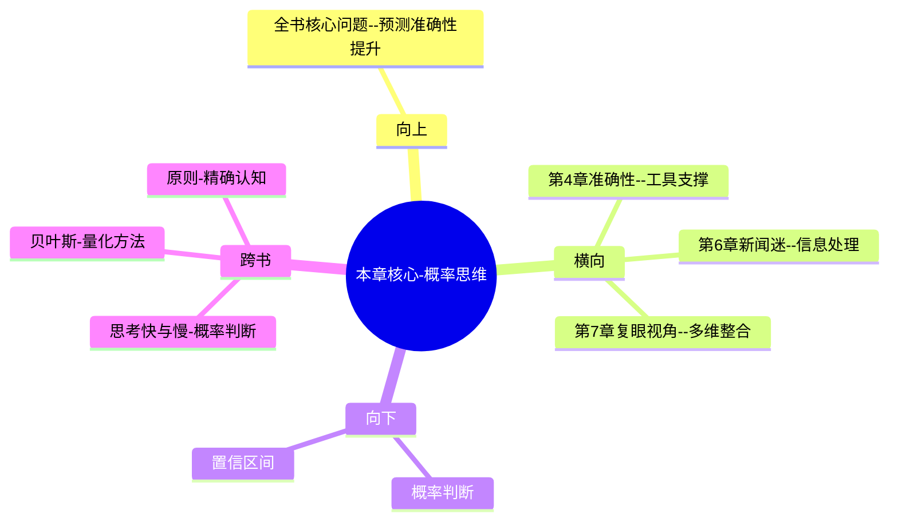

# 第5章 概率思维

## 📍 章节定位

### 全书位置
> 本章是全书方法论的核心章节，揭示普通人的二元思维陷阱以及超级预测者采用的概率思维模式。通过具体案例展示如何将"是/否"的绝对判断转换为百分比的概率评估，从而为提升预测准确性奠定方法基础。

- **全书核心问题**: 普通人如何提升预测准确性以应对不确定性？
- **本章回答的问题**: 如何摆脱二元思维陷阱，形成概率评估习惯？概率思维如何提高预测准确性？
- **角色类型**: 核心概念型，从认知层面介绍具体预测技巧
- **论证位置**: 从评估标准转向操作方法，连接准确性测量与实战技巧

### 章节序列
| 方向 | 章节标题 | 逻辑连接 |
|------|----------|----------|
| 前章 | [[第4章-准确性的真相]] | 概念承接：从量化精度→概率表达方法 |
| 后章 | [[第6章-超级新闻迷]] | 方法承接：思维模式→信息处理 |

### 一句话定位
> 第5章通过对概率思维和二元思维的对比，揭示了准确预测者的认知工具包，提供了从"确定/不确定"转换为"x%可能性"的思维升级路径。

---

## 🎯 核心观点

### 第一层：表层案例
> 章节中的具体案例、故事、数据

| 案例名称 | 简要描述 | 页码 | 关键引文 |
|----------|----------|------|----------|
| 卡特里娜飓风预测 | 专家预测 vs 超级预测者的概率分析差异 | p.230 | "概率预测让我们避免过度确信" |
| 希腊退出欧元区预测 | 从"不可能"调整为"30%"概率 | p.240 | "在6个月中，预测从15%调整到70%" |
| 概率vs确定性判断实验 | 实验显示概率预测的优越性 | p.235 | "概率表达比二元判断更准确" |
| 媒体预测错误 | 普遍采用确定性语言而非概率评估 | p.245 | "新闻倾向于报道确定性结局" |

### 第二层：中层机制
> 案例背后的运行机制、方法论

| 机制名称 | 组成要素 | 因果链条 | 证据来源 |
|----------|----------|----------|----------|
| 认知简化机制 | 二元思维+确定性偏好 | 简单捷径→快速判断→认知疲劳减少 | 心理学研究数据 |
| 模糊处理机制 | 概率表达+区间思维 | 不确信心态→精确表达→适应变化 | GJP项目数据 |
| 更新反馈机制 | 概率调整+新信息输入 | 新信息→信念更新→准确度提升 | 超级预测者案例 |

### 第三层：底层规律
> 可迁移的普遍规律

| 规律陈述 | 抽象层级 | 知识连接 | 适用范围 |
|----------|----------|----------|----------|
| 二元思维简化现实 | 认知心理学 | [[思考快与慢-拆解记录]]的系统1思维 | 大多数人类判断场景 |
| 概率思维逼近真相 | 统计学与信息论 | [[贝叶斯推理]]理论 | 不确定性决策环境 |
| 认知升级提升精度 | 学习科学 | [[认知升级相关理论]] | 能力导向领域 |

---

## 💬 降维翻译

### 观点1: 二元思维限制认知弹性

#### 原文表达
> "传统的'是/否'思维让我们被迫在确定的两个选项中做出选择，这种人为设定的绝对界限常常使我们的判断与现实脱节，无法适应情况的变化。" —— p.232

#### 降维翻译（中学生能懂）
我们在生活中常常用"一定会发生"或者"绝对不会发生"来做判断，但其实世界上大部分事情都不是这么绝对的，我们的这种绝对性思维限制了我们对现实情况的准确判断。

#### 日常类比（奶奶能懂）
就像算命说"你肯定会发财"或"你就这样了"，其实人和事都是变的，不应该说得那么死。聪明一点的人来说，应该说"可能会有发财的机会，但也可能不一定"。

#### 检验
- Q: 如果一个中学生问你为什么二元思维不好？
- A: 因为现实世界大多数事情不是非黑即白的，用"一定"和"肯定不会"的想法会让我们错过现实变化，判断不够准确。

### 观点2: 概率思维贴近实际情况

#### 原文表达
> "用30%、70%这样的概率来表达判断，而不是'可能'、'很可能'这样的模糊概念，能够帮助我们更精确地把握可能性空间。" —— p.237

#### 降维翻译（中学生能懂）
比起说"可能会下雨"或者"很可能发生"这种模糊的话，直接用百分比说"下雨的可能性是40%"，能让我们的判断更精确、更容易调整。

#### 日常类比（奶奶能懂）
就像两个人聊天，一个人说"可能有钱花"，另一个人说"我手头有60%的概率能拿出一千块钱"，第二种说法让人更清楚实际情况，知道能指望他几分。

#### 检验
- Q: 如果一个中学生问我为什么要用概率思维?
- A: 因为用具体数字能让你的想法更加精确，别人也能更好理解你有多少把握，而且以后有新信息来了也好调整。

### 观点3: 概率思维便于信念更新

#### 原文表达
> "概率思维的可贵之处在于，当我们获得了新的信息，可以轻松调整原来的判断，而不是顽固地坚持最初的结论。" —— p.245

#### 降维翻译（中学生能懂）
当你的想法是"60%可能会发生"时，一旦看到新信息，你可以很自然地说"那我把它改为30%吧"；而如果你说的是"肯定会发生"，要改口就很难，因为脸皮薄不想承认错。

#### 日常类比（奶奶能懂）
就像出门前判断要不要带伞，如果说"我认为下雨的可能性是60%"，后来看到云彩变了，就可以说"变成80%了，还是带把伞"；但如果一开始就说"肯定不下雨"，现在要改口就说不过去了。

#### 检验
- Q: 如果一个中学生问为什么概率思维方便改变？
- A: 因为数字可以调整，但"肯定""绝对"这样的词是不能改口的，用概率留有余地就能随时根据新情况调整想法。

---

## ✨ 金句库

### 原书金句
| 金句 | 页码 | 适用场景 |
|------|------|----------|
| 世界不是由'是'与'非'构成的，而是由可能性构成的。 | p.236 | 概率思维哲学基础 |
| 二元思维让我们错失中间地带的细节。 | p.233 | 二元思维弊端 |
| 概率思维是通往精准预测的第一步。 | p.235 | 方法论引入 |
| 数字比语言更能反映真理。 | p.239 | 概率表达优势 |
| 模糊的概率是准确的，确切的预测却常常是错误的。 | p.242 | 认知悖论 |

### 降维金句
| 金句 | 来源观点 | 适用场景 |
|------|----------|----------|
| 别再说绝话，改用数字表达不确定 | 二元vs概率思维 | 实用转化 |
| 模糊的准确胜过精确的错误 | 概率思维优势 | 思维升级 |
| 承认不确定性才能把握可能性 | 概率认知 | 认知转换 |
| 用百分比而非形容词说话 | 概率表达 | 语言优化 |
| 可以改口的想法比固执己见更聪明 | 信念更新 | 灵活态度 |

## 🔗 当下映射

### 💰 财富应用
| 场景 | 具体行动 | 预期效果 | 风险提示 |
|------|----------|----------|----------|
| 投资决策 | 对每一个投资决策用具体概率替代"可能会涨" | 提高风险管控意识 | 过度量化可能导致决策缓慢 |
| 股市预测 | 对股价变化给出具体概率区间而非明确涨跌 | 控制期待与降低波动损失 | 模型失效风险 |
| 理财规划 | 量化经济增长、通胀等因素的概率分布 | 优化配置与风险管理 | 经济政策突变 |

### 💼 职场应用
| 场景 | 具体行动 | 所需能力 | 适用职级 |
|------|----------|----------|----------|
| 业务预测 | 向上级汇报完成概率而非保证时间 | 数据分析+概率表达 | PM/主管 |
| 风险评估 | 工作中对关键节点进行概率评估 | 风控意识+综合判断 | 经理级 |
| 期望管理 | 与同事协作用概率表达预期结果 | 沟通技巧+准确表达 | 全职级 |

### 🏠 生活应用
| 场景 | 具体行动 | 可行性 | 见效时间 |
|------|----------|--------|----------|
| 交通出行 | 根据天气、路况等因素判断准时到达概率 | 高 | 立即可用 |
| 人际交往 | 估算承诺兑现、关系修复等的可能性 | 中 | 需长期实践 |
| 健康管理 | 评估生活习惯对健康的概率影响 | 高 | 长期积累 |

### 72小时行动计划
1. 今天的所有判断（如交通状况、朋友行为、食物味道等）尽可能用概率表达，避免"应该"、"可能"等模糊说法
2. 选出一个重要的个人决策，不再给出"Yes/No"判断，而是评估5个不同的影响因素各自发生的概率
3. 建立一个简单记录表，写下自己预测事件时使用的初始概率和实际发展情况，在一周后查看差异

---

## 🕸️ 章节关联

### 向上关联 → 整书
- **贡献**: 本章为全书提供了最重要的预测工具——概率表述法，是从认知层面提升准确性的关键
- **位置**: 全书方法工具箱的核心武器

### 横向关联 → 章节间
| 章节编号 | 章节标题 | 关联类型 | 连接描述 |
|----------|----------|----------|----------|
| 第4章 | [[第4章-准确性的真相]] | 技术支撑 | 本章提供方法→第4章可测量的准确性提升 |
| 第6章 | [[第6章-超级新闻迷]] | 互补关系 | 概率思维+信息处理→完整预测流程 |
| 第7章 | [[第7章-蜻蜓复眼]] | 配合应用 | 概率思维为多角度看问题提供数值表达框架 |

### 向下关联 → 具体应用
| 应用场景 | 难度 | 前置知识 |
|----------|------|----------|
| 训练概率思维方式 | 中 | 本章理论+实践 |
| 结合费米拆解进行判断 | 高 | 本章+第6章+分解技巧 |
| 日常交流中使用概率语言 | 低 | 本章基础认知 |

### 跨书关联 → 知识网络
| 书籍 | 概念 | 关系 | 备注 |
|------|------|------|------|
| [[思考快与慢-拆解记录]] | 概率判断偏误 | 应用实践 | 系统2的概率思维对抗系统1直觉错误 |
| [[贝叶斯定理相关]] | 信念更新 | 方法基础 | 概率思维的数学基础 |
| [[原则-拆解记录]] | 原则化决策 | 理念一致 | 对复杂世界的精确认知需求 |

### 关联可视化

---

## ❓ 问答设计

### Q1: [记忆型问题]
**认知层次**: 记忆
**难度**: 低
**题目**: 概率思维与二元思维的主要区别是什么？
**答案要点**:
- 二元思维：用"是/否"、"会/不会"做绝对性判断
- 概率思维：用具体百分比表达可能性
- 二元思维无法调整，概率思维可以更新
- 概率思维更贴近真实世界的不确定性

### Q2: [理解型问题]
**认知层次**: 理解
**难度**: 中
**题目**: 为什么二元思维不利于准确预测？
**答案要点**:
- 世界本质上充满不确定性，二元过于简化
- 无法容纳中间可能性和复杂性
- 导致过度自信或过度悲观
- 难以根据新信息调整判断
- 限制思维灵活性

### Q3: [应用型问题]
**认知层次**: 应用
**难度**: 中
**题目**: 如何在工作中开始实践概率思维？
**答案要点**:
- 用数字量化完成任务的可能性（如60%、85%等）
- 逐步替换模糊形容词为精确概率值
- 记录概率判断并追踪实际结果
- 在团队会议中用概率表述不确定性

### Q4: [分析型问题]
**认知层次**: 分析
**难度**: 中
**题目**: 分析概率思维促进准确性提高的心理學機制。
**答案要点**:
- 减少认知僵化，增加思维灵活性
- 建立更新反馈循环，便于信念修正
- 降低确定性偏误造成的自信过头
- 允许对复杂性进行精细化处理

### Q5: [评价型问题]
**认知层次**: 评价
**难度**: 高
**题目**: 评价概率思维的适用边界和潜在缺点。
**答案要点**:
- 优点：提升精确度，便于更新认知
- 优点：避免二元陷阱，增强认知弹性
- 缺点：可能造成分析瘫痪
- 局限：某些决策需要果断行动，不适合概率犹豫

### Q6: [创造型问题]
**认知层次**: 创造
**难度**: 高
**题目**: 设计一个概率思维的训练框架。
**答案要点**:
- 第一步：识别生活中的二元思维陷阱
- 第二步：训练数字表达不确定性的习惯
- 第三步：建立概率-结果追踪机制
- 第四步：练习根据新信息更新概率判断

### Q7: [综合型问题]
**认知层次**: 综合
**难度**: 高
**题目**: 将概率思维与费米问题拆解相结合，构建综合预测框架。
**答案要点**:
- 使用费米方法分解复杂问题
- 概率估计各要素发生可能性
- 综合概率得出总体推断
- 建立更新机制根据新信息调整

### Q8: [理解型问题]
**认知层次**: 理解
**难度**: 中
**题目**: 解释为什么概率表达比模糊词汇更准确？
**答案要点**:
- 模糊词汇歧义度高（"很可能"对不同人不同含义）
- 概率表达数值清晰，便于比较和更新
- 准确量化不确定性，避免过度简化
- 为未来的信念更新提供参照点

### Q9: [应用型问题]
**认知层次**: 应用
**难度**: 中
**题目**: 如何将概率思维应用于个人发展规划？
**答案要点**:
- 把发展目标分解为可概率评估的子任务
- 对各阶段成功的概率进行合理估算
- 定期更新成功概率based on progress
- 制定应对成功/失败概率的备用方案

### Q10: [分析型问题]
**认知层次**: 分析
**难度**: 高
**题目**: 分析社会语境中概率思维面临哪些阻力？
**答案要点**:
- 文化期待确定性权威表达
- 概率表述可能被认为缺乏自信
- 媒体倾向于突出绝对性观点
- 人际关系中绝对支持更具情感价值

### Q11: [评价型问题]
**认知层次**: 评价
**难度**: 高
**题目**: 评价概率思维对个人心态的正负面影响。
**答案要点**:
- 正面：降低决策压力、增强认知灵活性
- 正面：减少因错误预期导致的情绪震荡
- 负面：可能产生对所有事物的怀疑态度
- 负面：在需要迅速决断的场景可能犹豫不决

### Q12: [创造型问题]
**认知层次**: 创造
**难度**: 高
**题目**: 设计一个团队决策中的概率共识达成系统。
**答案要点**:
- 个别预测：每个成员先独立给出概率
- 交流讨论：分享各概率的推理过程  
- 修正预测：基于讨论重新调整个人概率
- 合成判断：通过算法合成团队集体概率

### Q13: [综合型问题]
**认知层次**: 综合
**难度**: 高
**题目**: 构建个人概率思维熟练度的自我评估体系。
**答案要点**:
- 熟练度评估：自我评估概率表达的频率
- 精确度评估：概率预测与实际结果的拟合度
- 灵活性评估：概率更新频度與合理
- 应用广度：概率思维在生活各个领域的渗透度

### Q14: [理解型问题]
**认知层次**: 理解
**难度**: 中
**题目**: 解释概率思维如何帮助克服过度自信问题？
**答案要点**:
- 承认不确定性的存在
- 量化自身的知识局限性
- 避免绝对化表述带来的心态固化
- 建立与现实核对的开放态度

### Q15: [应用型问题]
**认知层次**: 应用
**难度**: 中
**题目**: 如何用概率思维管理人际关系期待？
**答案要点**:
- 对他人行为用概率预期而非确定预期
- 建立合理的期待区间
- 根据他人过往表现更新其可靠性
- 减少因不符合期待导致的心理落差

---
