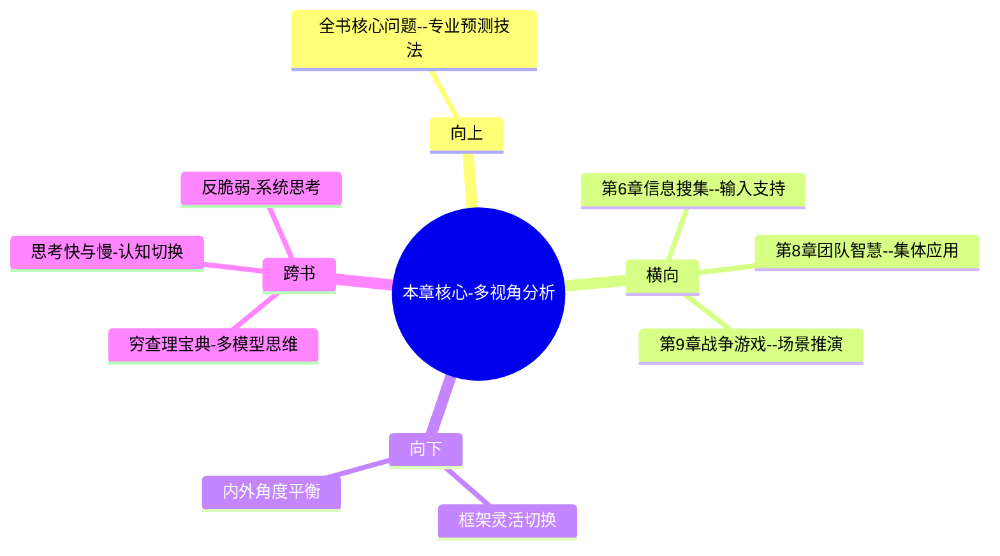

# 第7章 蜻蜓复眼

## 📍 章节定位

### 全书位置
> 本章介绍超级预测者最重要的思维技巧之一：多视角切换能力。如同蜻蜓的复眼可以看到多个角度的同时画面，预测者需要在内外视角、不同理论框架、正反两方面观点之间自由切换，形成立体的判断画面。这是认知层面的高级技巧。

- **全书核心问题**: 普通人如何提升预测准确性以应对不确定性？
- **本章回答的问题**: 如何从单一视角突破为多维视角？如何在预测中综合使用不同理论框架？视角切换如何提升准确性？
- **角色类型**: 核心技能型，展示高阶认知技巧
- **论证位置**: 从信息输入向多维整合的高级认知升级

### 章节序列
| 方向 | 章节标题 | 逻辑连接 |
|------|----------|----------|
| 前章 | [[第6章-超级新闻迷]] | 概念承接：信息搜集+验证→多视角解读 |
| 后章 | [[第8章-团队智慧]] | 层级提升：个体多视角→集体智慧 |

### 一句话定位
> 第7章通过"蜻蜓复眼"的隐喻，阐释顶级预测者如何在不同理论框架、内外视角、正反观点间自由切换并综合判断，形成多维度的立体洞察。

---

## 🎯 核心观点

### 第一层：表层案例
> 章节中的具体案例、故事、数据

| 案例名称 | 简要描述 | 页码 | 关键引文 |
|----------|----------|------|----------|
| 内外部视角切换 | 用内部视角分析事件，用外部视角校准概率 | p.280 | "内部视角会让我们过度乐观，外部视角提供基准参考" |
| 蜻蜓复眼比喻 | 系统1和系统2思维的灵活切换 | p.285 | "优秀的预测者能够同时看到多重视角画面" |
| 经济vs政治视角 | 同一事件从经济和政治双重视角分析 | p.290 | "单一理论框架会让我们错失重要信息" |
| 中国经济发展预测 | 用多个类比国家路径分析不同结局可能 | p.295 | "类比的力量在于寻找相似模式" |

### 第二层：中层机制
> 案例背后的运行机制、方法论

| 机制名称 | 组成要素 | 因果链条 | 证据来源 |
|----------|----------|----------|----------|
| 视角切换机制 | 多框架+主动转换 | 识别单一盲点→切换框架→综合理解→提升准确 | 实际预测案例研究 |
| 外部校准机制 | 基准比较+统计概览 | 特殊情况→普遍规律参考→校准判断→纠偏修正 | GJP数据分析 |
| 内外平衡机制 | 情境分析+概率调整 | 内部特征→外部基线→概率更新→均衡概率 | 超级预测者访谈 |

### 第三层：底层规律
> 可迁移的普遍规律

| 规律陈述 | 抽象层级 | 知识连接 | 适用范围 |
|----------|----------|----------|----------|
| 单一视角存在系统性盲点 | 认知心理学 | [[思考快与慢-拆解记录]]的盲区理论 | 所有复杂判断场景 |
| 多视角整合提升判断质量 | 系统科学 | [[系统论相关理论]]的整体性原则 | 复杂系统判断 |
| 框架切换增强适应性 | 认知灵活性理论 | [[认知灵活性相关研究]] | 动态适应环境 |

---

## 💬 降维翻译

### 观点1: 内外部视角切换策略

#### 原文表达
> "内部视角让我们深入了解一个特定情况的独特特性，外部视角则提供了统计学意义上的参考基准。优秀的预测者会在两个视角之间来回切换，确保判断既考虑具体情况又不背离一般规律。" —— p.282

#### 降维翻译（中学生能懂）
就像看一个人，内部视角是看这个人有什么特长技能、学习认真等等具体情况；外部视角是看成绩一般在班里排位的情况。两个都考虑，才能更准确判断他这次会不会考好。

#### 日常类比（奶奶能懂）
就像选房子，得既看这个房子好不好（内部视角），又得看周围的环境、邻居的情况（外部视角）。不能光看一个方面就决定买房。

#### 检验
- Q: 如果一个中学生问我什么是内外部视角？
- A: 内部视角关注特殊性，外部视角关注普遍性，两者结合才能全面判断。

### 观点2: 框架多样性避免盲点

#### 原文表达
> "只用一个理论框架来看问题就像是戴着有色眼镜观察世界，你可能会错过那些不在这个框架内的线索。而多个框架则可以像拼图一样，为我们构建一个更完整的画面。" —— p.292

#### 降维翻译（中学生能懂）
就像解数学题，有时用代数方法简单，有时用图形法更直观，如果我们只会一种方法，遇到题目换个方式就不会做了。多掌握几种思考方式，对解决问题更全面。

#### 日常类比（奶奶能懂）
就像炒菜，要用油、盐、酱、醋各种调料，如果只会放盐，菜就不好吃。处理问题也需要从多个角度考虑，不是只看一个方面。

#### 检验
- Q: 如果一个中学生问为什么要有多种理论？
- A: 因为任何一种观点都有盲点，用多种角度看问题才能更完整全面，不会被蒙蔽。

### 观点3: 视角切换促进贝叶斯更新

#### 原文表达
> "视角的切换实际上是一个信念更新的过程，当我们从不同角度看一个事件时，往往会调整自己最初的看法。这种不断的调整才是准确预测的根源。" —— p.298

#### 降维翻译（中学生能懂）
当你换个角度看问题的时候，就会发现之前没注意到的事，就会调整自己原来的想法，这样一步步修正，才能越来越符合事物的真实情况。

#### 日常类比（奶奶能懂）
就像走路看路，有时候正面看不觉得有坑，转个角度来看才发现有洞。从不同角度看问题才能发现真相，避免走弯路。

#### 检验
- Q: 如果一个中学生问为什么切换视角很重要？
- A: 因为换个角度看会有新发现，能帮我们纠正错误想法，让判断更准确。

---

## ✨ 金句库

### 原书金句
| 金句 | 页码 | 适用场景 |
|------|------|----------|
| 预测者需要像蜻蜓一样拥有复眼般的多重视角。 | p.285 | 多视角思维引入 |
| 内部视角让我们深入，外部视角让我们审慎。 | p.282 | 内外视角平衡 |
| 单一理论框架是认知的监狱。 | p.292 | 多框架思维 |
| 真相很少只有一个角度。 | p.295 | 多角度思维 |
| 灵活的视角切换是超级预测者的标志性特征。 | p.300 | 切换能力重要性 |

### 降维金句
| 金句 | 来源观点 | 适用场景 |
|------|----------|----------|
| 别戴单一有色眼镜看世界，换副眼镜多看看 | 框架多样性 | 突破局限思维 |
| 对问题要内外兼修，双重视角才准确 | 内外视角结合 | 实践方法 |
| 换角度不是背叛，是追求更接近真相 | 视角切换价值 | 认知升级 |
| 单一视角看不清全貌，多元角度更立体 | 多维思考价值 | 思维方法 |
| 多个角度看问题，错误的概率会更小 | 多视角益处 | 准确度提升 |

## 🔗 当下映射

### 💰 财富应用
| 场景 | 具体行动 | 预期效果 | 风险提示 |
|------|----------|----------|----------|
| 投资分析 | 从宏观经济+行业基本面+公司财务+技术面多视角分析 | 减少单一判断错误 | 信息处理负荷过重 |
| 理财决策 | 内部需求分析+外部利率趋势+历史数据校准 | 平衡主观愿望与现实 | 时间成本较高 |
| 风险管理 | 看收益潜力+分析潜在风险+历史回测+情景对比 | 综合风险收益比 | 决策周期延长 |

### 💼 职场应用
| 场景 | 具体行动 | 所需能力 | 适用职级 |
|------|----------|----------|----------|
| 项目管理 | 内部资源评估+外部环境分析+历史同期对比 | 分析+整合综合能力 | PM及以上 |
| 战略规划 | 公司内部资源+外部竞争格局+宏观经济环境 | 战略+统筹综合能力 | 管理层 |
| 人员评估 | 当前表现+过往轨迹+潜力预测+岗位匹配度 | 评价+发展预测 | 直线经理 |

### 🏠 生活应用
| 场景 | 具体行动 | 可行性 | 见效时间 |
|------|----------|--------|----------|
| 居住选择 | 房子本身+邻里环境+区域发展+价格趋势 | 中 | 长期决策 |
| 学习新技能 | 技能价值+投入时间+收益预期+资源可用 | 高 | 长短期并重 |
| 人际交往 | 对方性格+自身能力+环境因素+历史表现 | 高 | 长短期并重 |

### 72小时行动计划
1. 对当下一个困扰你的决策，尝试用内部视角和外部视角分别分析一遍，对比差异
2. 选择一个当前关注的话题或预测，用完全相反的两种框架（比如悲观/乐观）来重构看法
3. 尝试在日常对话中，听完别人的想法后问一句："换个角度看会怎样？"

---

## 🕸️ 章节关联

### 向上关联 → 整书
- **贡献**: 本章提供了最高级的认知技术，是全书方法论的巅峰所在，展示了真正的专业预测技巧
- **位置**: 全书认知技法的集大成者，连接理论与实践

### 横向关联 → 章节间
| 章节编号 | 章节标题 | 关联类型 | 连接描述 |
|----------|----------|----------|----------|
| 第6章 | [[第6章-超级新闻迷]] | 数据支撑 | 本章提供多视角分析框架←第6章提供多源信息 |
| 第8章 | [[第8章-团队智慧]] | 技能升级 | 本章个体多视角→第8章集体多视角优势 |
| 第9章 | [[第9章-战争游戏]] | 场景应用 | 多视角分析→沙盘推演模拟应用 |

### 向下关联 → 具体应用
| 应用场景 | 难度 | 前置知识 |
|----------|------|----------|
| 训练多视角切换思维 | 高 | 本章+认知灵活性 |
| 处理复杂问题分析 | 高 | 本章+信息处理能力 |
| 在沟通中体现多视角 | 中 | 本章+沟通技巧 |

### 跨书关联 → 知识网络
| 书籍 | 概念 | 关系 | 备注 |
|------|------|------|------|
| [[穷查理宝典-拆解记录]] | 多模型思维 | 应用扩展 | 与芒格多学科模型异曲同工 |
| [[思考快与慢-拆解记录]] | 系统1和系统2思维切换 | 机制补充 | 视角切换背后的认知机制 |
| [[反脆弱-塔勒布-拆解记录]] | 多层次系统思考 | 框架扩展 | 在不确定性中的适应性思维 |

### 关联可视化

---

## ❓ 问答设计

### Q1: [记忆型问题]
**认知层次**: 记忆
**难度**: 低
**题目**: 蜻蜓复眼比喻指的是什么？
**答案要点**:
- 预测者需要多种视角并存
- 如同蜻蜓的复眼同时看到多个角度
- 不局限于单一框架视角
- 多重视角整合形成判断

### Q2: [理解型问题]
**认知层次**: 理解
**难度**: 中
**题目**: 内外部视角有何区别及作用？
**答案要点**:
- 内部视角：关注特殊情境和具体因素
- 外部视角：参考统计基准和历史类比
- 内部视角可能过度乐观或悲观
- 外部视角帮助校准合理期望
- 两者结合避免判断偏误

### Q3: [应用型问题]
**认知层次**: 应用
**难度**: 中
**题目**: 如何在职业转型决策中应用多视角？
**答案要点**:
- 内部视角：技能匹配+兴趣契合+个人资源
- 外部视角：行业前景+市场需求+薪酬水平
- 历史类比：其他人相似转型的成功比例
- 经济环境：大环境对该领域的支持度

### Q4: [分析型问题]
**认知层次**: 分析
**难度**: 中
**题目**: 分析单一框架带来的认知局限性。
**答案要点**:
- 选择性感知：只关注框架内的信息
- 框架锁定：无法识别框架外的信号
- 路径依赖：沿用熟悉但可能不合适的分析模式
- 认知盲点：看不到框架本身的局限性

### Q5: [评价型问题]
**认知层次**: 评价
**难度**: 高
**题目**: 评价多视角分析的局限和代价。
**答案要点**:
- 优点：增强判断准确性，减少盲点
- 优点：提高适应复杂环境能力
- 缺点：决策时间拉长，消耗脑力
- 风险：视角过多可能引发认知混乱
- 风险：过度分析可能导致瘫痪

### Q6: [创造型问题]
**认知层次**: 创造
**难度**: 高
**题目**: 设计一个多视角分析工具模板。
**答案要点**:
- 外部视角栏：历史类比+基准参照数据
- 内部视角栏：具体情境要素+个性化因素
- 反向视角栏：相反推论+反证思维
- 综合判断栏：多视角信息融合的结果

### Q7: [综合型问题]
**认知层次**: 综合
**难度**: 高
**题目**: 综合视角切换与贝叶斯更新的内在关系。
**答案要点**:
- 视角切换：提供不同类型证据输入
- 信念更新：基于不同视角调整概率
- 信息融合：多来源综合影响最终判断
- 持续优化：循环切换→更新→再切换

### Q8: [理解型问题]
**认知层次**: 理解
**难度**: 中
**题目**: 解释为什么视角切换被认为是高级技能？
**答案要点**:
- 需要认知灵活性，打破思维惯性
- 要求元认知能力，监控思维过程
- 需要知识储备，掌握多种分析框架
- 耗费认知资源，不如单一路径高效

### Q9: [应用型问题]
**认知层次**: 应用
**难度**: 中
**题目**: 如何在日常对话中练习视角切换？
**答案要点**:
- 听取观点后尝试反向论述
- 主动询问对方观点的基础假设
- 从不同角色立场思考同一问题
- 练习用"另一方面来看..."句式

### Q10: [分析型问题]
**认知层次**: 分析
**难度**: 高
**题目**: 分析多视角分析与团队思维的区别？
**答案要点**:
- 多视角分析：个体拥有多个分析工具
- 团队思维：多个不同视角的人集合
- 前者：要求个体思维灵活性
- 后者：要求集体协作能力
- 两者可结合，个体掌握多视角+团队互补

### Q11: [评价型问题]
**认知层次**: 评价
**难度**: 高
**题目**: 评价视角固定者与视角灵活者的长期表现。
**答案要点**:
- 视角固定者：在稳定环境下较高效
- 视角固定者：遇到变化时容易误判
- 视角灵活者：适应性更强
- 视角灵活者：可能因过度调整降低信心

### Q12: [创造型问题]
**认知层次**: 创造
**难度**: 高
**题目**: 设计视角切换能力的专项训练课程。
**答案要点**:
- 阶段一：识别当前视角偏好
- 阶段二：学习多种理论框架
- 阶段三：练习视角之间快速切换
- 阶段四：整合多视角信息决策

### Q13: [综合型问题>
**认知层次**: 综合
**难度**: 高
**题目**: 如何建立个人的"复眼式思维"系统？
**答案要点**:
- 框架库建设：掌握多领域分析工具
- 提醒机制：设置视角切换触发器
- 实践演练：定期应用多视角分析
- 反馈优化：追踪视角切换对准确性的改进

### Q14: [理解型问题]
**认知层次**: 理解
**难度**: 中
**题目**: 解释外部视角的统计学基础。
**答案要点**:
- 参考类比事件的历史发生率
- 基于大样本的基准概率
- 运用贝叶斯先验概率概念
- 防止单一情况引起的判断偏差

### Q15: [应用型问题]
**认知层次**: 应用
**难度**: 中
**题目**: 在产品开发决策中如何使用复眼式分析？
**答案要点**:
- 市场需求视角：用户痛点+市场规模
- 技术可行视角：技术能力+实现难度
- 商业盈利视角：成本结构+变现模式
- 竞争态势视角：对手分析+差异化

---
