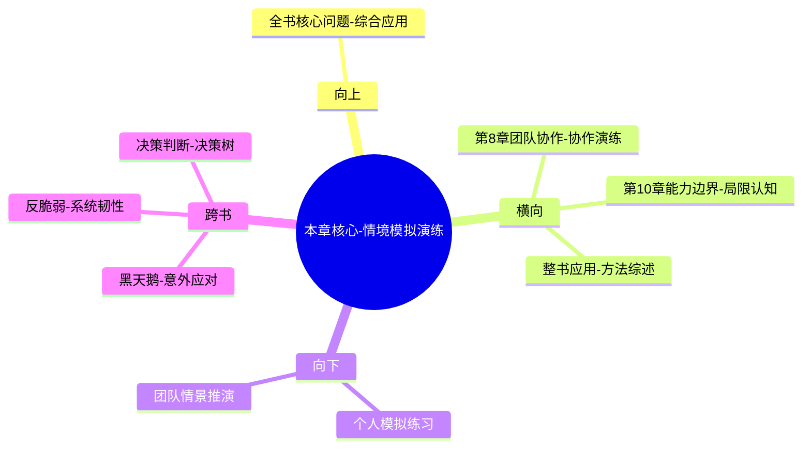

# 第9章 战争游戏

## 📍 章节定位

### 全书位置
> 本章介绍超级预测者和团队使用情境模拟和场景推演的方式，通过构建可能的情景路径来提高预测准确性。这是将前几章介绍的各项技能综合运用于模拟实践的操作环节，体现了全方位的预测能力。通过战争游戏/情景演练，预测者能够提前模拟不同的未来发展路径。

- **全书核心问题**: 普通人如何提升预测准确性以应对不确定性？
- **本章回答的问题**: 如何运用情境模拟和场景推演来提高预测准确性？战争游戏的组织方式和核心技巧是什么？模拟练习如何改进判断？
- **角色类型**: 实战应用型，整合前几章方法的综合性演练
- **论证位置**: 从理论技能向场景演练的关键转化点

### 章节序列
| 方向 | 章节标题 | 逻辑连接 |
|------|----------|----------|
| 前章 | [[第8章-团队智慧]] | 概念承接：团队协作→协作推演 |
| 后章 | [[第10章-预测的局限性]] | 层级递进：情景演练→应用边界认知 |

### 一句话定位
> 第9章通过介绍战争游戏和情境模拟技术，展示预测者如何通过预先演练各种可能情境，系统性地提升对未来复杂事件的应变能力。

---

## 🎯 核心观点

### 第一层：表层案例
> 章节中的具体案例、故事、数据

| 案例名称 | 简要描述 | 页码 | 关键引文 |
|----------|----------|------|----------|
| 俄乌危机演练 | GJP团队模拟战争发展趋势的场景推演 | p.340 | "在冲突加剧之前，我们已经演练过多种可能路径" |
| 中东政治博弈 | 预测团队模拟地区冲突的决策路径 | p.345 | "通过角色扮演发现未预料的政治反应" |
| 经济制裁影响 | 场景推演对制裁连锁反应的预测 | p.350 | "经济制裁的非线性后果让我们大吃一惊" |
| 决策树分析 | 构建事件发展路径的详细模型 | p.355 | "每个决策点都有分支影响最终走向" |

### 第二层：中层机制
> 案例背后的运行机制、方法论

| 机制名称 | 组成要素 | 因果链条 | 证据来源 |
|----------|----------|----------|----------|
| 情境模拟机制 | 多角色+多路径 | 设定场景→分配角色→推理决策→输出可能 | GJP演练数据库 |
| 反事实推理机制 | 假设变更+路径对比 | 变更初始条件→推演差异路径→理解因果 | 历史事件复盘 |
| 情景树构建机制 | 分支节点+概率权 | 确定关键点→设置分支→评估可能→整合结论 | 决策推演记录 |

### 第三层：底层规律
> 可迁移的普遍规律

| 规律陈述 | 抽象层级 | 知识连接 | 适用范围 |
|----------|----------|----------|----------|
| 预演提升应对能力 | 训练科学 | [[刻意练习相关理论]] | 所有复杂情境决策 |
| 情境感知影响判断质量 | 认知心理学 | [[情境认知理论]] | 环境依赖性任务 |
| 多元路径增强预见性 | 决策科学 | [[情景规划方法论]] | 重大决策场景 |

---

## 💬 降维翻译

### 观点1: 提前演练增强现实应变能力

#### 原文表达
> "超级预测者不是等到事情发生后才开始思考应对之策，而是通过事前的情境模拟，预演各种可能发生的路径。这种'演习'大大提升了他们面对真实情况时的反应速度和准确性。" —— p.342

#### 降维翻译（中学生能懂）
就像运动员赛前要训练，消防员平时要练救火一样，厉害的预测者也会预先设想各种可能发生的场景，做好应对方案。等真的发生了类似情况，就可以快速应对了。

#### 日常类比（奶奶能懂）
就像家里要做防灾准备，平时就要想好地震来了怎么办，停水停电了怎么办，准备好了这些预案，真遇到了就不慌张了。

#### 检验
- Q: 如果一个中学生问我为什么要演练？
- A: 因为等真的遇到时，你已经想过对策了，就不会手忙脚乱，能够更好的应对。

### 观点2: 多角色模拟暴露盲点

#### 原文表达
> "当预测者在模拟中扮演不同角色时，他们会从各个利益当事方的角度思考问题，这让他们发现了自己原本作为观察者所忽略的复杂因素。" —— p.347

#### 降维翻译（中学生能懂）
当你预测一个事情的时候，如果能想象自己是当事人，而不仅仅是旁观者，你会从更多角度去看明白整个情况，这样你的预测就会更准确。

#### 日常类比（奶奶能懂）
就像调解邻里纠纷，如果只听一方的话就会误解，如果双方都站出来说明情况，就能搞清真实的情况了。

#### 检验
- Q: 如果一个中学生问我为什么要换角色？
- A: 因为每个人站在自己角度看法不一样，只有都想想才能了解全貌，不然会忽略很多重要因素。

### 观点3: 路径推演识别意外结果

#### 原文表达
> "情境模拟的一个重要功能就是识别可能的意外后果。当我们沿着一条路径逐步展开推演时，经常会遇到出乎意料的发展转折点。" —— p.355

#### 降维翻译（中学生能懂）
在模拟演练过程中，我们会一步一步推演下去，这时候经常会发现一些意想不到的特殊情况可能发生，这就是提前发现了意外结果。

#### 日常类比（奶奶能懂）
就像走远路，纸上规划路线时才发现路上可能有塌方，提前就知道要注意些什么了。

#### 检验
- Q: 如果一个中学生问我演练能发现什么意外？
- A: 就是在一步步设想的过程中，你会发现一些之前没想到的情况，这就是预测到了可能的意外。

---

## ✨ 金句库

### 原书金句
| 金句 | 页码 | 适用场景 |
|------|------|----------|
| 优秀的预测者通过模拟演练为可能发生的意外做准备。 | p.343 | 演练价值引入 |
| 战争游戏是预测者的头脑健身房。 | p.350 | 训练方法比喻 |
| 身临其境的模拟带来了现实中的洞察。 | p.348 | 情景模拟价值 |
| 多重路径推演能揭示单一路径的盲区。 | p.355 | 多路径分析 |
| 准备得最好的预测者不是知道最多的人，而是设想最多的人。 | p.352 | 情景推演核心 |

### 降维金句
| 金句 | 来源观点 | 适用场景 |
|------|----------|----------|
| 练兵千日不为战，只为突发不慌张 | 预演重要性 | 风险管控 |
| 从多个身份看同一件事，才能看透本质 | 多角色模拟 | 视角思维 |
| 推演出意料之外，方能从容应对现实突变 | 路径推演价值 | 应变能力 |
| 练过的预设比临场的判断更准确 | 预设重要性 | 实用指导 |
| 事先想遍意外，胜过事后想应对 | 预防思维 | 策略指导 |

## 🔗 当下映射

### 💰 财富应用
| 场景 | 具体行动 | 预期效果 | 风险提示 |
|------|----------|----------|----------|
| 投资风险预案 | 模拟市场暴跌、政策变化等情况的应对 | 提前准备应对措施 | 过多预案增加焦虑 |
| 理财决策模拟 | 演练不同经济环境下投资组合表现 | 发现潜在问题 | 计算过多可能误判 |
| 职业变动准备 | 预演被裁员或机会出现的各种应对 | 减少突发事件冲击 | 过度担忧影响现状 |

### 💼 职场应用
| 场景 | 具体行动 | 所需能力 | 适用职级 |
|------|----------|----------|----------|
| 项目推进演练 | 模拟项目推进中的各种突发情况 | 危机处理+规划能力 | 项目经理 |
| 会议策略预演 | 预演会议可能的争论热点和应对 | 策略规划+博弈思维 | 中层管理层 |
| 危机公关模拟 | 练习可能出现的公关危机处置 | 沟通+应变能力 | 公关/管理层 |

### 🏠 生活应用
| 场景 | 具体行动 | 可行性 | 见效时间 |
|------|----------|--------|----------|
| 大病救治预案 | 演练家庭成员生大病时的行动安排 | 高 | 持续准备 |
| 远程照顾父母 | 模拟父母突发疾病时的紧急处理 | 高 | 提前备需 |
| 旅行安全预案 | 预演外地旅行可能出现意外情况 | 中 | 旅行准备时 |

### 72小时行动计划
1. 选择一个重要目标，预演可能的3种阻碍和各自的应对策略
2. 模拟一个关键对话场景，从对方角度思考他们可能的观点并准备自己的回应
3. 设计一个应急计划，当当前重要事项出现意外中断时，如何调整应对

---

## 🕸️ 章节关联

### 向上关联 → 整书
- **贡献**: 本章体现了全书方法论的集大成应用，将之前所有技能在模拟环境中综合运用，形成了完整的预测体系
- **位置**: 全书技法的综合性演练总结

### 横向关联 → 章节间
| 章节编号 | 章节标题 | 关联类型 | 连接描述 |
|----------|----------|----------|----------|
| 第8章 | [[第8章-团队智慧]] | 协作深化 | 本章个体演练→第8章团队协作演练 |
| 第10章 | [[第10章-预测的局限性]] | 应用边界 | 演练技能→界限认知 |
| 全书 | [[超预测-泰洛克-拆解记录]] | 综合应用 | 是全书方法论的集中体现 |

### 向下关联 → 具体应用
| 应用场景 | 难度 | 前置知识 |
|----------|------|----------|
| 开展个人情境模拟练习 | 中 | 概率思维+多视角分析 |
| 构建决策树进行路径分析 | 高 | 本章+贝叶斯更新 |
| 组织团队情景演练 | 高 | 本章+团队管理 |

### 跨书关联 → 知识网络
| 书籍 | 概念 | 关系 | 备注 |
|------|------|------|------|
| [[黑天鹅-塔勒布-拆解记录]] | 意外事件应对 | 实践补充 | 战争游戏作为应对黑天鹅的准备 |
| [[反脆弱-塔勒布-拆解记录]] | 系统抗冲击能力 | 方法支撑 | 情景演练提升系统韧性 |
| [[决策与判断-拆解记录]] | 决策树分析 | 技法扩展 | 场景推演的决策树应用 |

### 关联可视化

---

## ❓ 问答设计

### Q1: [记忆型问题]
**认知层次**: 记忆
**难度**: 低
**题目**: 情境模拟在预测中指的是什么？
**答案要点**:
- 事前预演各种可能事件发展路径
- 设定不同角色和场景进行推演
- 暴露潜在盲点和意想不到结果
- 提升真实发生时的应对准确性

### Q2: [理解型问题]
**认知层次**: 理解
**难度**: 中
**题目**: 为什么要从多角色视角开展情景模拟？
**答案要点**:
- 不同角色有不同的利益和动机
- 每个角色会对同一件事做出不同反应
- 观察者视角会忽略当事人才知道的因素
- 综合多个视角能看到更完整的图景

### Q3: [应用型问题]
**认知层次**: 应用
**难度**: 中
**题目**: 如何在个人决策中应用情境模拟？
**答案要点**:
- 设想决策后可能的发展路径
- 想象自己是各个相关方的视角
- 推演各环节可能出现的转折点
- 准备多套应对方案

### Q4: [分析型问题]
**认知层次**: 分析
**难度**: 中
**题目**: 分析情景模拟与真实推演的异同。
**答案要点**:
- 相同点：都涉及路径推演和结果预测
- 相同点：都需要考虑变量和不确定性
- 不同点：模拟可控变量，真实不可控
- 不同点：模拟可重复，真实仅有一次

### Q5: [评价型问题]
**认知层次**: 评价
**难度**: 高
**题目**: 评价情景模拟的效益与成本评估。
**答案要点**:
- 收益：提升应对能力和准确性
- 收益：暴露出意想不到的情况
- 成本：时间和精力的投入需求
- 成本：过度依赖模拟可能脱离现实

### Q6: [创造型问题]
**认知层次**: 创造
**难度**: 高
**题目**: 设计一个企业战略情景模拟框架。
**答案要点**:
- 情景区设定：宏观经济、行业竞争、技术变化
- 角色分配：企业、客户、竞争对手、监管机构
- 推演路线：关键决策点设置和分支分析
- 评估机制：不同结果的应对策略评估

### Q7: [综合型问题]
**认知层次**: 综合
**难度**: 高
**题目**: 综合评估情景模拟技能与整体预测能力的关系。
**答案要点**:
- 情景模拟是前期技能综合应用的场景
- 需要前面所有技能支持（概率、多视角、团队）
- 综合演练提升整体预测技能整合
- 实践应用验证理论学习效果

### Q8: [理解型问题]
**认知层次**: 理解
**难度**: 中
**题目**: 解释为何情境模拟能够发现单一路径盲区？
**答案要点**:
- 单一路径容易忽略其他可能性
- 多路径比对暴露出遗漏环节
- 分叉节点揭示隐藏因果链
- 回溯不同路径找出关键变量

### Q9: [应用型问题]
**认知层次**: 应用
**难度**: 中
**题目**: 如何将情景模拟应用到日常风险管控？
**答案要点**:
- 识别日常生活中的关键风险点
- 构建突发情况的应对预案
- 演练各种危机的处置流程
- 组织家人或朋友参与协作演练

### Q10: [分析型问题]
**认知层次**: 分析
**难度**: 高
**题目**: 分析情景模拟与传统预测方法的区别。
**答案要点**:
- 传统方法：基于历史数据统计推演
- 模拟方法：基于可能场景路径推演
- 传统方法：强调概率统计准确性
- 模拟方法：强调路径多样性和意外性

### Q11: [评价型问题]
**认知层次**: 评价
**难度**: 高
**题目**: 评价个人模拟与团队模拟的效果差异。
**答案要点**:
- 个人模拟：便于思考，但视角有限
- 团队模拟：视角丰富，但协调复杂
- 个人模拟：决策效率高，责任清晰
- 团队模拟：覆盖全面，但可能分歧

### Q12: [创造型问题]
**认知层次**: 创造
**难度**: 高
**题目**: 设计一个用于个人成长的生涯情景模拟器。
**答案要点**:
- 阶段设定：学业、职场、家庭等生命阶段
- 能力要素：知识、技能、资源等发展路径
- 意外设置：失业、转行、创业等突变事件
- 反馈调整：基于模拟结果优化实际规划

### Q13: [综合型问题>
**认知层次**: 综合
**难度**: 高
**题目**: 综合探讨情景模拟对培养反脆弱性的贡献。
**答案要点**:
- 模拟训练提高对意外的适应能力
- 多路径思维增强系统的韧性
- 预案构建提升恢复能力
- 推演经验支持反脆弱机制

### Q14: [理解型问题]
**认知层次**: 理解
**难度**: 中
**题目**: 解释反事实推理在情景模拟中的作用？
**答案要点**:
- 变更变量观察结果差异
- 理解关键要素的影响力
- 突出路径的敏感节点
- 验证因果推断的准确性

### Q15: [应用型问题]
**认知层次**: 应用
**难度**: 中
**题目**: 如何在生活中组织简单的家庭情景模拟？
**答案要点**:
- 选定潜在风险场景（生病、失业、变故）
- 分配家庭成员不同角色和职责
- 推演应急响应流程和资源配置
- 定期回顾和更新应急预案

---
