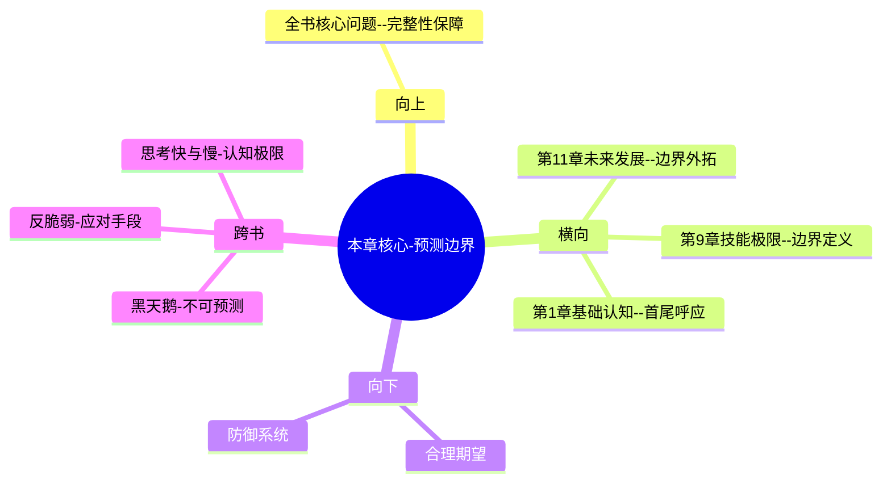

---

category: 
  - 书籍拆解
  - [[超预测-泰洛克]]
status: draft
chapter: 
number: 10
title: 预测的局限性
links:

  - "[[第9章-战争游戏]]"
  - "[[第11章-下一个超级预测者]]"
created: 2026-02-27
tags:
  - 超预测
  - 预测边界
  - 方法局限
  - 能力认知
  - 谦逊智慧
---

# 第10章 预测的局限性

## 📍 章节定位

### 全书位置
> 本章在充分展示预测可习得性和超级预测者能力之后，坦诚分析预测能力的现实边界和方法适用范围。既是对前文预测能力展示的平衡，也是帮助读者建立正确的期望和使用边界认知。这是预防滥用技能的部分，体现了科学理性和谦逊智慧。

- **全书核心问题**: 普通人如何提升预测准确性以应对不确定性？
- **本章回答的问题**: 预测有哪些固有局限？我们无法预测什么？什么情况下预测方法失效？预测技能的应用边界在哪里？
- **角色类型**: 平衡反思型，划定技能边界和适用范围
- **论证位置**: 全书技能介绍的制衡补充，避免能力夸大

### 章节序列
| 方向 | 章节标题 | 逻辑连接 |
|------|----------|----------|
| 前章 | [[第9章-战争游戏]] | 概念平衡：无限可能→有限边界 |
| 后章 | [[第11章-下一个超级预测者]] | 边界认知→未来延续 |

### 一句话定位
> 第10章通过分析预测技术的固有局限和方法边界，帮助读者建立务实的期望，避免预测技能的过度自信和误用，体现了科学的理性认知。

---

## 🎯 核心观点

### 第一层：表层案例
> 章节中的具体案例、故事、数据

| 案例名称 | 简要描述 | 页码 | 关键引文 |
|----------|----------|------|----------|
| 预测失败案例 | 财务预测、选举预测、自然灾害预测的失败 | p.370 | "即使是超级预测者也有无法预测的领域" |
| 系统复杂性障碍 | 股市、全球气候、金融市场崩溃 | p.375 | "混沌系统对初始条件极其敏感" |
| 人类行为的不可预测性 | 个体行为vs群体行为的预测差异 | p.380 | "复杂的人类互动带来不可预测性" |
| 突发事件冲击 | 疫情、恐怖袭击、意外事件的冲击 | p.385 | "黑天鹅事件无法准确预测" |

### 第二层：中层机制
> 案例背后的运行机制、方法论

| 机制名称 | 组成要素 | 因果链条 | 证据来源 |
|----------|----------|----------|----------|
| 边界识别机制 | 问题分类+难易识别 | 预测类型→难度分层→准确性评估 | GJP数据分析 |
| 局限告知机制 | 风险提示+适用范围 | 边界提醒→理性预期→正确使用 | 教学研究报告 |

### 第三层：底层规律
> 可迁移的普遍规律

| 规律陈述 | 抽象层级 | 知识连接 | 适用范围 |
|----------|----------|----------|----------|
| 技能有其局限性 | 能力边界论 | [[技能边界相关理论]] | 所有人类技能边界 |
| 复杂系统难预测 | 系统论 | [[混沌理论]] | 混沌系统预测 |
| 确定性幻觉是危险的 | 心理学认知 | [[认知偏误研究]] | 决策制定领域 |

---

## 💬 降维翻译

### 观点1: 某些事件本质上不可预测

#### 原文表达
> "某些现象从根本上就不可能被精确预测，比如人类的随机创新行为、复杂系统在临界点的行为、以及纯粹的随机事件。企图预测这些领域不仅是徒劳，而且可能导致有害的确定性幻觉。" —— p.372

#### 降维翻译（中学生能懂）
不是什么事情都能量化预判的，有些特别复杂的事情，或者一些纯属巧合的事情，本来就没法算准。非要觉得自己能预测会让人误入歧途。

#### 日常类比（奶奶能懂）
就像刮风下雨虽然大概有规律可循，但今天具体几点几分会下雨就无法准确预知，特别是突然刮起来的大风，谁也没法预知。

#### 检验
- Q: 如果一个中学生问我为什么有些事预测不了？
- A: 因为有些事本身就很复杂不确定，还有的是纯属随机，所以预测不了也很正常。

### 观点2: 预测技能适用于特定问题域

#### 原文表达
> "预测技能在某些领域表现出色（如中期经济增长、选举结果、政策影响），但在另一些领域（如短期股市变动、创新发生时间）则接近随机。了解应用边界是智慧的一部分。" —— p.377

#### 降维翻译（中学生能懂）
预测技能虽然厉害，但不是万能的，只适用于某些类型的判断，比如预测大选谁赢、经济怎么样这类的事；但对股票短线涨跌、什么时候发明新技术这种事就不行。

#### 日常类比（奶奶能懂）
就像医生能看好病，但不能预测明天刮多大风，每种本事都有自己管的事儿，超出了范围就做不到。

#### 检验
- Q: 如果一个中学生问预测技能有什么限制？
- A: 不是所有东西都可以预测的，只有一些有一定规律的事适合用预测技能。

### 观点3: 正确认知边界避免有害自信

#### 原文表达
> "对预测能力的边界有清醒认知，可以避免确定性幻觉。当我们知道自己不能预测什么时，才能真正智慧地运用自己的技能。" —— p.382

#### 降维翻译（中学生能懂）
知道自己什么能预测，什么不能预测，比一味相信自己什么都预测得了更重要。知道自己有极限也是一种智慧，能防止走错路。

#### 日常类比（奶奶能懂）
就像会开车的人要知道自己在什么路况下能开，什么路况开不了。明知不能开的时候非要开就很危险，知道分寸才安全。

#### 检验
- Q: 如果一个中学生问我为什么要知道技能限制？
- A: 因为知道什么做不到，就会避免做傻事，这才算是真正的聪明。

---

## ✨ 金句库

### 原书金句
| 金句 | 页码 | 适用场景 |
|------|------|----------|
| 智慧的一部分在于知道预测的边界。 | p.378 | 边界认知 |
| 对未知的谦卑是我们最大的力量。 | p.382 | 谦逊智慧 |
| 准确知道无法预测的事，也是一种准确。 | p.375 | 准确性认知 |
| 技能的边界比技能本身更重要。 | p.385 | 边界意识 |
| 预测不能预测的是什么，是预测的重要内容。 | p.380 | 反向思考 |

### 降维金句
| 金句 | 来源观点 | 适用场景 |
|------|----------|----------|
| 聪明的预测者知道自己预测不了什么 | 边界认知 | 自我认知 |
| 不可预测的部分恰恰是最需要警觉 | 风险意识 | 风险管控 |
| 预测技能不是万能钥匙 | 适用性认知 | 能力认知 |
| 谦逊是一种预测能力 | 谦虚智慧 | 能力建设 |
| 技能的限制决定其边界 | 边界设定 | 理性规划 |

## 🔗 当下映射

### 💰 财富应用
| 场景 | 具体行动 | 预期效果 | 风险提示 |
|------|----------|----------|----------|
| 股市预测认知 | 承认短线涨跌无法准确预测 | 合理投资策略 | 避免频繁交易 |
| 理财规划局限 | 了解经济大势可判，小波动不可控 | 稳健投资原则 | 不过度杠杆 |
| 项目投资决策 | 识别可预测要素和不可控因素 | 降低预期风险 | 投资前准备 |

### 💼 职场应用
| 场景 | 具体行动 | 所需能力 | 适用职级 |
|------|----------|----------|----------|
| 业务预测边界 | 判断项目中可预判和不确定部分 | 辨别+评估综合能力 | 部门负责人 |
| 战略规划局限 | 识别战略规划中的可预测与未知 | 战略+边界判断能力 | 高级管理层 |
| 风险管理系统 | 在不可预测领域保留缓冲空间 | 风险+应对设计能力 |风控岗位 |

### 🏠 生活应用
| 场景 | 具体行动 | 可行性 | 见效时间 |
|------|----------|--------|----------|
| 健康预测认知 | 知晓长期健康趋势可判断，突发事件难预测 | 高 | 长期规划 |
| 子女教育规划 | 明确教育投入可计划但未来变化不确定 | 高 | 长期视角 |
| 人生规划局限 | 在不确定领域保持灵活调整 | 高 | 持续更新 |

### 72小时行动计划
1. 审视当前正在进行的一个预测判断，明确其中哪些可以科学分析，哪些存在不确定性
2. 对于重要决策中涉及的预测部分，列出自己承认无法预测的风险因素  
3. 与信任的人讨论一个预测，主动分享自己认为的预测边界和局限

---

## 🕸️ 章节关联

### 向上关联 → 整书
- **贡献**: 本章为整个预测技能体系提供了边界认知和现实约束，避免了预测技能的过度神化
- **位置**: 全书理论与实践框架的完整补充

### 横向关联 → 章节间
| 章节编号 | 章节标题 | 关联类型 | 连接描述 |
|----------|----------|----------|----------|
| 第9章 | [[第9章-战争游戏]] | 对比平衡 | 无限可能推演→有限边界认知 |
| 第11章 | [[第11章-下一个超级预测者]] | 承接延续 | 边界认知→未来发展方向 |
| 第1章 | [[第1章-好的判断]] | 哲学呼应 | 整体呼应全书首章对预测能力认识 |

### 向下关联 → 具体应用
| 应用场景 | 难度 | 前置知识 |
|----------|------|----------|
| 制定合理预测期望 | 低 | 本章基础认知 |
| 识别不可预测领域 | 中 | 全系列技能+辩证思维 |
| 建立防御性判断系统 | 高 | 本章+风险管控思维 |

### 跨书关联 → 知识网络
| 书籍 | 概念 | 关系 | 备注 |
|------|------|------|------|
| [[黑天鹅-塔勒布]] | 不可预测事件 | 互补 | 本章解释预测边界+塔勒布强调黑天鹅 |
| [[反脆弱-塔勒布]] | 应对不确定性 | 协同 | 无法预测时如何增强韧性 |
| [[思考快与慢]] | 认知限制 | 呼应 | 认知局限的认知 |

### 关联可视化

---

## ❓ 问答设计

### Q1: [记忆型问题]
**认知层次**: 记忆
**难度**: 低
**题目**: 预测的局限性主要体现在哪些领域？
**答案要点**:
- 复杂系统（如股市、天气）
- 人类随机创新行为  
- 临界点的混沌反应
- 纯粹随机事件的预测

### Q2: [理解型问题]
**认知层次**: 理解
**难度**: 中
**题目**: 为什么理解边界对预测者很重要？
**答案要点**:
- 避免过度自信导致错误决策
- 指导技能的合理应用
- 帮助制定现实的期望
- 防止确定性幻觉的风险

### Q3: [应用型问题]
**认知层次**: 应用
**难度**: 中
**题目**: 如何判断问题是否适合预测？
**答案要点**:
- 是否有历史规律可借鉴
- 是否存在明显因果因素
- 系统复杂度是否可控
- 外部扰动影响有多大

### Q4: [分析型问题]
**认知层次**: 分析
**难度**: 中
**题目**: 分析预测技能在不同领域的适用性差异。
**答案要点**:
- 中长期趋势相对可预测
- 短期波动难准确预测
- 结构稳定领域较易预测
- 高度创新领域极难预测

### Q5: [评价型问题]
**认知层次**: 评价
**难度**: 高
**题目**: 评价过度自信对预测准确性的负面影响。
**答案要点**:
- 低估不确定性，高估预测能力
- 导致过于冒险的决策
- 避免质疑和反思机制
- 忽视黑天鹅式的意外冲击

### Q6: [创造型问题]
**认知层次**: 创造
**难度**: 高
**题目**: 设计一个预测适用性快速评估工具。
**答案要点**:
- 因果清晰度（1-10评分）
- 变化频率评估（稳定度打分）
- 系统复杂度（交互因素数）
- 随机事件影响（外部冲击可能）
- 历史规律性（数据参考度）

### Q7: [综合型问题]
**认知层次**: 综合
**难度**: 高
**题目**: 综合评价预测能力认知与技能应用的平衡关系。
**答案要点**:
- 技能提升与边界认知应同步进行
- 明确边界是更好应用的前提
- 知其可行与知其不可行同等重要
- 两者结合形成完整的预测观

### Q8: [理解型问题]
**认知层次**: 理解
**难度**: 中
**题目**: 解释什么是确定性幻觉？
**答案要点**:
- 觉得未来可以精确定量掌控
- 忽略了系统内在的随机性
- 过度高估模型和预测能力
- 将可能误以为必然

### Q9: [应用型问题]
**认知层次**: 应用
**难度**: 中
**题目**: 如何在团队决策中体现预测边界认知？
**答案要点**:
- 在决策中标识不可预测因素
- 为不确定性预留预案
- 定期检视预测假设的可靠性
- 建立预警和回退机制

### Q10: [分析型问题]
**认知层次**: 分析
**难度**: 高
**题目**: 分析混沌系统特性如何影响预测。
**答案要点**:
- 初始条件极小变化产生巨大差异
- 长期预测在数学上不可能
- 因果链复杂交织，难以追踪
- 相互依存变量过多，影响不可控

### Q11: [评价型问题>
**认知层次**: 评价
**难度**: 高
**题目**: 评价"预测一切"观念的危害性。
**答案要点**:
- 导致战略规划僵硬化
- 忽视意外事件的影响
- 丧失灵活性和适应性
- 造成资源配置失误
- 影响应对突发情况的准备

### Q12: [创造型问题>
**认知层次**: 创造
**难度**: 高
**题目**: 设计一个个人预测能力透明报告模板。
**答案要点**:
- 预测领域划分（擅长项vs不适用项）
- 准确度统计（历史表现数据）
- 边界声明（明确不适用场景）
- 风险提示（未来不确定性说明）
- 更新机制（定期评估修订）

### Q13: [综合型问题>
**认知层次**: 综合
**难度**: 高
**题目**: 综合考虑如何在预测训练中平衡能力强化与边界认知？
**答案要点**:
- 技能训练与边界教育并行
- 成功案例与失败案例并重
- 应用技能与反思局限并举
- 追求准确与接受不确定并行

### Q14: [理解型问题>
**认知层次**: 理解
**难度**: 中
**题目**: 解释复杂系统中涌现现象对预测的挑战。
**答案要点**:
- 局部互动产生全局性质
- 整体行为无法从部分预测
- 突现属性在模型中难刻画
- 复合系统难以解构分析

### Q15: [应用型问题>
**认知层次**: 应用
**难度**: 中
**题目**: 在企业决策中如何建立预测边界管理？
**答案要点**:
- 制定预测适用域明确规范
- 在不确定领域保留战略弹性
- 建立多元化应对预案系统
- 定期审视假设合理性机制

---
