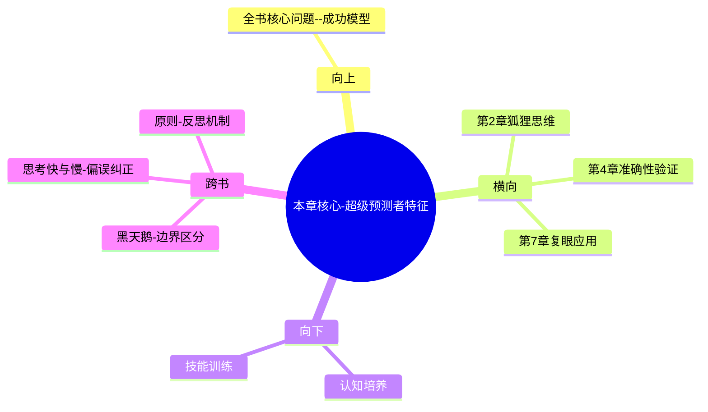

---

category: 
  - 书籍拆解
  - [[超预测-泰洛克]]
status: draft
chapter: 
number: 3
title: 超级预测者
links:

  - "[[第2章-狐狸与刺猬]]"
  - "[[第4章-准确性的真相]]"
created: 2026-02-27
tags:
  - 超预测
  - 超级预测者
  - 预测技能特征
  - 认知能力
  - 决策技巧
---

# 第3章 超级预测者

## 📍 章节定位

### 全书位置
> 本章是全书的核心章节，详细刻画超级预测者的具体特征和能力构成，验证狐狸型思维的实际应用效果，并为后续具体预测方法的学习提供实证基础。

- **全书核心问题**: 普通人如何提升预测准确性以应对不确定性？
- **本章回答的问题**: 超级预测者具有哪些显著特征？他们是如何超越常人的预测能力的？
- **角色类型**: 核心概念型，展示成功的预测者具有的具体特质
- **论证位置**: 理论到实践的过渡，从"为何"进入"如何"

### 章节序列
| 方向 | 章节标题 | 逻辑连接 |
|------|----------|----------|
| 前章 | [[第2章-狐狸与刺猬]] | 概念承接：从狐狸vs刺猬理论到具体实践特征 |
| 后章 | [[第4章-准确性的真相]] | 概念延续：描述特征 → 验证准确性机制 |

### 一句话定位
> 第3章通过GJP项目发现的58位超级预测者的实证分析，揭示了预测高手的具体特征，为普通人提供了可学习、可复制的成功模型。

---

## 🎯 核心观点

### 第一层：表层案例
> 章节中的具体案例、故事、数据

| 案例名称 | 简要描述 | 页码 | 关键引文 |
|----------|----------|------|----------|
| 瑞秋·弗雷泽 | 英国护士，超级预测者 | p.170 | "我试着从每个可能的预测角度出发" |
| 赛斯·阿特尔 | 飞行员+统计学家 | p.175 | "我会把自己想象成一个旁观者" |
| 加里·特罗特 | 退休工程师 | p.180 | "把问题分解成可以衡量的各个部分再组合起来" |
| 美国情报分析师研究 | 机密情报专家vs超级预测者 | p.185 | "掌握机密情报的分析员输给了一群业余爱好者" |

### 第二层：中层机制
> 案例背后的运行机制、方法论

| 机制名称 | 组成要素 | 因果链条 | 证据来源 |
|----------|----------|----------|----------|
| 智力基础机制 | 分析思维+智力水平 | 中等偏高智力→可习得技巧→预测能力 | GJP数据分析 |
| 意愿动力机制 | 关注准确性+好奇心 | 关注分数→反思改进→能力提升 | 超级预测者访谈 |
| 操作技能机制 | 费米拆解+贝叶斯更新 | 问题拆分→外/内部视角→概率调整 | 操作过程分析 |

### 第三层：底层规律
> 可迁移的普遍规律

| 规律陈述 | 抽象层级 | 知识连接 | 适用范围 |
|----------|----------|----------|----------|
| 预测技能可习得性 | 预测科学 | 刻意练习理论 | 所有学习型技能 |
| 价值观导向性 | 心理学 | 成长型思维理论 | 个人发展领域 |
| 反馈循环重要性 | 闭环控制 | 学习科学的反馈理论 | 各类学习过程 |

---

## 💬 降维翻译

### 观点1: 超级预测者的智力基础

#### 原文表达
> "超级预测者的平均智商大约在115-120之间，略高于平均水平，但远不及天才级别。更重要的是，他们的认知风格和思维模式。" —— p.172

#### 降维翻译（中学生能懂）
超级预测者们的聪明水平属于聪明人范围，但不是那种顶级聪明的人。也就是说，成为预测高手并不是要看你有多么聪明，而是看你怎么用脑子处理问题。

#### 日常类比（奶奶能懂）
就像厨艺比赛，获奖的不一定是脑子最灵活的，而是最用心、最有耐心钻研食材搭配和调味的那个人。厨艺好坏主要看用心不用心，不是看聪明不聪明。

#### 检验
- Q: 如果一个中学生问你觉得预测能力跟聪明程度关系如何？
- A: 不是那种超厉害的神童才能预测准确，普通人中等聪明加上好的思考方法就能超越专业人才。

### 观点2: 知识基础与持续更新

#### 原文表达
> "他们持续关注新闻和时事，但是以超级预测者的身份，而非新闻消费者的立场去阅读。每次看到新的消息时，他们会问：这对我正在追踪的预测意味着什么？" —— p.188

#### 降维翻译（中学生能懂）
超级预测者们一直在看新闻，但他们看新闻的方式和其他人不一样。他们总是想着"这个新消息对我之前预测的事有啥影响？"而不是纯粹看热闹。

#### 日常类比（奶奶能懂）
就像种地的农民，天天关注天气预报不只是出于好奇，而是在盘算"下了雨庄稼会长得好不好？要不要提前排水？"他们把信息和自家的庄稼关联起来。

#### 检验
- Q: 如果一个中学生问什么叫新闻消费者vs超级预测者的区别？
- A: 一个是看热闹，一个是想着"这个对我的判断有啥影响吗？需要调整我的看法吗？"

### 观点3: 思考过程的开放性

#### 原文表达
> "优秀的预测者会强迫自己考虑那些挑战他们初始印象的证据。'我可能错在哪里？'这是一个非常强大的反思问题。" —— p.195

#### 降维翻译（中学生能懂）
优秀的预测者会主动去找反面的证据，问自己"哪里有可能搞错了？"这种自我质疑的思维方式让他们能更好地纠正错误。

#### 日常类比（奶奶能懂）
就像做菜时，聪明的人会尝味道后再加调料，而不是加了调味料就不敢再调整。聪明的厨师总在试、在调整，而不是凭一开始的印象就不变了。

#### 检验
- Q: 如果一个中学生问我为什么要质疑自己的判断？
- A: 因为我们的第一印象可能有局限，主动找反面证据就像试菜一样，能帮我们做出更好的调整。

---

## ✨ 金句库

### 原书金句
| 金句 | 页码 | 适用场景 |
|------|------|----------|
| 超级预测者不是超人，而是超常专注于准确性的人。 | p.168 | 强调专注重要性 |
| 我试着从每个可能的预测角度出发。 | p.170 | 展示预测者特征 |
| 把问题分解成可以衡量的各个部分再组合起来。 | p.180 | 介绍解题方法 |
| 我可能错在哪里？这是一个非常强大的反思问题。 | p.195 | 预测反思原则 |
| 他们关注的是如何得到正确答案，而不是维护既有立场。 | p.192 | 价值观导向 |

### 降维金句
| 金句 | 来源观点 | 适用场景 |
|------|----------|----------|
| 预测高手不是天生聪明，而是特别关心对不对 | 智力门槛观点 | 破除天赋迷信 |
| 优秀的预测者不护短，会主动质疑自己 | 开放性观点 | 促进自我反思 |
| 预测=拆解+整合，像搭积木一样 | 方法论介绍 | 技能传授 |
| 看信息先想对自己判断的影响 | 新闻处理方式 | 提供实践指导 |
| 重视准确胜过维护面子 | 价值观优先 | 态度端正 |

## 🔗 当下映射

### 💰 财富应用
| 场景 | 具体行动 | 预期效果 | 风险提示 |
|------|----------|----------|----------|
| 股票投资 | 对持股公司进行分解分析：行业环境+商业模式+财务状况 | 提升分析准确性 | 过度分析错过操作窗口 |
| 理财规划 | 对宏观经济环境进行外部视角评估+个人财务状态内部评估 | 制定合理配置策略 | 信息时效性影响判断 |
| 消费决策 | 分解购买理由：必要性+性价比+替代选择进行判断 | 避免非理性消费 | 对小金额物品同样过度分析 |

### 💼 职场应用
| 场景 | 具体行动 | 所需能力 | 适用职级 |
|------|----------|----------|----------|
| 项目评估 | 分解：市场需求+实现难度+资源需求+竞争环境 | 综合分析能力 | 项目经理及以上 |
| 战略决策 | 外部视角（行业趋势、竞品分析）+内部视角（资源评估） | 战略思维能力 | 管理层 |
| 绩效改进 | 主动找反面证据验证自己的工作成效假设 | 自我反思能力 | 全岗位通用 |

### 🏠 生活应用
| 场景 | 具体行动 | 可行性 | 见效时间 |
|------|----------|--------|----------|
| 房产选择 | 外部：房价走势+政策环境；内部：家庭状况+资金情况 | 中 | 1年以上 |
| 健康管理 | 关注意外信息对自己的健康评估可能带来的影响 | 高 | 持续 |
| 人生态度 | 时刻问"我的人生假设哪里可能是错的" | 高 | 长期 |

### 72小时行动计划
1. 选择一个小的判断（比如明天天气、某件事的进展），分解为3个以上的子问题来分析
2. 主动查找至少一条可能与自己的判断相反的信息来源
3. 针对自己的一个重要决策，列出3个最可能出错的原因

---

## 🕸️ 章节关联

### 向上关联 → 整书
- **贡献**: 本章提供了预测能力的实际榜样，让理论概念具象化，增强可模仿性
- **位置**: 从理论阐述进入实践验证的关键节点

### 横向关联 → 章节间
| 章节编号 | 章节标题 | 关联类型 | 连接描述 |
|----------|----------|----------|----------|
| 第2章 | [[第2章-狐狸与刺猬]] | 验证 | 本章通过具体预测者行为验证狐狸型思维 |
| 第4章 | [[第4章-准确性的真相]] | 接续 | 本章展现特征 → 第4章验证准确性成果 |
| 第7章 | [[第7章-蜻蜓复眼]] | 实操指导 | 本章介绍特征为第7章多视角提供主体基础 |

### 向下关联 → 具体应用
| 应用场景 | 难度 | 前置知识 |
|----------|------|----------|
| 建立预测者思维模式 | 中 | [[第2章-狐狸与刺猬]] |
| 应用预测者技能进行日常决策 | 高 | 本章+第5-6章技能 |
| 训练预测能力 | 高 | 本章+第4-9章全套方法 |

### 跨书关联 → 知识网络
| 书籍 | 概念 | 关系 | 备注 |
|------|------|------|------|
| [[黑天鹅-塔勒布]] | 无法预测极端事件 | 补充 | 本章聚焦可控预测范围，避开黑天鹅领域 |
| [[思考快与慢]] | 认知偏误及纠正 | 应用 | 本章的反射机制是[[思考快与慢-丹尼尔·卡尼曼]]的应用实践 |
| [[原则]] | 原则构建与反思 | 验证 | 超级预测者的反思能力验证原则的必要性 |

### 关联可视化

---

## ❓ 问答设计

### Q1: [记忆型问题]
**认知层次**: 记忆
**难度**: 低
**题目**: 超级预测者的平均智商大概是多少？
**答案要点**:
- 115-120左右，属于中等偏高水平
- 不是天才级别的超高智商
- 智力是必要但非充分条件

### Q2: [理解型问题]
**认知层次**: 理解
**难度**: 中
**题目**: GJP中的超级预测者和专业情报分析师相比表现如何？
**答案要点**:
- 超级预测者比掌握机密情报的专业分析师准确率高出约30%
- 证明预测能力更多取决于方法和思维模式
- 智力和信息优势并非决定性因素

### Q3: [应用型问题]
**认知层次**: 应用
**难度**: 中
**题目**: 如何在日常工作决策中体现超级预测者的思维？
**答案要点**:
- 主动收集不同角度的信息
- 拆解复杂问题为可分析的子问题
- 定期询问"我是错的什么可能性"

### Q4: [分析型问题]
**认知层次**: 分析
**难度**: 中
**题目**: 分析超级预测者为何不护持原有立场。
**答案要点**:
- 更关注预测准确性而非维护自尊
- 将错误视为学习机会而非失败
- 动机源于求真而非获胜

### Q5: [评价型问题]
**认知层次**: 评价
**难度**: 高
**题目**: 评价超级预测者的反思型思维的价值。
**答案要点**:
- 提高预测准确性
- 促进认知改进
- 避免确认偏误
- 短期内可能面临认知不适

### Q6: [创造型问题]
**认知层次**: 创造
**难度**: 高
**题目**: 设计一份自我评估表判断是否具备预测者潜质。
**答案要点**:
- 开放性：对新信息的接纳程度
- 分析性：将复杂问题拆解的能力
- 耐受性：对不确定性的承受力
- 专注性：对准确性的关注度

### Q7: [综合型问题]
**认知层次**: 综合
**难度**: 高
**题目**: 结合超级预测者特征，构建普通人学习预测能力的框架。
**答案要点**:
- 态度转换：从求稳到求准的心理基础
- 工具学习：费米拆解、概率思考等技能
- 实践应用：日常决策中的预测练习
- 反馈循环：建立预测准确性追踪机制

### Q8: [理解型问题]
**认知层次**: 理解
**难度**: 中
**题目**: 超级预测者如何处理新闻信息？
**答案要点**:
- 从预测影响角度而非单纯信息消费者角度
- 思考新信息对现有预测的含义
- 建立信息与预测之间的映射关系

### Q9: [应用型问题]
**认知层次**: 应用
**难度**: 中
**题目**: 模拟超级预测者对股票预测的分析。
**答案要点**:
- 分解：公司基本面+行业趋势+宏观环境
- 外部视角：国际股市关联+历史涨跌模式
- 内部视角：具体财报+管理层动向
- 概率评估：综合各因素给出可能区间

### Q10: [分析型问题]
**认知层次**: 分析
**难度**: 高
**题目**: 分析超级预测者与媒体专家在思维模式上的差异。
**答案要点**:
- 媒体专家：追求明确观点以获得关注
- 超级预测者：追求准确概率以提高精度
- 动机差异：前者重表态，后者重事实
- 风格差异：前者坚持立场，后者频繁调整

### Q11: [评价型问题]
**认知层次**: 评价
**难度**: 高
**题目**: 评价普通人成为超级预测者的可能性。
**答案要点**:
- 可行性存在，但需要大量练习和反馈
- 智力非主要障碍，认知风格是关键
- 心理障碍（爱面子、怕否定）可能更大阻碍
- 适合人群：对准确性有高度追求的人

### Q12: [创造型问题]
**认知层次**: 创造
**难度**: 高
**题目**: 设计针对普通人培养预测技能的训练方案。
**答案要点**:
- 第一阶段：建立预测-验证思维模式
- 第二阶段：学习分析工具和拆解方法
- 第三阶段：实践复杂问题预测
- 第四阶段：建立自我评估系统

### Q13: [综合型问题]
**认知层次**: 综合
**难度**: 高
**题目**: 整合超级预测者特质对个人决策能力的整体提升作用。
**答案要点**:
- 分析技能提升：系统性拆解能力增强
- 决策质量优化：考虑更多变量和可能性
- 反思习惯养成：不断改进和调整
- 抗错能力强：能坦然接受和学习错误

### Q14: [理解型问题]
**认知层次**: 理解
**难度**: 中
**题目**: 解释超级预测者对错误的态度特点。
**答案要点**:
- 错误是学习途径而非个人失败
- 积极寻找可能错误的证据
- 欢迎挑战和反驳意见
- 将不确定性视为正常状态

### Q15: [应用型问题]
**认知层次**: 应用
**难度**: 中
**题目**: 在项目管理中如何应用超级预测者的方法。
**答案要点**:
- 预测项目时间：外参考同类耗时+内评估具体困难
- 风险评估：从不同视角识别潜在问题
- 进度追踪：根据新信息调整原有时间预估
- 反思机制：复盘时重点分析预测偏差原因

---
