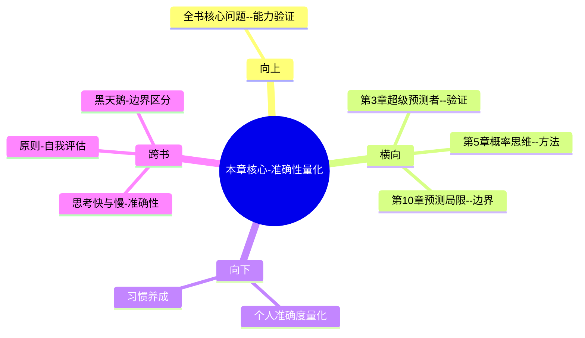

---

category: 
  - 书籍拆解
  - [[超预测-泰洛克]]
status: draft
chapter: 
number: 4
title: 准确性的真相
links:

  - "[[第3章-超级预测者]]"
  - "[[第5章-概率思维]]"
created: 2026-02-27
tags:
  - 超预测
  - 预测准确性
  - GJP项目
  - 预测量化
  - 预测评估
---

# 第4章 准确性的真相

## 📍 章节定位

### 全书位置
> 本章通过GJP项目的具体数据分析，揭示预测准确性的量化方法和提升路径，为理解和评判预测质量提供客观标准，同时为超级预测者的有效性提供实证支撑。

- **全书核心问题**: 普通人如何提升预测准确性以应对不确定性？
- **本章回答的问题**: 如何衡量预测准确性？预测准确性的评估标准是什么？为什么超级预测者确实更准确？
- **角色类型**: 核心概念型，建立预测准确性的量化评估体系
- **论证位置**: 从个体特征描述转向定量评估体系，提供判断依据

### 章节序列
| 方向 | 章节标题 | 逻辑连接 |
|------|----------|----------|
| 前章 | [[第3章-超级预测者]] | 概念承接：从特质描述到准确性验证 |
| 后章 | [[第5章-概率思维]] | 激发延伸：验证准确性原理→介绍概率表达法 |

### 一句话定位
> 第4章通过Brier评分等量化方法揭秘预测准确性的衡量标准，证明超级预测者确实具备显著高于普通人和专家的准确性，建立了客观的预测能力评估体系。

---

## 🎯 核心观点

### 第一层：表层案例
> 章节中的具体案例、故事、数据

| 案例名称 | 简要描述 | 页码 | 关键引文 |
|----------|----------|------|----------|
| Brier评分法 | 计算预测误差的平方和 | p.205 | "Brier得分越低，预测越准确" |
| GJP五年数据 | 2800人项目的成绩验证了预测的可量化性 | p.210 | "超级预测者比专业分析人员准确30%" |
| 预测准确性分布 | 预测能力呈正态分布 | p.215 | "少数人表现显著超出平均水平" |
| 专家vs新手对比 | 专业人士预测 vs 业余爱好者 | p.220 | "掌握机密情报的专家反而表现更差" |

### 第二层：中层机制
> 案例背后的运行机制、方法论

| 机制名称 | 组成要素 | 因果链条 | 证据来源 |
|----------|----------|----------|----------|
| 误差量化机制 | 预测概率-实际结果 | 概率预测→客观评分→准确度排序 | Brier评分数据 |
| 能力筛选机制 | 个人vs群体对比 | 个体练习→准确度对比→优胜劣汰 | GJP项目追踪 |
| 反馈优化机制 | 成绩监控+反思改进 | 量化反馈→发现问题→调整策略 | 高手训练数据 |

### 第三层：底层规律
> 可迁移的普遍规律

| 规律陈述 | 抽象层级 | 知识连接 | 适用范围 |
|----------|----------|----------|----------|
| 准确性可量化 | 计量学 | [[数据分析方法]] | 任何可预测领域 |
| 能力分层级 | 统计学 | [[天赋与技能相关理论]] | 技能型活动分布 |
| 反馈闭环关键 | 学习科学 | [[刻意练习理论]] | 飞轮效应 |

---

## 💬 降维翻译

### 观点1: 预测准确性可量化

#### 原文表达
> "Brier评分是一种衡量概率预测准确性的标准方法，它基于预测概率与实际结果之间的距离进行计算，使得我们第一次拥有了预测质量的精确度量。" —— p.207

#### 降维翻译（中学生能懂）
预测准不准不是靠主观感觉，而是可以用数学公式测量的。Brier评分就像是预测的GPS地图一样，能精确告诉你是偏离了多少，让你知道自己的预测是否接近事实。

#### 日常类比（奶奶能懂）
就像射击打靶，你能不能打得准不能光凭感觉说"我觉得打得还行"，得看你实际打中了几环，差多少才到靶心。预测也是这样，不能说"我觉得我很准确"，得拿实际结果来验证。

#### 检验
- Q: 如果一个中学生问你为什么预测要量化？
- A: 就像考试得有分数才能知道谁学得好一样，预测得有评分才能知道谁判断得准，不然只是各说各有理。

### 观点2: 超级预测者真实存在

#### 原文表达
> "在GJP五年的时间里，我们发现一些人的得分始终优异，他们的表现不是侥幸的结果，而是预测技能使然。" —— p.218

#### 降维翻译（中学生能懂）
超级预测者不是传说，而是通过数据分析发现的真实存在的人群。他们的高准确性不是一次两次运气好，而是持续稳定的准确判断能力。

#### 日常类比（奶奶能懂）
就像真正的神枪手不是偶尔打中靶心，而是几乎次次都能打中。那些预测大师也是，不是一两次猜对了，而是长期预测都比其他人准确得多。

#### 检验
- Q: 如果一个中学生问你什么是真正的预测高手？
- A: 就是那些无论什么问题，预测准确率都比别人高一大截的人，不是靠运气而是靠技能。

### 观点3: 量化反馈促进提升

#### 原文表达
> "知道自己准确得分的预测者，其改进速度比不知情的人快很多。量化反馈是提升预测能力的关键驱动力。" —— p.225

#### 降维翻译（中学生能懂）
知道自己预测准确度的人，能快速发现自己哪里预测错了，从而改进思维模式。如果不记录准确度，就等于做数学题不看答案，根本不知道哪做错了。

#### 日常类比（奶奶能懂）
就像学车一样，光踩油门、转动方向盘是没有用的，必须看着里程表和路况才知道自己开得好不好。预测也是一样，看不到准确度就无法知道自己哪里判断错了。

#### 检验
- Q: 如果一个中学生问我为什么需要记录预测准确性？
- A: 因为你需要知道自己哪些判断准确，哪些有偏差，这样才能改进，不然是蒙着头瞎干。

---

## ✨ 金句库

### 原书金句
| 金句 | 页码 | 适用场景 |
|------|------|----------|
| 预测质量第一次被赋予了数学上的精确性。 | p.205 | 超预测科学性论证 |
| 超级预测者不是运气好，而是技能强。 | p.218 | 驳斥偶然论 |
| 数据不会说谎，准确性是可以测量的。 | p.208 | 量化验证重要 |
| Brier得分让我们终于可以比较谁更准确。 | p.207 | 客观评判标准 |
| 练习和反馈是提高预测能力的唯一道路。 | p.225 | 方法论指导 |

### 降维金句
| 金句 | 来源观点 | 适用场景 |
|------|----------|----------|
| 预测不再是蒙，而是可以测量的科目 | 量化准确性 | 思维升级 |
| 技术打败运气，高手绝非偶然 | 超级预测者存在 | 激励实践 |
| 不记录预测，永远无法提升 | 客观反馈重要 | 实用指导 |
| 看不到差距，谈何进步 | 客观测评 | 自我改进 |
| 真正的预测家不怕验证 | 验证态度 | 价值观引导 |

## 🔗 当下映射

### 💰 财富应用
| 场景 | 具体行动 | 预期效果 | 风险提示 |
|------|----------|----------|----------|
| 投资决策 | 对每一笔投资决定记录当时的预期和实际结果 | 提高投资准确度 | 过度计算影响操作灵活性 |
| 理财规划 | 量化不同理财工具的实际收益是否符合预期 | 优化资产配置 | 历史数据不代表未来表现 |
| 消费决策 | 记录对商品价值的评估和实际体验的匹配度 | 减少后悔购买 | 小额消费过度量化无效率 |

### 💼 职场应用
| 场景 | 具体行动 | 所需能力 | 适用职级 |
|------|----------|----------|----------|
| 项目管理 | 对项目进度、交付成果的预测进行记录和核实 | 目标管理+数据分析 | PM及以上 |
| 销售预测 | 预测客户成交概率和最终业绩进行记录 | 客户分析+业绩追踪 | 销售代表+销售管理 |
| 招聘决策 | 记录对候选人适应性的预判和实际表现对比 | 准确判断+长期追踪 | HR经理+直线经理 |

### 🏠 生活应用
| 场景 | 具体行动 | 可行性 | 见效时间 |
|------|----------|--------|----------|
| 感情生活 | 记录对伴侣行为和想法的预测准确性 | 低 | 需谨慎，涉及隐私 |
| 身体健康 | 预测健康相关行为对身体的实际影响 | 高 | 持续记录 |
| 学习新技能 | 预测学习进度和实际达到效果的对比 | 高 | 短期可见 |

### 72小时行动计划
1. 回顾过去一年做的3-5个重要决策，尝试还原当时的具体预测和实际结果（准确性评估）
2. 选定一个当前的小预测（如天气、朋友行为、会议时间等），正式记录自己的判断概率和信心度
3. 设置一个每日提醒，用1分钟回顾当天的一个判断是否准确（如交通猜测，饭菜口感等）

---

## 🕸️ 章节关联

### 向上关联 → 整书
- **贡献**: 本章提供了预测能力的客观衡量标准，验证了超级预测者的实际存在
- **位置**: 全书实证验证环节，从理论进入数据分析

### 横向关联 → 章节间
| 章节编号 | 章节标题 | 关联类型 | 连接描述 |
|----------|----------|----------|----------|
| 第3章 | [[第3章-超级预测者]] | 验证 | 本章验证第三章描述的特征实际产生更高准确性 |
| 第5章 | [[第5章-概率思维]] | 承接 | 本章建立量化基础 → 第5章介绍概率表达法 |
| 第10章 | [[第10章-预测的局限性]] | 限定 | 本章展示准确性潜力 → 第10章说明局限边界 |

### 向下关联 → 具体应用
| 应用场景 | 难度 | 前置知识 |
|----------|------|----------|
| 建立个人预测档案 | 中 | 记录追踪习惯 |
| 应用量化方法改进预测 | 高 | 本章+概率思维 |
| 开始追踪个人预判准确性 | 低 | 本章基础+意愿 |

### 跨书关联 → 知识网络
| 书籍 | 概念 | 关系 | 备注 |
|------|------|------|------|
| [[思考快与慢]] | 判断准确度 | 补充 | 卡尼曼的准确性问题在此得到解决方案 |
| [[原则]] | 自我评估体系 | 类比 | 对标达利欧的"痛苦按钮"记录法 |
| [[黑天鹅-塔勒布]] | 不可预测性边界 | 区分 | 本章聚焦可预测领域而非黑天鹅领域 |

### 关联可视化

---

## ❓ 问答设计

### Q1: [记忆型问题]
**认知层次**: 记忆
**难度**: 低
**题目**: Brier评分法是用来做什么的？
**答案要点**:
- 衡量概率预测准确性的方法
- 基于预测概率与实际结果之间的距离
- 分数越低预测越准确  
- 使预测质量可量化比较

### Q2: [理解型问题]
**认知层次**: 理解
**难度**: 中
**题目**: 为什么准确性评估在预测活动中如此重要？
**答案要点**:
- 无法量化就不知道当前水平
- 没有反馈就无法改进提升
- 客观对比才能鉴别真假高手
- 防止自恋和过度自信的偏误

### Q3: [应用型问题]
**认知层次**: 应用
**难度**: 中
**题目**: 如何在日常生活决策中应用准确性追踪？
**答案要点**:
- 选取日常可验证的预测场景
- 记录预判与实际结果对比
- 定期回顾反思错误模式
- 根据反馈调整预测方法

### Q4: [分析型问题]
**认知层次**: 分析
**难度**: 中
**题目**: 分析超级预测者在准确性上超越一般专家的原因。
**答案要点**:
- 资源投入与反馈循环差异  
- 预测策略和认知风格的不同
- 注意力分配机制的优越性
- 量化自我监控能力更强

### Q5: [评价型问题]
**认知层次**: 评价
**难度**: 高
**题目**: 评价Brier评分法的优势和局限。
**答案要点**:
- 优势：客观性强，可比较性高，易于计算
- 优势：适用于二元和多结果预测
- 局限：可能不适合极度不平衡的结果
- 局限：短期内可能出现统计波动误导

### Q6: [创造型问题]
**认知层次**: 创造
**难度**: 高
**题目**: 设计一个个人预测能力提升的评估系统。
**答案要点**:
- 预测记录模块：概率+理由记录
- 真实性追踪：结果验证机制  
- 反馈统计：Brier分+置信区间
- 改进计划：弱点分析与培训建议

### Q7: [综合型问题]
**认知层次**: 综合
**难度**: 高
**题目**: 综合评价预测准确性概念对现代决策的重要意义。
**答案要点**:
- 推动决策从经验主义转向数据驱动
- 促进行业建立科学决策标准
- 帮助识别真正的判断专家
- 奠定预测训练的科学基础

### Q8: [理解型问题]
**认知层次**: 理解
**难度**: 中
**题目**: 解释为什么有些领域的预测可以被准确评估？
**答案要点**:
- 事件具有确定的二元或多元结果
- 有明确的时间期限界定
- 结果可以客观验证
- 预测事件相对独立而非强相互依赖

### Q9: [应用型问题]
**认知层次**: 应用
**难度**: 中
**题目**: 如何应用准确性评估改进团队决策质量？
**答案要点**:
- 建立团队预判共享登记册  
- 定期对照实际结果分析误差
- 识别团队内部的认知盲区
- 提升成员预测准确性意识

### Q10: [分析型问题]
**认知层次**: 分析
**难度**: 高
**题目**: 分析准确性提升背后的认知神经学基础。
**答案要点**:
- 前额皮质的元认知机能参与
- 反馈回路增强预测-结果关联
- 神经可塑性支持预测算法优化
- 情绪调节增强客观判断

### Q11: [评价型问题]
**认知层次**: 评价
**难度**: 高
**题目**: 评价准确性评估对个人成长的影响。
**答案要点**:
- 增强谦卑心态，减少盲目自信
- 促进持续学习和改进意愿  
- 提升风险管控与决策质量
- 可能增加决策时的心理压力

### Q12: [创造型问题]
**认知层次**: 创造
**难度**: 高
**题目**: 设计一款用于普通人的准确性提升工具应用。
**答案要点**:
- 预测创建助手：提供分解提示
- 进度追踪：实时评分提醒
- 智能反馈：识别错误模式
- 社区互动：多人预测比赛

### Q13: [综合型问题]
**认知层次**: 综合
**难度**: 高
**题目**: 将预测准确性评估与决策质量改进系统整合。
**答案要点**:
- 理念融合：预测思维融入决策流程
- 工具统一：准确性评估集成在决策系统
- 反馈闭环：决策结果反馈预测准确度
- 能力建设：基于准确度的个人技能提升

### Q14: [理解型问题]
**认知层次**: 理解
**难度**: 中
**题目**: 解释Brier分数如何处理概率预测准确性。
**答案要点**:
- 完全正确预测获得满分
- 概率偏差越大得分越高
- 数学上惩罚过度自信
- 可分解为可靠性与分辨力

### Q15: [应用型问题]
**认知层次**: 应用
**难度**: 中
**题目**: 在企业环境中如何实施预测准确性评估制度？
**答案要点**:
- 经营预测：设置销售、成本等关键指标准确性考核
- 战略规划：对比战略预判与实际结果
- 项目管理：预测完成时间与质量的验证
- 客观追踪：建立透明评估与反馈机制

---
