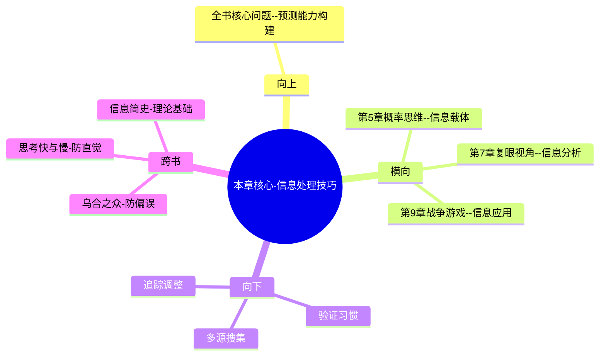

---

category: 
  - 书籍拆解
  - [[超预测-泰洛克]]
status: draft
chapter: 
number: 6
title: 超级新闻迷
links:

  - "[[第5章-概率思维]]"
  - "[[第7章-蜻蜓复眼]]"
created: 2026-02-27
tags:
  - 超预测
  - 信息素养
  - 多源验证
  - 信息处理技巧
  - 媒体素养
---

# 第6章 超级新闻迷

## 📍 章节定位

### 全书位置
> 本章展示超级预测者如何高效处理和利用信息，特别是新闻信息，揭示了他们在信息搜集、筛选、验证方面的独特技能。这是从基础认知思维向实际行动技能的关键转换，介绍了具体的操作技巧。

- **全书核心问题**: 普通人如何提升预测准确性以应对不确定性？
- **本章回答的问题**: 超级预测者如何获取、筛选、验证信息？如何在海量信息中找到对预测有价值的内容？
- **角色类型**: 核心技能型，从概率认知转向信息处理操作
- **论证位置**: 从思维模式进入行为习惯层面

### 章节序列
| 方向 | 章节标题 | 逻辑连接 |
|------|----------|----------|
| 前章 | [[第5章-概率思维]] | 概念承接：从概率思维→信息处理方法 |
| 后章 | [[第7章-蜻蜓复眼]] | 功能衔接：信息处理→多视角切换 |

### 一句话定位
> 第6章揭示超级预测者独特的新闻处理习惯——不仅广泛收集信息，更能主动验证信息，持续关注预测相关的新闻，将信息消化为预测改进的素材。

---

## 🎯 核心观点

### 第一层：表层案例
> 章节中的具体案例、故事、数据

| 案例名称 | 简要描述 | 页码 | 关键引文 |
|----------|----------|------|----------|
| 瑞秋的阅读习惯 | 一天花3-4小时阅读各类新闻源 | p.255 | "我不是信息消费者，我是信息收集者" |
| 瑞士脱欧类比案例 | 用瑞士政治信息类比预测英国脱欧 | p.260 | "寻找历史上的类比来预测可能的路径" |
| 信息验证技巧 | 不仅获取信息，更验证信息准确性 | p.265 | "我会核实信息来源及准确性" |
| 新闻敏感度 | 持续关注预测事件的新闻报道 | p.270 | "当新闻与我的预测相关时，我会特别留意" |

### 第二层：中层机制
> 案例背后的运行机制、方法论

| 机制名称 | 组成要素 | 因果链条 | 证据来源 |
|----------|----------|----------|----------|
| 信息搜集机制 | 广泛来源+多角度 | 多源输入→更完整画面→减少盲区 | 超级预测者访谈 |
| 信息验证机制 | 交叉验证+溯源 | 三方对比→识别误传→提高信度 | 信息准确性研究 |
| 注意力分配机制 | 主动导向+预测相关度 | 预测目标→关注焦点→信息处理效率 | 注意力经济学理论 |

### 第三层：底层规律
> 可迁移的普遍规律

| 规律陈述 | 抽象层级 | 知识连接 | 适用范围 |
|----------|----------|----------|----------|
| 信息广度提升判断全面性 | 决策科学 | 信息茧房相关理论 | 所有信息处理场景 |
| 目标导向提升信息处理效率 | 注意心理学 | 注意力管理理论 | 定向搜索任务 |
| 验证习惯确保信息质量 | 科技素养 | 媒介素养教育 | 数字信息时代生存 |

---

## 💬 降维翻译

### 观点1: 变被动为主动的信息处理

#### 原文表达
> "超级预测者不是漫无目的地读新闻，而是带着明确的目的，寻找与自己正在预测事件相关的新信息。他们是信息的主动驾驭者，而不是被动接收者。" —— p.257

#### 降维翻译（中学生能懂）
一般的读新闻是为了了解发生了什么事情，但超级预测者读新闻是为了寻找可以帮助他预测的数据。他们读书目的明确，不是泛泛而过，这是很大的区别。

#### 日常类比（奶奶能懂）
就像买菜人和研究人员的区别：买菜人是看看市场上有什么菜，研究员是专门寻找特定营养成分的信息。预测者是后者，他们不是随便看看，而是在找对预测有用的信息。

#### 检验
- Q: 如果一个中学生问我预测者和普通人看书有什么区别？
- A: 普通人看新闻是为了"了解发生什么事"，预测者看新闻是为了"我预测的事是不是有变化"。

### 观点2: 多源交叉验证保障信息质量

#### 原文表达
> "超级预测者从不会只依赖一个信息来源，他会交叉比较多个不同来源的报道，特别是那些立场不同的媒体，以此辨别信息的真实性。" —— p.266

#### 降维翻译（中学生能懂）
想要知道一条新闻真假，要去看不同立场的媒体怎么说，并且要找到源头去验证。超级预测者不会轻易相信单一的渠道。

#### 日常类比（奶奶能懂）
就像古董鉴定，一个专家说值钱你不能就信了，得找其他几个不同眼光的专家都看看，如果大家都有一样的判断，才比较可信。

#### 检验
- Q: 如果一个中学生问我为什么要看多个来源新闻？
- A: 因为您从一家知道的消息可能不准确，看多家才能知道真正发生了什么，避免被误导。

### 观点3: 持续关注形成动态判断

#### 原文表达
> "他们不是一次性地预测后就结束，而是会持续关注相关新闻，不断地根据新信息更新自己的判断。这就像监控器一样，始终保持对预测事件的敏锐觉察。" —— p.272

#### 降维翻译（中学生能懂）
做完预测不代表结束了，而要一直盯着相关信息的变化，一旦有新消息就要重新评估一下，不能预测完就不管了。

#### 日常类比（奶奶能懂）
就像煮粥一样，把火开了不代表就等着了，还得时不时去看看、搅一搅、尝一尝咸淡，随时调整。

#### 检验
- Q: 如果一个中学生问我为什么预测完了还要一直关注？
- A: 因为情况是会变的，你不跟着变就会判断错误，预测是要随时调整的。

---

## ✨ 金句库

### 原书金句
| 金句 | 页码 | 适用场景 |
|------|------|----------|
| 我不是信息消费者，我是信息收集者。 | p.256 | 媒体素养理念 |
| 优秀的预测者会主动寻觅，而非被动接受。 | p.257 | 信息处理态度 |
| 一个信息源是不可靠的，多个才是参考。 | p.266 | 信息验证 |
| 预测不是静止的判断，而是动态的过程。 | p.270 | 预测过程观 |
| 真实性比新颖性更重要。 | p.272 | 信息价值观 |

### 降维金句
| 金句 | 来源观点 | 适用场景 |
|------|----------|----------|
| 真正厉害的人读信息不为了凑热闹，而是为了找线索 | 主动信息搜集 | 阅读目标 |  
| 看一个消息真假要像侦探一样多方取证 | 多源验证 | 媒体素养 |
| 聪明的预测不是一次完成，而是一直追踪 | 持续关注 | 预测方法论 |
| 信息处理高手都有交叉验证的习惯 | 验证思维 | 实用习惯 |
| 不轻信、勤验证是数字时代的基本素养 | 验证意识 | 数字认知 |

## 🔗 当下映射

### 💰 财富应用
| 场景 | 具体行动 | 预期效果 | 风险提示 |
|------|----------|----------|----------|
| 投资信息搜集 | 关注多类别财经媒体，交叉验证信息 | 提升信息质量 | 时间投入过大 |
| 市场趋势判断 | 建立新闻来源清单，定时追踪 | 减少决策盲目性 | 信息噪音干扰 |
| 理财决策 | 对关键经济数据进行多源对比 | 提升判断准确度 | 信息超载 |

### 💼 职场应用
| 场景 | 具体行动 | 所需能力 | 适用职级 |
|------|----------|----------|----------|
| 行业动态跟踪 | 关注多个垂直媒体，交叉比对信息 | 信息整理+分析能力 | 中层及以下 |
| 竞品分析 | 不依赖单一信源，建立多方情报网 | 研究+验证综合能力 | 市场/战略岗 |
| 业务决策 | 建立信息验证流程，避免单一误导 | 辨别+判断综合能力 | 管理层 |

### 🏠 生活应用
| 场景 | 具体行动 | 可行性 | 见效时间 |
|------|----------|--------|----------|
| 健康决策 | 对健康资讯查证多个可信来源 | 高 | 持续有效 |
| 消费决策 | 查找多项评测进行对比参考 | 高 | 短期可见 |
| 学习新知 | 交叉验证在线信息，避免被误导 | 中 | 持续累积 |

### 72小时行动计划
1. 选择一个重要决策主题，建立不少于3个不同来源的信息监测清单
2. 从今天开始，每当看到有趣信息时，主动寻找另外2个来源进行交叉验证
3. 设定每日信息整理时间，将获取的信息与之前的预测判断进行对比分析

---

## 🕸️ 章节关联

### 向上关联 → 整书
- **贡献**: 本章为全书提供了信息处理的具体行动指南，是连接认知层面和操作层面的关键环节
- **位置**: 从理论思考进入实践操作的重要桥梁

### 横向关联 → 章节间
| 章节编号 | 章节标题 | 关联类型 | 连接描述 |
|----------|----------|----------|----------|
| 第5章 | [[第5章-概率思维]] | 技能支撑 | 概率思维提供工具→本章提供原料(信息) |
| 第7章 | [[第7章-蜻蜓复眼]] | 功能协同 | 本章搜集信息+第7章多视角分析→综合判断 |
| 第9章 | [[第9章-战争游戏]] | 实践拓展 | 信息处理技能在场景模拟中的深化应用 |

### 向下关联 → 具体应用
| 应用场景 | 难度 | 前置知识 |
|----------|------|----------|
| 建立个人媒体监控清单 | 中 | 信息筛选能力 |
| 开发信息验证习惯 | 中 | 批判性思维 |
| 运营持续追踪机制 | 高 | 本章+时间管理 |

### 跨书关联 → 知识网络
| 书籍 | 概念 | 关系 | 备注 |
|------|------|------|------|
| [[乌合之众-勒庞]] | 群体认知偏误 | 防范 | 多源验证防范群体误判 |
| [[思考快与慢]] | 惯性思维陷阱 | 改进 | 交叉验证防止直觉误判 |
| 信息简史 | 信息的本质 | 理论基础 | 建立正确的信息价值观 |

### 关联可视化

---

## ❓ 问答设计

### Q1: [记忆型问题]
**认知层次**: 记忆
**难度**: 低
**题目**: 超级预测者的信息处理与其他一般人有什么基本区别？
**答案要点**:
- 主动搜集 vs 被动接收 
- 目标导向 vs 泛泛而过
- 持续追踪 vs 一次性判断
- 多源验证 vs 单一依赖

### Q2: [理解型问题]
**认知层次**: 理解
**难度**: 中
**题目**: 为什么多源交叉验证能提升信息质量？
**答案要点**:
- 不同立场来源有不同盲点，相互补充
- 受到操控的信息容易在多方比对中暴露
- 源头核查能避免传播过程中的变形
- 大量验证能筛选虚假信息

### Q3: [应用型问题]
**认知层次**: 应用
**难度**: 中
**题目**: 如何在日常社交媒体使用中应用交叉验证？
**答案要点**:
- 看到重要信息时先核实原始发布渠道
- 查找多个角度的二次报导
- 对比持不同立场的声音
- 验证转发链条中的变形环节

### Q4: [分析型问题]
**认知层次**: 分析
**难度**: 中
**题目**: 分析"信息迷"和"信息消费者"的区别。
**答案要点**:
- 信息迷：主动寻找特定信息解决特定疑问
- 信息迷：建立系统性收集渠道网络
- 信息消费者：被动接受推送内容
- 信息消费者：消费后即忘记，不建立体系

### Q5: [评价型问题]
**认知层次**: 评价
**难度**: 高
**题目**: 评价持续追踪新闻对预测准确性的利弊。
**答案要点**:
- 优点：及时捕捉变化，优化预测精度
- 优点：避免基于陈旧信息形成滞后判断  
- 劣势：信息过载，影响决策效率
- 劣势：短期波动可能误导长期趋势预测

### Q6: [创造型问题]
**认知层次**: 创造
**难度**: 高
**题目**: 设计一套个人新闻验证系统。
**答案要点**:
- 收集层：建立分类信源池（左中右立场）
- 验证层：三源对比验证机制
- 分析层：自动标记未验证信息
- 更新层：定期评估信源可靠性

### Q7: [综合型问题]
**认知层次**: 综合
**难度**: 高
**题目**: 综合构建个人媒体素养提升计划。
**答案要点**:
- 信息输入：建立多元化信源体系
- 信息处理：训练验证和质疑习惯
- 信息输出：避免传播未验证信息
- 长期改进：建立反馈和评估机制

### Q8: [理解型问题]
**认知层次**: 理解
**难度**: 中
**题目**: 解释超级预测者如何看待信息时效性？
**答案要点**:
- 不是越新越好，关键看是否影响预测
- 老信息可能比新信息更重要
- 建立动态信息价值评估
- 定期更新预测相关性判断

### Q9: [应用型问题]
**认知层次**: 应用
**难度**: 中
**题目**: 如何在职业发展中应用超级新闻迷思路？
**答案要点**:
- 关注行业发展动态，不仅在本职范围内
- 建立职业领域信息监控系统
- 定期验证职业判断是否有更新
- 用信息指导职业路径预判

### Q10: [分析型问题]
**认知层次**: 分析
**难度**: 高
**题目**: 分析不同信息类型的验证策略。
**答案要点**:
- 事实类：多方新闻验证法
- 数据类：查证原始数据来源
- 判断类：比对多个专家观点
- 趋势类：查找历史演变路径

### Q11: [评价型问题]
**认知层次**: 评价
**难度**: 高
**题目**: 评价社交媒体对信息验证习惯的挑战。
**答案要点**:
- 正面：传播速度快，覆盖面广
- 负面：真假掺杂，验证困难
- 挑战：算法推荐强化信息茧房
- 策略：建立离线验证机制，避免算法束缚

### Q12: [创造型问题]
**认知层次**: 创造
**难度**: 高
**题目**: 构思一个团队信息处理验证系统。
**答案要点**:
- 分工合作：团队成员分担信源收集
- 并行验证：多线程交叉检查不同信息
- 统一平台：共享验证结果
- 质量控制：集体评议重要判断

### Q13: [综合型问题]
**认知层次**: 综合
**难度**: 高
**题目**: 探讨信息素养与预测能力的共生关系。
**答案要点**:
- 预测准确性依赖高质量信息基础
- 信息处理能力在预测实践中得到验证
- 持续关注提升信息敏感度
- 反馈循环提升整个系统质量

### Q14: [理解型问题]
**认知层次**: 理解
**难度**: 中
**题目**: 解释为什么信息验证需要不同立场的信源？
**答案要点**:
- 立场一致性隐藏信息盲点
- 不同视角暴露问题多面性  
- 左右相互制衡避免单一偏误
- 多角度形成全面信息图景

### Q15: [应用型问题]
**认知层次**: 应用
**难度**: 中
**题目**: 如何在教育投资决策中运用超级新闻迷技巧？
**答案要点**:
- 关注教育政策变化的官方与民间信息
- 交叉验证教育赛道的发展数据
- 追踪教育相关经济指标动态
- 建立长期信息监控预警体系

---
