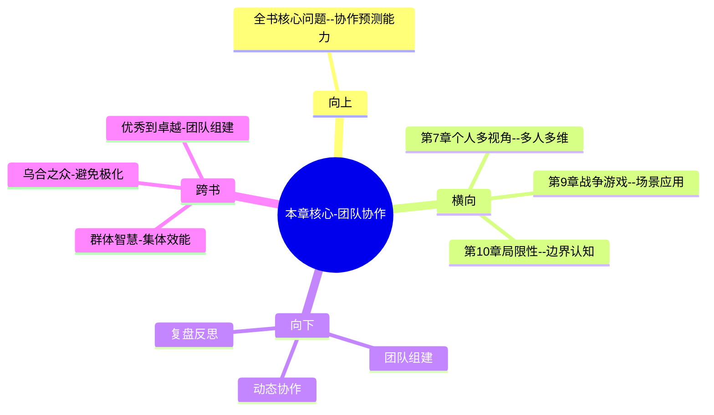

---

category: 
  - 书籍拆解
  - [[超预测-泰洛克]]
status: draft
chapter: 
number: 8
title: 团队智慧
links:

  - "[[第7章-蜻蜓复眼]]"
  - "[[第9章-战争游戏]]"
created: 2026-02-27
tags:
  - 超预测
  - 团队协作
  - 集体智慧
  - 动态团队
  - 群体决策
---

# 第8章 团队智慧

## 📍 章节定位

### 全书位置
> 本章探讨超级预测者的协作模式，揭示在团队环境中原子化的优秀个体如何产生协同效应。从个体预测技巧转向集体协作机制，展示了团队预测相对于个体的优势。同时指出团队协作的关键要素和避免群体性错误的注意事项。

- **全书核心问题**: 普通人如何提升预测准确性以应对不确定性？
- **本章回答的问题**: 独立预测者与团队协作预测哪种更准确？如何组建高效预测团队？团队预测如何避免集体错误？
- **角色类型**: 实践拓展型，从个人能力向协作技能转化
- **论证位置**: 个人技能向团队协作的跨越，展示协作增值效益

### 章节序列
| 方向 | 章节标题 | 逻辑连接 |
|------|----------|----------|
| 前章 | [[第7章-蜻蜓复眼]] | 概念承接：个体多视角→多人多视角协作 |
| 后章 | [[第9章-战争游戏]] | 实践拓展：团队协作→模拟演练 |

### 一句话定位
> 第8章揭示个体预测者组建成团队后不仅保持个人优势，还通过协作讨论产生1+1>2的协同效应，展现了动态团队协作预测的巨大价值。

---

## 🎯 核心观点

### 第一层：表层案例
> 章节中的具体案例、故事、数据

| 案例名称 | 简要描述 | 页码 | 关键引文 |
|----------|----------|------|----------|
| 独立vs团队测试 | 独立预测组vs协作组的准确性对比实验 | p.310 | "团队预测者比独立预测者准确15%以上" |
| 超级小组 | 5个左右超级预测者组成动态团队 | p.315 | "小型团队的动态协作优于大型团队" |
| 反思机制 | 定期复盘预测失误原因的讨论会 | p.320 | "团队反思对准确性的促进最为明显" |
| 信息交换 | 团队成员分享不同来源信息实例 | p.325 | "每个团队成员都有独特情报网络" |

### 第二层：中层机制
> 案例背后的运行机制、方法论

| 机制名称 | 组成要素 | 因果链条 | 证据来源 |
|----------|----------|----------|----------|
| 信息聚合机制 | 个体情报网络+信息共享 | 各携所需→信息互补→决策完整 | GJP团队数据 |
| 视角补充机制 | 多维框架+团队讨论 | 独特视角→视角分享→整体提升 | 团队访谈记录 |
| 反思促进机制 | 错误回顾+集体分析 | 预测失误→反思讨论→知识沉淀 | 团队学习记录 |

### 第三层：底层规律
> 可迁移的普遍规律

| 规律陈述 | 抽象层级 | 知识连接 | 适用范围 |
|----------|----------|----------|----------|
| 合作提升效率 | 协同效应理论 | 集体智慧相关理论 | 复杂任务领域 |
| 群体质量>数量 | 团队动力学 | 高质量小团队相关研究 | 协作解决问题 |
| 讨论促进反思 | 学习科学理论 | 社会建构学习 | 认知提升场景 |

---

## 💬 降维翻译

### 观点1: 小型精英团队优于大团队

#### 原文表达
> "最佳预测团队通常只有4-5个人，这样的规模足以提供多元化的思维视角，又不会让每个人都觉得可以搭便车或因人数过多而无法充分表达。" —— p.317

#### 降维翻译（中学生能懂）
一个预测团队最好的人数是4-5人，既能从不同角度看问题，又能让每个人都充分发表观点。如果太多人，反而没有人认真负责了。

#### 日常类比（奶奶能懂）
就像一个厨房，两三个人一起做菜可以互相帮助，配合默契，但如果有十几个人在厨房里，反而会挤来挤去，有人偷懒，效率还不高。

#### 检验
- Q: 如果一个中学生问我为什么预测团队不能太大？
- A: 因为人多了大家都不愿意思考，觉得有人会管，而且还可能有想法的人太多反而乱。

### 观点2: 团队动态比静态组成更重要

#### 原文表达
> "预测能力出色的团队不是由静态的固定成员组成，而是根据预测主题的不同，动态地召集拥有相应专长的专家。团队的质量在于协作过程，而非成员名单。" —— p.325

#### 降维翻译（中学生能懂）
好的预测团队不是固定的，而是根据不同问题临时挑选合适的人。重要的是这些人在一起怎么样讨论做事，而不是他们本身有多厉害。

#### 日常类比（奶奶能懂）
就像请客吃饭，重要的不是请了哪些人，而是客人坐在一起聊得好不好，气氛怎么样。同样的人换不同的场合搭配，效果可能会不一样。

#### 检验
- Q: 如果一个中学生问什么是动态团队？
- A: 就是根据不同问题挑不同的专家来讨论解决，不固定，讲究用最合适的人解决特定问题。

### 观点3: 协作反思提升预测能力

#### 原文表达
> "最有效的团队不仅仅是预测，还会定期停下来看看哪些预测成功了，哪些失败了，为什么会这样。这种集体反思是提升预测准确性的强大引擎。" —— p.322

#### 降维翻译（中学生能懂）
高效的预测团体不只是做预测，还会一起回顾之前哪个预测对了，哪个错了，为什么会这样。大家一起复盘是提升预测水平的关键。

#### 日常类比（奶奶能懂）
就像下棋，高手不仅会下一盘棋，还会复盘，想想哪步棋走得不好，为什么没下好，下次就知道该怎么办了。

#### 检验
- Q: 如果一个中学生问我团队要不要回顾错误？
- A: 当然要！一起聊聊做对了什么，搞砸了什么，这样才会越来越准确。

---

## ✨ 金句库

### 原书金句
| 金句 | 页码 | 适用场景 |
|------|------|----------|
| 优秀的预测者在团体中会变得更优秀。 | p.315 | 团队协作价值 |
| 人数越多未必越好，质量大于数量。 | p.317 | 团队规模选择 |
| 预测不仅是个人行为，更是协作的艺术。 | p.325 | 预测观念升级 |
| 反思是预测能力成长的催化剂。 | p.322 | 团队复盘价值 |
| 动态组合胜过静态组织。 | p.328 | 组织形式选择 |

### 降维金句
| 金句 | 来源观点 | 适用场景 |
|------|----------|----------|
| 高手抱团不是1+1=2，而是1+1>2 | 协同效应 | 团队价值 |
| 小而美团队胜过大而散组织 | 小团队优势 | 组织策略 |
| 讨论反思比个人埋头苦干更重要 | 反思价值 | 个人成长 |
| 合适的时候找到合适的人 | 动态协作 | 策略智慧 |
| 质量导向的协作优于数量堆叠 | 人员选择 | 高效工作法 |

## 🔗 当下映射

### 💰 财富应用
| 场景 | 具体行动 | 预期效果 | 风险提示 |
|------|----------|----------|----------|
| 投资决策 | 组建小型专业讨论组共享市场观点 | 减少个体盲点 | 意见分歧可能难以协调 |
| 理财规划 | 与家庭成员协商共同决策 | 整合各方考虑更周全 | 决策过程变慢 |
| 创业选择 | 寻找具有不同专业背景的合作伙伴 | 互补技能降低风险 | 利益冲突风险 |

### 💼 职场应用
| 场景 | 具体行动 | 所需能力 | 适用职级 |
|------|----------|----------|----------|
| 项目规划 | 在项目初期组建多元化视角小组 | 协调+分析能力 | 项目经理 |
| 战略制定 | 组建跨部门专家动态工作组 | 跨域整合能力 | 高级管理层 |
| 风险控制 | 定期团队复盘会议分析失误原因 | 沟通+反思能力 | 团队负责人 |

### 🏠 生活应用
| 场景 | 具体行动 | 可行性 | 见效时间 |
|------|----------|--------|----------|
| 住房选择 | 邀请有经验的朋友组成决策顾问团 | 高 | 短期 |
| 人生规划 | 定期与信任的朋友进行生涯讨论 | 高 | 长期 |
| 重大决定 | 组建小型多元咨询团队供决策参考 | 中 | 中短期 |

### 72小时行动计划
1. 回想一个最近自己独自做预测的事情，思考如果多找几个不同背景的人一起讨论，会产生什么不同的思路
2. 选择一项重要决策，尝试邀请一位观点与你差异较大的朋友进行交流，重点关注他们提出了那些你没想到的角度
3. 组建一个小型信息分享小组，每人在某个领域有一定专长，定期分享各自的关注点

---

## 🕸️ 章节关联

### 向上关联 → 整书
- **贡献**: 本章展示了个人预测能力向协作能力的跃迁，体现了预测不仅是个体技能还是社会活动
- **位置**: 从个体方法向组织技能的转换节点

### 横向关联 → 章节间
| 章节编号 | 章节标题 | 关联类型 | 连接描述 |
|----------|----------|----------|----------|
| 第7章 | [[第7章-蜻蜓复眼]] | 协作互补 | 本章多人视角→第7章个人多视角 |
| 第9章 | [[第9章-战争游戏]] | 实践延伸 | 团队协作→模拟场景应用 |
| 第10章 | [[第1章-哈吉斯]] | 范围限定 | 团队智慧有其应用边界 |

### 向下关联 → 具体应用
| 应用场景 | 难度 | 前置知识 |
|----------|------|----------|
| 组建动态精英团队 | 高 | 本章+人员识别能力 |
| 实施协作预测流程 | 中 | 本章+团队管理能力 |
| 运营定期复盘机制 | 中 | 本章+沟通技巧 |

### 跨书关联 → 知识网络
| 书籍 | 概念 | 关系 | 备注 |
|------|------|------|------|
| 群体的智慧 | 集体智慧 | 延展 | 个体差异在预测场景下的验证 |
| [[乌合之众-勒庞]] | 群体效应 | 对比 | 如何避免群体极化而促进群体智慧 |
| 从优秀到卓越 | 团队建设 | 应用 | 优秀团队构建原则 |

### 关联可视化

---

## ❓ 问答设计

### Q1: [记忆型问题]
**认知层次**: 记忆
**难度**: 低
**题目**: 高效预测团队最适宜的人数是多少？
**答案要点**:
- 4到5人左右
- 规模足够提供多元化视角
- 又不会让成员产生搭便车心理
- 确保每个人都能充分发言

### Q2: [理解型问题]
**认知层次**: 理解
**难度**: 中
**题目**: 为什么团队协作能够提升预测准确性？
**答案要点**:
- 信息互补：每个成员有不同的信息源
- 视角扩充：多人从不同维度分析问题
- 反思强化：集体讨论促进思维优化
- 质疑监督：成员相互验证避免盲点

### Q3: [应用型问题]
**认知层次**: 应用
**难度**: 中
**题目**: 如何为个人重要决策组建一个咨询小组？
**答案要点**:
- 识别决策所需的多元视角
- 挑选各自领域有一定专长的人
- 确保彼此观点差异互补
- 约定定期复盘反馈机制

### Q4: [分析型问题]
**认知层次**: 分析
**难度**: 中
**题目**: 分析静态团队与动态团队的优劣。
**答案要点**:
- 静态团队优势：成员熟悉，沟通高效
- 静态团队劣势：视野固化，缺乏新鲜视角
- 动态团队优势：适应性强，视角丰富
- 动态团队劣势：磨合成本，组织复杂

### Q5: [评价型问题]
**认知层次**: 评价
**难度**: 高
**题目**: 评价团队预测的潜在风险和挑战。
**答案要点**:
- 群体极化：成员趋向极端
- 从众压力：抑制异议
- 讨论主导者：话语权被垄断
- 决策迟缓：协商时间成本高
- 社会惰化：部分成员不承担

### Q6: [创造型问题]
**认知层次**: 创造
**难度**: 高
**题目**: 设计一个高效团队预测的标准化流程。
**答案要点**:
- 任务分配：明确各自信息搜集任务
- 观点分享：依次独立提出初步判断
- 集体讨论：开放质疑和补充
- 协商整合：形成团队统一判断
- 定期复盘：回顾错误原因分析

### Q7: [综合型问题]
**认知层次**: 综合
**难度**: 高
**题目**: 综合分析团队多样性对预测准确性的双刃剑效应。
**答案要点**:
- 正面：增加观点维度，提高覆盖性
- 正面：相互质疑，验证不同假设
- 负面：讨论成本高，分歧难协调
- 负面：文化差异可能引发争论
- 关键：在多样性与效率间找平衡

### Q8: [理解型问题]
**认知层次**: 理解
**难度**: 中
**题目**: 解释为什么反思对团队预测如此重要？
**答案要点**:
- 从错误中吸取经验教训
- 识别共同认知盲点
- 调整预测方法和流程
- 巩固成功的预测模式

### Q9: [应用型问题]
**认知层次**: 应用
**难度**: 中
**题目**: 如何构建工作团队的预测决策机制？
**答案要点**:
- 建立信息分享制度
- 设计定期预测会议议程
- 制定预测质量评估标准
- 开展预测结果复盘讨论

### Q10: [分析型问题]
**认知层次**: 分析
**难度**: 高
**题目**: 分析个体预测能力和团队预测能力的关系。
**答案要点**:
- 个体实力是团队的基础
- 高能力个体聚集不一定形成高效团队
- 团队协作可以放大个体能力
- 需要个体和协作双重技能并重

### Q11: [评价型问题]
**认知层次**: 评价
**难度**: 高
**题目**: 评价团队预测在组织决策中的实施障碍。
**答案要点**:
- 传统组织结构不利于灵活协作
- 管理者可能担心集体决策削弱权威
- 时间成本与效率考量
- 难以建立问责机制
- 文化接受度需要培育

### Q12: [创造型问题]
**认知层次**: 创造
**难度**: 高
**题目**: 创建一个企业内部的动态预测团队运营模式。
**答案要点**:
- 跨部门专家库：储备各领域专业人才
- 主题导向：根据预测问题召集专家
- 虚拟协作：在线实时讨论
- 成果共享：建立预测准确性追踪机制

### Q13: [综合型问题]
**认知层次**: 综合
**难度**: 高
**题目**: 综合考虑在不同场景下的最适团队协作模式。
**答案要点**:
- 紧急决策：少数核心人员快速决策
- 复杂长期预测：动态多元团队长期协作
- 日常运营决策：小组制定期评估
- 战略规划：高层+专家+一线代表结合

### Q14: [理解型问题]
**认知层次**: 理解
**难度**: 中
**题目**: 解释团队讨论如何提升个体预测能力？
**答案要点**:
- 暴露个体思维盲点
- 学习他人分析框架
- 强化反思验证习惯
- 建立更严格思维标准

### Q15: [应用型问题]
**认知层次**: 应用
**难度**: 中
**题目**: 如何运用团队智慧改善个人的投资决策？
**答案要点**:
- 组建投资理念差异化的朋友小群
- 分工关注不同板块和主题
- 定期分享看法和分析逻辑
- 评估投资决策的准确性反馈
- 讨论市场变化对各自策略的影响

---
