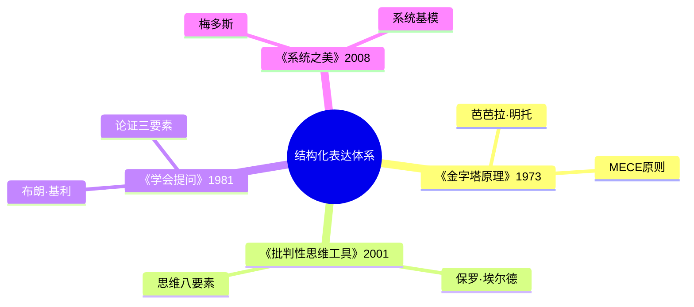
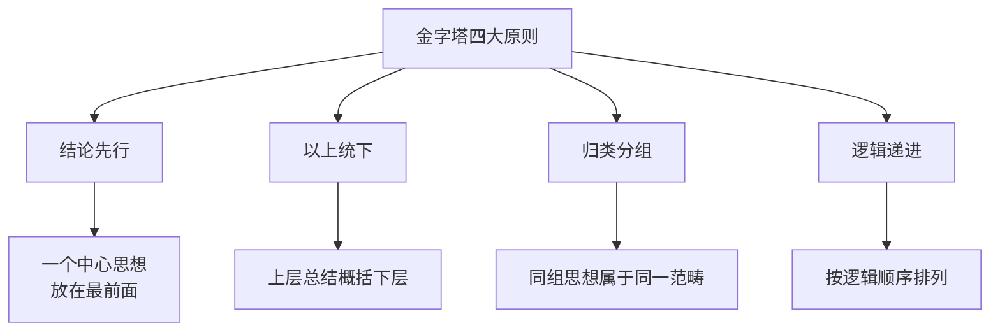
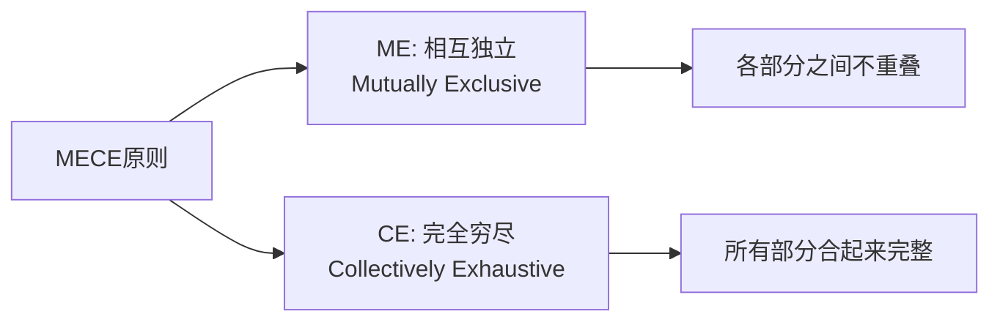
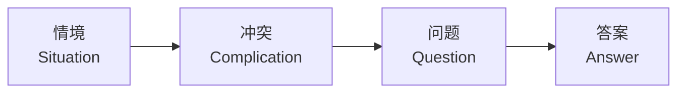

# 《金字塔原理》拆解记录

## 这本书要解决什么问题？

**核心困境**：想得清楚的人很多，说得清楚的人很少。大多数人写报告、做汇报、写PPT时，逻辑混乱、重点不清，听众听完不知道你想表达什么。同样的信息，有人讲得清楚，有人讲得混乱——差距不在信息本身，而在信息的组织方式。

明托在麦肯锡培训新人的时候发现：表达混乱不是因为思维混乱，而是因为缺少一套结构化方法。

**一句话定位**：
> 思考是金字塔的底座，表达是金字塔的塔尖。想清楚，才能说清楚。

### 作者站在什么位置说这些话？

| 维度 | 定位 |
|------|------|
| 主领域 | 逻辑思维、商务写作 |
| 跨界领域 | 管理学、沟通学、咨询方法论 |
| 作者背景 | 哈佛大学毕业，麦肯锡首位女咨询顾问，在麦肯锡负责内部培训时发明了这套方法 |
| 历史语境 | 1973年出版，全球咨询行业的标准培训教材，几乎所有顶级咨询公司的入职第一课 |

### 和其他书有什么关系？

| 关联书籍 | 关联关系 | 共同底层逻辑 |
|----------|----------|--------------|
| [[批判性思维工具-保罗-拆解记录]] | 方法互补 | 思维框架 vs 表达框架 |
| [[学会提问-布朗-拆解记录]] | 方法互补 | 提问技巧 vs 论证结构 |
| [[系统之美-梅多斯-拆解记录]] | 理论延伸 | 系统思维需要结构化表达 |
| [[第五项修炼-圣吉-拆解记录]] | 实践应用 | 学习型组织需要清晰沟通 |
| [[六顶思考帽-德博诺-拆解记录]] | 结构互补 | 六顶帽是"思考的模型"，金字塔是"表达的模型" |
| [[水平思考-德博诺-拆解记录]] | 结构延伸 | 水平思考生成想法，金字塔组织想法 |

### 知识网络图

---

## 作者的核心论点

### 金字塔四大原则——你的大脑天生喜欢有结构的信息

你有没有遇到过这种情况？有人汇报了10分钟，领导皱着眉头问："你到底想说什么？"有人写报告写了20页，读者翻完不知道结论是什么。

明托在麦肯锡研究后发现，大脑处理信息的方式是"先找结构，再填内容"。没有结构的信息，大脑会觉得混乱；有结构的信息，大脑会觉得清晰。她把这种最符合大脑认知规律的结构总结为四个原则：

**结论先行**——把中心思想放在最前面，先说结果再说原因。**以上统下**——每一层都是下一层的总结概括。**归类分组**——同组思想必须属于同一个范畴，而且要符合MECE原则（不重叠、不遗漏）。**逻辑递进**——按照时间顺序、结构顺序、重要性顺序或演绎顺序排列。

这打碎了我对"表达好就是口才好"的迷信。我一直以为有些人天生能说会道，有些人不行。但明托告诉我，表达清晰不是天赋，是结构。只要用对结构，普通人也能让领导听完就知道你想说什么。

> **金字塔定律**：大脑天生喜欢有结构的信息，金字塔结构最符合大脑的认知规律。

但光知道四大原则还不够。要让分类真正做到"不重叠、不遗漏"，还需要一个关键工具。

### MECE原则——不重叠、不遗漏，咨询公司最值钱的分类方法

为什么分析问题时总是遗漏关键因素？为什么分类时总是出现重叠导致混乱？

MECE是"相互独立、完全穷尽"（Mutually Exclusive, Collectively Exhaustive）的缩写。用大白话说就是：各部分之间不重叠（不做无用功），所有部分合起来完整（不遗漏关键因素）。咨询公司最值钱的能力不是聪明，而是用MECE分类——保证分析既不遗漏也不重复。当你把一个问题MECE地拆解完，答案往往自己就出来了。

> **MECE定律**：完整分析一个问题的最小必要条件——不重叠、不遗漏。

下次分析问题时，我不会再凭感觉列几条就算了，而是问自己两个问题：我的分类之间有没有重叠？有没有遗漏什么重要因素？两个问题都回答"没有"，分类才算合格。

MECE解决了"怎么分"的问题。但分完之后，怎么搭成金字塔？明托给了两条路径。

### 构建金字塔的两种方法——表达自上而下，思考自下而上

有时候你先有结论，需要展开论证；有时候你只有一堆材料，需要提炼出结论。两种情况要用不同的构建方法。

**自上而下法**（结论明确时使用）：1. 提出主题思想 2. 设想受众的主要疑问 3. 写序言（背景-冲突-疑问-回答）4. 与受众进行疑问/回答式对话 5. 对受众的新疑问，重复进行疑问/回答式对话。

**自下而上法**（材料丰富时使用）：1. 列出所有要点 2. 找出要点之间的关系 3. 从关系中提炼出结论。

以前我写报告总是想到哪写到哪，写完才发现逻辑不通。现在我意识到，正确的做法取决于你处在哪个阶段：结论已经清楚就用自上而下展开；只有素材就先自下而上提炼。关键是不要跳步——先想清楚结构，再填内容。

> **构建定律**：表达用自上而下，思考用自下而上。

有了结构框架和构建方法，还有一个经常被忽视的细节——怎么开头。这正是SCQA结构要解决的问题。

### SCQA结构——让你的序言变成一个好故事

为什么有些报告一开头就让人想读下去，有些开头就让人想关掉？区别不在内容，在序言。

明托发明了SCQA结构来写序言：**S（情境/Situation）**——从读者熟悉的背景开始，建立共鸣。**C（冲突/Complication）**——指出发生了什么问题或变化，引发关注。**Q（问题/Question）**——聚焦核心疑问。**A（答案/Answer）**——给出你的核心观点。

比如你要建议公司做数字化转型：公司面临市场竞争加剧（情境），传统运营效率下降成本上升（冲突），如何提升运营效率？（问题），数字化转型是最佳方案（答案）。好的序言本质上是一个好故事——先让读者进入熟悉的场景，再打破平静制造冲突，最后给出你的答案。读者会产生"我也要知道答案"的欲望。

> **序言定律**：好的序言是一个好故事，让读者产生"我也要知道答案"的欲望。

序言解决的是开头的问题。那正文的内容怎么排列？明托总结了最后一块拼图。

### 四种逻辑顺序——有了素材，怎么排列才清晰

有了素材不知道怎么排列，排列混乱读者就难以理解。明托总结了四种逻辑顺序：时间顺序（按事件发生先后）、结构顺序（按空间或组织）、重要性顺序（按重要性高低）、演绎顺序（按逻辑推演，大前提到小前提到结论）。

选哪种顺序取决于内容本身：流程类用时间顺序，空间类用结构顺序，说服类用重要性顺序，论证类用演绎顺序。选对顺序，读者会觉得"理所当然"；选错顺序，读者会觉得"东一榔头西一棒子"。

下次写报告之前，我不会再直接动笔，而是先问自己四个问题：结论是什么？分几层？每组之间是否MECE？用哪种逻辑顺序排列？回答完这四个问题，结构就出来了，填内容只是时间问题。

---

## 这本书的局限

| 批评点 | 谁在批评 | 怎么说 | 实际情况 |
|--------|---------|--------|---------|
| 过于机械化 | 沟通学研究者 | 把表达变成填表格，缺乏灵活性 | 结构是基础，但熟练后应该灵活运用，不要变成教条 |
| 不适合所有场景 | 实践者 | 创意写作、叙事性内容不适合金字塔结构 | 金字塔适合论证和汇报，不适合故事和情感表达 |
| 学习曲线陡 | 普通读者 | 需要大量练习才能内化，不是看完就会 | 方法简单但内化需要时间，就像学开车一样 |
| 西方逻辑偏好 | 跨文化研究者 | 隐含了西方线性逻辑的假设 | 不同文化有不同的表达偏好，但核心的"结论先行"仍然普适 |

**一句话总结局限性**：
> 金字塔原理是结构化表达的基础功，但不是全部。熟练掌握后需要灵活运用，避免机械套用。

---

## 最值得记住的话

**原书说的**：
1. "想清楚，才能说清楚。"
2. "结论先行，以上统下，归类分组，逻辑递进。"
3. "MECE：相互独立，完全穷尽。"
4. "自上而下表达，自下而上思考。"
5. "序言要用讲故事的形式。"

**翻译成人话**：
1. 思考是底座，表达是塔尖——底座不稳，塔尖就歪
2. 先说结论，再给理由——别让听众猜你想说什么
3. MECE就是：不重叠、不遗漏——分析问题的最小必要条件
4. 好的序言是一个好故事——让读者产生"我也要知道答案"的欲望
5. 大脑天生喜欢有结构的信息——给它结构，它就给你清晰
6. 想得清楚的人很多，说得清楚的人很少——差距在结构，不在智商

---

## 讲给没读过的人听

你有没有遇到过这种情况——汇报了半天，领导皱着眉头问："你到底想说什么？"

明托在麦肯锡培训新人的时候发现，这个问题太普遍了。不是大家没想清楚，而是缺少一套结构化方法。她的解决方案很简单：像搭金字塔一样组织你的表达。

金字塔有四个规则。结论先行：把最重要的结论放在最前面，别让人猜。以上统下：每一层都是下一层的总结。归类分组：同一组的东西必须属于同一个类别，而且不能重叠、不能遗漏——这叫MECE原则。逻辑递进：按时间、按结构、按重要性或按逻辑推演排列。

还有一个技巧是序言怎么写。用SCQA：先说一个大家都熟悉的背景（情境），然后指出出了什么问题（冲突），引出核心疑问（问题），最后给出你的答案（答案）。好的序言就像一个好故事的开头，让读者忍不住想看下去。

记住一句话就够了：思考是底座，表达是塔尖。想清楚，才能说清楚。

---

## 用来检验理解的问题

**基础回忆**：
1. Q: 金字塔四大原则是什么？
   A: 结论先行、以上统下、归类分组、逻辑递进。

2. Q: MECE是什么意思？
   A: 相互独立（Mutually Exclusive）、完全穷尽（Collectively Exhaustive）——不重叠、不遗漏。

3. Q: SCQA的四个字母分别代表什么？
   A: 情境（Situation）、冲突（Complication）、问题（Question）、答案（Answer）。

**理解验证**：
1. Q: 为什么"结论先行"是最重要的原则？
   A: 因为大脑处理信息的方式是先找结构再填内容。先给结论就是先给结构，读者才能理解后面的内容。

2. Q: 自上而下法和自下而上法分别适用于什么场景？
   A: 结论明确时用自上而下法展开论证；材料丰富时用自下而上法提炼结论。

**实际应用**：
1. Q: 用SCQA结构写一个工作汇报的开头。
   A: 关键是S要从读者熟悉的背景开始，C要制造反差，Q要聚焦，A要简洁。

2. Q: 用MECE原则分析"为什么团队效率低"。
   A: 按人员能力、流程设计、工具支持、沟通机制四个维度拆解，确保不重叠不遗漏。

**深度分析**：
1. Q: 金字塔原理和六顶思考帽的区别和联系？
   A: 六顶思考帽是"思考的模型"——帮你想清楚；金字塔原理是"表达的模型"——帮你说清楚。想清楚（六顶帽），才能说清楚（金字塔）。

2. Q: 为什么咨询公司把MECE当作最核心的训练？
   A: 因为MECE保证了分析的系统性和完备性。当一个问题被MECE地拆解完，答案往往自己就出来了——这正是咨询的价值所在。

---

## 和其他书的对话

保罗的《批判性思维工具》和明托的《金字塔原理》是思维和表达的两面。保罗教你如何思考——用思维八要素拆解论证；明托教你如何表达——用金字塔结构组织输出。一个管输入，一个管输出，合在一起才是完整的体系。

布朗和基利的《学会提问》跟金字塔原理也是互补关系。《学会提问》教你论证的三要素——主张、理由、证据，以及如何评判别人的论证；《金字塔原理》教你如何构建自己的论证结构。一个是批判性接收，一个是结构化输出。

梅多斯的《系统之美》解决的是更高层次的问题——如何看清复杂系统的运作规律。但系统思考的成果，最终要通过结构化表达传递给他人。你看清了系统，还得用金字塔结构说清楚，否则别人听不懂。

德博诺的《六顶思考帽》和《水平思考》跟金字塔原理形成有趣的对照。六顶帽是"思考的模型"——帮你想清楚；金字塔是"表达的模型"——帮你说清楚。水平思考帮你生成新想法，金字塔帮你把这些想法组织成有说服力的表达。表达加创新，才是职场双武器。

---

*拆解日期：2026-02-14*
*下次回访：1周后回顾「讲给没读过的人听」和「检验问题」*
