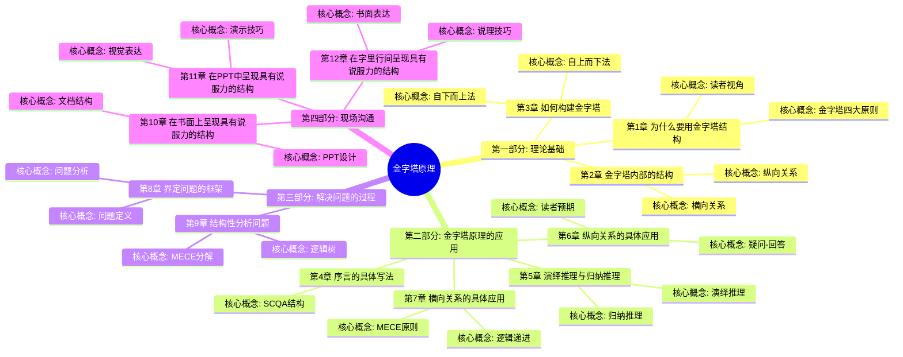
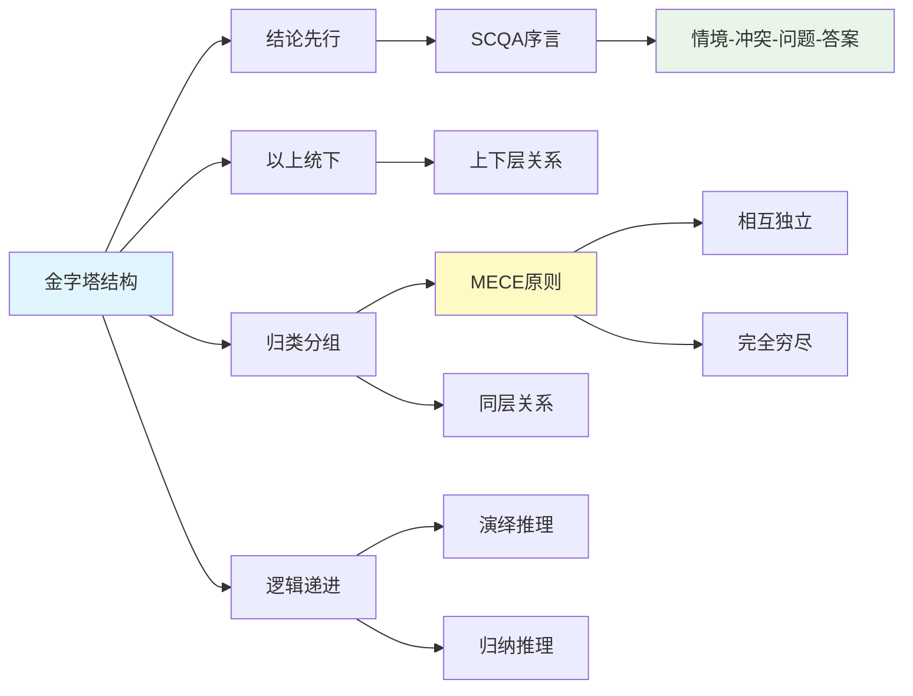

# 《金字塔原理》- 章节导航

> 作者: [美] 芭芭拉·明托
> 总章节: 12章
> 拆解状态: ✅ 已完成
> 最后更新: 2026-02-27

---

## 📚 章节结构（Mermaid Mindmap）

---

## 🔗 核心概念关联图

---

## 📊 拆解进度追踪

| 章节 | 标题 | 状态 | 完成日期 | 核心收获 |
|------|------|------|----------|----------|
| 第1章 | 为什么要用金字塔结构 | ✅ 已完成 | 2026-02-27 | 认知负荷规律与结构化表达 |
| 第2章 | 金字塔内部的结构 | ✅ 已完成 | 2026-02-27 | 纵向横向关系与MECE原则 |
| 第3章 | 如何构建金字塔 | ✅ 已完成 | 2026-02-27 | 自上而下与自下而上法 |
| 第4章 | 序言的具体写法 | ✅ 已完成 | 2026-02-27 | SCQA结构应用 |
| 第5章 | 演绎推理与归纳推理 | ✅ 已完成 | 2026-02-27 | 演绎归纳推理方法 |
| 第6章 | 纵向关系的具体应用 | ✅ 已完成 | 2026-02-27 | 疑问回答式对话技巧 |
| 第7章 | 横向关系的具体应用 | ✅ 已完成 | 2026-02-27 | 逻辑递进与分组原则 |
| 第8章 | 界定问题的框架 | ✅ 已完成 | 2026-02-27 | 问题分析与澄清技巧 |
| 第9章 | 结构性分析问题 | ✅ 已完成 | 2026-02-27 | 逻辑树与分解方法 |
| 第10章 | 在书面上呈现具有说服力的结构 | ✅ 已完成 | 2026-02-27 | 书面表达结构优化 |
| 第11章 | 在PPT中呈现具有说服力的结构 | ✅ 已完成 | 2026-02-27 | 演示文稿设计技巧 |
| 第12章 | 在字里行间呈现具有说服力的结构 | ✅ 已完成 | 2026-02-27 | 说服性文字表达艺术 |

**状态说明:**
- ✅ 已完成
- 🔄 进行中
- ⏳ 待开始
- ⏸️ 暂停

---

## 🚀 快速跳转

### 按章节跳转
- [[第1章-为什么要用金字塔结构]]
- [[第2章-金字塔内部的结构]]
- [[第3章-如何构建金字塔]]
- [[第4章-序言的具体写法]]
- [[第5章-演绎推理与归纳推理]]
- [[第6章-纵向关系的具体应用]]
- [[第7章-横向关系的具体应用]]
- [[第8章-界定问题的框架]]
- [[第9章-结构性分析问题]]
- [[第10章-在书面上呈现具有说服力的结构]]
- [[第11章-在PPT中呈现具有说服力的结构]]
- [[第12章-在字里行间呈现具有说服力的结构]]

### 按主题跳转
- [[金字塔结构]]
- [[MECE原则]]
- [[SCQA结构]]
- [[演绎推理]]
- [[归纳推理]]

### 相关资源
- [[金字塔原理-拆解记录]] - 主拆解笔记
- [[结构化思维]] - 相关知识卡片
- [[逻辑表达]] - 相关知识卡片
