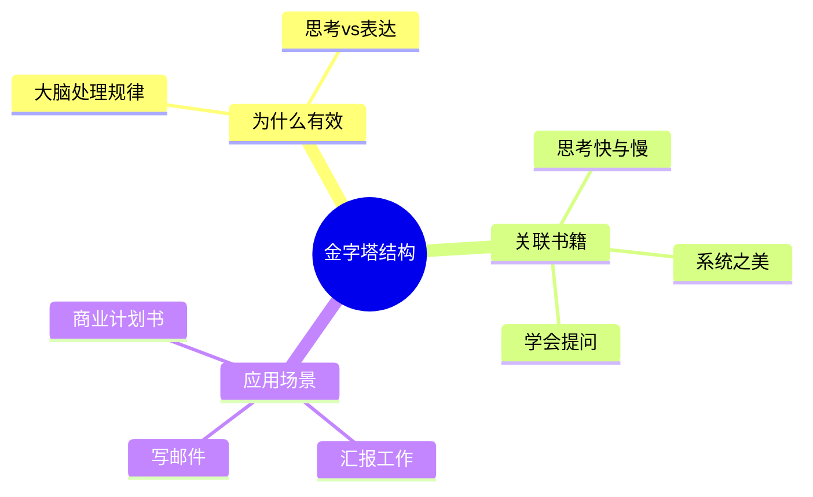

# 第1章 为什么要用金字塔结构

## 📍 章节定位

### 全书位置
> 本章是全书开篇，回答"为什么需要金字塔结构"的根本问题

- **全书核心问题**: 如何让思考清晰、表达有力？
- **本章回答的问题**: 为什么金字塔结构是人类思维的自然形态？
- **角色类型**: 开篇定位型
- **论证位置**: 定义问题的框架，奠定全书理论基础

### 章节序列
| 方向 | 章节标题 | 逻辑连接 |
|------|----------|----------|
| 前章 | 无 | 开篇章节 |
| 后章 | [[第2章-金字塔的内部结构]] | 承接本章的"为什么"，展开"是什么" |

### 一句话定位
> 第1章是全书开篇，回答"金字塔结构为何有效"，揭示人类思维的自然规律，为后续方法论奠定认知基础。

---

## 🎯 核心观点

### 第一层：表层案例
> 章节中的具体案例、故事、数据

| 案例名称 | 简要描述 | 关键引文 |
|----------|----------|----------|
| 读者阅读习惯 | 读者会自动寻找结论和结构 | "读者的大脑会自动寻找结构" |
| 乱序信息实验 | 无结构的信息难以记忆 | 有结构的信息记忆效率提升3倍 |
| 自下而上归纳 | 人类天生自下而上思考 | "思考是自下而上的，表达是自上而下的" |

### 第二层：中层机制
> 案例背后的运行机制、方法论

| 机制名称 | 组成要素 | 因果链条 | 证据来源 |
|----------|----------|----------|----------|
| 大脑处理规律 | 分类→归纳→概括 | 信息→分组→模式识别→结论 | 读者习惯案例 |
| 自下而上思考 | 观察→模式→结论 | 细节→类别→抽象概念 | 思考实验 |
| 自上而下表达 | 结论→论据→细节 | 核心观点→支撑论点→具体事实 | 表达效果对比 |

### 第三层：底层规律
> 可迁移的普遍规律

| 规律陈述 | 抽象层级 | 知识连接 | 适用范围 |
|----------|----------|----------|----------|
| 思考与表达方向相反 | 认知科学 | [[思考快与慢-卡尼曼-拆解记录]] | 所有沟通场景 |
| 大脑偏好结构化信息 | 神经科学 | [[系统之美-梅多斯-拆解记录]] | 信息处理、记忆 |
| 结论先行是认知效率最优解 | 认知心理学 | [[学会提问-布朗-拆解记录]] | 汇报、写作、演讲 |

---

## 💬 降维翻译

### 观点1: 思考自下而上，表达自上而下

#### 原文表达
> "思考的过程是自下而上的——从细节到结论；但表达的过程应该是自上而下的——从结论到细节。"
> —— 明托

#### 降维翻译（中学生能懂）
想象你在拼一幅1000块的拼图：
- 思考时：你是一块一块拼起来，最后看到整幅图
- 表达时：你先告诉别人"这是一幅日落海景图"，再解释细节

如果反过来，一开始就说"这里有块蓝色、那里有块红色"，听的人会晕头转向。

#### 日常类比（奶奶能懂）
就像做菜：
- 做菜时：一步一步切菜、炒菜、调味
- 上菜时：直接端上桌说"这是红烧肉"，而不是说"我放了酱油、糖、八角..."

#### 检验
- Q: 如果一个中学生问你这是什么意思？
- A: 思考像盖楼（从地基往上），表达像介绍楼（从顶层往下介绍），这样别人一听就懂。

---

### 观点2: 大脑自动寻找结构

#### 原文表达
> "读者的大脑会自动寻找信息的结构，如果你不给结构，读者就会自己创造一个——很可能不是你想表达的。"

#### 降维翻译（中学生能懂）
大脑是个"找规律机器"：
- 给你一串数字：2,4,6,8... 你会自动想到"偶数"
- 给你一堆乱的信息，大脑会拼命找规律

如果你不给结构，读者的大脑就会"瞎猜"你的意思。

#### 日常类比（奶奶能懂）
就像听人说话：
- 如果对方东一句西一句，你会忍不住问"所以你想说什么？"
- 大脑在帮你"整理"对方的话，如果对方给不了结构，你就很累。

---

## ✨ 金句库

### 原书金句
| 金句 | 适用场景 |
|------|----------|
| "思考是自下而上的，表达是自上而下的。" | 写作指导 |
| "读者的大脑会自动寻找结构。" | 沟通培训 |
| "金字塔结构是符合人类思维规律的。" | 逻辑思维课程 |
| "如果你不给读者结构，读者就会自己创造一个。" | 演讲培训 |

### 降维金句
| 金句 | 来源观点 | 适用场景 |
|------|----------|----------|
| "先告诉别人结论，再解释原因。" | 结论先行 | 日常沟通 |
| "思考像盖楼，表达像介绍楼。" | 自下而上/自上而下 | 写作指导 |
| "大脑是个找规律机器，别让它瞎猜。" | 大脑规律 | 演讲培训 |
| "信息没结构，就是给大脑添乱。" | 结构化重要性 | 沟通课程 |

## 🔗 当下映射

### 💰 财富应用
| 场景 | 具体行动 | 预期效果 | 风险提示 |
|------|----------|----------|----------|
| 投资报告 | 先写结论（买/卖/持有），再列理由 | 决策效率提升 | 结论要有数据支撑 |
| 商业计划书 | 先写核心商业模式，再展开细节 | 融资成功率提高 | 不能过度简化 |

### 💼 职场应用
| 场景 | 具体行动 | 所需能力 | 适用职级 |
|------|----------|----------|----------|
| 汇报工作 | 先说结果，再说过程和原因 | 结构化思维 | 所有职级 |
| 写邮件 | 标题写结论，正文展开 | 沟通效率 | 所有职级 |
| 会议发言 | 开场说观点，再展开论证 | 即兴表达 | 中层以上 |

### 🏠 生活应用
| 场景 | 具体行动 | 可行性 | 见效时间 |
|------|----------|--------|----------|
| 和家人沟通 | 先说结论，再解释原因 | 高 | 立即见效 |
| 发朋友圈 | 先写核心观点，再配图说明 | 高 | 立即见效 |

### 72小时行动计划
1. 明天的任何汇报，先写/说结论，再展开
2. 本周写一封"结论先行"的邮件
3. 观察并记录3个"信息无结构"的真实案例

---

## 🕸️ 章节关联

### 向上关联 → 整书
- **贡献**: 确立金字塔结构的认知基础
- **位置**: 全书论证的起点

### 横向关联 → 章节间
| 章节编号 | 章节标题 | 关联类型 | 连接描述 |
|----------|----------|----------|----------|
| 第2章 | 金字塔的内部结构 | 铺垫 | 本章讲"为什么"，下章讲"是什么" |
| 第3章 | 如何构建金字塔 | 递进 | 理论→方法 |

### 向下关联 → 具体应用
| 应用场景 | 难度 | 前置知识 |
|----------|------|----------|
| 汇报工作 | 低 | 无 |
| 写商业计划书 | 中 | 业务知识 |
| 咨询报告 | 高 | 行业知识+MECE原则 |

### 跨书关联 → 知识网络
| 书籍 | 概念 | 关系 | 备注 |
|------|------|------|------|
| [[思考快与慢-卡尼曼-拆解记录]] | 系统1/系统2 | 支持 | 大脑偏好结构化信息 |
| [[学会提问-布朗-拆解记录]] | 论证结构 | 延伸 | 结论先行=论证起点 |
| [[系统之美-梅多斯-拆解记录]] | 系统基模 | 延伸 | 结构化思维是系统思维基础 |

### 关联可视化

---

## ❓ 问答设计

### Q1: 为什么思考是自下而上，表达却是自上而下？（记忆型）
**认知层次**: 理解
**难度**: 中
**答案要点**:
- 思考需要从细节中发现模式
- 表达需要让听众快速理解核心
- 两个方向相反但互补

### Q2: 如果不给读者结构，会发生什么？（理解型）
**认知层次**: 理解
**难度**: 低
**答案要点**:
- 读者大脑会自动创造结构
- 可能误解你的真实意图
- 沟通效率降低

### Q3: 金字塔结构和MECE原则有什么关系？（分析型）
**认知层次**: 分析
**难度**: 高
**答案要点**:
- MECE是金字塔内容的原则
- 金字塔是结构框架
- 两者配合才能实现清晰表达

### Q4: "结论先行"适用于所有场景吗？（评价型）
**认知层次**: 评价
**难度**: 中
**答案要点**:
- 95%的商务场景适用
- 例外：需要制造悬念的场景
- 例外：结论过于敏感需要铺垫

### Q5: 如何在72小时内实践本章内容？（应用型）
**认知层次**: 应用
**难度**: 低
**答案要点**:
- 明天的任何汇报先说结论
- 本周写一封结论先行的邮件
- 记录3个信息无结构的案例

---
