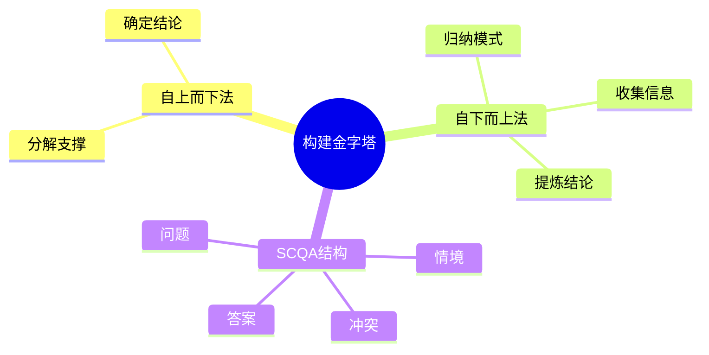

# 第3章 如何构建金字塔

## 📍 章节定位

### 全书位置
> 本章是方法论章节，回答"如何构建金字塔结构"的实操问题

- **全书核心问题**: 如何让思考清晰、表达有力？
- **本章回答的问题**: 构建金字塔有哪些方法？步骤是什么？
- **角色类型**: 核心方法论型
- **论证位置**: 承接第2章的结构要素，提供实操方法

### 章节序列
| 方向 | 章节标题 | 逻辑连接 |
|------|----------|----------|
| 前章 | [[第2章-金字塔的内部结构]] | 本章承接"是什么"，教"怎么做" |
| 后章 | [[第4章-序言的具体写法]] | 本章讲结构构建，下章讲序言技巧 |

### 一句话定位
> 第3章是全书方法论核心，提供两种构建金字塔的方法（自上而下法、自下而上法）和SCQA序言结构。

---

## 🎯 核心观点

### 第一层：表层案例
> 章节中的具体案例、故事、数据

| 案例名称 | 简要描述 | 关键引文 |
|----------|----------|----------|
| 咨询师构建方法 | 先确定核心问题，再分解支撑 | "自上而下是最常用的方法" |
| 问题分析案例 | 从零散信息中归纳出结论 | "自下而上适合信息不完整的情况" |
| 序言结构案例 | 情境→冲突→问题→答案 | "SCQA是最有效的序言结构" |

### 第二层：中层机制
> 案例背后的运行机制、方法论

| 机制名称 | 组成要素 | 因果链条 | 证据来源 |
|----------|----------|----------|----------|
| 自上而下法 | 结论→分论点→论据 | 核心观点确定后，向下分解支撑 | 咨询案例 |
| 自下而上法 | 论据→分论点→结论 | 从零散信息中归纳出模式 | 问题分析 |
| SCQA结构 | 情境→冲突→问题→答案 | 故事化开头吸引注意力 | 序言案例 |

### 第三层：底层规律
> 可迁移的普遍规律

| 规律陈述 | 抽象层级 | 知识连接 | 适用范围 |
|----------|----------|----------|----------|
| 演绎推理vs归纳推理 | 逻辑学 | [[批判性思维工具-保罗-拆解记录]] | 所有论证场景 |
| 结构化思考需要两种模式 | 认知科学 | [[思考快与慢-卡尼曼-拆解记录]] | 问题解决 |
| 好的序言=好的开始 | 沟通学 | [[学会提问-布朗-拆解记录]] | 写作、演讲 |

---

## 💬 降维翻译

### 观点1: 两种构建方法

#### 原文表达
> "构建金字塔有两种方法：自上而下法和自下而上法。自上而下适合观点明确时，自下而上适合信息收集阶段。"

#### 降维翻译（中学生能懂）
建金字塔有两种方式：
1. **自上而下**（先有结论）：像装修房子，先定风格，再选材料
2. **自下而上**（先有信息）：像拼图，先拼碎片，再看全图

什么时候用哪个？
- 已经知道要说什么 → 自上而下
- 信息一大堆，不知道结论 → 自下而上

#### 日常类比（奶奶能懂）
就像做菜：
- **自上而下**：今天要做红烧肉 → 准备五花肉、酱油、糖
- **自下而上**：冰箱里有五花肉、酱油、糖 → 决定做红烧肉

---

### 观点2: SCQA序言结构

#### 原文表达
> "序言应该包含四个要素：情境（Situation）、冲突（Complication）、问题（Question）、答案（Answer）。"

#### 降维翻译（中学生能懂）
写文章开头有个"万能公式"：
- **S（情境）**：介绍一下背景
- **C（冲突）**：出了什么问题
- **Q（问题）**：怎么办？
- **A（答案）**：我有个办法

比如：
- S：天气越来越热
- C：空调费太贵
- Q：怎么省钱又凉快？
- A：买一台节能风扇

#### 日常类比（奶奶能懂）
就像讲故事：
- "从前有座山"（情境）
- "山上有只老虎"（冲突）
- "怎么办？"（问题）
- "找猎人来"（答案）

---

## ✨ 金句库

### 原书金句
| 金句 | 适用场景 |
|------|----------|
| "自上而下法是最常用的构建方法。" | 方法指导 |
| "序言的作用是引起读者兴趣。" | 写作指导 |
| "SCQA结构让序言有故事感。" | 培训课程 |
| "确定主题后，第一步是确定读者的问题。" | 方法指导 |

### 降维金句
| 金句 | 来源观点 | 适用场景 |
|------|----------|----------|
| "有结论用自上而下，没结论用自下而上。" | 两种方法 | 方法选择 |
| "SCQA=故事四要素：情境、冲突、问题、答案。" | 序言结构 | 记忆口诀 |
| "序言是金字塔的门面，决定读者要不要进来。" | 序言作用 | 写作指导 |

## 🔗 当下映射

### 💰 财富应用
| 场景 | 具体行动 | 预期效果 | 风险提示 |
|------|----------|----------|----------|
| 投资报告 | SCQA开头，自上而下展开 | 可读性提高 | 数据要支撑结论 |
| 融资路演 | 情境=市场，冲突=痛点，答案=产品 | 投资人共鸣 | 情境要真实 |

### 💼 职场应用
| 场景 | 具体行动 | 所需能力 | 适用职级 |
|------|----------|----------|----------|
| 汇报 | SCQA开场，自上而下展开 | 结构化表达 | 所有职级 |
| 问题分析 | 自下而上归纳，再自上而下表达 | 逻辑思维 | 中层以上 |

### 🏠 生活应用
| 场景 | 具体行动 | 可行性 | 见效时间 |
|------|----------|--------|----------|
| 说服家人 | SCQA结构说服 | 高 | 立即见效 |
| 求职信 | 情境=行业，冲突=挑战，答案=我的能力 | 高 | 1周见效 |

### 72小时行动计划
1. 明天写任何东西，先用SCQA规划开头
2. 分析一个复杂问题，用自下而上归纳结论
3. 用自上而下法重构一份旧文档

---

## 🕸️ 章节关联

### 向上关联 → 整书
- **贡献**: 提供构建金字塔的实操方法
- **位置**: 方法论核心章节

### 横向关联 → 章节间
| 章节编号 | 章节标题 | 关联类型 | 连接描述 |
|----------|----------|----------|----------|
| 第2章 | 金字塔的内部结构 | 承接 | 本章承接结构要素，提供构建方法 |
| 第4章 | 序言的具体写法 | 递进 | 本章讲SCQA，下章深入序言技巧 |

### 跨书关联 → 知识网络
| 书籍 | 概念 | 关系 | 备注 |
|------|------|------|------|
| [[批判性思维工具-保罗-拆解记录]] | 演绎/归纳 | 支持 | 两种方法对应两种推理 |
| [[学会提问-布朗-拆解记录]] | 问题意识 | 延伸 | SCQA的核心是问题驱动 |

### 关联可视化

---

## ❓ 问答设计

### Q1: 自上而下法和自下而上法有什么区别？（理解型）
**认知层次**: 理解
**难度**: 中
**答案要点**:
- 起点：结论vs信息
- 方向：向下分解vs向上归纳
- 适用场景：观点明确vs信息收集阶段

### Q2: SCQA四个字母分别代表什么？（记忆型）
**认知层次**: 记忆
**难度**: 低
**答案要点**:
- S：Situation（情境）
- C：Complication（冲突）
- Q：Question（问题）
- A：Answer（答案）

### Q3: 什么时候用自上而下，什么时候用自下而上？（应用型）
**认知层次**: 应用
**难度**: 中
**答案要点**:
- 结论明确→自上而下
- 信息散乱→自下而上
- 实际中常混合使用

---
