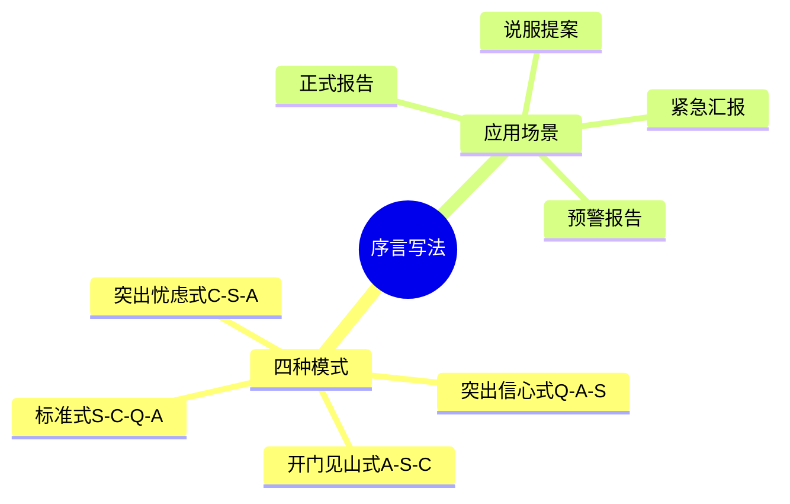

# 第4章 序言的具体写法

## 📍 章节定位

### 全书位置
> 本章深入讲解序言的写法技巧，是SCQA结构的扩展应用

- **全书核心问题**: 如何让思考清晰、表达有力？
- **本章回答的问题**: 如何写出一个吸引人的序言？
- **角色类型**: 技巧深化型
- **论证位置**: 承接第3章的SCQA，提供更多写法技巧

### 章节序列
| 方向 | 章节标题 | 逻辑连接 |
|------|----------|----------|
| 前章 | [[第3章-如何构建金字塔]] | 本章承接SCQA，深化序言技巧 |
| 后章 | [[第5章-演绎推理与归纳推理]] | 序言是开头，推理是主体 |

### 一句话定位
> 第4章深入讲解序言的各种写法（标准式、开门见山式、突出忧虑式、突出信心式），帮助读者根据场景选择最佳开头。

---

## 🎯 核心观点

### 第一层：表层案例
> 章节中的具体案例、故事、数据

| 案例名称 | 简要描述 | 关键引文 |
|----------|----------|----------|
| 标准式序言 | S-C-Q-A完整呈现 | "最稳妥的序言结构" |
| 开门见山式 | 直接给出答案 | "适合读者急切知道结论时" |
| 突出忧虑式 | 先强调冲突和风险 | "适合说服性场景" |
| 突出信心式 | 先强调解决方案优势 | "适合提案和汇报" |

### 第二层：中层机制
> 案例背后的运行机制、方法论

| 机制名称 | 组成要素 | 因果链条 | 证据来源 |
|----------|----------|----------|----------|
| 四种序言模式 | 标准式、开门见山式、突出忧虑式、突出信心式 | 不同顺序→不同效果 | 案例对比 |
| 序言长度控制 | 2-3段，200-400字 | 太短无铺垫，太长失去耐心 | 阅读习惯研究 |
| 序言与正文衔接 | 最后一句话引出核心论点 | 序言→核心观点→正文 | 结构完整性 |

### 第三层：底层规律
> 可迁移的普遍规律

| 规律陈述 | 抽象层级 | 知识连接 | 适用范围 |
|----------|----------|----------|----------|
| 不同场景需要不同的序言策略 | 沟通策略 | [[影响力-西奥迪尼-拆解记录]] | 所有书面沟通 |
| 序言决定读者是否继续阅读 | 注意力经济学 | [[思考快与慢-卡尼曼-拆解记录]] | 写作、演讲 |

---

## 💬 降维翻译

### 观点1: 四种序言模式

#### 原文表达
> "序言有四种基本模式：标准式（S-C-Q-A）、开门见山式（A-S-C）、突出忧虑式（C-S-A）、突出信心式（Q-A-S）。"

#### 降维翻译（中学生能懂）
写开头有四种"套路"：
1. **标准式**：讲故事顺序 → 情境→冲突→问题→答案
2. **开门见山式**：直接给答案 → 答案→情境→冲突
3. **突出忧虑式**：先吓一跳 → 冲突→情境→答案
4. **突出信心式**：先画饼 → 问题→答案→情境

什么时候用哪个？
- 正式报告 → 标准式
- 老板急着看 → 开门见山
- 需要说服 → 突出忧虑
- 提方案 → 突出信心

#### 日常类比（奶奶能懂）
就像给人介绍对象：
- **标准式**：背景→问题→解决方案（最稳妥）
- **开门见山式**：直接说"我给你介绍个好对象"（直接）
- **突出忧虑式**："你都快40了还不结婚"（先施压）
- **突出信心式**："我有个绝好的对象给你"（先画饼）

---

## ✨ 金句库

### 原书金句
| 金句 | 适用场景 |
|------|----------|
| "序言是金字塔的门面。" | 写作指导 |
| "不同场景需要不同的序言策略。" | 方法选择 |
| "标准式序言最稳妥，但不是最优。" | 进阶指导 |
| "序言的最后一句话必须引出核心论点。" | 结构要求 |

### 降维金句
| 金句 | 来源观点 | 适用场景 |
|------|----------|----------|
| "四种序言：标准式、开门见山式、突出忧虑式、突出信心式。" | 四种模式 | 记忆口诀 |
| "序言是金字塔的门面，门面不好，没人进来。" | 序言作用 | 写作指导 |
| "讲故事的顺序最稳妥，但不一定最有效。" | 模式选择 | 进阶课程 |

## 🔗 当下映射

### 💰 财富应用
| 场景 | 具体行动 | 预期效果 | 风险提示 |
|------|----------|----------|----------|
| 融资路演 | 突出信心式：问题→答案→市场 | 投资人信心提升 | 答案要可信 |
| 投资报告 | 标准式：背景→风险→建议 | 专业性体现 | 不能过度简化 |

### 💼 职场应用
| 场景 | 具体行动 | 所需能力 | 适用职级 |
|------|----------|----------|----------|
| 汇报（紧急） | 开门见山式：结论→背景→原因 | 快速表达 | 所有职级 |
| 提案 | 突出信心式：需求→方案→优势 | 说服能力 | 中层以上 |
| 预警报告 | 突出忧虑式：风险→背景→应对 | 风险意识 | 中层以上 |

### 🏠 生活应用
| 场景 | 具体行动 | 可行性 | 见效时间 |
|------|----------|--------|----------|
| 说服家人 | 突出忧虑式：问题→背景→方案 | 高 | 立即见效 |
| 求职信 | 突出信心式：匹配→能力→热情 | 高 | 1周见效 |

### 72小时行动计划
1. 分析3篇文章的序言，识别使用的是哪种模式
2. 用四种模式分别写一段开头的草稿
3. 选择一个实际场景，应用最合适的序言模式

---

## 🕸️ 章节关联

### 向上关联 → 整书
- **贡献**: 深化序言写作技巧
- **位置**: 方法论的延伸章节

### 横向关联 → 章节间
| 章节编号 | 章节标题 | 关联类型 | 连接描述 |
|----------|----------|----------|----------|
| 第3章 | 如何构建金字塔 | 承接 | 本章承接SCQA，深化序言技巧 |
| 第5章 | 演绎推理与归纳推理 | 递进 | 序言是开头，推理是论证主体 |

### 跨书关联 → 知识网络
| 书籍 | 概念 | 关系 | 备注 |
|------|------|------|------|
| [[影响力-西奥迪尼-拆解记录]] | 说服技巧 | 支持 | 突出忧虑式=稀缺性原则应用 |
| [[思考快与慢-卡尼曼-拆解记录]] | 注意力 | 支持 | 序言设计基于注意力规律 |

### 关联可视化

---

## ❓ 问答设计

### Q1: 序言的四种模式分别是什么？（记忆型）
**认知层次**: 记忆
**难度**: 中
**答案要点**:
- 标准式：S-C-Q-A
- 开门见山式：A-S-C
- 突出忧虑式：C-S-A
- 突出信心式：Q-A-S

### Q2: 什么时候用突出忧虑式序言？（应用型）
**认知层次**: 应用
**难度**: 中
**答案要点**:
- 需要引起重视时
- 说服性场景
- 预警、风险报告

### Q3: 序言的最后一句话应该是什么？（理解型）
**认知层次**: 理解
**难度**: 低
**答案要点**:
- 引出核心论点
- 与正文的第一句话衔接
- 确保结构完整性

---
