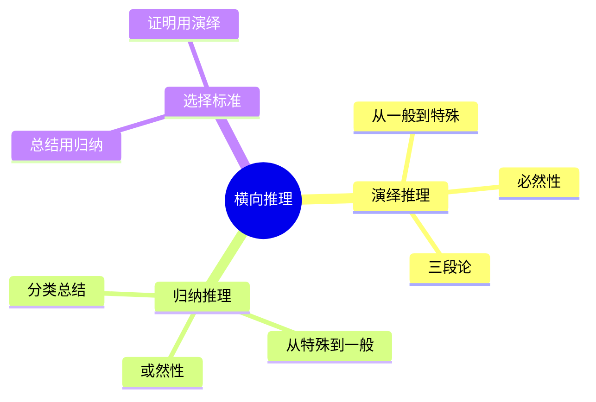

# 第5章 演绎推理与归纳推理

## 📍 章节定位

### 全书位置
> 本章讲解金字塔横向关系的两种推理方式，是论证逻辑的核心

- **全书核心问题**: 如何让思考清晰、表达有力？
- **本章回答的问题**: 横向关系应该用演绎推理还是归纳推理？
- **角色类型**: 核心方法论型
- **论证位置**: 承接序言，讲解主体论证的逻辑

### 章节序列
| 方向 | 章节标题 | 逻辑连接 |
|------|----------|----------|
| 前章 | [[第4章-序言的具体写法]] | 序言是开头，本章是论证主体 |
| 后章 | [[第6章-纵向关系的具体应用]] | 横向推理→纵向应用 |

### 一句话定位
> 第5章讲解横向关系的两种推理方式（演绎推理、归纳推理），帮助读者选择最适合的论证方式。

---

## 🎯 核心观点

### 第一层：表层案例
> 章节中的具体案例、故事、数据

| 案例名称 | 简要描述 | 关键引文 |
|----------|----------|----------|
| 三段论演绎 | 大前提→小前提→结论 | "所有人都会死→苏格拉底是人→苏格拉底会死" |
| 归纳分类 | 同类事物归纳出共性 | "苹果、香蕉、橘子→水果" |
| 推理选择 | 演绎适合证明，归纳适合分类 | "选择取决于你想达到什么目的" |

### 第二层：中层机制
> 案例背后的运行机制、方法论

| 机制名称 | 组成要素 | 因果链条 | 证据来源 |
|----------|----------|----------|----------|
| 演绎推理 | 大前提→小前提→结论 | 必然性推理 | 三段论案例 |
| 归纳推理 | 观察→模式→结论 | 或然性推理 | 分类案例 |
| 推理选择 | 目的→场景→方法 | 不同目的选择不同推理 | 推理选择案例 |

### 第三层：底层规律
> 可迁移的普遍规律

| 规律陈述 | 抽象层级 | 知识连接 | 适用范围 |
|----------|----------|----------|----------|
| 演绎保证必然，归纳提供可能 | 逻辑学 | [[批判性思维工具-保罗-拆解记录]] | 所有论证场景 |
| 演绎适合证明，归纳适合探索 | 认知策略 | [[思考快与慢-卡尼曼-拆解记录]] | 问题解决、决策 |

---

## 💬 降维翻译

### 观点1: 演绎推理vs归纳推理

#### 原文表达
> "演绎推理是从一般到特殊的必然推理，归纳推理是从特殊到一般的或然推理。"

#### 降维翻译（中学生能懂）
两种推理方式：
1. **演绎推理**（从上往下推）：
   - 所有人都会死 → 苏格拉底是人 → 苏格拉底会死
   - 100%正确，只要前提对

2. **归纳推理**（从下往上推）：
   - 这只天鹅是白的、那只也是... → 所有天鹅都是白的
   - 不一定100%正确（可能有一只黑天鹅）

什么时候用哪个？
- 要证明某事一定对 → 演绎
- 要总结规律或分类 → 归纳

#### 日常类比（奶奶能懂）
就像医生看病：
- **演绎**：流感会发烧 → 你得了流感 → 你会发烧（肯定）
- **归纳**：来看病的人都发烧 → 流感流行了（推测）

---

## ✨ 金句库

### 原书金句
| 金句 | 适用场景 |
|------|----------|
| "演绎保证必然，归纳提供可能。" | 逻辑思维课程 |
| "演绎适合证明，归纳适合分类。" | 方法选择 |
| "三段论是演绎推理的经典形式。" | 逻辑入门 |
| "归纳推理的结论需要足够多的例证支撑。" | 科学方法 |

### 降维金句
| 金句 | 来源观点 | 适用场景 |
|------|----------|----------|
| "演绎是从一般到特殊，归纳是从特殊到一般。" | 两种推理 | 记忆口诀 |
| "演绎100%正确，归纳只是'很可能'。" | 可靠性对比 | 方法选择 |
| "要证明用演绎，要总结用归纳。" | 场景选择 | 实践指导 |

## 🔗 当下映射

### 💰 财富应用
| 场景 | 具体行动 | 预期效果 | 风险提示 |
|------|----------|----------|----------|
| 投资论证 | 演绎：理论→条件→结论 | 逻辑严密 | 前提要正确 |
| 行业分析 | 归纳：多家公司→行业趋势 | 洞察力强 | 样本要足够 |

### 💼 职场应用
| 场景 | 具体行动 | 所需能力 | 适用职级 |
|------|----------|----------|----------|
| 方案论证 | 演绎：原理→条件→方案 | 逻辑推理 | 中层以上 |
| 问题分析 | 归纳：多个案例→根本原因 | 归纳能力 | 所有职级 |

### 🏠 生活应用
| 场景 | 具体行动 | 可行性 | 见效时间 |
|------|----------|--------|----------|
| 说服家人 | 演绎：原则→情况→建议 | 高 | 立即见效 |
| 总结经验 | 归纳：多次经历→规律 | 高 | 1周见效 |

### 72小时行动计划
1. 分析一个论证，识别它用的是演绎还是归纳
2. 用演绎推理写一段论证
3. 用归纳推理总结一个规律

---

## 🕸️ 章节关联

### 向上关联 → 整书
- **贡献**: 讲解横向关系的逻辑方法
- **位置**: 论证逻辑核心章节

### 横向关联 → 章节间
| 章节编号 | 章节标题 | 关联类型 | 连接描述 |
|----------|----------|----------|----------|
| 第4章 | 序言的具体写法 | 承接 | 序言是开头，本章是论证主体 |
| 第6章 | 纵向关系的具体应用 | 递进 | 横向推理→纵向应用 |

### 跨书关联 → 知识网络
| 书籍 | 概念 | 关系 | 备注 |
|------|------|------|------|
| [[批判性思维工具-保罗-拆解记录]] | 推理类型 | 支持 | 演绎/归纳是基本推理类型 |
| [[学会提问-布朗-拆解记录]] | 论证分析 | 延伸 | 论证分析需要识别推理类型 |

### 关联可视化

---

## ❓ 问答设计

### Q1: 演绎推理和归纳推理有什么区别？（理解型）
**认知层次**: 理解
**难度**: 中
**答案要点**:
- 方向：一般→特殊 vs 特殊→一般
- 可靠性：100% vs 或然
- 用途：证明 vs 总结

### Q2: 什么是三段论？（记忆型）
**认知层次**: 记忆
**难度**: 低
**答案要点**:
- 大前提（一般原则）
- 小前提（具体情况）
- 结论（必然结果）

### Q3: 什么时候用演绎，什么时候用归纳？（应用型）
**认知层次**: 应用
**难度**: 中
**答案要点**:
- 证明某事必然如此 → 演绎
- 总结规律或分类 → 归纳
- 实际中常混合使用

---
