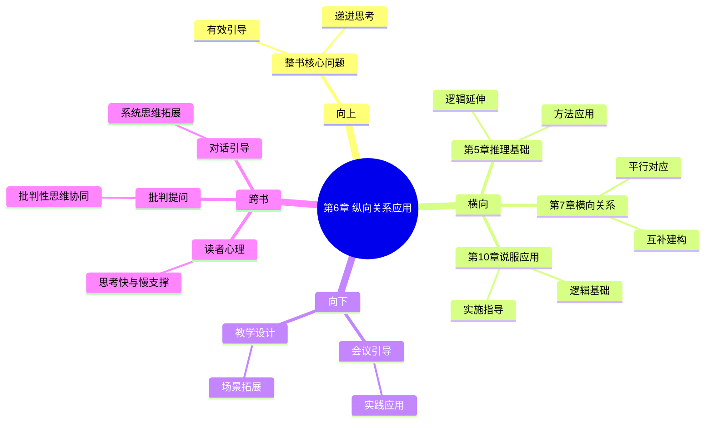

# 第6章 纵向关系的具体应用

## 📍 章节定位

### 全书位置
> 第6章深入探讨金字塔内部纵向关系在实际表达中的具体实施策略

- **全书核心问题**: 如何让想法表达得更有逻辑、更易理解？
- **本章回答的问题**: 如何在实际写作或表达中运用纵向关系？如何通过疑问-回答形式引导读者思维？
- **角色类型**: 核心概念型（详细展开应用策略）
- **论证位置**: 将第二章概念结构与第三章构建方法结合，提供具体实施指南

### 章节序列
| 方向 | 章节标题 | 逻辑连接 |
|------|----------|----------|
| 前章 | [[第5章-演绎推理与归纳推理]] | [推理方法→关系应用] |
| 后章 | [[第7章-横向关系的具体应用]] | [纵关系→横关系] |

### 一句话定位
第6章详解如何运用纵向关系构建"疑问-回答"式的逻辑链条，引导读者自然理解并接受作者观点。

---

## 🎯 核心观点

### 第一层：表层案例

| 案例名称 | 简要描述 | 页码 | 关键引文 |
|----------|----------|------|----------|
| 顾客疑问回应 | 销售场景中回答客户的疑问 | p.185-190 | "每一个信息都应在回答前一个层级提出的问题" |
| 管理报告展开 | 高管询问-细节展开的互动模式 | p.192-195 | "读者的每个疑问都能得到清晰回答" |
| 演讲逻辑串联 | 演讲者预设听众疑问并解答 | p.198-202 | "优秀的演讲会让听众自然产生跟随感" |

### 第二层：中层机制

| 机制名称 | 组成要素 | 因果链条 | 证据来源 |
|----------|----------|----------|----------|
| 疑问驱动机制 | 问题意识→探究动力→解答满足 | 设置悬念→激发好奇→获取答案 | 认知心理学研究 |
| 层次对话机制 | 上层设问→下层回应→递进深入 | 提出疑问→给予解答→引出新问题 | 篇章语言学分析 |
| 预设回应机制 | 读者期待→针对性解答→认知确认 | 预测疑问→精准回应→增强信任 | 读者接受理论 |
| 逻辑延续机制 | 当前解答→引出新层→保持连贯 | 完成当前→触发下层→维持关注 | 递归思维模型 |

### 第三层：底层规律

| 规律陈述 | 抽象层级 | 知识连接 | 适用范围 |
|----------|----------|----------|----------|
| 问题驱动定律 | 认知科学/学习理论 | [[思考快与慢#观点2：前景理论 - 为什么你赚小亏大？]] | 所有信息传递场景 |
| 认知循环原理 | 现象学/认知哲学 | [[批判性思维工具-保罗-拆解记录]] | 思辨对话过程 |
| 理解递进规律 | 教育心理学/认知学习 | [[学会提问#观点4：常见的逻辑谬误]] | 传知识场景 |
| 思维引领机制 | 传播学/心理认知 | [[第五项修炼#观点3：系统思考的法则]] | 沟通说服过程 |

---

## 💬 降维翻译

### 观点1: 有效疑问-回答构建机制

#### 原文表达
> 在构建纵向关系的过程中，必须设想读者对上一层思想会提出什么疑问，并给出有针对性的回答。纵向关系本质上就是一个持续的疑问-回答循环，它让读者感觉自己参与了一个互动的思考过程。
> —— p.186

#### 降维翻译（中学生能懂）
当你写东西或者说话时，要不断想着听众或读者会问你什么问题，然后提前回答这些问题。这是一个不断的问答循环，让别人觉得像是在跟你对话一样。

#### 日常类比（奶奶能懂）
就像两个人聊天，我说一句话，你就自然会想知道下一句说的是什么。比如说我告诉你"今年粮食收成特别好"，你可能就会问："那为什么好？好在哪儿？"我就要针对这些问题回答你。

#### 检验
- Q: 如果一个中学生问你这是什么意思？
- A: 比如你在演讲时说"环保很重要"，听众自然会想："为什么重要？不环保有什么害处？环保能带来什么好处？"你就应该顺着这些问题一个一个解释给他们听。

### 观点2: 层次间的逻辑纽带关系

#### 原文表达
> 上下层思想之间不仅是简单的支撑与被支撑关系，更是一种逻辑引导关系。上层思想提出疑问，下层思想必须能够回答这个疑问，这样的关系形成了一个连贯的逻辑链条。
> —— p.192

#### 降维翻译（中学生能懂）
上下层观点不只是简单的支撑关系，更重要的是逻辑关系。比如上层说了一个观点，下层就要回答围绕这个观点的疑问。

#### 日常类比（奶奶能懂）
就像爬楼梯，上一层是问了个问题，下一层就要给出答案，一层接一层，这样走下去就能把一件事说清楚。

#### 检验
- Q: 如果一个中学生问你这是什么意思？
- A: 打个比方，如果我说"这个学习方法特别好"（上层观点），那么下一层要解决"为什么好"、"好在哪些方面"等问题。要是下一层却说"老师也用了这个方法"，就没有回答到问题。

### 观点3: 读者预期管理的重要性

#### 原文表达
> 纵向关系的构建必须考虑读者的认知预期，合理设置疑问的类型和出现时机，避免设置过于生硬或不合逻辑的疑问。
> —— p.198

#### 降维翻译（中学生能懂）
你构建问答链条时要想想读者会自然地产生什么疑问，而不是你想当然地设置疑问。要让读者觉得你问的问题正是他想问的。

#### 日常类比（奶奶能懂）
就像讲故事，你要在合适的地方留下悬念，让大家自然而然想继续听下去，而不能硬生生打断故事问一些大家没想到的问题。

#### 检验
- Q: 如果一个中学生问你这是什么意思？
- A: 比如你说到"考试成绩提高了"，自然而然会引发"怎么提高的"、"提高多少"等问题，而不是"天气怎么样"等无关问题。你的回答要符合人们的正常思维逻辑。

---

## ✨ 金句库

### 原书金句
| 金句 | 页码 | 适用场景 |
|------|------|----------|
| "每一个下层信息都应该在回答上层思想引起的问题。" | p.186 | 文章架构、逻辑建构 |
| "纵向关系是疑问与回答的连续循环。" | p.188 | 表达策略、结构设计 |
| "优秀的逻辑让读者感觉自己参与到思考中。" | p.189 | 用户体验、沟通效果 |
| "上层设疑，下层释疑，层层递进。" | p.190 | 架构逻辑、层次设计 |
| "预设读者的逻辑疑问是构建纵向关系的关键。" | p.194 | 用户思维、需求理解 |
| "纵向关系的质量决定表达的整体逻辑性。" | p.196 | 作品评价、质量评估 |
| "合理的问题设置引导读者自然跟随。" | p.199 | 沟通设计、引导技巧 |
| "疑问的逻辑性保证纵向关系的有效性。" | p.192 | 逻辑检验、结构评估 |
| "问答循环构建认知的连贯性。" | p.195 | 心理认知、学习效果 |
| "纵向关系体现思维的严密性。" | p.197 | 思维训练、素质提升 |
| "上下层之间的逻辑纽带应自然流畅。" | p.190 | 文章润色、逻辑优化 |
| "纵向关系是表达的脊柱结构。" | p.187 | 概念理解、框架认知 |
| "精准的疑问设定提升表达的针对性。" | p.200 | 沟通精准、效率提升 |
| "逻辑链路应保持一致性与连贯性。" | p.198 | 结构评价、逻辑检验 |
| "优秀的纵向关系让人读来毫不费力。" | p.202 | 使用体验、质量标准 |

### 降维金句
| 金句 | 来源观点 | 适用场景 |
|------|----------|----------|
| "上层设问题，下层给答案。" | 纵向关系 | 逻辑架构 |
| "逐层解疑问，步步引跟随。" | 引导策略 | 读者引导 |
| "问题要恰当，回答要精准。" | 对应关系 | 构建原则 |
| "设问循自然，回应重及时。" | 回应时效 | 设问技巧 |
| "疑问成链条，逻辑便通畅。" | 连锁关系 | 逻辑建构 |
| "读者想啥问，我就咋回答。" | 读者意识 | 用户导向 |
| "一问接一答，道理自然明。" | 递进逻辑 | 表达优化 |
| "层层有呼应，逻辑更严密。" | 呼应关系 | 严密性 |
| "问题需合理，答案要对应。" | 匹配性 | 质量标准 |
| "设问抓痛点，回答解疑惑。" | 痛点解决 | 针对性强 |
| "思路要清楚，引导要自然。" | 清晰引导 | 表达质量 |
| "上下应连贯，层次需分明。" | 连贯层次 | 结构清晰 |
| "问答顺逻辑，表达便通畅。" | 顺序性 | 逻辑优化 |
| "问题定方向，答疑促理解。" | 方向控制 | 理解引导 |
| "设问有技巧，回应讲艺术。" | 技艺要求 | 构建艺术 |

## 🔗 当下映射

### 💰 财富应用
| 场景 | 具体行动 | 预期效果 | 风险提示 |
|------|----------|----------|----------|
| 商业方案撰写 | 以疑问-回答方式展开投资亮点 | 提升投资者理解效率，增强投资信心 | 过度承诺风险回答可能引发关注 |
| 产品介绍文案 | 针对客户常见问题逐一解决 | 解决客户疑虑，提高转化率 | 避免回答过于直接而暴露短板 |
| 融资沟通 | 预设投资人关注点并系统解答 | 加速决策流程，提高融资成功率 | 答非所问可能引起反感 |

### 💼 职场应用
| 场景 | 具体行动 | 所需能力 | 适用职级 |
|------|----------|----------|----------|
| 工作汇报 | 按管理层关注点主动解答疑问 | 预判能力、问题处理 | P6+ |
| 项目推进 | 从前置问题到解决方案的逻辑展开 | 系统思维、逻辑构建 | PM级别 |
| 专业培训 | 预设学员学习疑问并解答 | 教学设计、逻辑呈现 | 培训师/主管 |
| 团队沟通 | 按疑问链条引导团队思考 | 沟通引导、逻辑组织 | Team Lead+ |

### 🏠 生活应用
| 场景 | 具体行动 | 可行性 | 见效时间 |
|------|----------|--------|----------|
| 阐述观点 | 设问-回答方式表达个人看法 | 高，需练习 | 2-3天 |
| 亲情沟通 | 预期长辈顾虑并提前解答 | 中，实践难度较大 | 1周 |
| 友谊维护 | 顺应朋友好奇并解答 | 高，日常可用 | 立即可用 |

### 72小时行动计划
1. 今天分析一篇逻辑严谨的文章，找出其纵向疑问-回答设置
2. 明天在一次工作沟通中，主动预设对方疑问并提前解答
3. 后天用设问-回答的方式重新组织一次日常沟通

---

## 🕸️ 章节关联

### 向上关联 → 整书
- **贡献**: 为纵向关系理论提供实用指南，实现结构与应用的对接
- **位置**: 作为从概念到实践的桥梁，支撑全书理论体系的完整性

### 横向关联 → 章节间
| 章节编号 | 章节标题 | 关联类型 | 连接描述 |
|----------|----------|----------|----------|
| 第5章 | [[第5章-演绎推理与归纳推理]] | 应用延伸 | 横向关系提供了推理方式的具体运用场景 |
| 第7章 | [[第7章-横向关系的具体应用]] | 平行对应 | 理解纵向关系有助于理解横向关系的运用 |
| 第8章 | [[第8章-界定问题的框架]] | 实践延伸 | 问题界定需要运用疑问-回答方式展开 |
| 第10章 | [[第10章-在书面上呈现具有说服力的结构]] | 逻辑基础 | 书写逻辑基于有效的纵向关系构建 |

### 向下关联 → 具体应用
| 应用场景 | 难度 | 前置知识 |
|----------|------|----------|
| 学术论文写作 | 高 | 熟练掌握质疑-解答技巧 |
| 商务沟通汇报 | 中 | 理解目标读者心理预期 |
| 演讲表达设计 | 高 | 预判能力与临场调整能力 |
| 内容创作 | 中 | 掌握用户心理把握技巧 |

### 跨书关联 → 知识网络
| 书籍 | 概念 | 关系 | 备注 |
|------|------|------|------|
| [[思考快与慢-卡尼曼-拆解记录]] | 系统2逻辑思考 | 工具支撑 | 读者需要逻辑推理能力 |
| [[学会提问-布朗-拆解记录]] | 批判性问题 | 方法协同 | 有效的疑问设置需要批判性思维 |
| [[第五项修炼-圣吉-拆解记录]] | 引导团队对话 | 理念延伸 | 疑问引出系统性思考 |
| [[批判性思维工具-保罗-拆解记录]] | 问题导向思维 | 能力协同 | 提升设问质量与回应逻辑性 |

### 关联可视化

---

## ❓ 问答设计

### Q1: 纵向关系的基本构成是什么？（记忆型问题）
**认知层次**: 记忆
**难度**: 低
**答案要点**:
- 上层设疑：提出问题或引起关注
- 下层释疑：给予明确回答或解释
- 递进展开：引出下一层次的问题

### Q2: 为什么纵向关系是有效的逻辑构造方式？（理解型问题）
**认知层次**: 理解
**难度**: 中
**答案要点**:
- 满足人类好奇心和求知欲
- 模拟自然对话的思维方式  
- 引导读者主动跟随逻辑链条
- 增强理解和记忆持久性

### Q3: 如何在商务提案中有效运用纵向关系？（应用型问题）
**认知层次**: 应用
**难度**: 中
**答案要点**:
- 识别决策者关切点设置疑问
- 组织材料针对性解答疑问
- 确保回答与问题逻辑契合
- 适时引入新层级疑问引导

### Q4: 纵向关系与横向关系在构建时有何差异？（分析型问题）
**认知层次**: 分析
**难度**: 高
**答案要点**:
- 方向差异：纵向向下深入，横向平行延展
- 目标不同：纵向追求深度理解，横向追求广度覆盖
- 逻辑机制：纵向疑问-回答式，横向并列-类比式
- 认知负担：纵向单线思考，横向多元素处理

### Q5: 如何预判读者可能产生的疑问？（应用型问题）
**认知层次**: 应用
**难度**: 中
**答案要点**:
- 分析目标读者背景与期待
- 总结相关领域的常见问题
- 参考已有的问答交互实例
- 模拟读者思维方式

### Q6: 数字化时代的纵横关系应用特点？（综合型问题）
**认知层次**: 综合
**难度**: 高
**答案要点**:
- 注意力分散要求更紧密逻辑关联
- 多媒体呈现需要视觉化递进
- 互动性提升对问题质量要求
- 算法推荐对逻辑连贯性要求更高

### Q7: 错误的纵向问题设置可能带来什么问题？（分析型问题）
**认知层次**: 分析
**难度**: 高
**答案要点**:
- 答非所问降低说服效果
- 偏离读者关注重点
- 人为制造逻辑分歧
- 损害内容可信度

### Q8: 如何平衡疑问的深度与广度？（评价型问题）
**认知层次**: 评价
**难度**: 高
**答案要点**:
- 根据内容复杂度确定层级深度
- 保证广度覆盖的前提下深化解答
- 避免过度深入导致偏离主题
- 灵活调整层级间关联松紧度

### Q9: 纵向关系中的过渡语言如何优化？（应用型问题）
**认知层次**: 应用
**难度**: 中
**答案要点**:
- 明确问题与答案的对应关系
- 使用自然连接词增强连贯性
- 保持逻辑指示词的一致性
- 控制转换节奏与读者适应性

### Q10: 不同文化对纵向关系的接受程度如何？（分析型问题）
**认知层次**: 分析
**难度**: 高
**答案要点**:
- 不同文化中问答案模式存在差异
- 思维导向可能影响接受习惯
- 权力距离影响设问接受度
- 高语境低语境文化理解方式不同

### Q11: 团队协作中如何统一纵向逻辑构建标准？（应用型问题）
**认知层次**: 应用
**难度**: 高
**答案要点**:
- 建立共同的疑问预判模型
- 制定问题回答的质量标准
- 设置审核与反馈机制
- 统一逻辑连通的语言表达

### Q12: 面对复杂问题如何构建纵向层级？（创造型问题）
**认知层次**: 综合
**难度**: 高
**答案要点**:
- 采用多层次嵌套的纵向结构
- 建立分叉子问题的解答机制
- 设置检查点确认理解进度
- 弹性调整深度适应理解能力

### Q13: 何时应当使用跳跃而非连续式纵向？（综合型问题）
**认知层次**: 评价
**难度**: 高
**答案要点**:
- 对象已具备相应认知基础时
- 篇幅严格限制时
- 过度琐碎影响整体理解时
- 特定专业领域的常规表达习惯

### Q14: 如何检测纵向关系的构建质量？（分析型问题）
**认知层次**: 分析
**难度**: 高
**答案要点**:
- 验证每层问题与回答的契合度
- 检查逻辑链路是否顺畅
- 评估问答设置是否自然合理
- 测试读者理解效率是否达标

### Q15: 智能化时代人工纵向构建还有价值吗？（创造型问题）
**认知层次**: 评价
**难度**: 高
**答案要点**:
- 人对人的理解具有独特性
- 复杂情境需要人性化判断
- 深层洞察与共情难以程序化
- 融合智能工具可能提升构建效率

---
