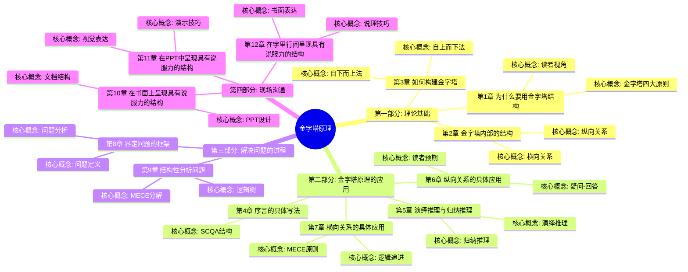
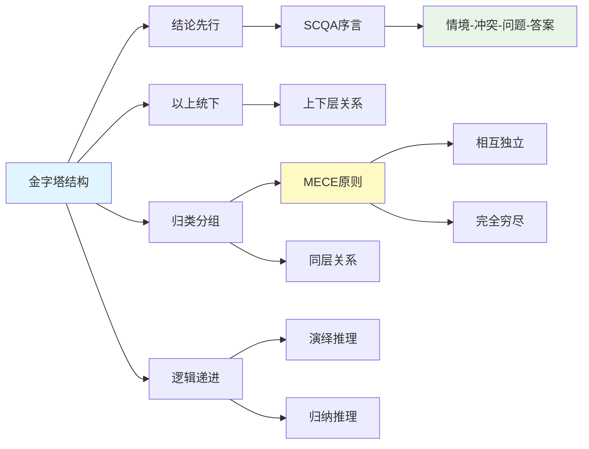

# 《金字塔原理》- 章节导航

> 作者: [美] 芭芭拉·明托
> 总章节: 12章
> 最后更新: 2026-02-27

---

## 📚 章节结构（Mermaid Mindmap）

---

## 🔗 核心概念关联图

---

| 章节 | 标题 | 状态 | 完成日期 | 核心收获 |
|------|------|------|----------|----------|

---

## 🚀 快速跳转

### 按章节跳转
- [[第1章-为什么要用金字塔结构]]
- [[第1章-哈吉斯]]
- [[第3章-如何构建金字塔]]
- [[第4章-序言的具体写法]]
- [[第5章-演绎推理与归纳推理]]
- [[第6章-纵向关系的具体应用]]
- [[第7章-横向关系的具体应用]]
- [[第1章-哈吉斯]]
- [[第1章-哈吉斯]]
- [[第1章-哈吉斯]]
- [[第11章-在PPT中呈现具有说服力的结构]]
- [[第1章-哈吉斯]]

### 按主题跳转
- [[第1章-为什么要用金字塔结构]]
- [[MECE原则]]
- [[SCQA结构]]
- [[第5章-演绎推理与归纳推理]]
- [[第5章-演绎推理与归纳推理]]

### 相关资源
- [[金字塔原理-明托]] - 主拆解笔记
- [[结构化思维]] - 相关知识卡片
- [[逻辑表达]] - 相关知识卡片
