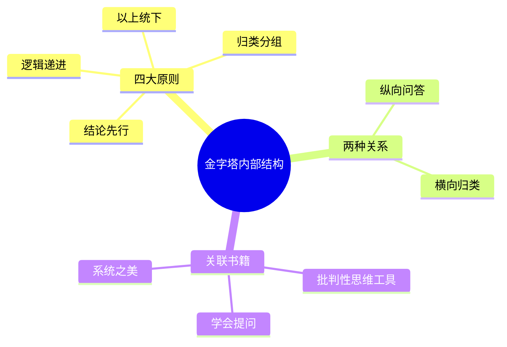

---

category:
  - 书籍拆解

status: draft
chapter:
number: 2
title: 金字塔的内部结构
links:

  - "[[第1章-为什么要用金字塔结构]]"
  - "[[第3章-如何构建金字塔]]"
created: 2026-02-27
tags:
  - 金字塔原理
  - 结构化思维
  - MECE原则
---

# 第2章 金字塔的内部结构

## 📍 章节定位

### 全书位置
> 本章是全书核心章节，回答"金字塔结构是什么"的问题

- **全书核心问题**: 如何让思考清晰、表达有力？
- **本章回答的问题**: 金字塔结构由哪些要素组成？它们如何配合？
- **角色类型**: 核心概念型
- **论证位置**: 承接第1章的"为什么"，定义"是什么"

### 章节序列
| 方向 | 章节标题 | 逻辑连接 |
|------|----------|----------|
| 前章 | [[第1章-为什么要用金字塔结构]] | 本章承接"为什么"，展开"是什么" |
| 后章 | [[第3章-如何构建金字塔]] | 铺垫本章的结构要素，引出"怎么做" |

### 一句话定位
> 第2章是全书核心，定义金字塔的四大原则（结论先行、以上统下、归类分组、逻辑递进）和两大关系（纵向、横向）。

---

## 🎯 核心观点

### 第一层：表层案例
> 章节中的具体案例、故事、数据

| 案例名称 | 简要描述 | 关键引文 |
|----------|----------|----------|
| 咨询报告结构 | 标题→核心结论→分论点→论据 | "每一层都是下一层的总结" |
| 汇报三分钟 | 一句话说结论，三点支撑 | "先总后分是永恒原则" |
| 问题分析结构 | 问题→原因→解决方案 | "纵向回答问题，横向归类分组" |

### 第二层：中层机制
> 案例背后的运行机制、方法论

| 机制名称 | 组成要素 | 因果链条 | 证据来源 |
|----------|----------|----------|----------|
| 四大原则 | 结论先行、以上统下、归类分组、逻辑递进 | 原则→结构→清晰表达 | 咨询案例 |
| 纵向关系 | 顶层→中层→底层 | 上层概括下层，下层支撑上层 | 三分钟汇报 |
| 横向关系 | 同层之间 | MECE原则确保不重不漏 | 问题分析 |

### 第三层：底层规律
> 可迁移的普遍规律

| 规律陈述 | 抽象层级 | 知识连接 | 适用范围 |
|----------|----------|----------|----------|
| 结论是金字塔的塔尖 | 结构论 | [[系统之美-梅多斯]] | 所有层级结构 |
| MECE是分类的金标准 | 逻辑学 | [[批判性思维工具-保罗]] | 所有分类场景 |
| 每一层都是下一层的抽象 | 认知科学 | [[思考快与慢-丹尼尔·卡尼曼]] | 信息压缩、记忆 |

---

## 💬 降维翻译

### 观点1: 金字塔四大原则

#### 原文表达
> "金字塔结构必须遵循四大原则：结论先行、以上统下、归类分组、逻辑递进。"

#### 降维翻译（中学生能懂）
金字塔有四条"铁律"：
1. **结论先行**：最重要的放最前面
2. **以上统下**：上面的统领下面的
3. **归类分组**：同类的东西放一起
4. **逻辑递进**：按顺序来，不能乱

就像写作文：
- 先写中心思想（结论先行）
- 每段有段意（以上统下）
- 同类内容同一段（归类分组）
- 段落有顺序（逻辑递进）

#### 日常类比（奶奶能懂）
就像盖房子：
- **结论先行**：先告诉别人要盖什么房子
- **以上统下**：屋顶决定墙体，墙体决定地基
- **归类分组**：卧室在一起，厨房在一起
- **逻辑递进**：先打地基，再盖墙，最后封顶

---

### 观点2: 纵向关系与横向关系

#### 原文表达
> "金字塔结构有两种关系：纵向是问答关系，横向是归类关系。"

#### 降维翻译（中学生能懂）
金字塔里有两套"关系网"：
- **纵向（上下关系）**：上面是"答案"，下面是"为什么"
- **横向（左右关系）**：同一层的东西是"同类"

比如你说"今天不去上学"：
- 纵向问：为什么？→ 因为生病了
- 横向问：还有什么原因？→ 需要参加比赛

#### 日常类比（奶奶能懂）
就像家和房间：
- **纵向**：客厅是"公共区域"→ 为什么？→ 有沙发、电视（支撑）
- **横向**：客厅、餐厅、门厅都是"公共区域"（归类）

---

## ✨ 金句库

### 原书金句
| 金句 | 适用场景 |
|------|----------|
| "结论先行是永恒的原则。" | 写作指导 |
| "每一层都是下一层的总结概括。" | 结构设计 |
| "纵向回答问题，横向归类分组。" | 培训课程 |
| "MECE原则：相互独立，完全穷尽。" | 逻辑思维 |

### 降维金句
| 金句 | 来源观点 | 适用场景 |
|------|----------|----------|
| "金字塔四原则：先行、统下、归类、递进。" | 四大原则 | 记忆口诀 |
| "纵向是'为什么'，横向是'还有什么'。" | 两种关系 | 沟通培训 |
| "上面统领下面，左右互不重叠。" | 纵横关系 | 结构设计 |

## 🔗 当下映射

### 💰 财富应用
| 场景 | 具体行动 | 预期效果 | 风险提示 |
|------|----------|----------|----------|
| 投资报告 | 核心结论→支撑论点→数据 | 决策效率提升 | 不能过度简化风险 |
| 融资路演 | 投资亮点→业务数据→市场分析 | 投资人理解度提高 | 需要数据真实性 |

### 💼 职场应用
| 场景 | 具体行动 | 所需能力 | 适用职级 |
|------|----------|----------|----------|
| 汇报PPT | 标题=结论，内容=支撑 | 结构化思维 | 所有职级 |
| 项目报告 | 结论→原因→方案→计划 | 逻辑表达 | 中层以上 |

### 🏠 生活应用
| 场景 | 具体行动 | 可行性 | 见效时间 |
|------|----------|--------|----------|
| 家庭讨论 | 先说决定，再说原因 | 高 | 立即见效 |
| 朋友求助 | 先给建议，再解释理由 | 高 | 立即见效 |

### 72小时行动计划
1. 明天的任何书面沟通，先写结论
2. 观察一个汇报，画出它的金字塔结构
3. 用四大原则检查自己的一篇文档

---

## 🕸️ 章节关联

### 向上关联 → 整书
- **贡献**: 定义金字塔的核心要素
- **位置**: 全书的理论核心

### 横向关联 → 章节间
| 章节编号 | 章节标题 | 关联类型 | 连接描述 |
|----------|----------|----------|----------|
| 第1章 | 为什么要用金字塔结构 | 承接 | 本章承接"为什么"，定义"是什么" |
| 第3章 | 如何构建金字塔 | 铺垫 | 本章定义要素，下章教如何使用 |

### 跨书关联 → 知识网络
| 书籍 | 概念 | 关系 | 备注 |
|------|------|------|------|
| [[批判性思维工具-保罗]] | 思维要素 | 支持 | MECE是思维要素之一 |
| [[学会提问-布朗]] | 论证结构 | 延伸 | 纵向关系=论证关系 |
| [[系统之美-梅多斯]] | 层级系统 | 延伸 | 金字塔=层级结构特例 |

### 关联可视化

---

## ❓ 问答设计

### Q1: 金字塔的四大原则是什么？（记忆型）
**认知层次**: 记忆
**难度**: 低
**答案要点**:
- 结论先行
- 以上统下
- 归类分组
- 逻辑递进

### Q2: 纵向关系和横向关系有什么区别？（理解型）
**认知层次**: 理解
**难度**: 中
**答案要点**:
- 纵向：上下级关系，问答逻辑
- 横向：同层级关系，归类逻辑
- 两者配合形成完整结构

### Q3: 为什么说MECE是分类的金标准？（分析型）
**认知层次**: 分析
**难度**: 高
**答案要点**:
- 相互独立：不重叠
- 完全穷尽：不遗漏
- 确保分类完整性和清晰度

---
