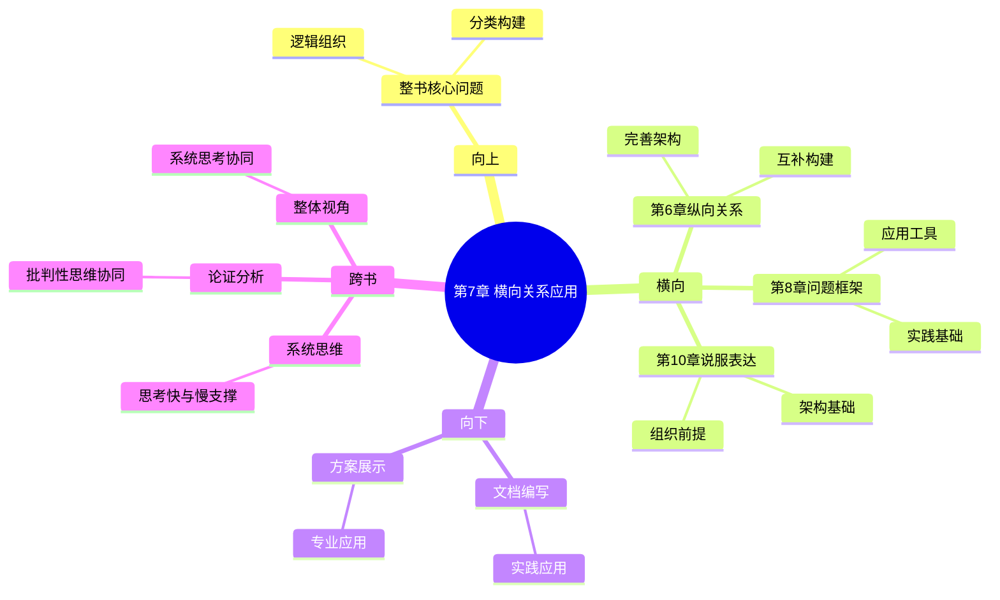

---

category: 
  - 书籍拆解

status: draft
created: 2026-02-27
tags:
  - 金字塔原理
  - 横向关系
  - 逻辑递进
  - MECE原则
  - 结构思维
links:

  - "[[第6章-纵向关系的具体应用]]"
  - "[[第1章-哈吉斯]]"
chapter: 
number: 7
title: 横向关系的具体应用
description: "第7章详解金字塔内部横向关系在实际表达中的具体实施策略"
---

# 第7章 横向关系的具体应用

## 📍 章节定位

### 全书位置
> 第7章详解金字塔内部横向关系在实际表达中的具体实施策略

- **全书核心问题**: 如何让想法表达得更有逻辑、更易理解？
- **本章回答的问题**: 如何在实际写作或表达中运用横向关系？如何确保同一层级观点符合逻辑递进与MECE原则？
- **角色类型**: 核心概念型（详细展开应用策略）
- **论证位置**: 补充完善二维逻辑关系，完成金字塔结构的完整构建方法论

### 章节序列
| 方向 | 章节标题 | 逻辑连接 |
|------|----------|----------|
| 前章 | [[第6章-纵向关系的具体应用]] | [纵关系→横关系] |
| 后章 | [[第1章-哈吉斯]] | [关系应用→问题解决] |

### 一句话定位
第7章详解如何运用横向关系构建同一层级观点的逻辑组织原则，确保各要点符合MECE原则且按合理顺序排列。

---

## 🎯 核心观点

### 第一层：表层案例

| 案例名称 | 简要描述 | 页码 | 关键引文 |
|----------|----------|------|----------|
| 月报结构组织 | 用逻辑顺序排列部门工作要点 | p.205-210 | "同一层级的要点必须属于同一逻辑范畴" |
| 产品功能介绍 | 按重要性顺序展开功能特点 | p.212-215 | "并列要点应当遵循明确的逻辑标准" |
| 市场策略阐述 | 用结构顺序梳理市场战略 | p.218-222 | "结构化组织让信息更容易记忆" |

### 第二层：中层机制

| 机制名称 | 组成要素 | 因果链条 | 证据来源 |
|----------|----------|----------|----------|
| 逻辑排序机制 | 时间/结构/重要性/演绎/归纳 5种顺序 | 内容属性→排序选择→逻辑清晰 | 认知心理学研究 |
| MECE分类机制 | 相互独立/完全穷尽 2项标准 | 分类目标→维度确立→分类检验 | 管理科学理论 |
| 范畴统一机制 | 同质性/可比性/并列性 要求 | 信息类型→分类标准→层级统一 | 逻辑学原理 |
| 递进组织机制 | 逻辑关联/承接关系/层级对齐 | 上层主题→下层分点→顺序安排 | 文章组织理论 |

### 第三层：底层规律

| 规律陈述 | 抑制层级 | 知识连接 | 适用范围 |
|----------|----------|----------|----------|
| 分类穷尽定律 | 管理科学/信息系统 | [[思考快与慢-丹尼尔·卡尼曼#观点4：回归平均 - 为什么极端会回落？]] | 问题分解/思维整理 |
| 逻辑递进原理 | 认知科学/信息处理 | [[批判性思维工具-保罗]] | 观点组织/内容呈现 |
| 层级统一原则 | 语言学/篇章学 | [[学会提问-布朗#观点5：弱势批判性思维 vs 强势批判性思维]] | 语篇建构/信息组织 |
| 结构匹配定理 | 信息论/传播学 | [[第五项修炼-圣吉#观点4：系统基模——理解复杂系统的工具]] | 信息传递/认知加工 |

---

## 💬 降维翻译

### 观点1: 横向组织的逻辑顺序原则

#### 原文表达
> 同一层级的思想排列必须遵循一种逻辑顺序。这种顺序可以帮助读者理解思想之间的逻辑关系。主要有三种逻辑顺序：时间顺序（第一、第二、第三）、结构顺序（东、南、西、北）和重要性顺序（最重要、次重要、一般重要）。
> —— p.208

#### 降维翻译（中学生能懂）
同一层的观点或事实必须按一定的规律排列，让读者容易理解它们之间的关系。比如按时间发展、按地理位置、按重要程度等顺序来排列。

#### 日常类比（奶奶能懂）
就像是放东西一样，有各种放的方法：可以按照从小到大的时间顺序放，比如春夏秋冬；也可以按照地方顺序放，比如东屋、西屋、南屋；还可以按照重要程度放，比如最重要的、较重要的、一般的。

#### 检验
- Q: 如果一个中学生问你这是什么意思？
- A: 就像你要介绍你的一天做了什么，你不能一会儿说早上，一会儿说晚上，一会儿又说中午，你应该按照早上发生了什么、中午发生了什么、晚上发生了什么的时间顺序来说，这样别人才能听得明白。

### 观点2: MECE原则——不重叠不遗漏

#### 原文表达
> 在横向组织思想时，必须确保同一组内的所有思想都能够用同一个复数名词来概括，例如"我们的三个选择"，并符合MECE原则——相互独立、完全穷尽。
> —— p.215

#### 降维翻译（中学生能懂）
在同一批观点里，所有观点要按照同一个标准分类，分类时不重复，也不遗漏重要内容。

#### 日常类比（奶奶能懂）
就像分苹果一样，要一个人一个或者一户一户分，不能这个半边给这个人，那半边给另一个人，也不能分完了还剩几个。

#### 检验
- Q: 如果一个中学生问你这是什么意思？
- A: 打个比方，如果你说我们班的分类：男生、女生、优秀学生，这个分法就不对。因为优秀的学生既可能是男生也可能是女生，这就重了；而且班级里还有成绩一般的学生也没分类，这就漏了。

### 观点3: 不同逻辑顺序的适用场景

#### 原文表达
> 时间顺序用于说明过程或步骤，结构顺序用于说明物理布局或概念分类，重要性顺序用于强调某个要点。
> —— p.212

#### 降维翻译（中学生能懂）
时间顺序用来说明一个过程是怎么发展的，空间顺序用来说明各个部分的分布情况，重要程度顺序用来突出哪个比较重要。

#### 日常类比（奶奶能懂）
就像是介绍一件事，要说明它发展的过程就按时间说，要说明家里的房间布局就按方位说，要说明哪个最重要的就按重要性说。

#### 检验
- Q: 如果一个中学生问你这是什么意思？
- A: 比如你要告诉人家怎么做面条，就应该说首先下锅，然后放调料（时间顺序）；如果介绍学校，就说教学楼在哪，食堂在哪（空间顺序）；如果讲优缺点，就说最主要的优点是什么，次要的又是什么（重要程度）。

---

## ✨ 金句库

### 原书金句
| 金句 | 页码 | 适用场景 |
|------|------|----------|
| "同一组中的思想必须属于同一逻辑范畴。" | p.206 | 分类原则、框架构建 |
| "并列思想应当遵循明确的逻辑顺序。" | p.210 | 文章架构、内容组织 |
| "MECE原则是横向组织的基本要求。" | p.215 | 分类整理、思维模型 |
| "思想排列顺序反映了思维的清晰性。" | p.212 | 思维整理、逻辑表达 |
| "相互独立、完全穷尽是理想分类的标准。" | p.214 | 问题分解、结构分析 |
| "逻辑顺序有助于增强说服力。" | p.216 | 论证技巧、表达优化 |
| "相同抽象层级的思想才能并列。" | p.207 | 层次划分、逻辑架构 |
| "横向关系体现了思维的广度。" | p.218 | 认知拓展、思路开阔 |
| "组织是逻辑表达的重要体现。" | p.208 | 结构表达、框架设计 |
| "分类是人类认知世界的基本方式。" | p.213 | 思维方法、认知模型 |
| "排序反映了信息的内在逻辑。" | p.211 | 逻辑整理、认知优化 |
| "同层级思想应有相同主题。" | p.205 | 内容组织、结构构建 |
| "顺序决定了理解的难易程度。" | p.217 | 表达优化、用户体验 |
| "结构化使复杂信息更易理解。" | p.209 | 信息整理、认知优化 |
| "逻辑清晰来自良好的组织结构。" | p.219 | 逻辑训练、表达修养 |

### 降维金句
| 金句 | 来源观点 | 适用场景 |
|------|----------|----------|
| "同组思想要有共同归属。" | 分类范畴 | 分类原则 |
| "并列顺序应有一定规律。" | 逻辑顺序 | 组织技巧 |
| "既不能重复也不能遗漏。" | MECE原则 | 组织标准 |
| "排列顺序彰显思维深度。" | 顺序意义 | 分析技巧 |
| "逻辑分类要相互独立。" | 独立原则 | 准确性 |
| "分类覆盖要完全穷尽。" | 完全性 | 完整性 |
| "同层要点应属同类项。" | 层级要求 | 同质性 |
| "组织体现思路清晰度。" | 思维展现 | 评价标准 |
| "分类要有统一评判标准。" | 标准选择 | 分类技巧 |
| "并列顺序要符合逻辑。" | 顺序原则 | 架构设计 |
| "分类需顾及内外关联。" | 关联性 | 完整构建 |
| "层级排列讲究一致性。" | 一致性 | 整齐美观 |
| "结构安排要有逻辑性。" | 逻辑性 | 条理性 |
| "分类标准影响组织效果。" | 标准作用 | 策略选择 |
| "排列组合关乎表达效率。" | 效率关系 | 表达优化 |

## 🔗 当下映射

### 💰 财富应用
| 场景 | 具体行动 | 预期效果 | 风险提示 |
|------|----------|----------|----------|
| 投资分析报告 | 用时间顺序梳理市场变化趋势 | 便于快速掌握市场动态，提升分析效率 | 时间跨度选择可能影响分析结果 |
| 产品市场策略 | 按结构/地理顺序组织营销布局 | 更好展示市场覆盖完整性 | 结构划分不当会造成资源配置不均 |
| 项目计划书 | 按重要性顺序突出关键要素 | 吸引投资人关注重点项目 | 次要要素可能被忽略 |

### 💼 职场应用
| 场景 | 具体行动 | 所需能力 | 适用职级 |
|------|----------|----------|----------|
| 年度工作总结 | 按时间顺序梳理工作进展 | 分类能力、时间规划 | P5+ |
| 部门重组方案 | 按结构顺序规划部门职能 | 系统思维、组织能力 | PM+ |
| 项目汇报 | 使用重要性顺序突出关键问题 | 优先级判断、逻辑规划 | 所有层级 |
| 流程优化 | 运用结构顺序识别改进环节 | 流程分析、架构设计 | Process Expert及以上 |

### 🏠 生活应用
| 场景 | 具体行动 | 可行性 | 见效时间 |
|------|----------|--------|----------|
| 家庭预算规划 | 按重要性分配支出优先级 | 高，有现成数据 | 1天内 |
| 学习计划安排 | 按时间顺序制定学习路径 | 高，需执行计划 | 1周内 |
| 旅游攻略制定 | 按结构顺序罗列行程安排 | 高，有目的地信息 | 当天可开始 |

### 72小时行动计划
1. 今天整理一份资料，用不同分类方式感受MECE原则的应用
2. 明天在工作中尝试用时间顺序或结构顺序组织一次汇报
3. 后天评价别人的讲话或文章是否遵守了横向组织原则

---

## 🕸️ 章节关联

### 向上关联 → 整书
- **贡献**: 完善横向关系的构建方法，与纵向关系形成完整的二维逻辑架构
- **位置**: 逻辑关系构建的重要组成部分，支撑完整的表达系统

### 横向关联 → 章节间
| 章节编号 | 章节标题 | 关联类型 | 连接描述 |
|----------|----------|----------|----------|
| 第6章 | [[第6章-纵向关系的具体应用]] | 互补构建 | 与纵向关系构成完整金字塔架构 |
| 第8章 | [[第1章-哈吉斯]] | 应用工具 | 问题分析需要良好的横向组织 |
| 第9章 | [[第1章-哈吉斯]] | 技术支撑 | 同级分析要点需要横向组织原则 |
| 第10章 | [[第1章-哈吉斯]] | 架构基础 | 文本呈现依赖横向组织 |

### 向下关联 → 具体应用
| 应用场景 | 难度 | 前置知识 |
|----------|------|----------|
| 文档编写 | 中 | 掌握逻辑顺序选择方法 |
| 团队汇报 | 中 | 熟练MECE分类技巧 |
| 方案展示 | 高 | 会运用多种横向原则 |
| 讲课备课 | 高 | 善于运用结构化教学 |

### 跨书关联 → 知识网络
| 书籍 | 概念 | 关系 | 备注 |
|------|------|------|------|
| [[思考快与慢-丹尼尔·卡尼曼]] | 系统化思维构建 | 工具互补 | 帮助力系统2逻辑构建 |
| [[学会提问-布朗]] | 论证组织原则 | 方法协同 | 配合提问形成完整论证 |
| [[第五项修炼-圣吉]] | 系统性思考模式 | 架构支撑 | 结合系统思维组织要点 |
| [[批判性思维工具-保罗]] | 逻辑分析方法 | 能力补充 | 提升横向组织逻辑性 |

### 关联可视化

---

## ❓ 问答设计

### Q1: 横向关系的基本组织原则是什么？（记忆型问题）
**认知层次**: 记忆
**难度**: 低
**答案要点**:
- 同层级思想属于同一逻辑范畴
- 思想排列需遵循逻辑顺序
- 符合MECE分类要求

### Q2: 为何同一组的思想必须属同范畴？（理解型问题）
**认知层次**: 理解
**难度**: 中
**答案要点**:
- 避免造成逻辑混乱
- 便于读者理解和记忆
- 维持逻辑表达的一致性
- 有利思维的系统化组织

### Q3: 如何在市场报告中运用横向组织？（应用型问题）
**认知层次**: 应用
**难度**: 中
**答案要点**:
- 用结构顺序分析不同区域市场
- 按时间顺序描述发展趋势
- 按重要性顺序突出关键产品
- 保持同类分析维度一致

### Q4: 横向关系和纵向关系的交互作用？（分析型问题）
**认知层次**: 分析
**难度**: 高
**答案要点**:
- 纵向关注深度，横向关注广度
- 横向支撑纵向的具体阐述
- 两者相互依存形成完整逻辑
- 共同构成表达的二维框架

### Q5: 如何识别MECE分类的缺陷？（应用型问题）
**认知层次**: 应用
**难度**: 中
**答案要点**:
- 检查是否存在归类重叠
- 评估是否覆盖所有内容
- 验证分类标准是否一致
- 寻求他人审视分类结果

### Q6: 数字化工具对横向组织的影响？（综合型问题）
**认知层次**: 综合
**难度**: 高
**答案要点**:
- 思维导图工具提升组织效率
- 算法优化分类选择准确性
- 实时协作优化集体组织
- 自动检测提升MECE合规

### Q7: 逻辑顺序的选择标准是什么？（分析型问题）
**认知层次**: 分析
**难度**: 高
**答案要点**:
- 考虑内容本身的内在秩序
- 分析接受者的认知习惯
- 评估表达目标的要求
- 重视信息间的关联特征

### Q8: 如何避免横向组织的常见误区？（评价型问题）
**认知层次**: 评价
**难度**: 高
**答案要点**:
- 严控分类标准的统一性
- 避免重要维度的遗漏
- 防止分类间的重叠性
- 保证顺序的逻辑合理性

### Q9: 不同文化对逻辑排序的接受差异？（分析型问题）
**认知层次**: 分析
**难度**: 高
**答案要点**:
- 文化价值观影响重要性排序
- 认知习惯决定接受逻辑顺序
- 交流习惯影响组织有效性
- 地域特点影响空间逻辑

### Q10: 团队协作中如何统一横向组织标准？（应用型问题）
**认知层次**: 应用
**难度**: 中
**答案要点**:
- 建立共同的分类词汇表
- 统一顺序选择的评估标准
- 设置协同的分类检查流程
- 制定组织优化的迭代机制

### Q11: 横向关系对认知负荷的影响？（分析型问题）
**认知层次**: 分析
**难度**: 高
**答案要点**:
- 合理组织降低信息处理负担
- 逻辑排列减少记忆检索难度
- 一致性减少认知切换消耗
- 顺序性提升理解连贯性

### Q12: 应对复杂情况下的分类策略？（创造型问题）
**认知层次**: 创造
**难度**: 高
**答案要点**:
- 采用多层嵌套分类结构
- 运用交叉维度验证覆盖
- 建立动态调整分类机制
- 设置反馈完善分类体系

### Q13: 多维度分析时的横向组织技巧？（应用型问题）
**认知层次**: 应用
**难度**: 高
**答案要点**:
- 确立主要分类的统一标准
- 按逻辑关联组织维度
- 平衡深度与广度的要求
- 避免维度间的相互干扰

### Q14: 个人习惯影响分类效果吗？（评价型问题）
**认知层次**: 评价
**难度**: 高
**答案要点**:
- 个人经验影响分类维度选择
- 思维习惯决定组织逻辑
- 文化背景影响排序偏好
- 建议建立标准框架来平衡

### Q15: 人工智能时代横向组织的意义？（创造型问题）
**认知层次**: 评价
**难度**: 高
**答案要点**:
- 结构化思考能力更有价值
- 人机协作提升组织效率
- 人性化分类体现独特价值
- 认知框架帮助AI更好理解

---
