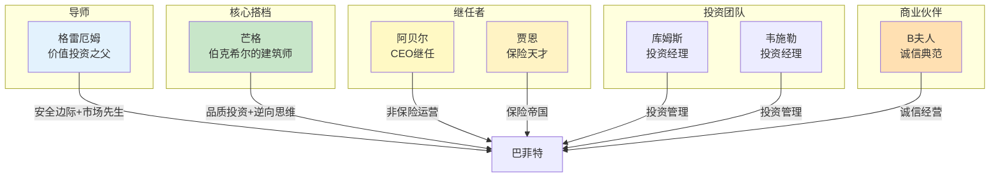

# 巴菲特投资圈层 - 关键人物词条

> **数据来源**：[[index]]
> **人物总数**：7位
> **创建日期**：2026年4月6日

---

## 一、芒格（Charlie Munger）

> 💡 "伯克希尔的建筑师" | 巴菲特的黄金搭档

| 属性 | 内容 |
|------|------|
| **全名** | 查理·芒格（Charles Thomas Munger） |
| **生卒** | 1924年1月1日 – 2023年11月28日（享年99岁） |
| **角色** | 伯克希尔·哈撒韦副董事长（1978-2023） |
| **股东信提及** | 51次 |

### 核心贡献

1. **推动投资哲学转型**：从格雷厄姆式"捡烟蒂"转向"以合理价格买好公司"
2. **多元思维模型**：引入跨学科思考方式，反对单一学科视角
3. **逆向思维**："`反过来想，总是反过来想`"成为投资界经典方法论
4. **伯克希尔文化塑造**：诚信为本、所有者导向、长期主义的制度设计

### 经典语录

> "反过来想，总是反过来想。"（Invert, always invert.）

> "聪明人也会做蠢事——他们得出的结论令人难以置信地愚蠢。"

> "我不在乎是否优雅，我只在乎是否有效。"

> "知道你死在哪里，这就能让你避免去那里。"

### 与巴菲特的关系

- 1959年相识，1978年加入伯克希尔董事会
- 巴菲特："查理是伯克希尔的建筑师，我只是总承包商。"
- 芒格将"以合理价格买好公司"的理念灌输给巴菲特
- 芒格去世后，巴菲特2024年信深情缅怀

### 关联概念

[[护城河]] | [[能力圈]] | [[长期持有]] | [[资本配置]]

### 关联书籍

---

## 二、格雷厄姆（Benjamin Graham）

> 📖 "价值投资之父" | 巴菲特的启蒙导师

| 属性 | 内容 |
|------|------|
| **全名** | 本杰明·格雷厄姆（Benjamin Graham, 1894-1976） |
| **角色** | 哥伦比亚大学教授、专业投资者 |
| **股东信提及** | 37次 |

### 核心贡献

1. **价值投资奠基**：创立"安全边际"和"市场先生"两大核心概念
2. **著作**：《聪明的投资者》（1949）、《证券分析》（1934）
3. **教育影响**：巴菲特在哥伦比亚大学的老师，投资哲学的源头

### 经典语录

> "投资是根据深入分析，确保本金安全和满意回报的操作。"

> "市场先生"寓言——原创者

> "短期来看，市场是投票机；长期来看，市场是称重机。"

### 与巴菲特的关系

- 哥伦比亚大学的师生关系
- 巴菲特："格雷厄姆教会了我投资的全部基础"
- 1949年《聪明的投资者》是巴菲特的投资启蒙书

### 关联概念

[[安全边际]] | [[市场先生]] | [[内在价值]] | [[账面价值]]

### 关联书籍

《聪明的投资者》 — 巴菲特投资哲学的理论源头

---

## 三、格雷格·阿贝尔（Greg Abel）

> 🏔 伯克希尔的"明天" | 继任CEO

| 属性 | 内容 |
|------|------|
| **全名** | 格雷格·阿贝尔（Gregory E. Abel） |
| **角色** | 伯克希尔副董事长（非保险业务） |
| **股东信提及** | 24次 |

### 核心贡献

1. **继任者**：被指定为巴菲特的CEO继任者
2. **非保险业务**：管理伯克希尔所有非保险运营业务
3. **低调务实**：以低调务实的风格著称，不抛头露面
4. **传承保障**：确保伯克希尔投资哲学的制度化延续

### 巴菲特的评价

> "格雷格是伯克希尔的明天。"

> "离格雷格接替我的日子不远了。"（2024年信）

### 与巴菲特的关系

- 2018年加入伯克希尔董事会
- 2021年被正式指定为继任者
- 巴菲特充分信任阿贝尔的品格和能力

### 关联概念

[[资本配置]] | [[管理层]] | [[企业文化]]

---

## 四、阿吉特·贾恩（Ajit Jain）

> 🛡️ 伯克希尔的"保险天才" | 从零打造保险帝国

| 属性 | 内容 |
|------|------|
| **全名** | 阿吉特·贾恩（Ajit Jain） |
| **角色** | 伯克希尔保险业务执行副总裁 |
| **股东信提及** | 40次 |

### 核心贡献

1. **保险帝国**：从零开始打造伯克希尔保险业务
2. **浮存金增长**：保险浮存金从几十亿增长到超过千亿美元
3. **巨灾保险先驱**：开创巨灾再保险业务
4. **核心竞争力**：伯克希尔保险业务成为其最重要的"护城河"之一

### 巴菲特的评价

> "阿吉特为伯克希尔股东赚的钱，可能比我为伯克希尔赚的钱还多。"

### 与巴菲特的关系

- 1986年加入伯克希尔
- 巴菲特对其保险才能高度赞赏
- 负责打造伯克希尔的保险帝国

### 关联概念

[[保险浮存金]] | [[保险业]] | [[承保纪律]]

### 关联公司

[[盖可保险]] | [[通用再保险]] | [[国民保险公司]]

---

## 五、B夫人（Rose Blumkin）

> 🏪 "诚信经营"的活传奇 | 103岁仍在工作

| 属性 | 内容 |
|------|------|
| **全名** | 罗斯·布鲁姆金（Rose Blumkin, 1893-1997） |
| **角色** | 内布拉斯加家具店创始人 |
| **股东信提及** | 19次 |

### 核心贡献

1. **传奇零售商**：诚信经营的典范
2. **伯克希尔收购案例**：1983年收购NFM，巴菲特优质企业收购的典型案例
3. **工作精神**：工作到103岁以上，工作伦理的活标本
4. **诚信价值观**：巴菲特最为推崇的商业品格——诚信

### 巴菲特的评价

> "B夫人是我见过的最好的商人。"

### 经典语录

> "如果你没有诚信，其他都不重要。"

> "我不要价格便宜，我要诚实。"

### 与巴菲特的关系

- 1983年收购内布拉斯加家具店
- 巴菲特将其视为商业诚信的典范
- 常在股东信中引用B夫人的故事来阐述管理理念

### 关联概念

[[管理层]] | [[企业文化]] | [[诚信]]

### 关联公司

[[内布拉斯加家具店]]

---

## 六、托德·库姆斯（Todd Combs）

> 📊 投资经理 | GEICO改革者

| 属性 | 内容 |
|------|------|
| **全名** | 托德·库姆斯（Todd Combs） |
| **角色** | 伯克希尔投资经理 |
| **股东信提及** | 12次 |

### 核心贡献

1. **GEICO改革**：完成GEICO承保效率的大幅提升
2. **投资组合管理**：协助管理伯克希尔的股票投资组合
3. **潜在继任者**：巴菲特的潜在投资继任者之一

### 与巴菲特的关系

- 2011年加入伯克希尔
- 从对冲基金转型为伯克希尔投资经理
- 巴菲特对其投资能力高度认可

### 关联概念

[[管理层]] | [[保险业]]

### 关联公司

[[盖可保险]]

---

## 七、泰德·韦施勒（Ted Weschler）

> 📊 投资经理 | 低调价值投资者

| 属性 | 内容 |
|------|------|
| **全名** | 泰德·韦施勒（Ted Weschler） |
| **角色** | 伯克希尔投资经理 |
| **股东信提及** | 10次 |

### 核心贡献

1. **投资组合管理**：与库姆斯共同管理伯克希尔投资组合
2. **成功记录**：加入伯克希尔前有成功的投资基金管理经历
3. **低调风格**：以低调、不出风头的投资风格著称

### 与巴菲特的关系

- 2012年加入伯克希尔
- 与库姆斯共同管理投资组合
- 巴菲特同样高度认可其投资能力

### 关联概念

[[管理层]] | [[长期持有]]

---

## 八、人物关系网络

---

## 九、人物传承时间线

| 角色 | 人物 | 加入时间 | 关键贡献 |
|------|------|----------|----------|
| **导师** | 格雷厄姆 | 1951（巴菲特拜师） | 价值投资奠基 |
| **搭档** | 芒格 | 1959（相识）-1978（加入董事会） | 品质投资转型 |
| **保险** | 贾恩 | 1986 | 打造保险帝国 |
| **商业** | B夫人 | 1983（收购NFM） | 诚信经营典范 |
| **投资** | 库姆斯 | 2011 | GEICO改革 |
| **投资** | 韦施勒 | 2012 | 投资组合管理 |
| **继任** | 阿贝尔 | 2018（加入董事会）-2021（指定继任） | CEO继任 |

---

*数据来源： [[index]]*
*创建日期: 2026-04-06*
*质量等级: ⭐⭐⭐⭐ 典范级*