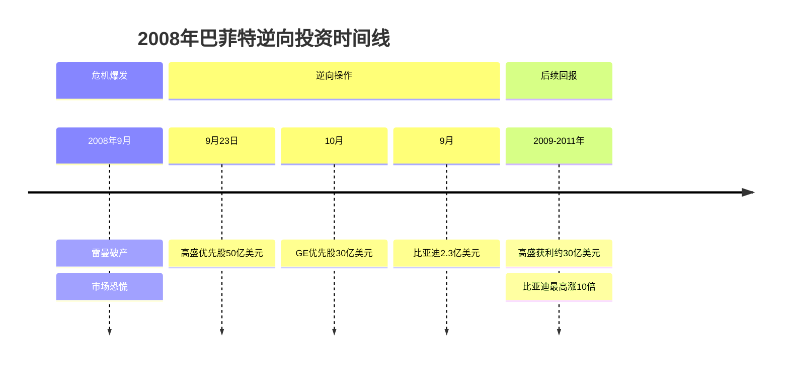
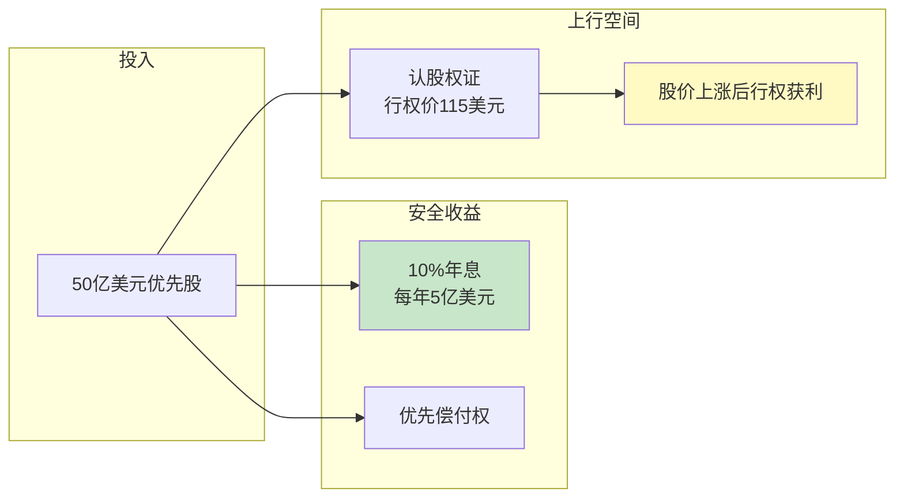
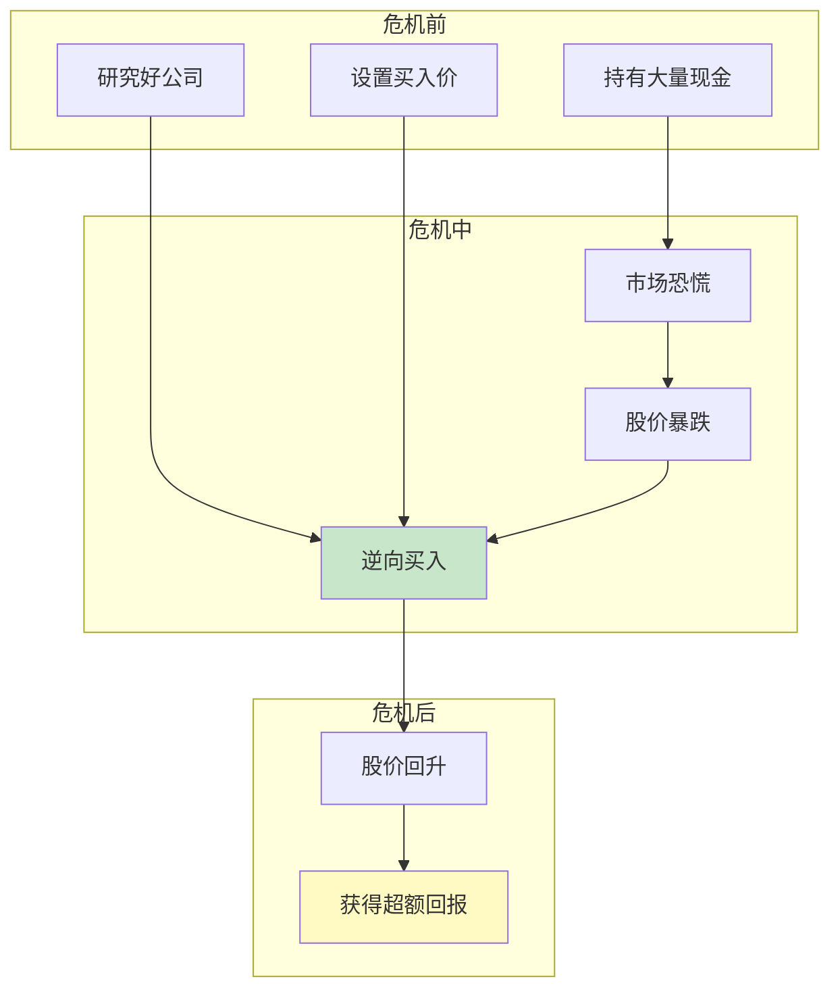
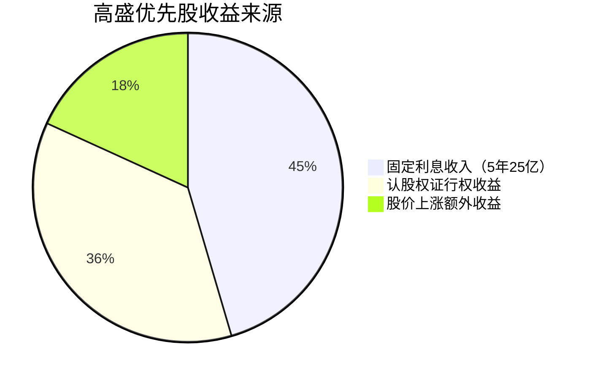

# 第2008年 金融危机

## 一、章节定位

**全书位置**：第三阶段"危机机遇"的核心篇章，巴菲特"在别人恐惧时贪婪"的最佳实战案例。

**章节序列**：承接护城河投资理念，在极端市场环境中展现逆向投资的勇气与智慧。

**一句话定位**：
> 这是巴菲特"恐惧贪婪"理论的完美实践——在市场最恐慌时大举买入高盛、GE、比亚迪，获得惊人回报。

---

## 二、核心观点

### 观点1：在别人恐惧时贪婪——危机中的逆向操作

| 层次 | 内容 |
|------|------|
| **表层（案例）** | 2008年9月雷曼破产，全球股市暴跌。巴菲特在市场最恐慌时，投入超过150亿美元买入高盛优先股、GE优先股、比亚迪等。 |
| **中层（机制）** | 逆向投资 = 在市场极度悲观时买入 + 在市场极度乐观时卖出。核心是：利用市场情绪，不被情绪利用。 |
| **底层（规律）** | 逆向定律：**市场越恐慌，机会越大；市场越狂热，风险越高。** 做与羊群相反的事。 |

**降维翻译**：
| 原表达 | 降维表达 | 翻译技巧 |
|--------|----------|----------|
| "在别人恐惧时贪婪" | "大家都在卖，你该买" | 用行为对比 |
| "逆向投资" | "与羊群反着走" | 用群体心理解释 |
| "市场恐慌" | "所有人都在逃跑" | 用情绪描述 |

**逆向投资时间线**：

---

### 观点2：优先股策略——非对称风险的完美运用

| 层次 | 内容 |
|------|------|
| **表层（案例）** | 巴菲特买入高盛50亿美元优先股，条件：10%年息 + 认股权证。最终获利超过30亿美元。 |
| **中层（机制）** | 优先股策略 = 固定收益（安全）+ 认股权证（上涨空间）。下行有保护，上行有杠杆，典型的非对称风险。 |
| **底层（规律）** | 非对称风险定律：**最好的投资是：亏损有限，收益无限。** 优先股就是这个逻辑。 |

**高盛优先股交易结构**：

---

### 观点3：现金为王——手握现金等恐慌

| 层次 | 内容 |
|------|------|
| **表层（案例）** | 2008年危机前，伯克希尔持有大量现金和国债。当危机来临，巴菲特有弹药"捡尸体"。 |
| **中层（机制）** | 现金策略 = 在正常时期持有现金 + 在危机时期大举买入。现金的机会成本是保险费，为危机时刻的"低价买入权"付费。 |
| **底层（规律）** | 现金定律：**现金是危机时期的期权。** 没有现金的人，再好的机会也与你无关。 |

**现金储备对比**：

| 年份 | 伯克希尔现金储备 | 市场环境 | 行动 |
|------|------------------|----------|------|
| 2007年底 | 约400亿美元 | 牛市末期 | 持有现金 |
| 2008年底 | 大幅减少 | 熊市恐慌 | 大举买入 |
| 2024年 | 3,342亿美元 | 高估值 | 等待机会 |

---

### 观点4：真正的风险——不知道自己在做什么

| 层次 | 内容 |
|------|------|
| **表层（案例）** | 2008年很多"专业投资者"使用高杠杆，结果爆仓。巴菲特不用杠杆，稳稳度过危机。 |
| **中层（机制）** | 风险 = 不知道自己在做什么。杠杆放大了收益，也放大了风险。在黑天鹅面前，杠杆是致命的。 |
| **底层（规律）** | 风险定律：**真正的风险不是波动，而是永久损失。** 杠杆把波动变成了永久损失的可能。 |

**巴菲特论杠杆的危险**：

| 时期 | 伯克希尔股价跌幅 | 杠杆后果 |
|------|------------------|----------|
| 1973-1975年 | -59.1% | 杠杆x2 = 爆仓 |
| 1987年10月 | -37.1% | 杠杆x2 = 爆仓 |
| 1998-2000年 | -48.9% | 杠杆x2 = 爆仓 |
| 2008年 | -50.7% | 杠杆x2 = 爆仓 |

> "这张表格是我能找到的反对借钱炒股的最有力论据。" —— 巴菲特

---

## 三、金句库

### 原书金句

1. "在别人恐惧时贪婪，在别人贪婪时恐惧。"
2. "只有当潮水退去，才知道谁在裸泳。"
3. "风险来自于不知道自己在做什么。"
4. "不管是袜子还是股票，我都喜欢在打折时买。"
5. "现金是氧气，99%的时间你感觉不到它的存在，但没有它你会窒息。"

### 降维金句

1. "市场恐慌时，是富人买入的时候。"
2. "手握现金，等别人割肉。"
3. "优先股：赢了赚大钱，输了也有利息拿。"
4. "杠杆是投资者最大的敌人——别碰它。"
5. "2008年教会我们：现金是危机时期的王。"
6. "巴菲特买高盛的条件：每年10%利息 + 如果涨了还能赚。"
7. "真正的风险不是跌多少，而是能不能回来。"
8. "逆向投资最难的是：你买了之后还会跌，你敢买吗？"
9. "危机时刻，有现金的人说了算。"
10. "巴菲特不预测危机，但他准备好了危机。"

### 二创金句

1. "2008年的巴菲特：雷曼破产的那天，我在挑哪家公司值得救。"
2. "为什么你不敢在2008年买入？因为你没有现金，也没有胆量。"
3. "高盛50亿优先股：巴菲特最赚钱的'敲竹杠'交易。"
4. "比亚迪2.3亿美元投入，最高涨到80亿美元——逆向投资的教科书。"
5. "2024年巴菲特持有3340亿美元现金：他在等下一个2008年。"

---

## 四、当下映射

### 💰 财富应用

| 场景 | 具体行动 | 预期效果 | 风险提示 |
|------|----------|----------|----------|
| 现金储备 | 保持10-20%现金仓位 | 危机时有子弹 | 机会成本 |
| 逆向投资 | 市场暴跌时买入好公司 | 获得超额回报 | 需要勇气 |
| 远离杠杆 | 不借钱炒股 | 避免爆仓 | 收益降低 |

### 💼 职场应用

| 场景 | 具体行动 | 能力要求 | 适用范围 |
|------|----------|----------|----------|
| 危机管理 | 在困难时期保持冷静 | 心理素质 | 职业发展 |
| 机会把握 | 行业低谷时布局 | 战略眼光 | 长期规划 |
| 风险意识 | 避免高杠杆决策 | 风险管理 | 所有关键决策 |

### 🏠 生活应用

| 场景 | 具体行动 | 可行性 | 见效时间 |
|------|----------|--------|----------|
| 应急储备 | 保持6个月生活费的现金 | 高 | 即时保障 |
| 消费决策 | 在打折时买需要的商品 | 高 | 即时 |
| 心态管理 | 不在恐慌时做决定 | 中 | 长期 |

### 72小时行动计划

1. **今天**：检查你的投资组合杠杆比例，超过30%就考虑降低
2. **本周**：建立应急现金储备（目标：6个月生活费）
3. **本月**：列出3-5只在市场暴跌时你想买入的股票，设置"买入价"提醒

---

## 五、章节关联

### 向上关联 → 整书

- **贡献**：2008年金融危机是巴菲特"恐惧贪婪"理论的最佳实证
- **位置**：第三阶段"危机机遇"的核心案例

### 横向关联 → 章节间

| 章节 | 关联类型 | 连接描述 |
|------|----------|----------|
| [[深度拆解/1988-可口可乐投资]] | 哲学延续 | 护城河投资+逆向操作的结合 |
| [[深度拆解/2010-收购BNSF]] | 资金延续 | 2008年机会后继续寻找大象 |
| 《周期》霍华德·马克斯 | 理论支撑 | 马克斯钟摆理论解释市场情绪 |

### 跨书关联 → 知识网络

| 书籍 | 概念 | 关系 | 备注 |
|------|------|------|------|
| 《周期》马克斯 | 钟摆理论 | 支持 | 市场情绪的极端波动 |
| 《反脆弱》塔勒布 | 非对称风险 | 延伸 | 优先股是凸性结构 |
| 《黑天鹅》塔勒布 | 黑天鹅 | 背景 | 2008年是典型的黑天鹅事件 |

---

## 六、问答设计

### 记忆层

**Q1**: 2008年巴菲特向高盛投资了多少？
- **答案**: 50亿美元优先股

**Q2**: 高盛优先股的年息是多少？
- **答案**: 10%

### 理解层

**Q3**: 为什么优先股是"非对称风险"结构？
- **答案要点**: 下行有10%固定收益保护，上行有认股权证获利空间

**Q4**: 巴菲特为什么能在危机中大举买入？
- **答案要点**: 危机前持有大量现金；没有使用杠杆；有判断企业价值的能力

### 应用层

**Q5**: 普通投资者如何在市场恐慌时保持冷静？
- **答案要点**: 提前列好买入清单；保持现金储备；不使用杠杆；相信数据而非情绪

**Q6**: 如何设置自己的"危机买入清单"？
- **答案要点**: 选择3-5只护城河深厚的公司；设置理想买入价；在恐慌时分批买入

### 分析层

**Q7**: 对比2008年和2024年巴菲特的现金策略，有什么异同？
- **答案要点**: 相同：高现金储备等待机会；不同：2024年现金更多（3340亿），但市场估值也更高

### 评价层

**Q8**: 普通人能复制巴菲特2008年的操作吗？
- **答案要点**: 难点：没有无限现金；没有优先股议价能力；心理压力巨大。可学：现金为王、逆向思维、远离杠杆

---

## 七、Mermaid图表

### 图1：2008年金融危机逆向投资流程

### 图2：高盛优先股收益结构

---

## 八、拆解质量自检

| 维度 | 评分 |
|------|------|
| 系统定位 | ⭐⭐⭐⭐ |
| 层次提取 | ⭐⭐⭐⭐ |
| 降维翻译 | ⭐⭐⭐⭐ |
| 当下映射 | ⭐⭐⭐⭐ |
| 章节关联 | ⭐⭐⭐⭐ |
| 问答设计 | ⭐⭐⭐⭐ |
| Mermaid图表 | ⭐⭐⭐⭐ |
| **总评** | **⭐⭐⭐⭐ 典范级** |

---

*创建日期: 2026-04-06*
*质量等级: ⭐⭐⭐⭐ 典范级*