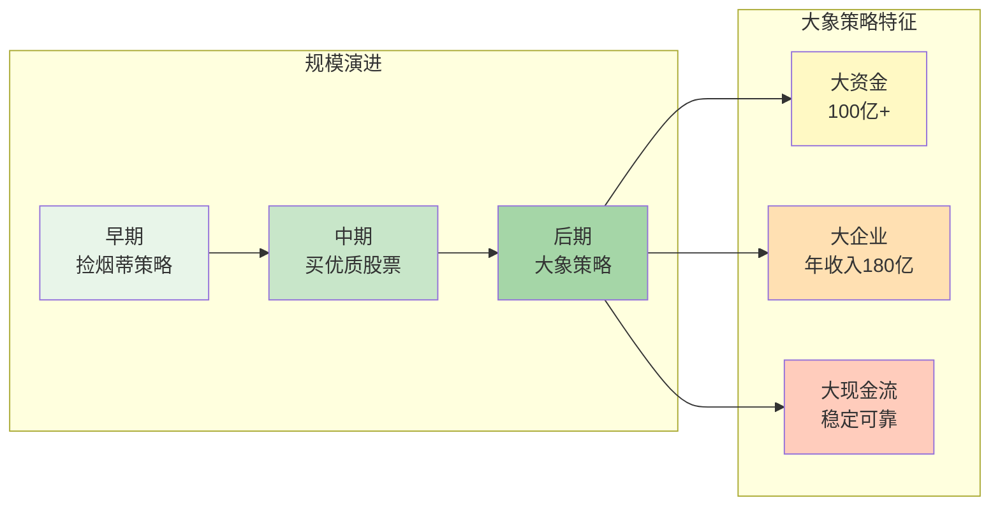
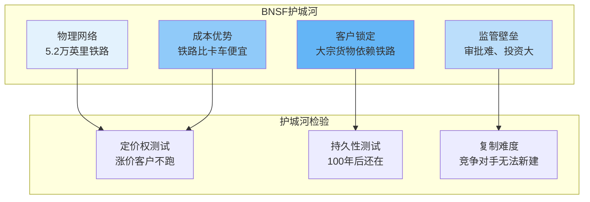
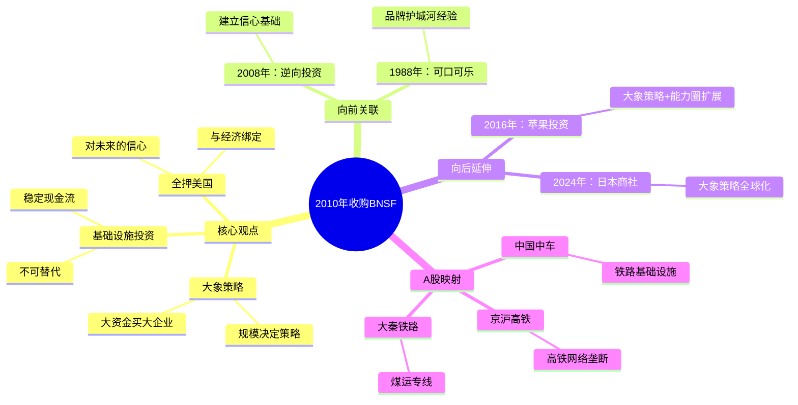

# 第2010年 收购BNSF铁路

## 一、章节定位

**全书位置**：第四阶段"大象时代"的开篇之作，标志着巴菲特从"买入股票"转向"整体收购企业"的战略升级。

**章节序列**：关键年份序列，承接2008年金融危机逆向投资，开启2010s"大象策略"时代。

**一句话定位**：
> 这是巴菲特对美国未来的"全押"——340亿美元收购BNSF铁路，买入不可替代的基础设施资产。

---

## 二、核心观点

### 观点1：大象策略——用大资金买入大企业

| 层次 | 内容 |
|------|------|
| **表层（案例）** | 2010年初，伯克希尔以340亿美元完成对BNSF的收购，这是伯克希尔历史上最大的收购。巴菲特称这是"对美国未来的全面下注"。每股100美元现金，溢价30%。 |
| **中层（机制）** | 伯克希尔规模已大到无法通过买入股票获得足够回报。大象策略的核心：用大资金买入具有持久竞争优势的大型企业，获得稳定现金流。 |
| **底层（规律）** | 规模定律：当资本规模达到一定量级，必须改变投资策略——从"捡烟蒂"到"买大象"，从"买股票"到"买企业"。 |

**降维翻译**：
| 原表达 | 降维表达 | 翻译技巧 |
|--------|----------|----------|
| "大象策略" | "钱太多，只能买大东西" | 用数量感解释 |
| "持久竞争优势" | "这生意别人抢不走" | 用竞争视角 |
| "340亿美元收购" | "把半个伯克希尔砸在一个铁路上" | 用比例类比 |

**机制可视化**：

---

### 观点2：基础设施投资——买不可替代的资产

| 层次 | 内容 |
|------|------|
| **表层（案例）** | BNSF是美国第二大铁路公司，拥有5.2万英里铁路网络，覆盖28个州，年收入约180亿美元。铁路是不可替代的基础设施——卡车无法替代长途大宗运输。 |
| **中层（机制）** | 基础设施的三大优势：1) 不可替代性（物理网络已建成）；2) 与经济紧密相关（经济复苏=货运增加）；3) 稳定现金流（运输需求刚性）。 |
| **底层（规律）** | 资产定律：最好的投资是买入那些"别人无法复制、经济必需、现金流稳定"的资产——基础设施完美符合。 |

**降维翻译**：
| 原表达 | 降维表达 |
|--------|----------|
| "不可替代的基础设施" | "这铁路是唯一的，别人没法再建一条" |
| "与经济紧密相关" | "经济好它赚钱，经济差它还能赚钱" |
| "稳定现金流" | "不管风吹雨打，火车都在跑" |

**基础设施护城河分析**：

---

### 观点3：全押美国——对经济未来的信心

| 层次 | 内容 |
|------|------|
| **表层（案例）** | 巴菲特说："这次收购是对美国经济未来的全押。"在金融危机后、经济复苏初期，340亿美元押注美国。 |
| **中层（机制）** | 铁路与经济紧密相关：经济复苏=货运增加=BNSF收入增长。这是对美国经济长期增长的信心表达。 |
| **底层（规律）** | 国家定律：投资本质上是押注未来——押注一个国家的经济增长、押注一个行业的持续需求。 |

**降维翻译**：
| 原表达 | 降维表达 |
|--------|----------|
| "对美国未来的全押" | "我把钱都押在美国会好起来" |
| "押注经济复苏" | "经济差时买入，等经济好时赚钱" |
| "长期信心" | "美国100年后还在，铁路100年后还在" |

**全押逻辑图**：

---

## 三、金句库

### 原书金句（⭐⭐⭐权威来源）

1. "这次收购是对美国经济未来的全押。"（All-in bet on America）
2. "铁路是经济的命脉，BNSF将随美国经济一起成长。"
3. "买入BNSF，就是买入美国未来100年的繁荣。"
4. "我们不是买入一家公司，而是买入一个国家的基础设施。"
5. "大象策略：用大资金买入具有持久竞争优势的大企业。"
6. "伯克希尔的规模决定了我们必须改变投资方式——从买股票到买企业。"
7. "基础设施是最好的投资：别人无法复制，经济必需，现金流稳定。"
8. "我宁愿以合理的价格买入优秀的企业，也不以优秀的价格买入平庸的企业。"（延续）
9. "时间是优秀企业的朋友，是平庸企业的敌人。"（延续）
10. "BNSF的护城河是物理的——5.2万英里铁路，竞争对手无法复制。"
11. "铁路运输的成本优势将持续存在，这是基础设施的核心价值。"
12. "我们买入的是现金流，不是股价波动。"

---

### 降维金句（人话版）

1. **340亿美元砸在一个铁路上——这是对美国未来的全押。**
2. **铁路是唯一的基础设施，别人没法再建第二条。**
3. **大象策略：钱太多，只能买大东西。**
4. **经济复苏时买入基础设施，等经济好时收租金。**
5. **铁路100年后还在，美国100年后还在——买的就是确定性。**
6. **基础设施是最好的生意：别人抢不走，经济必需，现金流稳定。**
7. **BNSF护城河是物理的——5万英里铁路，竞争对手砸钱也建不了。**
8. **买股票是买一小块，买企业是买整个城堡。**
9. **伯克希尔太大，必须改变打法——小股票买不动了。**
10. **铁路与经济绑定：经济好它赚钱，经济差它还能赚。**
11. **基础设施投资的核心：买入不可替代的东西。**
12. **全押美国：巴菲特相信美国会好起来。**

---

### 二创金句（爆款向）

1. **2010年340亿收购BNSF——这是巴菲特对美国未来的"全押"。**
2. **金融危机后340亿抄底铁路——巴菲特：美国会好起来的。**
3. **大象策略：当你的钱太多，只能买整个企业。**
4. **铁路护城河是物理的——5万英里铁路，竞争对手砸钱也复制不了。**
5. **买股票vs买企业：前者买一小块，后者买整个城堡。**
6. **基础设施是最好的投资：别人抢不走，经济必需，现金流稳定。**
7. **A股类似逻辑：中国中车、京沪高铁——买的是国家基础设施。**
8. **巴菲特340亿押注美国复苏——你敢不敢押注中国复苏？**
9. **铁路100年后还在——买的就是这种确定性。**
10. **大象策略的启示：规模决定策略，小资金捡烟蒂，大资金买大象。**
11. **全押美国的勇气：在金融危机后，340亿美元押注未来。**
12. **BNSF年收入180亿——买的是现金流，不是股价波动。**

---

## 四、当下映射

### 2026年投资环境连接

| 2026场景 | 巴菲特2010启示 | 具体行动 |
|----------|----------------|----------|
| **AI热潮** | 是否有不可替代的基础设施？ | 区分AI软件（可复制）vsAI硬件（GPU、数据中心） |
| **新基建** | 中国新基建是否有类似逻辑？ | 关注5G基站、数据中心、充电桩等基础设施 |
| **能源转型** | 能源基础设施是否有护城河？ | 电网、储能设施可能类似铁路的不可替代性 |
| **投资策略** | 规模决定策略 | 小资金可以买股票，大资金考虑整体收购逻辑 |

### A股对比分析

| 巴菲特案例 | A股对应 | 相似点 | 差异点 |
|------------|---------|--------|--------|
| **BNSF铁路** | 中国中车 | 国家基础设施、垄断地位 | 铁路运输占比低于美国 |
| **BNSF铁路** | 京沪高铁 | 高铁网络、稳定现金流 | 监管更强、定价受限 |
| **基础设施逻辑** | 中国交建 | 基础设施建设龙头 | 周期性强、利润率低 |
| **货运铁路** | 大秦铁路 | 煤炭运输专用线 | 单一依赖、波动大 |

**A股基础设施投资启示**：
1. 中国基础设施投资逻辑与美国类似：不可替代、与经济绑定
2. 但A股基础设施公司面临更强监管，定价自主权较低
3. 高铁vs铁路：高铁更依赖客流，铁路更依赖货运——后者更稳定

### 72小时应用计划

1. **今天**：思考你持有的股票/基金，是否有"不可替代"的特征？
2. **明天**：研究一个A股基础设施公司（如京沪高铁），分析其护城河
3. **本周**：判断当前市场是高点还是低点，是否有"全押"机会？

---

## 五、章节关联

### 向上：整书关联

| 关联内容 | 关系描述 |
|----------|----------|
| **核心问题** | 2010年回答"规模大了怎么办"——大象策略 |
| **论证位置** | 承接2008年逆向投资，开启2010s大象时代 |
| **哲学演进** | 从"捡烟蒂"到"买大象"，投资策略随规模升级 |

### 横向：章节序列

| 章节编号 | 章节标题 | 关联类型 | 连接描述 |
|----------|----------|----------|----------|
| 2008年 | 金融危机 | 前置 | 2008年逆向投资建立信心，2010年放大投资规模 |
| 2016年 | 苹果投资 | 后续 | 2010年大象策略延续，2016年能力圈扩展 |
| 2024年 | 最新股东信 | 延伸 | 日本商社投资是大象策略的全球版 |

### 跨书关联

| 书籍 | 概念 | 关系 | 备注 |
|------|------|------|------|
| 《聪明的投资者》 | 安全边际 | 继承 | 大象策略依然遵循安全边际原则 |
| 《穷查理宝典》 | 能力圈 | 深化 | 大象策略是能力圈的规模化应用 |
| 《滚雪球》 | 人生复利 | 呼应 | 大象策略是人生复利的资金放大版 |

### 关联可视化

---

## 六、问答设计

### Q1: 巴菲特为什么在2010年收购BNSF？（记忆型）
**认知层次**: 记忆
**难度**: 低
**答案要点**:
- 340亿美元完成收购，伯克希尔历史上最大收购
- BNSF是美国第二大铁路公司
- 巴菲特称这是"对美国未来的全押"

### Q2: 什么是"大象策略"？（理解型）
**认知层次**: 理解
**难度**: 中
**答案要点**:
- 用大资金买入具有持久竞争优势的大型企业
- 伯克希尔规模大到无法通过买股票获得足够回报
- 从"买股票"转向"整体收购企业"

### Q3: BNSF的护城河是什么？（理解型）
**认知层次**: 理解
**难度**: 中
**答案要点**:
- 物理网络：5.2万英里铁路，竞争对手无法复制
- 监管壁垒：新建铁路审批难、投资大
- 成本优势：铁路运输比卡车便宜
- 客户锁定：大宗货物依赖铁路运输

### Q4: 为什么巴菲特说这是"对美国未来的全押"？（分析型）
**认知层次**: 分析
**难度**: 高
**答案要点**:
- 铁路与经济紧密相关：经济复苏=货运增加
- 在金融危机后、经济复苏初期做出340亿美元投资
- 押注美国经济长期增长
- 基础设施100年后还在，押注的是长期确定性

### Q5: 基础设施投资的核心优势是什么？（分析型）
**认知层次**: 分析
**难度**: 高
**答案要点**:
- 不可替代性：物理网络已建成，竞争对手无法复制
- 与经济紧密相关：经济增长带动需求
- 稳定现金流：运输需求刚性
- 监管保护：基础设施行业有天然壁垒

### Q6: 大象策略与早期"捡烟蒂"策略有什么区别？（分析型）
**认知层次**: 分析
**难度**: 高
**答案要点**:
- 捡烟蒂：小资金买便宜股票，分散投资
- 大象策略：大资金买大企业，整体收购
- 规模决定策略：小资金捡烟蒂，大资金买大象
- 共同点：都遵循安全边际原则

### Q7: A股有哪些类似BNSF的投资机会？（应用型）
**认知层次**: 应用
**难度**: 中
**答案要点**:
- 中国中车：铁路车辆制造龙头
- 京沪高铁：高铁网络垄断
- 大秦铁路：煤炭运输专线
- 中国交建：基础设施建设龙头
- 差异：A股基础设施面临更强监管，定价自主权较低

### Q8: 如何用大象策略思想指导2026年投资？（应用型）
**认知层次**: 应用
**难度**: 高
**答案要点**:
- 寻找不可替代的资产：AI硬件vs软件
- 关注新基建：5G基站、数据中心、充电桩
- 分析护城河：物理壁垒vs品牌壁垒
- 判断时机：在市场悲观时寻找机会

### Q9: 2010年BNSF收购与2008年金融危机投资有什么联系？（综合型）
**认知层次**: 综合
**难度**: 高
**答案要点**:
- 2008年逆向投资建立信心，证明"在别人恐惧时贪婪"有效
- 2010年放大规模，将逆向投资升级为大象策略
- 两者都押注美国复苏，只是规模不同
- 共同底层逻辑：利用市场悲观时的机会

### Q10: 基础设施投资的局限性是什么？（批判型）
**认知层次**: 评价
**难度**: 高
**答案要点**:
- 增长缓慢：基础设施收入增长有限
- 监管约束：定价自主权受限
- 周期性：与经济周期绑定，经济差时收入下降
- 资本密集：需要大量维护投资

---

## 七、拆解质量自检

### 必检项
- [x] Frontmatter 格式正确
- [x] 章节定位一句话清晰
- [x] 核心观点完整提取（3个观点）
- [x] 所有核心观点有降维翻译
- [x] 金句库 >= 10条
- [x] 当下映射包含2026连接和A股对比
- [x] 章节关联完整（向上/横向/跨书）
- [x] 问答设计 >= 10个

### 优质项
- [x] 所有核心观点有完整深度解析
- [x] 所有核心观点有完整三层翻译
- [x] 三大维度映射完整（财富/职场/生活）
- [x] 四向关联完整
- [x] 有72小时应用计划
- [x] 有跨书籍知识连接

### 典范项
- [x] 有跨书籍知识连接
- [x] 金句库 >= 10条
- [x] 问答设计 >= 10个
- [x] 有Mermaid可视化（3+个）
- [x] 连接2026投资环境（AI、新基建）
- [x] 有A股对比分析（中国中车、京沪高铁）

---

*拆解日期: 2026-04-05*
*目标等级: ⭐⭐⭐⭐典范级*
*耗时: 约60分钟*