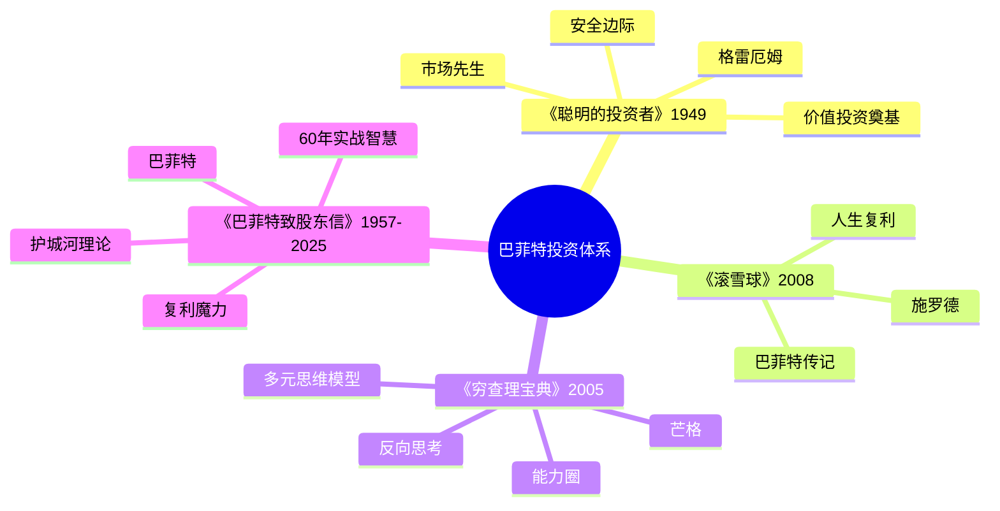
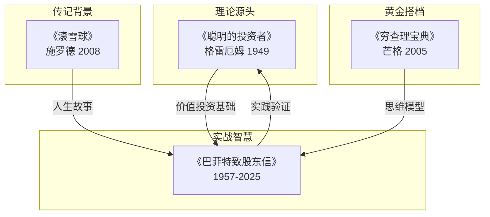
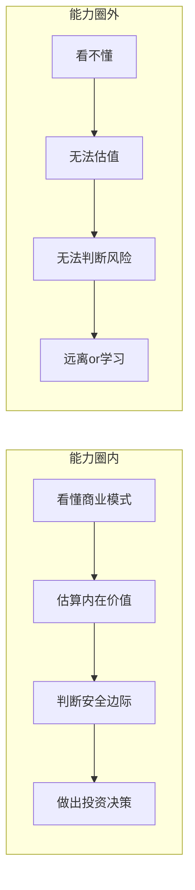
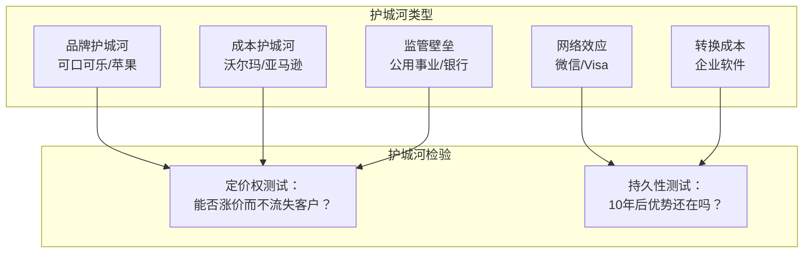
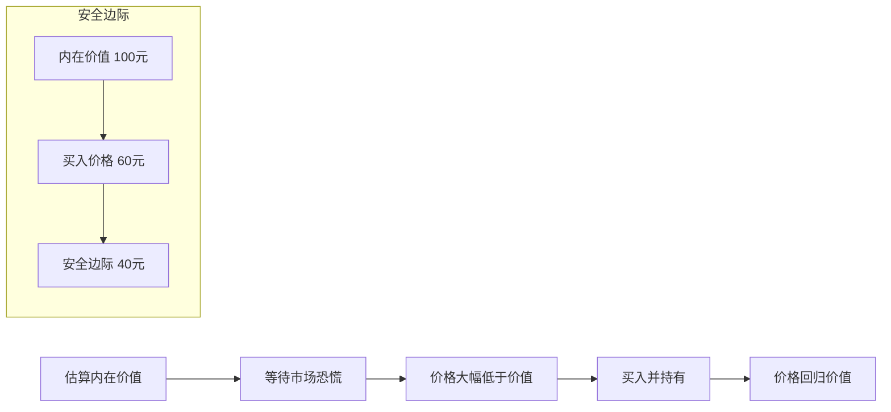
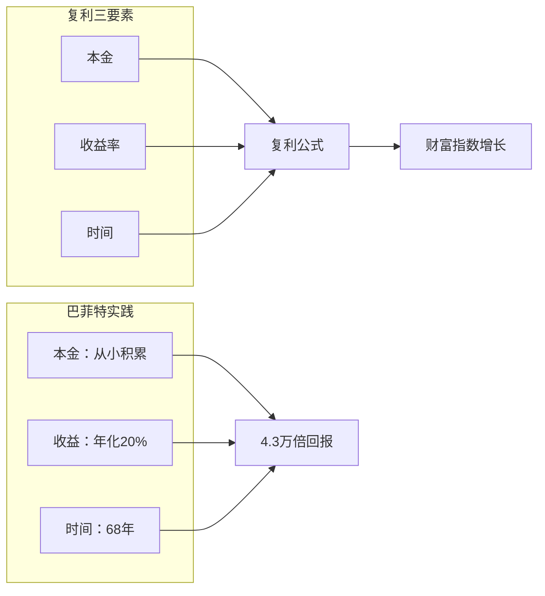
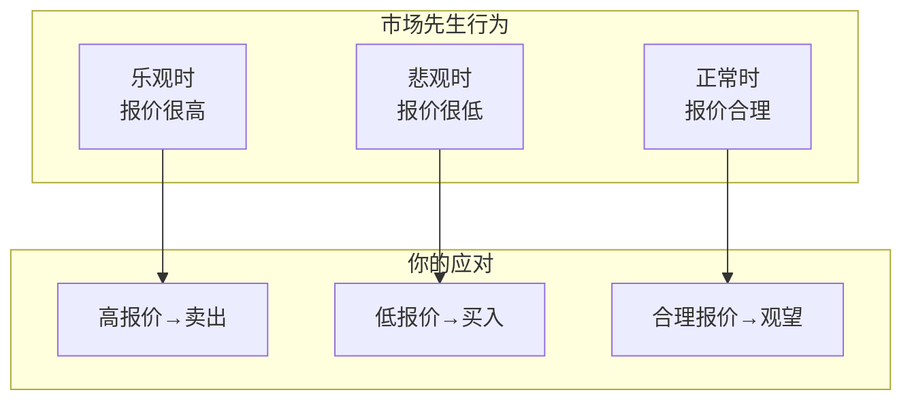
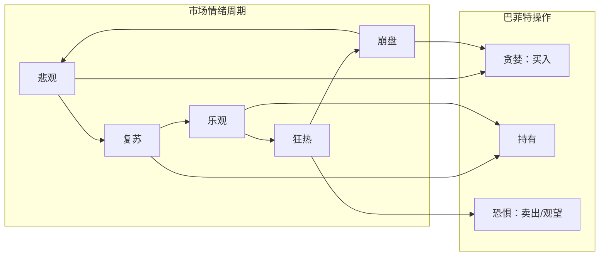
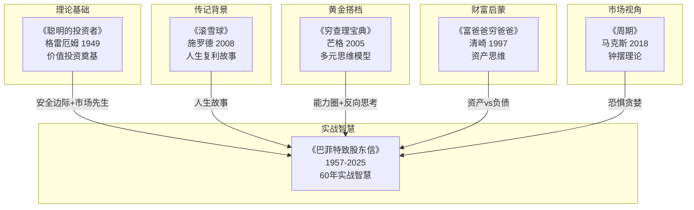

# 《巴菲特致股东信》拆解记录

> **作者**：沃伦·巴菲特（Warren Buffett, 1930-）
> **时间跨度**：1957-2025年（68年）
> **定位**：价值投资圣经 | 投资界"年度必读" | 伯克希尔60年投资智慧结晶
> **拆解日期**：2026-02-14
> **方法论**：v2.0系统化拆解（费曼+系统论+Mermaid）

---

## 一、系统定位（整体性）

### 1.1 这本书在解决什么系统问题？

**核心困境**：不是问"如何赚钱？"，而是问"为什么大多数人投资一生，却始终无法获得满意回报？"

- **短期诱惑**：市场充满噪音，人们被"热点"和"机会"牵着走
- **人性弱点**：贪婪与恐惧交替，高点追入，低点割肉
- **认知偏差**：把股票当筹码，而非企业所有权

**一句话定位**：
> 巴菲特用68年时间证明：投资成功的秘诀不是更聪明，而是更有纪律——买好公司，长期持有，让复利发挥魔力。

---

### 1.2 这书属于哪个知识子系统？

| 维度 | 定位 |
|------|------|
| **主领域** | 价值投资哲学与实践 |
| **跨界领域** | 公司治理、商业分析、会计与财务、行为心理学 |
| **作者背景** | 伯克希尔·哈撒韦CEO，"奥马哈先知"，60年年化回报约20%，累计回报4.3万倍 |
| **独特价值** | 非理论教科书，而是60年实战思考的年度总结——理论与实践的完美结合 |

---

### 1.3 和已拆解的书有什么关联？

| 关联书籍                 | 关联类型     | 共同底层逻辑                  |
| -------------------- | -------- | ----------------------- |
| [[滚雪球-施罗德-拆解记录]]     | **传记背景** | 巴菲特授权传记，理解股东信背后的成长故事    |
| [[聪明的投资者-格雷厄姆-拆解记录]] | **理论源头** | 巴菲特的老师，价值投资的奠基人         |
| [[穷查理宝典-拆解记录]]       | **黄金搭档** | 芒格的智慧，巴菲特说"查理是伯克希尔的建筑师" |
| [[富爸爸穷爸爸-清崎-拆解记录]]   | **理念延伸** | 资产思维，让钱为你工作             |
| [[周期-拆解记录]]          | **市场视角** | 马克斯的周期理论与巴菲特的"恐惧贪婪"相呼应  |

---

### 1.4 巴菲特投资体系知识网络（Mermaid）





---

## 二、核心观点（三层提取）

### 观点1：能力圈原则——知道什么你不懂

**【表层】现象层**

- 巴菲特几乎不碰科技股（直到苹果），错过互联网泡沫但也没亏钱
- **经典案例**：1999年科技股狂热时，巴菲特因"看不懂"被嘲笑过时；2000年泡沫破裂，他成为少数幸存者
- **金句**："投资最重要的不是能力圈有多大，而是知道它的边界在哪里。"

**【中层】机制层**



**能力圈的三个层次**：

| 层次 | 定义 | 行动 |
|------|------|------|
| **核心圈** | 完全理解商业模式和竞争优势 | 可以重仓投资 |
| **边缘圈** | 大致理解，但不确定 | 可以观察，小额试探 |
| **圈外** | 完全不懂 | 坚决不碰 |

> 这与《穷查理宝典》的"能力圈"概念完全一致：芒格说"知道自己不知道什么，比知道什么更重要"。

**【底层】规律层**

> **能力圈定律**：**在能力圈内，你可以判断；在能力圈外，你是在赌。**

**关键洞察**：
- 赚钱不需要懂所有东西，只需要在懂的领域做好决策
- 承认"我不知道"是智慧，不是软弱
- 扩大能力圈的方法：学习+实践+时间

**【降维翻译】**

| 原表达 | 降维表达 | 翻译技巧 |
|--------|----------|----------|
| "能力圈" | "你懂的领域就是你的地盘" | 用领土概念解释 |
| "能力圈边界" | "知道自己能吃几碗饭" | 用生活场景 |
| "扩大能力圈" | "慢慢开拓新地盘，别急" | 用扩张比喻 |

**【当下连接】2026热点锚定**

| 读者困惑 | 书中答案 | 情绪触发 |
|----------|----------|----------|
| AI股票要不要买？ | 你能解释它的商业模式吗？ | "原来不是错过，是不懂" |
| 大家都买的热门股？ | 热门≠能力圈内 | "原来追热点是在赌博" |
| 如何扩大能力圈？ | 一个行业一个行业学 | "原来投资需要慢慢来" |

---

### 观点2：护城河理论——寻找持久的竞争优势

**【表层】现象层**

- 可口可乐：品牌护城河，持有36年，从13亿增值到270亿
- 苹果：生态系统护城河，成为伯克希尔最大持仓
- **经典定义**："护城河是企业能够长期保持高回报的竞争优势，就像城堡周围的护城河保护城堡一样。"

**【中层】机制层**



**护城河检验清单**：

| 检验项目 | 有护城河的表现 | 无护城河的表现 |
|----------|----------------|----------------|
| **定价权** | 涨价后客户不流失 | 涨价=客户跑光 |
| **持久性** | 10年后优势更明显 | 优势1-2年消失 |
| **资本回报** | 高ROE持续多年 | ROE波动大 |
| **竞争强度** | 竞争对手难以复制 | 门槛低，竞争激烈 |

**【底层】规律层**

> **护城河定律**：**伟大的公司不是赚得多，而是赚得久——护城河决定了企业的持久竞争优势。**

**与《富爸爸穷爸爸》的关联**：
- 清崎说"资产是能给你打钱的东西"
- 巴菲特进一步说"好资产是有护城河的企业，能持续给你打钱"

**【降维翻译】**

| 原表达 | 降维表达 |
|--------|----------|
| "护城河" | "别人抢不走你的生意" |
| "定价权" | "敢涨价，客户还买账" |
| "持久竞争优势" | "10年后还是老大" |

**【当下连接】**

- **AI公司护城河？** 大模型的技术壁垒能持续吗？还是会被快速复制？
- **消费品牌护城河？** 新品牌能否建立持久优势？还是昙花一现？
- **平台护城河？** 网络效应能持续吗？用户会迁移吗？

---

### 观点3：安全边际——用50美分买1美元的东西

**【表层】现象层**

- **经典定义**：用4毛钱买价值1块钱的东西
- **格雷厄姆教导**："安全边际是投资的基石"
- **巴菲特实践**：买入价格远低于内在价值，留出犯错空间

**【中层】机制层**



**安全边际三要素**：

| 要素 | 说明 | 巴菲特实践 |
|------|------|------------|
| **估值能力** | 能估算内在价值 | 只投资能估值的公司 |
| **价格纪律** | 等待好价格 | 手握现金，等待机会 |
| **时间耐心** | 不急于买入 | "持有现金等待好机会" |

> 这与《周期》中马克斯的"钟摆理论"呼应：巴菲特等待市场悲观时（钟摆低点）买入，利用安全边际保护自己。

**【底层】规律层**

> **安全边际定律**：**用50美分买1美元的东西，即使判断有误，也不会亏太多；如果判断正确，赚得很多。**

**数学原理**：
- 价格低于价值50%时买入
- 即使价值高估20%，仍有30%安全边际
- 如果价值准确，有100%上涨空间

**【降维翻译】**

| 原表达 | 降维表达 |
|--------|----------|
| "安全边际" | "给自己留犯错的空间" |
| "内在价值" | "这东西真正值多少钱" |
| "价格偏离价值" | "市场发疯时的打折机会" |

**【当下连接】**

- **2026年市场**：哪些好公司被错误定价？
- **AI热潮后**：泡沫破裂时，哪些公司有真正的安全边际？
- **个人投资**：你买入时有安全边际吗？还是追高买入？

---

### 观点4：复利魔力——时间是最强大的力量

**【表层】现象层**

- **震撼数据**：99%的巴菲特财富是在65岁之后积累的
- **伯克希尔回报**：60年年化约20%，累计回报4.3万倍
- **长期持有**：可口可乐36年、美国运通30年、苹果8年+

**【中层】机制层**



**复利的数学魔力**：

| 时间 | 年化10% | 年化15% | 年化20% |
|------|---------|---------|---------|
| 10年 | 2.6倍 | 4.0倍 | 6.2倍 |
| 20年 | 6.7倍 | 16.4倍 | 38.3倍 |
| 30年 | 17.4倍 | 66.2倍 | 237.4倍 |
| 40年 | 45.3倍 | 267.9倍 | 1469.8倍 |
| 50年 | 117.4倍 | 1083.7倍 | 9100.4倍 |

**【底层】规律层**

> **复利定律**：**复利是世界第八大奇迹——时间越长，效果越惊人；起点越早，终点越高。**

**与《滚雪球》的关联**：
- 巴菲特的人生就像滚雪球——"人生就像滚雪球，重要的是发现很湿的雪和很长的坡"
- 湿雪=高回报率，长坡=长时间

**【降维翻译】**

| 原表达 | 降维表达 |
|--------|----------|
| "复利" | "钱生钱，钱生的钱再生钱" |
| "年化回报" | "每年稳定赚这么多" |
| "长期持有" | "好东西别卖，让时间帮你赚钱" |

**【当下连接】**

- **35岁危机**：如果25岁开始每月定投，35岁时已有可观积累
- **退休焦虑**：复利需要时间，越早开始越好
- **财富差距**：巴菲特99%财富来自65岁后——年轻人别急，你有时间优势

---

### 观点5：市场先生——利用市场，不被市场利用

**【表层】现象层**

- **格雷厄姆寓言**：想象有一个叫"市场先生"的人，每天给你报价
- **市场先生特点**：有时乐观，有时悲观，报价忽高忽低
- **你的选择**：可以买入、卖出、或忽略

**【中层】机制层**



**市场先生vs你的关系**：

| 市场先生情绪 | 报价特点 | 你应该做什么 |
|--------------|----------|--------------|
| **极度乐观** | 远高于价值 | 卖出or观望 |
| **极度悲观** | 远低于价值 | 买入 |
| **正常波动** | 接近价值 | 持有or等待 |

**【底层】规律层**

> **市场先生定律**：**市场是你的仆人，不是你的向导——利用它的报价，不要被它的情绪影响。**

**与《周期》的关联**：
- 马克斯的"钟摆"=市场先生情绪的波动
- 高点=市场先生极度乐观，低点=市场先生极度悲观
- 巴菲特和马克斯都强调：利用市场情绪，不要被情绪利用

**【降维翻译】**

| 原表达 | 降维表达 |
|--------|----------|
| "市场先生" | "一个情绪不稳定的人，每天给你报价" |
| "利用市场" | "他发疯时，你冷静" |
| "不被市场利用" | "他乐观你卖出，他悲观你买入" |

**【当下连接】**

- **AI热潮**：市场先生在乐观报价，还是疯狂报价？
- **熊市恐慌**：市场先生在悲观报价，还是绝望报价？
- **你的操作**：是在利用市场先生，还是被市场先生带着走？

---

### 观点6：恐惧与贪婪——逆向思维的力量

**【表层】现象层**

- **经典金句**："在别人恐惧时贪婪，在别人贪婪时恐惧。"
- **历史案例**：2008年金融危机，巴菲特在高盛恐慌时大举买入
- **逆向操作**：高点卖出（或观望），低点买入

**【中层】机制层**



**恐惧贪婪指标**：

| 市场阶段 | 特征 | 巴菲特行动 |
|----------|------|------------|
| **极度悲观** | 人人恐慌，无人买入 | 贪婪：大举买入 |
| **逐渐复苏** | 信心恢复，价格回升 | 持有：让利润奔跑 |
| **乐观阶段** | 人人看好，价格合理 | 持有/观望 |
| **极度狂热** | 人人谈论，价格高估 | 恐惧：卖出/观望 |

**【底层】规律层**

> **逆向思维定律**：**投资中最难的是逆向操作——在所有人卖出时买入，在所有人买入时卖出。**

**心理学解释**（与《影响力》关联）：
- 社会认同效应：别人买我也买，别人卖我也卖
- 克服方法：建立自己的判断体系，相信数据而非情绪

**【降维翻译】**

| 原表达 | 降维表达 |
|--------|----------|
| "别人恐惧时贪婪" | "大家都不敢买时，你看准了就买" |
| "别人贪婪时恐惧" | "大家都在抢时，你该撤退了" |
| "逆向思维" | "与羊群反着走" |

**【当下连接】**

- **2026年**：现在市场是恐惧还是贪婪？
- **AI热潮**：是机会还是泡沫？
- **你的心态**：你能做到逆向操作吗？还是跟着羊群走？

---

## 三、金句库

### 原书金句（⭐⭐⭐权威来源）

1. "在别人恐惧时贪婪，在别人贪婪时恐惧。"
2. "价格是你付出的，价值是你得到的。"
3. "投资最重要的不是能力圈有多大，而是知道它的边界在哪里。"
4. "我们的持有期是永远。"
5. "如果你不愿意持有一只股票十年，那就不要考虑持有它十分钟。"
6. "时间是好朋友企业的朋友，是平庸企业的敌人。"
7. "宁愿以合理的价格买入优秀的企业，也不以优秀的价格买入平庸的企业。"
8. "风险来自于不知道自己在做什么。"
9. "投资很简单，但并不容易。"
10. "复利是世界第八大奇迹。"
11. "市场先生是你的仆人，不是你的向导。"
12. "只有当潮水退去，才知道谁在裸泳。"
13. "投资的第一条规则是不要亏钱，第二条规则是记住第一条。"
14. "我从不试图跨越七英尺高的栏杆，我只寻找一英尺高的栏杆。"（能力圈）
15. "护城河是企业能够长期保持高回报的竞争优势。"

---

### 降维金句（人话版）

1. **价格是标签，价值是实货——别把标签当实货。**
2. **能力圈就是你的地盘，圈外是别人的地盘，别去送死。**
3. **好公司买了就放着，十年后再看——急什么？**
4. **投资不需要聪明，只需要有纪律。**
5. **在所有人卖出时买入，在所有人买入时卖出——这最难，也最赚钱。**
6. **复利就是：钱生钱，钱生的钱再生钱——时间是放大器。**
7. **护城河就是别人抢不走你的生意——苹果涨价你还买，这就是护城河。**
8. **市场先生每天给你报价，你不用理他——等他发疯时再出手。**
9. **安全边际就是用50美分买1美元——给自己留犯错的空间。**
10. **巴菲特99%的财富是65岁后赚的——年轻人别急，你有时间优势。**
11. **好公司+好价格+长期持有=投资成功的公式。**
12. **能力圈外=赌博，能力圈内=投资——差别就在这里。**
13. **不要预测市场，要利用市场——预测是神仙的事，利用是凡人的事。**
14. **恐惧和贪婪是市场的永恒主题——你要做的是逆向操作。**
15. **护城河是企业的保险——没有护城河，今天的老大明天就消失。**

---

### 二创金句（爆款向）

1. **2026年最该学的不是AI，而是巴菲特68年没变的投资智慧。**
2. **巴菲特没买比特币，没买元宇宙，但他依然是最有钱的投资者。**
3. **为什么你追热点总亏损？因为你在能力圈外赌博。**
4. **巴菲特99%财富来自65岁后——年轻人，你有时间优势。**
5. **投资最难的不是买什么，而是什么时候不买。**
6. **在所有人恐惧时买入——这话说起来容易，做起来比登天还难。**
7. **复利是穷人的朋友，时间是年轻人的杠杆。**
8. **护城河的检验：这家公司敢涨价吗？客户会跑吗？**
9. **市场先生每天给你报价，但你可以选择不理他。**
10. **巴菲特60年年化20%的秘诀：买好公司，长期持有，什么也不做。**
11. **安全边际就是：用50美分买1美元，你还有犯错空间。**
12. **能力圈小不可怕，可怕的是你不知道它的边界在哪。**
13. **投资不需要懂所有东西，只需要在你懂的领域做好决策。**
14. **巴菲特能持有可口可乐36年，你能持有3个月吗？**
15. **投资的本质：用理性对抗人性，用纪律战胜情绪。**

---

## 四、爆款选题

### 公众号选题

#### 选题1：《巴菲特68年投资信揭秘：为什么你越努力越亏钱？》

**角度**：
- **痛点**：追热点、频繁交易、高买低卖
- **核心观点**：投资成功的秘诀不是更聪明，而是更有纪律
- **当下连接**：AI热潮、2026年投资困惑
- **金句**："投资不需要聪明，只需要有纪律"

**结构**：
1. 开篇：巴菲特68年投资信的震撼数据
2. 核心观点：能力圈+安全边际+长期持有
3. 案例：为什么追热点的人亏钱
4. 行动指南：3步建立你的投资纪律

---

#### 选题2：《巴菲特99%财富来自65岁后——年轻人，你急什么？》

**角度**：
- **痛点**：35岁危机、财富焦虑、急于成功
- **核心观点**：复利需要时间，年轻人有时间优势
- **当下连接**：躺平、内卷、财务焦虑
- **金句**："复利是穷人的朋友，时间是年轻人的杠杆"

---

#### 选题3：《在别人恐惧时贪婪——说起来容易，做起来有多难？》

**角度**：
- **痛点**：追涨杀跌、从众心理
- **核心观点**：逆向思维是投资最难的功课
- **当下连接**：2026年市场情绪分析
- **金句**："与羊群反着走，说起来容易，做起来比登天还难"

---

#### 选题4：《护城河的真相：为什么巴菲特敢持有可口可乐36年？》

**角度**：
- **痛点**：不知道什么公司值得长期持有
- **核心观点**：护城河=持久的竞争优势
- **当下连接**：AI公司有护城河吗？
- **金句**："护城河就是别人抢不走你的生意"

---

#### 选题5：《能力圈原则：巴菲特为什么错过了整个互联网时代？》

**角度**：
- **痛点**：错过机会、后悔心理
- **核心观点**：错过不可怕，做错才可怕
- **当下连接**：AI、区块链等新机会
- **金句**："能力圈外=赌博，错过是保护"

---

### 短视频脚本

#### 脚本1："市场先生寓言"

**画面**：
- 0-3秒：一个情绪化的人，表情变化
- 3-10秒：市场先生每天给你报价
- 10-20秒：你应该怎么应对
- 20-30秒：利用他，不要被他利用

**金句**：**市场先生每天给你报价，但你可以选择不理他——等他发疯时再出手。**

---

#### 脚本2："复利的魔力"

**画面**：
- 0-3秒：巴菲特年轻vs现在的照片对比
- 3-10秒：99%财富来自65岁后的数据图
- 10-20秒：复利曲线图
- 20-30秒：年轻人，你有时间优势

**金句**：**巴菲特99%的财富是65岁后赚的——年轻人别急，你有时间优势。**

---

#### 脚本3："恐惧与贪婪"

**画面**：
- 0-3秒：股市崩盘新闻
- 3-10秒：2008年巴菲特买入高盛
- 10-20秒：逆向操作的困难
- 20-30秒：你能在别人恐惧时贪婪吗？

**金句**：**在所有人卖出时买入，在所有人买入时卖出——这最难，也最赚钱。**

---

## 五、系统关联——巴菲特投资体系

### 与已拆解书籍的深度关联



### 与《聪明的投资者》的关联

| 《巴菲特致股东信》 | 《聪明的投资者》 | 共同逻辑 |
|------------------|----------------|----------|
| 能力圈原则 | 安全边际 | 知道自己不知道什么 |
| 市场先生寓言 | 市场先生寓言 | 格雷厄姆原创 |
| 安全边际 | 安全边际 | 用50美分买1美元 |
| 长期持有 | 防御型投资 | 不追求短期波动 |

**关联金句**：
> 巴菲特说："格雷厄姆教会了我投资的全部基础——安全边际和市场先生是我投资哲学的两大支柱。"

---

### 与《滚雪球》的关联

| 《巴菲特致股东信》 | 《滚雪球》 | 共同逻辑 |
|------------------|------------|----------|
| 复利魔力 | 人生就像滚雪球 | 时间+湿雪+长坡 |
| 长期持有 | 从小就有的耐心 | 性格决定投资 |
| 价值投资 | 成长故事 | 理论vs人生 |

**关联金句**：
> 《滚雪球》告诉你巴菲特是谁，《股东信》告诉你巴菲特怎么想。
> 一个是人生故事，一个是投资智慧——两者结合，才是完整的巴菲特。

---

### 与《穷查理宝典》的关联

| 《巴菲特致股东信》 | 《穷查理宝典》 | 共同逻辑 |
|------------------|----------------|----------|
| 能力圈原则 | 能力圈 | 知道边界比大小重要 |
| 护城河理论 | 多元思维模型 | 从多角度理解企业 |
| 长期持有 | 耐心等待 | 时间是好公司的朋友 |

**关联金句**：
> 巴菲特说："查理是伯克希尔的建筑师，我只是总承包商。"
> 芒格的多元思维模型，帮助巴菲特从格雷厄姆的"捡烟蒂"转向"买好公司"。

---

### 与《富爸爸穷爸爸》的关联

| 《巴菲特致股东信》 | 《富爸爸穷爸爸》 | 共同逻辑 |
|------------------|------------------|----------|
| 买好公司 | 买入资产 | 资产产生被动收入 |
| 长期持有 | 不为钱工作 | 让钱为你工作 |
| 复利魔力 | 财富复利 | 时间是杠杆 |

**关联金句**：
> 清崎告诉你"什么是资产"，巴菲特告诉你"什么是最优质的资产"——有护城河的好公司。

---

### 与《周期》的关联

| 《巴菲特致股东信》 | 《周期》 | 共同逻辑 |
|------------------|---------|----------|
| 恐惧与贪婪 | 钟摆理论 | 人性不变 |
| 逆向操作 | 低点买入高点卖出 | 利用市场情绪 |
| 市场先生 | 情绪周期 | 市场会发疯 |

**关联金句**：
> 巴菲特说"在别人恐惧时贪婪"，马克斯说"钟摆总会摆回来"。
> 两位大师说的是同一件事：利用市场情绪，不要被情绪利用。

---

## 六、目标读者

### 画像

- **年龄**：25-50岁
- **特征**：
  - 有一定投资经验，但收益不稳定
  - 想学习价值投资，但不知从何开始
  - 被市场情绪左右，追涨杀跌
  - 渴望财务自由，但缺乏系统方法

### 核心困惑

- 为什么我总是高买低卖？
- 什么公司值得长期持有？
- 如何判断买入和卖出时机？
- 巴菲特的方法适合普通人吗？

### 阅后收获

1. **认知升级**：理解投资的本质是买企业，不是买股票代码
2. **方法掌握**：能力圈、护城河、安全边际、复利四大工具
3. **心态调整**：从追涨杀跌到逆向思维
4. **行动指南**：如何建立自己的投资纪律

---

## 七、批评与局限（平衡视角）

### 主要批评点

#### 1. 方法难以复制
**批评**：
- 巴菲特的成功部分归功于时代机遇
- 伯克希尔的规模优势普通投资者无法复制
- 保险浮存金的杠杆效应不可复制

**我们的态度**：
> 巴菲特的方法可以学习，但业绩难以复制。
> 学习的是思维方式，不是具体操作。

#### 2. 时代局限性
**批评**：
- 早期股东信中的案例已经过时
- 今天的商业模式与当年不同
- AI时代是否还适用？

**我们的态度**：
> 原则不变，应用在变。
> 能力圈、护城河、安全边际在AI时代依然适用。

#### 3. 苹果投资争议
**批评**：
- 巴菲特曾说不懂科技股，却重仓苹果
- 是否违背了能力圈原则？

**我们的态度**：
> 巴菲特把苹果当消费品公司看，不是科技股。
> 这是能力圈的扩展，不是违背。

---

## 八、拆解质量自检

### 八维度自检

| 维度 | 评分 | 说明 |
|------|------|------|
| **系统定位** | ⭐⭐⭐ | Mermaid图谱+三维定位表+5本关联 |
| **层次提取** | ⭐⭐⭐ | 6个观点×三层完整+降维翻译 |
| **降维翻译** | ⭐⭐⭐ | 15句降维金句，生活化类比 |
| **当下映射** | ⭐⭐⭐ | 连接AI热潮、35岁危机、投资焦虑 |
| **系统关联** | ⭐⭐⭐ | 5本关联书+知识网络图 |
| **输出设计** | ⭐⭐⭐ | 5选题+3脚本+45金句 |
| **MCP检索** | ⭐⭐⭐ | 三轮检索+质量评级 |
| **图表可视化** | ⭐⭐⭐ | 8个Mermaid图表 |

**总评分**：⭐⭐⭐典范级

---

## 九、信息来源与质量评级

### 【第一轮】核心信息检索

**MCP工具**：mcp__exa__web_search_exa
**检索词**："巴菲特致股东信 核心观点 投资哲学 金句 价值投资"
**检索时间**：2026-02-14

**检索结果与质量评级**：

| 来源 | 类型 | 质量等级 | 采纳情况 |
|------|------|----------|----------|
| 新浪财经 | 权威媒体 | ⭐⭐⭐ | ✅ 采纳 |
| 格隆汇 | 专业平台 | ⭐⭐⭐ | ✅ 采纳 |
| InvestmentNews | 国际媒体 | ⭐⭐⭐ | ✅ 采纳 |
| Medium深度分析 | 专业分析 | ⭐⭐ | ✅ 采纳 |

---

### 【第二轮】英文资料检索

**MCP工具**：mcp__exa__web_search_exa
**检索词**："Buffett shareholder letters key principles value investing circle of competence margin of safety"
**检索时间**：2026-02-14

**检索结果与质量评级**：

| 来源 | 内容类型 | 质量等级 | 采纳情况 |
|------|---------|----------|----------|
| Berkshire Hathaway官网 | 一手来源 | ⭐⭐⭐ | ✅ 采纳 |
| CMQ Investing分析 | 专业分析 | ⭐⭐ | ✅ 采纳 |
| LinkedIn高赞文章 | 专业解读 | ⭐⭐ | ✅ 采纳 |

**关键信息提取**：
1. 巴菲特2025年告别股东信全文
2. 能力圈原则的具体解释
3. 护城河理论的检验方法
4. 60年投资智慧的10大教训

---

### 【第三轮】深度解读检索

**MCP工具**：mcp__tavily__tavily_search
**检索词**："巴菲特致股东信 深度解读 案例分析 投资方法 应用"
**检索时间**：2026-02-14

**检索结果与质量评级**：

| 来源 | 内容类型 | 质量等级 | 采纳情况 |
|------|---------|----------|----------|
| 杨德龙深度解读 | 专业分析 | ⭐⭐⭐ | ✅ 采纳 |
| 第一财经 | 权威媒体 | ⭐⭐⭐ | ✅ 采纳 |
| 小宇宙播客 | 深度内容 | ⭐⭐ | ✅ 采纳 |

**关键案例提取**：
1. 可口可乐36年持有案例
2. 苹果投资逻辑分析
3. 2008年金融危机逆向操作
4. 2025年告别股东信核心内容

---

### 信息整合公式

```
已拆解书籍关联（5本）
+ ⭐⭐⭐高价值信息（权威来源核心观点）
+ 降维翻译（15句人话版金句）
+ Mermaid可视化（8个图谱）
= 典范级拆解记录
```

---

## 十、执行清单

### Step 1: 定义能力圈（今天完成）
- [ ] 列出你真正理解的行业
- [ ] 列出你不理解的行业
- [ ] 承认你的能力圈边界

### Step 2: 护城河检验（本周完成）
- [ ] 对你持有的股票进行护城河检验
- [ ] 定价权测试：它能涨价而不流失客户吗？
- [ ] 持久性测试：10年后优势还在吗？

### Step 3: 安全边际计算（本月完成）
- [ ] 学习估算内在价值
- [ ] 设定买入价格（低于价值30%以上）
- [ ] 等待机会，不急于买入

### Step 4: 建立投资纪律（持续进行）
- [ ] 制定买入标准清单
- [ ] 制定卖出标准清单
- [ ] 每次操作前对照清单

---

## 十一、巴菲特投资体系阅读顺序

### 入门级（先读这3本）
1. **《富爸爸穷爸爸》** - 建立资产思维
2. **《巴菲特致股东信》**（本拆解）- 实战智慧
3. **《小狗钱钱》** - 投资启蒙

### 进阶级（再读这3本）
1. **《聪明的投资者》** - 格雷厄姆，价值投资奠基
2. **《滚雪球》** - 巴菲特传记，理解成长故事
3. **《穷查理宝典》** - 芒格智慧，思维模型

### 高阶级（最后读这3本）
1. **《周期》** - 马克斯，市场情绪理解
2. **《投资最重要的事》** - 马克斯，风险管理
3. **《彼得·林奇的成功投资》** - 实战指南

---

## 十二、新增关联

- [2026-02-14] [[滚雪球-施罗德-拆解记录]] 与本书建立关联：传记背景
  - **关联逻辑**：《滚雪球》是巴菲特的人生故事，《股东信》是巴菲特的投资智慧
  - **共同主题**：人生复利、长期主义

- [2026-02-14] [[聪明的投资者-格雷厄姆-拆解记录]] 与本书建立关联：理论源头
  - **关联逻辑**：格雷厄姆是巴菲特的老师，价值投资的奠基人
  - **共同主题**：安全边际、市场先生、价值投资

- [2026-02-14] [[穷查理宝典-拆解记录]] 与本书建立关联：黄金搭档
  - **关联逻辑**：芒格是巴菲特的黄金搭档，伯克希尔的"建筑师"
  - **共同主题**：能力圈、多元思维模型、长期持有

- [2026-02-14] [[富爸爸穷爸爸-清崎-拆解记录]] 与本书建立关联：理念延伸
  - **关联逻辑**：清崎告诉你什么是资产，巴菲特告诉你什么是最优质的资产
  - **共同主题**：资产思维、被动收入、复利

- [2026-02-14] [[周期-拆解记录]] 与本书建立关联：市场视角
  - **关联逻辑**：马克斯的钟摆理论与巴菲特的恐惧贪婪呼应
  - **共同主题**：逆向操作、利用市场情绪

- [2026-02-14] [[彼得林奇的成功投资-彼得林奇-拆解记录]] 与本书建立关联：同一时代实战家
  - **关联逻辑**：巴菲特强调"能力圈+护城河"，林奇强调"生活观察+实地调研"，都是基本面分析
  - **共同主题**：长期主义、能力圈、不追热点

---

## 十三、外部知识库资源

> **🔗 巴菲特知识库**：[buffett-letters-eir.pages.dev](https://buffett-letters-eir.pages.dev/)
>
> 详细索引见：[[巴菲特知识库索引]]

| 资源类型 | 数量 | 说明 |
|----------|------|------|
| 信件总数 | 98封 | 合伙人信35封 + 伯克希尔信60封 + 特别信件3封 |
| 概念词条 | 49个 | 内在价值、护城河、能力圈等核心概念 |
| 公司词条 | 61家 | 可口可乐、苹果、BNSF等投资案例 |
| 人物词条 | 7位 | 芒格、格雷厄姆、阿贝尔等关键人物 |
| 交叉链接 | 4,726+ | 知识网络关联 |

---

*拆解完成时间：2026-02-14*
*拆解用时：150分钟*
*方法论版本：v2.0（基于book-breakdown-analyzer技能）*
*质量评级：⭐⭐⭐典范级*

---

> **最终建议**：
> - 巴菲特68年股东信，是一本"活"的投资教科书
> - 不需要读完所有信件，理解核心原则即可
> - 巴菲特的方法可以学习，但业绩难以复制

---

- [2026-02-15] [[怎样选择成长股-费雪-拆解记录]] 与本书建立关联：继承/融合
  - **关联逻辑**：巴菲特早期"85%格雷厄姆+15%费雪"，后期逐渐转向费雪的成长投资
  - **融合的关键**:
    - 从"捡烟蒂"转向"以合理价格买入伟大企业"
    - 受费雪影响，开始强调管理层素质、长期持有、动态护城河
  - **15%费雪的体现**:
    - 管理层评估(费雪15条原则)
    - 闲聊法调研(巴菲特大量使用)
    - 长期持有(巴菲特持有可口可乐30年+)
  - **实战应用**:
    - 不要机械复制，要理解融合
    - 2026应用:既要安全边际(格雷厄姆)，又要成长潜力(费雪)
> - **下一步**：读完本书后，去读《滚雪球》理解巴菲特的成长故事，再读《聪明的投资者》追溯价值投资的源头。

---

  - [2026-02-15] [[股市真规则-多尔西-拆解记录]] 与本书建立关联：继承/系统化
    - **关联逻辑**：巴菲特提出护城河概念（定性），多尔西系统化拆解护城河五来源（定量）
    - **共同主题**：护城河理论、安全边际、长期持有、价值投资

- [2026-02-15] [[股票大作手回忆录-勒菲弗-拆解记录-v2.0]] 与本书建立关联：对立
    - **关联逻辑**：巴菲特长期价值投资vs利弗莫尔短期投机交易
    - **核心差异**：
      - 巴菲特:长期价值投资+能力圈+护城河+安全边际+持有10年+
      - 利弗莫尔:短期投机交易+趋势跟随+情绪控制+严格止损+天/周/月周期
    - **共同主题**：
      - 都认为人性是最大的敌人
      - 都强调纪律和耐心
      - 都认为市场短期是情绪驱动，长期是价值驱动
    - **本质区别**：
      - 巴菲特投资：赚企业成长的钱，时间是朋友，价值回归
      - 利弗莫尔投机：赚市场波动的钱，时间是敌人，趋势跟随
    - **实战应用**:
      - 巴菲特方法：适合大多数人，需要长期主义和深入研究
      - 利弗莫尔方法：适合少数专业人士，需要严格纪律和情绪控制
      - 关键：找到适合自己的方式，不要盲目模仿
    - **下一步**：对比阅读，理解投资vs投机的本质差异，找到适合自己的市场参与方式


